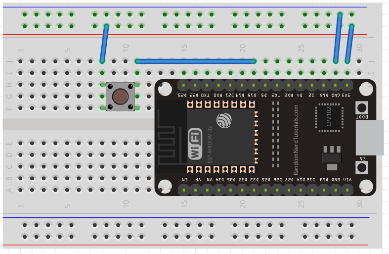

# 01 - PlatformIO

- En VSCode, con PlatformIO, creamos un nuevo proyecto
- Nme: LedBlink, Board: Espressif ESP32 Dev Module  Framework: Arduino
- Voy a src/main.cpp
- Consta de dos funciones, **setup** y **loop** y la cabecera con Arduino.h
- setup solo se ejecuta una sola vez, loop es un ciclo infinito
- Uso la directiva **define** para declarar una constante
- Las constantes definidas con define no se guardan en la FLASH
  - Le doy el valor de 2, porque el ESP32 viene con un Led incorporado en la patilla número 2 
  - Hay que determinar si la vamos a usar como entrada o salida, usaremos **pinMode**
    - El primer argumento es la patilla, y el segundo si es entrada o salida  
  - Para pasarle un valor (alto o bajo, HIGH o LOW) usaremos **digitalWrite**
  - Uso delay, le paso el valor en milisegundos

~~~cpp
#include <Arduino.h>

#define pinLed 2 //no se guarda en la FLASH

void setup() {
  pinMode(pinLed, OUTPUT); //patilla 2 como salida
}

void loop() {
  digitalWrite(pinLed, HIGH); //enciendo
  delay(1000); //milisegundos 
  digitalWrite(pinLed, LOW); //apago
  delay(1000);
}
~~~

- Para compilar, usar la V en la parte inferior izquierda de VSCode
- Para cargar el programa en el ESP32 usar la flecha de al lado, al situar el cursor encima dice upload

## Agregar una biblioteca

- En el home PlatformIO, vamos al apartado de libraries
- Por ejemplo busco Firebase, aparece el resultado Firebase ESP32 Client, Add to Project, escojo el proyecto y le doy a Add
- Ya puedo usarla en el main.cpp

~~~cpp
#include <Arduino.h>
#include <FirebaseESP32.h>

void setup() {

}

void loop() {

}
~~~

## Introducción a la comunicación serial

- ¿Cómo mandar datos del ESP32 a la computadora?

~~~cpp
#include <Arduino.h>

#define pinLed 2

void setup() {
  Serial.begin(9600); //iniciar la comunicación a 9600 baudios (standard)
}

void loop() {
  Serial.print("Dato: ");
  Serial.println(1); 

  delay(1000);
}
~~~

- Esto imprime Dato: 1 (y salto de línea)
- Cuando en consola aparezca Conecting... hay que aprtetar el boot del ESP32

## Tipos de variables

- byte, char, int, float, long, double, String

## Arrays

- Dos formas de declarar un array son estas

~~~cpp
int myArray[3];
int myArray2[] = {1,2,3,4,5,6,7,8,9};
~~~

## Funciones

- En las funciones hay que declarar el valor de retorno (si no lo tiene se indica con **void**)
- En C++ hay que declarar la función para poder definirla y luego llamarla

~~~cpp
#include <Arduino.h>

#define pinLed 2

int miFuncion(); //declaro la función

void setup() {

}

void loop() {
  miFuncion(); //llamo a la función
  delay(1000);
}

int miFuncion(){ //defino la función
  return 1+2;
}
~~~
------------

# El ESP32

## Entradas y salidas digitales

- Una **señal digital** no puede tener valores indiscretos, o tiene 1 o tiene 0
- Normalmente 0 lo representamos con GND y 1 con nuestra fuente de alimentación
- La **señal analógica** puede tener infinidad de valores (onda sinoidal)
- Para trabajar con la señal digital usaremos dos tipos de resistencias
  - Pull-down: la resistencia está conectada a GND. Cuando el interruptor no está presionado tendremos un 0 lógico
  - Pull-up: la resistencia está conectada a la fuente de alimentación. Sin presionar el botón vamos a tener un 0 lógico
- Usaremos **pinMode, digitalWrite y digitalRead**

- Hay algunas resistencias que vienen integradas en el ESP32, las podremos activar
- Las terminales de la 34 a la 39 no tienen resistencia de pull-up ni pull-down y no pueden ser usadas como salidas
- main.cpp

~~~cpp
#include <Arduino.h>

#define pinIn 18
#define pinOut 2

void setup() {
  //pinMode(pinIn, INPUT);
  pinMode(pinOut, OUTPUT);

  pinMode(pinIn, INPUT_PULLDOWN);
  //pinMode(pinOut, INPUT_PULLUP);
}

void loop() {
  if(digitalRead(pinIn)){ //regresa un valor booleano, true con 1 false con 0
    digitalWrite(pinOut,HIGH); //si pinIn tiene un 1 mando un 1 a pinOut
  }else{
    digitalWrite(pinOut, LOW); 
  }
}
~~~

- El esquema
- Hemos activado la resistencia Pull-down, lo que significa que está conectada a GND
- El interruptor esta conectado a VSC
- Tenemos la linea de 3.3 volts al interruptor, y del interruptor a la terminal 18 (pinIn)
- El voltaje está a 3V3, tierra a GND

## Entrada anlógica ADC

- Una señal analógica es aquella que toma valores continuos. Puede asumir una infinidad de valores
- En 12 bits vamos a tener 4096 combinaciones, 2^12. Esto quiere decir que tenemos una resolución de 805.86uV
- Para saber cuanto mide cada uno de esos escalones que hemos hecho en la señal sinoidal para darle un valor específico dividiremos 3.3v/4095. No usamos 4096 porque en las combinaciones el 0 cuenta. empezando por el 0, 4095 es la combinación 4096. Esto nos da el valor de 805.86uV (microVolts)
- Estos escaloncitos miden 805.86mV
- El escaloncito número 2 puede medir 1.61mV, el total (4095) nos va a dar los 3.3 volts, que es la amplitud máxima que vamos a poder leer
- En la imagen vemos todas las terminales ADC en lila

- src/main.cpp

~~~cpp
#include <Arduino.h>

#define PinADC 34
#define Resolucion 3.3/4095     // Resolucion de ADC de 12bits - 4096 combinaciones 
//#define Resolucion 3.3/2047   // Resolucion de ADC de 11bits - 2048 combinaciones
//#define Resolucion 3.3/1023   // Resolucion de ADC de 10bits - 1024 combinaciones
//#define Resolucion 3.3/511    // Resolucion de ADC de 9bits - 512 combinaciones

int rADC = 0; //para almacenar el valor de lectiura
int voltaje = 0; //conversión de esta lectura a voltaje

void setup() {
  Serial.begin(9600); //iniciamos la comunicación serial

  analogReadResolution(12); // Resolucion del ADC, Puede tomar valores del 9 al 12
  //analogSetAttenuation(ADC_11db); // Atenuacion del ADC, puede tomar valores ADC_0db, ADC_2_5db, ADC_6db, ADC_11db
  analogSetPinAttenuation(PinADC, ADC_11db);

  /***************************************
   * La atenuación de 0 dB (ADC_0db) proporciona un voltaje de escala completa de 1,1 V
   * La atenuación de 2,5 dB (ADC_2_5db) proporciona un voltaje de escala completa de 1,5 V
   * La atenuación de 6 dB (ADC_6db) proporciona un voltaje de escala completa de 2,2 V
   * La atenuación de 11 dB (ADC_11db) proporciona un voltaje de escala completa de 3,9 V (Nota)
   * 
   * A una atenuación de 11 dB, el voltaje máximo está limitado por VDDA, no por el voltaje de escala completa.
   **************************************/

  //https://docs.espressif.com/projects/esp-idf/en/latest/esp32/api-reference/peripherals/adc.html

}

void loop() {
  
  rADC = analogRead(PinADC);
  

  Serial.print("Valor: ");
  Serial.println(rADC);

  Serial.print("Voltaje: ");
  Serial.println(rADC*Resolucion,2);
  

  delay(500);
}
~~~

- analogSetAttenuation(ADC_11db) va a tenuar el voltaje en todo el canal ADC
- analogSetPinAttenuation(PinADC, ADC_11db); atenua el voltaje en un pin en específico, nos pide el pin y en cuánto lo vamos a atenuar
- Tenemos los valores ADC_0db, ADC_2_5db, ADC_6db, ADC_11db. Cada uno va a cambiar la resolución 
  - 0db lo cambiará a 1 volt
  - ADC_2_5db proporciona un voltaje de escala completa de 1,5 V
  - La atenuación de 6 dB (ADC_6db) proporciona un voltaje de escala completa de 2,2 V
  - La atenuación de 11 dB (ADC_11db) proporciona un voltaje de escala completa de 3,9 V (Nota)
- A una atenuación de 11 dB, el voltaje máximo está limitado por VDDA, no por el voltaje de escala completa.
- Hay lecturas que quizá  su máximo que te van a entregar son 1.5 v
  - ¿De qué sirve tener una resolución haste 3.3 v, estas desperdiciciando volts?
  - Para eso está la atenuación, con esta función puedes modificarlo
- Usamos analogRead, lo que hace es inicializar la conversión analógico-digital en la terminal especificada
  - Retornará un valor, que es la cantidad de escaloncitos
- Para convertir esta cantidad de voltaje a escaloncitos, lo multiplicamos por la resolución (3.3/4095)
  - El 2 es la cantidad de dígitos que quiero después del punto
- Veamos el esquemático
- La terminal del potenciómetro (su patilla extremo izquierda) la conectamos al voltaje
- La central a la terminal D34
- Su extrema derecha a GND del protoboard
- El voltaje lo conectamos al 3V3 del ESP32, GND a tierra del protoboard

- Compilamos, instalamos
- Abrimos el comunicador serial, el icono de un enchufe en la barra inferior de tareas de VSCode
- Si llevamos el potenicometro al extremo nos da una lectura de 4095 (3.3 volts)

## Salida analógica DAC

- El ESP32 tiene un DAC (conversor digital a analógico, lo opuesto del ADC) de 8 bits
- El ADC puede ser de 9,10,11,12 bits, el DAC solo es de 8 bits
- Las terminales del DAC son 25 y 26
- 8 bits = 256 combinaciones
- Valor mínimo 0,1,2... (0V)
- Valor máximo 253,254,255 (3.3V)
- Resolución 3.3v/255= 12.94mV
- Si le mando un 1, va a entregar 12.94mv, si multiplico 255*12.94 = 3.3V
- Si queremos 1.52V en la salida, 1.52V/12.94mV = 117.45
- 117.45, este resultado es el valor que entregarle al ESP32 para que envíe 1.52V. Hay que darle un valor entero (117)
- En el ejercicio vamos a generar una señal sinoidal
- La función de seno es => A sin (wt- Fi) + B  (la t minúscula aquí es tiempo, no periodo)
- A es la amplitud, B es desplazamiento en Y, w(omega)= 2PI/periodo, Periodo = 1/f, por lo tanto w=2Pif
- El periodo es el inverso de la frecuencia. 1/f es donde determinamos la frecuencia que queremos a la salida de la señal 
- 2Pif es la frecuencia angular, se escribe con la letra w
- fi se refiere al desfase en x. El desplazamiento horizontal de la onda
- B es un desfase en el eje Y (altura)
- Se trabaja en radianes. Para convertir de grados a radianes multiplicamos los grados por PI/180
- **Explicación llana**
  - Si aumento la amplitud, la onda sinoidal coge más altura
  - Si aumento omega, aumenta la frecuencia (más olas)
  - Si aumento Fi se desfasa la onda (se mueve horizontalmente respecto la onda con menos desfase)
  - B hace que la onda suba del eje X, que se desplaze verticalmente la onda entera, no solo en altura
    - Es decir, que la parte más baja de la onda esté más arriba en el eje Y
- **El ESP32 no puede generar valores negativos**, solo nos dará valores positivos
- Por eso tenemos que subir B, para que podamos leer toda la señal
- El valor máximo será 3.3
- Se puede experimentar con esto en  https://www.geogebra.org/m/DcUsxQz4
- La señal que buscamos (el máximo) será A=1.6 w=1 Fi=0 B=1.6
- Va a ser una señal continua, no como si tuviera valores negativos
- main.cpp

~~~cpp
#include <Arduino.h>

/***************************************
 * Tenemos dos salidas digitales a analógicas (DAC) 
 * Son las terminales 25 y 26, tiene un DAC de 8 bits - 256 combinaciones
 * tenemos del 0 al 255  
 * donde 0 es 0v y 255 es 3.3v
 ***************************************/

double j = 0;     //para el conteo de los grados, pero debenmos hacer la conversión a radianes
#define A 127           // Amplitud (tiene que ser la mitad)
#define f 50            // Frecuencia
#define B 128           //desplazamiento en Y (que sumado al valro máximo de amplitud = 255)
#define Salida 25       //sacaremos la señal por la terminal 25

void setup() {
  
}

void loop() {

  /* Nivel de CD */
  //dacWrite(25, 117);  // Establecer un voljate en la terminal 25. Sacando un valor continuo
                        //117 es el valor para sacar 1.52v explicado, 25 la terminal

 /* Señal senoidal */
 for(j = 0; j<360; j+=0.00120){ //el incremento es para que la final sea más finita
   dacWrite(Salida, A * sin(2*PI*f*(j*PI/180)) + B);
   //dacWrite se encarga de generar una señal analógica, en la Salida (terminal) 25
   //Amplitud * función sin(2*PI*frecuencia *(j_grados*PI/180)) + B_desplazamiento_Y
 } 
}  
~~~

- Para ver la señal necesito un osciloscopio

## Interrupciones externas

- Las interrupciones nos ayudan a ejecutar unas lineas de código con prioridad cuando ocurre un evento en alguna terminal de entrada
- Vamos a esperar un cambio en esa terminal, sin preguntar que estado tiene esa terminal
- Hay tres tipos de interrupciones
  - Rising: flanco de subida (pasar de 0 a 1)
  - Falling: flanco de bajada (pasar de 1 a 0)
  - Change: en cualquiera de los dos casos
- Pero existe ruido en nuestras señales (**rebotes**), por ejemplo con los botones (pull-up, pull-down), lo que puede provocar que la interrupción se ejecute varias veces. **Debemos evitar estos rebotes usadno delays**
- Con IRAM_ATTR guardamos la función en la RAM, lo que irá más rápida
- Configuro la comunicación serial con 9600 baudios
- Configuro las terminales con pinMode
  - En la entrada (Interrupción) activo la resistencia Pull-up
- Uso attachInterrupt para configurar la interrupción
  - digitalPinToInterrupt indica que la terminal Interrupción (la 23) la vamos a usar como terminal de interrupción
  - A attachInterrupt después le pasamos la función que se va a ejecutar con la interrupción y el tipo de interrupción
- La resistencia de Pull-up significa que siempre va a estar leyendo un 1 lógico, y cuando lo pulsemos pasará a 0 (flanco de bajada, FALLING)
- **Todas las variables que se van a usar en la funciónd e interrupción deben llevar la palabra volatile**
- toggle la vamos a usar para apagar o prender el LED
- El tiempoDeInterrupciónAnterior lo vamos a usar para evitar los rebotes
- Como este es una constante lo definimos con #define
- millis() nos entrega el tiempo que ha pasado desde que el ESP32 encendió
- main.cpp

~~~cpp
#include <Arduino.h>

#define Interrupcion 23 //terminal 23
#define Salida 2        //terminal 2 LED
 
volatile boolean toggle = true;
volatile unsigned long tiempoDeInterrupcionAnterior = 0;
#define tiempoDeRebote 200

/* Declaración de la función de interrupción,  se guarda en la RAM con IRAM_ATTR*/
void IRAM_ATTR funcionDeInterrupcion(); //se ejecutará cada vez que ocurra una interrupción

void setup() {

  Serial.begin(9600);
  pinMode(Salida, OUTPUT);
  pinMode(Interrupcion, INPUT_PULLUP);                            // Configuración de resistencia Pull-Up 
  //pinMode(Interrupcion, INPUT_PULLDOWN);                        // Configuración de resistencia Pull-Down 
  attachInterrupt(digitalPinToInterrupt(Interrupcion), funcionDeInterrupcion, FALLING);  // Flanco de bajada 
  //attachInterrupt(digitalPinToInterrupt(Interrupcion), funcionDeInterrupcion, RISING); // Flanco de subida 
  //attachInterrupt(digitalPinToInterrupt(Interrupcion), funcionDeInterrupcion, CHANGE); // Detecta ambos flancos

}

void loop() {

  Serial.println("Mensaje");
  delay(500);

  // Instrucción 1
  // Instrucción 2
  // Instrucción 3
  
}

/* Definición de la función de interrupción */
void IRAM_ATTR funcionDeInterrupcion() {

  //para evityar los rebotes
  //todos los rebotes que pasen en este rango de tiempo (200ms) no van a afectar
  if(millis() - tiempoDeInterrupcionAnterior > tiempoDeRebote){

    //cuando pasen 200ms entrará a este código
    digitalWrite(Salida, toggle); //Encender o apagar el LED
    Serial.println("Interrupcion");
    toggle ^= true; //^ es el operador XOR, devuelve true si los valores son distintos, false si son iguales
          //si toggle es true pasa a false, si toggle es false pasa a true
          //es lo mismo que toggle=!toggle
    
    //actualizamos el tiempo en el que corrió la interrupción
    tiempoDeInterrupcionAnterior = millis();
  }                                                            
}
~~~

- De esta manera el ESP32 arroja "Mensaje" por consola repetidamente
- Cuando apreto el botón se enciende el LED y arroja una vez el mensaje "Interrupción", seguido de "Mensaje" otra vez 
- Si vuelvo a apretar el botón se apaga el LED y vuelve a arrojar un mensaje de "Interrupción"
- **volatile**: con volatile C++ le dice al compilador: **Ojo, el valor de esta variable puede cambiar en cualquier momento, sin que el programa lo modifique directamente. No optimices asumiendo que no cambia**
- Esto lo hace porque el compilador es inteligente y hace optimizaciones: guarda una variable en un registro, asume que su valor no cambia si el programa no la modifica, etc
- Muy útil para registros que cambian por el hardware, interrupciones...

## Timer

- Como toggle lo vamos a usar en la función onTimer que se dispara con la interrupción debe llevar la palabra **volatile**
- hw_timer_t es un tipo de timer hardware del ESP32
- timer es un puntero que apunta al timer que vamos a usar
- Tal y como está configurado timerBegin, contará microsegundos hacia arriba
- timerAttachInterrupt(timer, &onTimer, true); indica el timer que usar, le passa la dirección de la función que usar durante la interrupción, el true indica interrupción por flanco (cambia en el momento exacto)
- timerAlarmWrite(timer, 1000000, true); 1 millón de microsegundos = 1 segundo, true hace que el timer se reinicie periódicamente después de llegar al límite, para que el LED se vaya encendiendo y apagando
  - Esto genera una interrupción cada 1 segundo
- timerAlarmEnable(timer); habilita la interrupción
-main.cpp

~~~cpp
#include <Arduino.h>

#define Salida 2  //terminal 2

volatile bool toggle = true;
void IRAM_ATTR onTimer();   // Declarar la función de interrupción (guardad en RAM, es más rápida)

hw_timer_t *timer = NULL;   // Declarar un apuntador de tipo hw_timer_t

void setup() {

  Serial.begin(9600);                             // Configuración de comunicación serial 

  pinMode(Salida, OUTPUT);                        // Configuración de la terminal Salida como salida

  timer = timerBegin(0, 80, true);                // Inicializamos el timer, true es up-counting, hacia arriba
                                                  // Hay 4 timers, 0 es el primero
  /*******************************
   * 1.- El primer parámetro es el timer que vamos a utilizar, puede tomar valores de 0 a 3, todos los timer son de 64 bits
   * 2.- El segundo parámetro es el valor del preescaler, el prescaler es de 16 bits lo cual puede tomar valores de 0 a 65536
   * 3.- El tercer parámetro indica si el contador cuenta hacia arriba o hacia abajo, puede tomar valores booleanos, true o false respectivamente.
   ******************************/

  timerAttachInterrupt(timer, &onTimer, true);    // Indicamos que función de interrupción se ejecutara.
  /********************************
   * 1.- El primer parámetro es el apuntador *timer
   * 2.- El segundo parámetro es la dirección de memoria de la función de interrupción que se ejecutara.
   * 3.- El tercer parámetro indica si la interrupción a generar es de flanco o de nivel, toma valores booleanos, true y false respectivamente.
   ********************************/

  timerAlarmWrite(timer, 1000000, true);          // Establecer el limite del contador
  /********************************
   * 1.- El primer parámetro es el apuntador *timer.
   * 2.- El segundo parámetro es el valor al que tiene que llegar el contador para ejecutar la función de interrupción.
   * 3.- El tercer argumento indica si el contador debe volver a cero o no.
   *******************************/

  timerAlarmEnable(timer);                        // Habilitamos la interrupción del timer.

  /* Tambien podemos deshabilitar el timer con */
  //timerAlarmDisable(timer);
  
}

void loop() {
    digitalWrite(Salida, toggle); //modificar la salida segúnel toggle (true/false=> 1/0 => HIGH/LOW)
}

// Función de interrupción. Cdaa segundo va a cambiar de valor
void IRAM_ATTR onTimer() {
  toggle ^= true; //cambio el toggle a true si esta en false y viceversa
}
~~~

- **Interrupción de flanco o de nivel** significa que si es de flanco puede ser de subida, bajada o cambio, mientras que si es de nivel se activa mientras la señal está a un nivel específico (HIGH/LOW). La interrupción se dispara continuamente mientras el nivel se mantenga
- **El prescaler** es un divisor de frecuencia. Toma la señal de reloj del microcontrolador y la divide antes de enviarla a un periférico (timer, contador, ADC, etc.).
- ¿Para qué sirve? Sirve para:
  - Hacer que un timer cuente más lento
  - Medir tiempos más largos
  - Ajustar la frecuencia del PWM
  - Adaptar velocidades internas sin cambiar el reloj principal
- Cuando hablamos del valor del prescaler, hablamos del factor de división del reloj (frecuencia_reloj/80)

~~~cpp
//Se usa para obtener 1 μs (microsegundo) por tick con un reloj de 80 MHz
timer = timerBegin(0, 80, true); 
~~~

- **El ESP32 tiene un reloj de 80MHz**. El prescaler divide la frecuencia del reloj

## PWM

- PWM en un ESP32 significa Pulse Width Modulation (Modulación por Ancho de Pulso). Es una técnica que usa el microcontrolador para simular una señal analógica usando salidas digitales (0 y 1).
- El ESP32 no “saca” valores analógicos reales por sus pines digitales. En vez de eso:
  - Enciende y apaga el pin muy rápido
  - Cambia cuánto tiempo está encendido vs apagado
  - Ese porcentaje de tiempo encendido se llama ciclo de trabajo (duty cycle).
- Ejemplo:
  - 0% → siempre apagado
  - 50% → mitad del tiempo encendido
  - 100% → siempre encendido
- Un LED al 50% se ve “a medio brillo”, un motor gira más lento, etc.
- PWM en el ESP32 (lo especial)
- A diferencia de Arduino clásico, el ESP32 usa un sistema de hardware llamado LEDC, que es muy potente:
  - Hasta 16 canales PWM
  - Frecuencia configurable (desde Hz hasta kHz)
  - Resolución configurable (8, 10, 12, 15 bits, etc.)
  - Casi cualquier pin puede usarse para PWM
- Para qué se usa
- PWM en el ESP32 se usa muchísimo para:
  - Controlar brillo de LEDs
  - Controlar velocidad de motores
  - Controlar servomotores
  - Simular salidas analógicas (DAC “fake”)
- En resumen: es una señal digital que tiene ciertas características
- Imagina una señal regular en 0 y 1, se le denomina un *periodo* a cada ciclo que pasa por 0 y 1
- Un ejemplo en un array sería

~~~js
const periodos = [[1,0],[1,0],[1,0]] //array de tres periodos
~~~

- El 1 va a tener un tiempo en alto y el 0 va a tenr un tiempo en bajo
- La suma de estos tiempos va a ser el **periodo** (un ciclo de señal en 1 y 0 completo)
- El ciclo útil es el ciclo en el que está en alto. Va de 0% a 100% pero para el ESP32 no se expresa en porcentajes
- Utilizaremos valores que van desde 0 hasta un valor máximo que depende de la resolución, si la resolución es de 10 bits, el valor máximo es de 1024
- Esto quiere decir que 0 es 0% y 1024 es el 100% del ciclo útil
- Si el 50% del flujo de la señal está en alto, nuestro ciclo útil será ese 50%
- Lo que vamos a controlar es el ciclo útil
- main.cpp

~~~cpp
#include <Arduino.h>

// Configuración PWM
#define Pin_PWM1 13  //terminal salida
#define Pin_PWM2 14 //terminal salida
#define Canal1 0    //canales donde va a trabajar el PWM
#define Canal2 1    
#define Freq 1000   //la frecuencia a la que van a trabajar los dos PWM
#define Resolucion 10 //la resolución de nuestro ciclo útil (10bits=valores desde 0 a 1024)
int CU1 = 100, CU2 = 900; //variables que tomarán valores desde 0 a 1024

void setup(){

  pinMode(Pin_PWM1, OUTPUT);
  pinMode(Pin_PWM2, OUTPUT);

  /* Configuración del canal */
  ledcSetup(Canal1, Freq, Resolucion);  // Canal puede tomar valores de 0 a 15
  ledcSetup(Canal2, Freq, Resolucion);  // Resolución puede tomar valores de 1 a 16

  /* Configuramos la terminal por la que saldrá el PWM */
  ledcAttachPin(Pin_PWM1, Canal1);
  ledcAttachPin(Pin_PWM2, Canal2);

  /** Modificamos el ciclo útil 
   * El ciclo útil tomara valores dependiendo de la resolución, 
   * para una resolución de 10 bits puede tomar valores de 0 a 1024
   **/
  ledcWrite(Canal1, CU1);   //100 sería el 10% aprox del ciclo útil
  ledcWrite(Canal2, CU2);   //900 = 90% de ciclo útil, la señal esta en HIGH la mayor parte del tiempo

}

void loop(){
  delay(50);
  
}
~~~

- Para observarlo necesitamos un osciloscopio