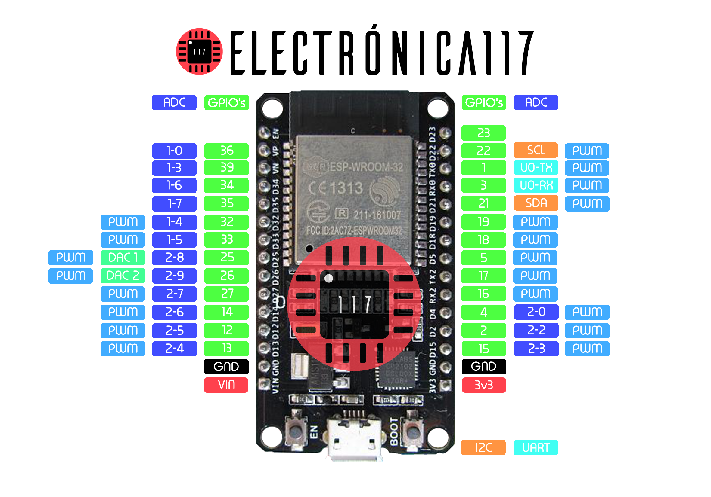
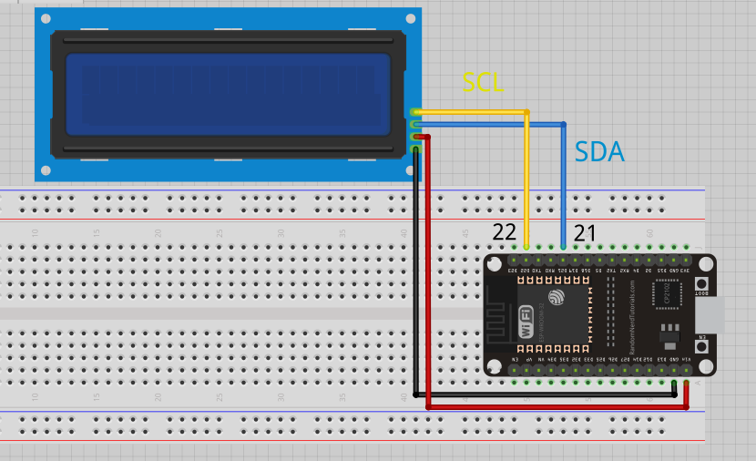
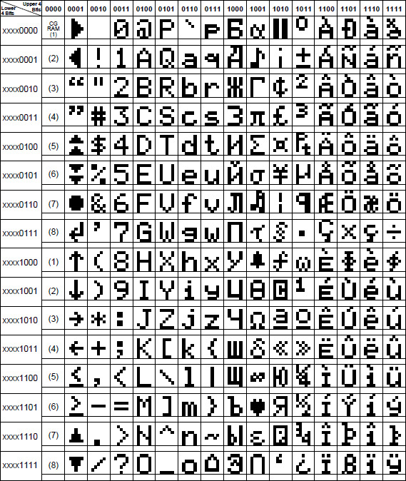
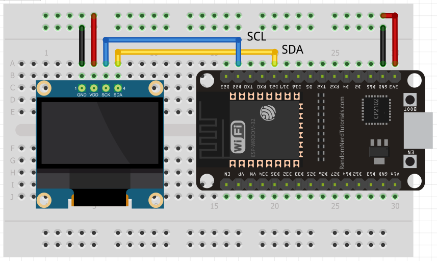

# PlatformIO - Displays

## LCD 16x2

- Usaremos un LCD 16x2, lo usaremos con un adaptador I2C para usar los mismos terminales
- Para mandarle la info al display necesitamos 8 terminales. El display trae un modo para usar solo 4 pero siguen siendo demasiadas terminales
- El adaptador saca 4 patillas que son GND, VCC, SDA y SCL
- En el datasheet del ESP32 tenemos que SCL es la terminal 22 y SDA la terminal 21

- Aquí tenemos las conexiones
- El cable rojo va a VIN que recibe los 5v del USB del ESP32 para alimentar el LED

- Agrego la biblioteca LiquidCrystal al proyecto
- main.cpp

~~~cpp
#include <Arduino.h>
#include <LiquidCrystal_I2C.h>

/**
 * LiquidCrystal by F Malpartida
 */

LiquidCrystal_I2C lcd(0x3F, 16, 2);  // Dirección del display LCD y tamaño.

//caracter creado por mi en https://omerk.github.io/lcdchargen/
byte customChar[8] = {
	0b01110,
	0b01010,
	0b01110,
	0b00100,
	0b01110,
	0b00100,
	0b01010,
	0b01010
};
byte customChar2[8] = {
	0b01010,
	0b11111,
	0b10101,
	0b11111,
	0b11111,
	0b10001,
	0b11011,
	0b00000
};

void setup(){

   lcd.init();                      // Inicializar LCD            
   lcd.backlight();                 // Encender luz del LCD
   //lcd.noBacklight();             // Apagar luz del LCD
   

   /**
    * Solo se pueden almacenar 8 caracteres en los espacios del 0 al 7
    */
   lcd.createChar(0, customChar);   // Crear caracter, pide ubicación en memoria y el caracter 
   // ...
   lcd.createChar(7, customChar2);  // Crear caracter 
   /**
    * Pagina para crear caracteres
    * https://omerk.github.io/lcdchargen/
    */

   lcd.home();                      // Mueve el cursor al inicio

}

void loop(){
   /**
    * lcd.setCursor(Columnas, Filas);
    * El display es de 16x2, 16 columnas y 2 filas
    * La primer columna y fila empiezan en el 0
    **/
   lcd.setCursor(0,0);              // Esto es igual que poner lcd.home()
   lcd.print(" Electronica117  Hola Mundo :D");     // Escribe el mensaje (hasta 40 caracteres en una fila)
   //lcd.clear();                        // Limpia el display LCD
   //lcd.scrollDisplayLeft();            // Avanza un espacio hacia la izquierda (scroll)
   //lcd.scrollDisplayRight();           // Avanza un espacio a la derecha

   //El LCD tiene caracteres almacenados en memoria
   lcd.setCursor(7,1);              // Mueve el cursor a la octava columna y la segunda fila 
   lcd.write(0);                    // Escribe el caracter almacenado en el espacio 0
   lcd.write(7);                    // Escribe el caracter almacenado en el espacio 7
   lcd.write(33);                   //! en la tabla

   delay(1000);
}
~~~

- El mapa de carcetrs almacenados en el LCD
- Siq uiero usar alguno de los caraceteres, compongo el numero en binario que hay en columna y fila y se lo paso a lcd.write convertido a decimal 

## OLED 128x64

- La pantalla tiene 128 pixeles a lo largo y 64 a lo alto
- Las conexiones también son a través de I2C (GND,VCC,SCL,SDA)

- Agregamos las bibliotecas al proyecto
- main.cpp

~~~cpp
#include <Arduino.h>
#include <Adafruit_I2CDevice.h>
#include <Adafruit_SSD1306.h>

/**
 * Adafruit BusIO by Adafruit
 * Adafruit GFX Library by Adafruit
 * Adafruit SSD1306 by Adafruit
 */

#define SCREEN_WIDTH 128    // Ancho
#define SCREEN_HEIGHT 64    // Alto

Adafruit_SSD1306 OLED(SCREEN_WIDTH, SCREEN_HEIGHT);

/* Bitmap array */
#define LOGO_WIDTH    128 //ancho de la pantalla
#define LOGO_HEIGHT   64  //alto de la pantalla

//* Pagina para convertir una imagen a bitmap array
//   * https://javl.github.io/image2cpp/ 
const unsigned char logo_bmp [] PROGMEM = {
	0xff, 0xfe, 0xf9, 0xff, 0xff, 0xff, 0xf9, 0xff, 0xff, 0xbe, 0x7f, 0xff, 0xff, 0xff, 0xff, 0xff, 
0xff, 0xfe, 0xf9, 0xff, 0xff, 0xff, 0xf9, 0xe3, 0xff, 0x3e, 0x7f, 0xff, 0xff, 0xff, 0xff, 0xff, 
0xff, 0xfe, 0xf9, 0xff, 0xff, 0xff, 0xf9, 0xeb, 0xfe, 0x3c, 0x7f, 0xff, 0xff, 0xff, 0xff, 0xff, 
0xff, 0xfe, 0xf9, 0xff, 0xff, 0xff, 0xf9, 0xe3, 0xfc, 0xf9, 0xff, 0xff, 0xff, 0xff, 0xff, 0xff, 
0xff, 0xfe, 0xfc, 0xff, 0xff, 0xff, 0xf9, 0xf7, 0xf9, 0xe3, 0xff, 0xff, 0xff, 0xff, 0xff, 0xff, 
0xff, 0xfe, 0xfe, 0x7f, 0xff, 0xff, 0xf1, 0xf7, 0xe3, 0xc7, 0xff, 0xff, 0xff, 0xff, 0xff, 0xff, 
0xff, 0xfe, 0x7f, 0x3f, 0xff, 0x3f, 0xe1, 0xf7, 0xe7, 0x9f, 0xff, 0xff, 0xff, 0xff, 0xff, 0xff, 
0xff, 0xfe, 0x7f, 0x80, 0x00, 0x3f, 0xc1, 0xf7, 0xef, 0x9f, 0xfc, 0x00, 0x00, 0x00, 0x00, 0x7f, 
0xff, 0xff, 0x3f, 0xff, 0xfe, 0x3f, 0x99, 0xf7, 0xcf, 0x9f, 0xf8, 0xff, 0xff, 0xff, 0xff, 0xff, 
0xff, 0xff, 0x8f, 0xff, 0xff, 0xff, 0x39, 0xe3, 0xcf, 0x9f, 0xf3, 0xff, 0xff, 0xff, 0xff, 0xff, 
0xff, 0xff, 0xc7, 0xff, 0xff, 0xfe, 0x79, 0xe3, 0xc7, 0x9f, 0xe7, 0xff, 0xff, 0xff, 0xff, 0xff, 
0xff, 0xff, 0xe7, 0xff, 0xff, 0xfc, 0xf9, 0xe3, 0xc7, 0x9f, 0xcf, 0xff, 0xff, 0xff, 0xff, 0xff, 
0xff, 0xff, 0xf3, 0xff, 0xff, 0xf9, 0xf9, 0xe3, 0xc7, 0x9f, 0x9f, 0xff, 0xff, 0xff, 0xff, 0xff, 
0xff, 0xff, 0xf9, 0xff, 0xff, 0xf3, 0xf9, 0xe3, 0xc7, 0x9e, 0x3f, 0xff, 0xff, 0xff, 0x9f, 0xff, 
0xff, 0xff, 0xfc, 0x00, 0x00, 0x07, 0xf9, 0xe3, 0xc7, 0x9d, 0x7f, 0xff, 0xff, 0xfc, 0x1f, 0xff, 
0xff, 0xff, 0xff, 0x00, 0x00, 0x0f, 0xf9, 0xe3, 0xc7, 0x9c, 0x7f, 0xff, 0xff, 0xf8, 0x1f, 0xff, 
0xff, 0xff, 0xff, 0xff, 0xff, 0xff, 0xfb, 0xf7, 0xef, 0xff, 0xff, 0xff, 0xff, 0xe3, 0xff, 0xff, 
0xff, 0xff, 0xff, 0xff, 0xff, 0xff, 0xff, 0xff, 0xff, 0xff, 0xff, 0xff, 0xff, 0xc7, 0xff, 0xff, 
0xff, 0xff, 0xff, 0xff, 0xff, 0xff, 0xf8, 0x00, 0x00, 0x1f, 0xff, 0xff, 0xff, 0x8f, 0xff, 0xff, 
0xff, 0xff, 0xff, 0xff, 0xff, 0xff, 0xe0, 0x00, 0x00, 0x07, 0xff, 0xff, 0xff, 0x1f, 0xff, 0xff, 
0xff, 0xf7, 0xff, 0xff, 0xff, 0xff, 0xe6, 0x00, 0x00, 0x07, 0xff, 0xff, 0xfe, 0x3f, 0x9f, 0xff, 
0xff, 0xe0, 0x00, 0x00, 0x00, 0x00, 0x4e, 0x00, 0x00, 0x06, 0x00, 0x00, 0x00, 0xfc, 0x1f, 0xff, 
0xff, 0xe3, 0xff, 0xff, 0xff, 0x80, 0x46, 0x00, 0x00, 0x06, 0x00, 0x00, 0x01, 0xf0, 0x1f, 0xff, 
0xff, 0xff, 0xff, 0xff, 0xff, 0xff, 0xc0, 0x00, 0x00, 0x07, 0xff, 0xff, 0xff, 0xe3, 0xff, 0xff, 
0xff, 0xff, 0xff, 0xff, 0xff, 0xff, 0xc0, 0x00, 0x00, 0x07, 0xff, 0xff, 0xff, 0xc7, 0xff, 0xff, 
0xff, 0xff, 0xff, 0xff, 0xff, 0xff, 0xc0, 0x00, 0x00, 0x07, 0xff, 0xff, 0xff, 0x8f, 0xff, 0xff, 
0xff, 0xff, 0xff, 0xff, 0xff, 0xff, 0xc0, 0x00, 0x00, 0x07, 0xff, 0xff, 0xff, 0x3f, 0xff, 0xff, 
0xff, 0xff, 0xff, 0xff, 0xff, 0xc0, 0xc0, 0x00, 0x00, 0x07, 0x03, 0xff, 0xfe, 0x7f, 0xff, 0xff, 
0xff, 0xff, 0xf0, 0x00, 0x00, 0x00, 0x40, 0x00, 0x00, 0x06, 0x00, 0x00, 0x00, 0xff, 0xff, 0xff, 
0xff, 0xff, 0xe7, 0xff, 0xff, 0x80, 0xc0, 0x00, 0x00, 0x06, 0x01, 0xff, 0xff, 0xff, 0xff, 0xff, 
0xff, 0xff, 0xcf, 0xff, 0xff, 0xff, 0xc0, 0x20, 0x00, 0x07, 0xff, 0xff, 0xff, 0xff, 0xff, 0xff, 
0xff, 0xff, 0x9f, 0xff, 0xff, 0xff, 0xc0, 0x20, 0x00, 0x07, 0xff, 0xff, 0xff, 0xff, 0xff, 0xff, 
0xff, 0xff, 0x3f, 0xff, 0xff, 0xff, 0xc0, 0x20, 0x00, 0x07, 0xff, 0xff, 0xff, 0xff, 0xff, 0xff, 
0xff, 0xfe, 0x7f, 0xff, 0xff, 0xff, 0xc0, 0x20, 0x00, 0x07, 0xff, 0xff, 0xff, 0xff, 0xff, 0xff, 
0xff, 0xfc, 0xff, 0xff, 0xff, 0x80, 0xc0, 0x20, 0x00, 0x06, 0x01, 0xff, 0xff, 0xff, 0xff, 0xff, 
0xff, 0xf9, 0xff, 0x80, 0x00, 0x00, 0x40, 0x00, 0x00, 0x06, 0x00, 0x00, 0x00, 0x00, 0x00, 0x7f, 
0xff, 0xf9, 0xff, 0x3f, 0xff, 0x80, 0xc0, 0x00, 0x00, 0x07, 0x03, 0xff, 0xff, 0xff, 0xff, 0xff, 
0xff, 0xfb, 0xfe, 0x7f, 0xff, 0xff, 0xc0, 0x00, 0x00, 0x07, 0xff, 0xff, 0xff, 0xff, 0xff, 0xff, 
0xff, 0xfb, 0xfc, 0xff, 0xff, 0xff, 0xc0, 0x00, 0x00, 0x07, 0xff, 0xff, 0xff, 0xff, 0xff, 0xff, 
0xff, 0xfb, 0xfd, 0xff, 0xff, 0xff, 0xc0, 0x00, 0x00, 0x07, 0xff, 0xff, 0xff, 0xff, 0xff, 0xff, 
0xff, 0xfb, 0xfb, 0xff, 0xff, 0xff, 0xc0, 0x00, 0x00, 0x07, 0xff, 0xff, 0xff, 0xff, 0xff, 0xff, 
0xff, 0xfb, 0xf7, 0xff, 0x00, 0x00, 0x40, 0x00, 0x00, 0x06, 0x00, 0x00, 0x01, 0xff, 0xff, 0xff, 
0xff, 0xfb, 0xe7, 0xfe, 0x00, 0x00, 0x40, 0x00, 0x00, 0x06, 0x00, 0x00, 0x00, 0x7f, 0xff, 0xff, 
0xff, 0xfb, 0xe7, 0xfd, 0xff, 0xff, 0xe0, 0x00, 0x00, 0x07, 0xff, 0xff, 0xff, 0x3f, 0xff, 0xff, 
0xff, 0xfb, 0xe7, 0xfb, 0xff, 0xff, 0xe0, 0x00, 0x00, 0x07, 0xff, 0xff, 0xff, 0x9f, 0xff, 0xff, 
0xff, 0xfb, 0xe7, 0xf3, 0xff, 0xff, 0xf0, 0x00, 0x00, 0x0f, 0xff, 0xff, 0xff, 0xcf, 0xff, 0xff, 
0xff, 0xfb, 0xe7, 0xe7, 0xff, 0xff, 0xff, 0xff, 0xff, 0xff, 0xff, 0xff, 0xff, 0xf3, 0xff, 0xff, 
0xff, 0xfb, 0xe7, 0xcf, 0xff, 0xff, 0xff, 0xff, 0xff, 0xff, 0xff, 0xff, 0x7f, 0xf9, 0xef, 0xff, 
0xff, 0xfb, 0xe7, 0xcf, 0xff, 0xff, 0xf9, 0xe3, 0xc7, 0x9f, 0xff, 0xfe, 0x3f, 0xfc, 0x07, 0xff, 
0xff, 0xfb, 0xe7, 0xcf, 0xff, 0xff, 0xf9, 0xe3, 0xc7, 0x9f, 0xff, 0xfe, 0x3f, 0xfe, 0x07, 0xff, 
0xff, 0xfb, 0xe7, 0xcf, 0xff, 0xff, 0xf9, 0xe3, 0xc7, 0x9f, 0xff, 0xff, 0x7f, 0xff, 0xef, 0xff, 
0xff, 0xfb, 0xe7, 0xcf, 0xff, 0xff, 0xf9, 0xe3, 0xc7, 0x9f, 0xff, 0xff, 0x7f, 0xff, 0xff, 0xff, 
0xff, 0xfb, 0xe7, 0xcf, 0xff, 0xff, 0xf9, 0xe3, 0xc7, 0x9f, 0xff, 0xff, 0x7f, 0xff, 0xff, 0xff, 
0xff, 0xfb, 0xe7, 0xcf, 0xff, 0xff, 0xf9, 0xe3, 0xc7, 0x9f, 0xff, 0xff, 0x7f, 0xff, 0xff, 0xff, 
0xff, 0xfb, 0xe7, 0xcf, 0xff, 0xff, 0xf9, 0xe3, 0xcf, 0x9f, 0xff, 0xfe, 0x7f, 0xff, 0xff, 0xff, 
0xff, 0xfb, 0xe7, 0xcf, 0xff, 0xff, 0xf9, 0xf7, 0xcf, 0x9f, 0xff, 0xfe, 0x7f, 0xff, 0xff, 0xff, 
0xff, 0xfb, 0xe7, 0xcf, 0xff, 0xff, 0xf1, 0xf7, 0xcf, 0x9f, 0xff, 0xfc, 0xff, 0xff, 0xff, 0xff, 
0xff, 0xfb, 0xe7, 0xcf, 0xff, 0xff, 0xf1, 0xf7, 0xcf, 0xc0, 0x00, 0x01, 0xff, 0xff, 0xff, 0xff, 
0xff, 0xfb, 0xe7, 0xcf, 0xff, 0xff, 0xc1, 0xf7, 0xe7, 0xe0, 0x00, 0x03, 0xff, 0xff, 0xff, 0xff, 
0xff, 0xfb, 0xe7, 0xcf, 0xff, 0xf0, 0x09, 0xf7, 0xf3, 0xff, 0xff, 0xff, 0xff, 0xff, 0xff, 0xff, 
0xff, 0xfb, 0xe7, 0xcf, 0xff, 0xc0, 0x19, 0xf7, 0xf9, 0xff, 0xff, 0xff, 0xff, 0xff, 0xff, 0xff, 
0xff, 0xfb, 0xe7, 0xcf, 0xff, 0x9f, 0xf1, 0xf7, 0xfc, 0x00, 0x00, 0x00, 0x00, 0xff, 0xff, 0xff, 
0xff, 0xfb, 0xe7, 0xcf, 0xff, 0x3f, 0xf9, 0xf7, 0xff, 0xff, 0xff, 0xff, 0xfc, 0x7f, 0xff, 0xff, 
0xff, 0xfb, 0xe7, 0xcf, 0xff, 0x7f, 0xff, 0xf7, 0xff, 0xff, 0xff, 0xff, 0xff, 0x3f, 0xff, 0xff
};
const unsigned char logo_bmp2 [] PROGMEM = {
	0xff, 0xff, 0xff, 0xff, 0xff, 0xff, 0xff, 0xc0, 0x03, 0xff, 0xff, 0xff, 0xff, 0xff, 0xff, 0xff, 
	0xff, 0xff, 0xff, 0xff, 0xff, 0xff, 0xfc, 0x1f, 0xf8, 0x3f, 0xff, 0xff, 0xff, 0xff, 0xff, 0xff, 
	0xff, 0xff, 0xff, 0xff, 0xff, 0xff, 0xe1, 0xff, 0xff, 0x8f, 0xff, 0xff, 0xff, 0xff, 0xff, 0xff, 
	0xff, 0xff, 0xff, 0xff, 0xff, 0xff, 0x8f, 0xff, 0xff, 0xf1, 0xff, 0xff, 0xff, 0xff, 0xff, 0xff, 
	0xff, 0xff, 0xff, 0xff, 0xff, 0xfe, 0x27, 0xe7, 0xc7, 0xe4, 0xff, 0xff, 0xff, 0xff, 0xff, 0xff, 
	0xff, 0xff, 0xff, 0xff, 0xff, 0xfc, 0xc3, 0xc3, 0xc3, 0xc3, 0x3f, 0xff, 0xff, 0xff, 0xff, 0xff, 
	0xff, 0xff, 0xff, 0xff, 0xff, 0xf3, 0xc3, 0xc3, 0xc3, 0xc3, 0x9f, 0xff, 0xff, 0xff, 0xff, 0xff, 
	0xff, 0xff, 0xff, 0xff, 0xff, 0xe7, 0xc3, 0xc3, 0xc3, 0xc3, 0xe7, 0xff, 0xff, 0xff, 0xff, 0xff, 
	0xff, 0xff, 0xff, 0xff, 0xff, 0xcf, 0xc3, 0xc3, 0xc3, 0xc3, 0xf3, 0xff, 0xff, 0xff, 0xff, 0xff, 
	0xff, 0xff, 0xff, 0xff, 0xff, 0x9f, 0xc3, 0xc3, 0xc3, 0xc3, 0xf9, 0xff, 0xff, 0xff, 0xff, 0xff, 
	0xff, 0xff, 0xff, 0xff, 0xff, 0x3f, 0xc3, 0xc3, 0xc3, 0xc3, 0xfc, 0xff, 0xff, 0xff, 0xff, 0xff, 
	0xff, 0xff, 0xff, 0xff, 0xfe, 0x7f, 0xc3, 0xc3, 0xc3, 0xc3, 0xfe, 0x7f, 0xff, 0xff, 0xff, 0xff, 
	0xff, 0xff, 0xff, 0xff, 0xfc, 0xff, 0xc3, 0xc3, 0xc3, 0xc3, 0xff, 0x7f, 0xff, 0xff, 0xff, 0xff, 
	0xff, 0xff, 0xff, 0xff, 0xfd, 0xff, 0xc3, 0xc3, 0xc3, 0xc3, 0xff, 0xbf, 0xff, 0xff, 0xff, 0xff, 
	0xff, 0xff, 0xff, 0xff, 0xfb, 0xff, 0xff, 0xff, 0xff, 0xff, 0xff, 0x9f, 0xff, 0xff, 0xff, 0xff, 
	0xff, 0xff, 0xff, 0xff, 0xf3, 0xff, 0xc0, 0x00, 0x00, 0x03, 0xff, 0xdf, 0xff, 0xff, 0xff, 0xff, 
	0xff, 0xff, 0xff, 0xff, 0xf7, 0xff, 0x00, 0x00, 0x00, 0x00, 0xff, 0xef, 0xff, 0xff, 0xff, 0xff, 
	0xff, 0xff, 0xff, 0xff, 0xe7, 0xff, 0x00, 0x00, 0x00, 0x00, 0xff, 0xef, 0xff, 0xff, 0xff, 0xff, 
	0xff, 0xff, 0xff, 0xff, 0xe8, 0x02, 0x18, 0x00, 0x00, 0x00, 0x40, 0x07, 0xff, 0xff, 0xff, 0xff, 
	0xff, 0xff, 0xff, 0xff, 0xc0, 0x02, 0x3c, 0x00, 0x00, 0x00, 0x40, 0x07, 0xff, 0xff, 0xff, 0xff, 
	0xff, 0xff, 0xff, 0xff, 0xd0, 0x02, 0x3c, 0x00, 0x00, 0x00, 0x40, 0x0b, 0xff, 0xff, 0xff, 0xff, 
	0xff, 0xff, 0xff, 0xff, 0xd8, 0x02, 0x18, 0x00, 0x00, 0x00, 0x40, 0x1b, 0xff, 0xff, 0xff, 0xff, 
	0xff, 0xff, 0xff, 0xff, 0x9f, 0xfe, 0x00, 0x00, 0x00, 0x00, 0x7f, 0xfb, 0xff, 0xff, 0xff, 0xff, 
	0xff, 0xff, 0xff, 0xff, 0xbf, 0xfe, 0x00, 0x00, 0x00, 0x00, 0x7f, 0xfd, 0xff, 0xff, 0xff, 0xff, 
	0xff, 0xff, 0xff, 0xff, 0xbf, 0xfe, 0x00, 0x00, 0x00, 0x00, 0x7f, 0xfd, 0xff, 0xff, 0xff, 0xff, 
	0xff, 0xff, 0xff, 0xff, 0xbf, 0xfe, 0x00, 0x00, 0x00, 0x00, 0x7f, 0xfd, 0xff, 0xff, 0xff, 0xff, 
	0xff, 0xff, 0xff, 0xff, 0x38, 0x02, 0x00, 0x00, 0x00, 0x00, 0x40, 0x0d, 0xff, 0xff, 0xff, 0xff, 
	0xff, 0xff, 0xff, 0xff, 0x70, 0x02, 0x00, 0x00, 0x00, 0x00, 0x40, 0x0c, 0xff, 0xff, 0xff, 0xff, 
	0xff, 0xff, 0xff, 0xff, 0x70, 0x02, 0x00, 0x41, 0x07, 0x00, 0x40, 0x0c, 0xff, 0xff, 0xff, 0xff, 
	0xff, 0xff, 0xff, 0xff, 0x78, 0x02, 0x00, 0x41, 0x02, 0x00, 0x40, 0x0e, 0xff, 0xff, 0xff, 0xff, 
	0xff, 0xff, 0xff, 0xff, 0x7f, 0xfe, 0x00, 0x41, 0x02, 0x00, 0x7f, 0xfe, 0xff, 0xff, 0xff, 0xff, 
	0xff, 0xff, 0xff, 0xff, 0x7f, 0xfe, 0x00, 0x41, 0x02, 0x00, 0x7f, 0xfe, 0xff, 0xff, 0xff, 0xff, 
	0xff, 0xff, 0xff, 0xff, 0x7f, 0xfe, 0x00, 0x41, 0x02, 0x00, 0x7f, 0xfe, 0xff, 0xff, 0xff, 0xff, 
	0xff, 0xff, 0xff, 0xff, 0x7f, 0xfe, 0x00, 0x41, 0x00, 0x00, 0x7f, 0xfe, 0xff, 0xff, 0xff, 0xff, 
	0xff, 0xff, 0xff, 0xff, 0x70, 0x02, 0x00, 0x41, 0x00, 0x00, 0x40, 0x0e, 0xff, 0xff, 0xff, 0xff, 
	0xff, 0xff, 0xff, 0xff, 0x70, 0x02, 0x00, 0x41, 0x04, 0x00, 0x40, 0x0c, 0xff, 0xff, 0xff, 0xff, 
	0xff, 0xff, 0xff, 0xff, 0x70, 0x02, 0x00, 0x00, 0x00, 0x00, 0x40, 0x0c, 0xff, 0xff, 0xff, 0xff, 
	0xff, 0xff, 0xff, 0xff, 0x38, 0x02, 0x00, 0x00, 0x00, 0x00, 0x40, 0x1d, 0xff, 0xff, 0xff, 0xff, 
	0xff, 0xff, 0xff, 0xff, 0xbf, 0xfe, 0x00, 0x00, 0x00, 0x00, 0x7f, 0xfd, 0xff, 0xff, 0xff, 0xff, 
	0xff, 0xff, 0xff, 0xff, 0xbf, 0xfe, 0x00, 0x00, 0x00, 0x00, 0x7f, 0xfd, 0xff, 0xff, 0xff, 0xff, 
	0xff, 0xff, 0xff, 0xff, 0xbf, 0xfe, 0x00, 0x00, 0x00, 0x00, 0x7f, 0xf9, 0xff, 0xff, 0xff, 0xff, 
	0xff, 0xff, 0xff, 0xff, 0x9f, 0xfe, 0x00, 0x00, 0x00, 0x00, 0x7f, 0xfb, 0xff, 0xff, 0xff, 0xff, 
	0xff, 0xff, 0xff, 0xff, 0xd8, 0x02, 0x00, 0x00, 0x00, 0x00, 0x40, 0x0b, 0xff, 0xff, 0xff, 0xff, 
	0xff, 0xff, 0xff, 0xff, 0xd0, 0x02, 0x00, 0x00, 0x00, 0x00, 0x40, 0x03, 0xff, 0xff, 0xff, 0xff, 
	0xff, 0xff, 0xff, 0xff, 0xe0, 0x02, 0x00, 0x00, 0x00, 0x00, 0x40, 0x07, 0xff, 0xff, 0xff, 0xff, 
	0xff, 0xff, 0xff, 0xff, 0xe8, 0x02, 0x00, 0x00, 0x00, 0x00, 0x40, 0x17, 0xff, 0xff, 0xff, 0xff, 
	0xff, 0xff, 0xff, 0xff, 0xe7, 0xff, 0x00, 0x00, 0x00, 0x00, 0xff, 0xef, 0xff, 0xff, 0xff, 0xff, 
	0xff, 0xff, 0xff, 0xff, 0xf7, 0xff, 0x00, 0x00, 0x00, 0x00, 0xff, 0xef, 0xff, 0xff, 0xff, 0xff, 
	0xff, 0xff, 0xff, 0xff, 0xfb, 0xff, 0xc0, 0x00, 0x00, 0x03, 0xff, 0xdf, 0xff, 0xff, 0xff, 0xff, 
	0xff, 0xff, 0xff, 0xff, 0xf9, 0xff, 0xff, 0xff, 0xff, 0xff, 0xff, 0x9f, 0xff, 0xff, 0xff, 0xff, 
	0xff, 0xff, 0xff, 0xff, 0xfd, 0xff, 0xc3, 0xc3, 0xc3, 0xc3, 0xff, 0x3f, 0xff, 0xff, 0xff, 0xff, 
	0xff, 0xff, 0xff, 0xff, 0xfe, 0xff, 0xc3, 0xc3, 0xc3, 0xc3, 0xff, 0x7f, 0xff, 0xff, 0xff, 0xff, 
	0xff, 0xff, 0xff, 0xff, 0xfe, 0x7f, 0xc3, 0xc3, 0xc3, 0xc3, 0xfe, 0xff, 0xff, 0xff, 0xff, 0xff, 
	0xff, 0xff, 0xff, 0xff, 0xff, 0x3f, 0xc3, 0xc3, 0xc3, 0xc3, 0xfc, 0xff, 0xff, 0xff, 0xff, 0xff, 
	0xff, 0xff, 0xff, 0xff, 0xff, 0x9f, 0xc3, 0xc3, 0xc3, 0xc3, 0xf9, 0xff, 0xff, 0xff, 0xff, 0xff, 
	0xff, 0xff, 0xff, 0xff, 0xff, 0xcf, 0xc3, 0xc3, 0xc3, 0xc3, 0xf3, 0xff, 0xff, 0xff, 0xff, 0xff, 
	0xff, 0xff, 0xff, 0xff, 0xff, 0xe7, 0xc3, 0xc3, 0xc3, 0xc3, 0xcf, 0xff, 0xff, 0xff, 0xff, 0xff, 
	0xff, 0xff, 0xff, 0xff, 0xff, 0xf9, 0xc3, 0xc3, 0xc3, 0xc3, 0x9f, 0xff, 0xff, 0xff, 0xff, 0xff, 
	0xff, 0xff, 0xff, 0xff, 0xff, 0xfc, 0xc3, 0xc3, 0xc3, 0xc3, 0x3f, 0xff, 0xff, 0xff, 0xff, 0xff, 
	0xff, 0xff, 0xff, 0xff, 0xff, 0xff, 0x23, 0xc3, 0xc3, 0xc4, 0xff, 0xff, 0xff, 0xff, 0xff, 0xff, 
	0xff, 0xff, 0xff, 0xff, 0xff, 0xff, 0xcf, 0xff, 0xff, 0xe3, 0xff, 0xff, 0xff, 0xff, 0xff, 0xff, 
	0xff, 0xff, 0xff, 0xff, 0xff, 0xff, 0xf1, 0xff, 0xff, 0x0f, 0xff, 0xff, 0xff, 0xff, 0xff, 0xff, 
	0xff, 0xff, 0xff, 0xff, 0xff, 0xff, 0xfe, 0x07, 0xe0, 0x7f, 0xff, 0xff, 0xff, 0xff, 0xff, 0xff, 
	0xff, 0xff, 0xff, 0xff, 0xff, 0xff, 0xff, 0xe0, 0x07, 0xff, 0xff, 0xff, 0xff, 0xff, 0xff, 0xff
};

void setup() {
                //Le decimos que funcione con 3.3 volts en la dirección 0x3C
  if(!OLED.begin(SSD1306_SWITCHCAPVCC, 0x3C)){ 
    Serial.println("OLED no encontrado");
    //este while infinito solo es necesario si la pantalla es indispensable para que el programa funcione
    while(true); 
  }

  OLED.clearDisplay();                         // Limpiar display
  OLED.setCursor(25, 32);                      // Colocar el cursor en las coordenadas 25,32 (x, y)
  OLED.setTextSize(1);                         // Establecer tamaño del texto
  OLED.setTextColor(WHITE);                    // Color del texto (hay pantallas RGB) WHITE el pixel está encendido
  OLED.print("Electronica117");                // Escribir en el display
  OLED.display();                              // Actualizar display. NECESARIO SIEMPRE!!!!
  delay(1000);

  OLED.startscrollright(0x00, 0x0F);           // Hacer scroll a la derecha a toda la pantalla
  delay(1000);
  OLED.stopscroll();                           // Detener scroll
  delay(1000);
  OLED.startscrollleft(0x00, 0x0F);            // Hacer scroll a la izquierda a toda la pantalla
  delay(1000);
  OLED.stopscroll();                           // Detener scroll
  delay(1000);
  OLED.startscrolldiagright(0x00, 0x0F);       // Hacer scroll a la derecha en diagonal a toda la pantalla
  delay(1000);
  OLED.startscrolldiagleft(0x00, 0x0F);        // Hacer scroll a la izquierda en diagonal a toda la pantalla
  delay(1000);
  OLED.stopscroll();                           // Detener scroll
  delay(1000);
}

void loop() {

  // Pantalla
  OLED.fillScreen(WHITE);                    // Rellenar toda la pantalla 
  OLED.display();                            // Actualizar display. NECESARIO PARA VISUALIZAR!!!
  delay(1000);
  OLED.clearDisplay();                       // Limpiar display

  // Circulo      centro del círculo (w,h), el radio, y white para el pixel encendido 
  OLED.drawCircle(SCREEN_WIDTH/2, SCREEN_HEIGHT/2, 31, WHITE);           // Dibujar circulo vacío   (x, y, radio, color)    
  OLED.fillCircle(SCREEN_WIDTH/2, SCREEN_HEIGHT/2, 15, WHITE);           // Dibujar circulo relleno (x, y, radio, color)
  OLED.display();                                                        // Actualizar display
  delay(1000);
  OLED.clearDisplay();                                                   // Limpiar display

  // Rectangulo
  /**
   * (x, y, w, h, color)
   * x -> Inicio    w -> Final    Establece el ancho
   * y -> Inicio    h -> Final    Establece el alto
   **/  //      la esquina inferior izq del rectángulo (0,0), donde acaba la esquina superior dcha (128,64), color
  OLED.drawRect(0, 0, 128, 64, WHITE);                                   // Dibujar rectángulo vacío 
  OLED.fillRect(32, 15, 64, 32, WHITE);                                  // Dibujar rectángulo relleno
  OLED.display();                                                        // Actualizar display
  delay(1000);
  OLED.clearDisplay();                                                   // Limpiar display

  // Rectangulo redondeado
  /**
   * (x, y, w, h, radio, color)
   * x -> Inicio    w -> Final    Establece el ancho
   * y -> Inicio    h -> Final    Establece el alto
   * radio -> radio de las esquinas
   **/
  OLED.drawRoundRect(0, 0, 128, 64, 15, WHITE);                          // Dibujar rectángulo con esquinas redondeadas vacío
  OLED.fillRoundRect(32, 15, 64, 32, 15, WHITE);                         // Dibujar rectángulo con esquinas redondeadas relleno
  OLED.display();                                                        // Actualizar display
  delay(1000);
  OLED.clearDisplay();                                                   // Limpiar display

  // Triangulo
  /**
   * (x0, y0, x1, y1, x2, y2, color)
   * Son las coordenadas de los tres vértices para formar un triangulo
   **/
  OLED.drawTriangle(SCREEN_WIDTH/2, 0, SCREEN_WIDTH*3/4, 63,             // Dibujar triangulo vacío
                       SCREEN_WIDTH/4, 63, WHITE);
  OLED.fillTriangle(SCREEN_WIDTH/2, 15, SCREEN_WIDTH*3/8, 48,            // Dibujar triangulo relleno
                       SCREEN_WIDTH*5/8, 48, WHITE);
  OLED.display();                                                        // Actualizar display
  delay(1000);
  OLED.clearDisplay();                                                   // Limpiar display

  // Encender Pixel
  /**
   * (x, y)
   * Coordenadas de (x, y) del pixel, pueden ir de 0 hasta el ancho o el alto
   */
  //recorro toda la pantalla
  for(int i=0; i<SCREEN_WIDTH; i+=7){
    for(int j=0; j<SCREEN_HEIGHT; j+=7){
      OLED.drawPixel(i, j, WHITE);                                       // Dibujar un pixel
    }
  }
  OLED.display();                                                        // Actualizar display
  delay(1000);
  OLED.clearDisplay();                                                   // Limpiar display

  // Dibujar Lineas
  /**
   * (x0, y0, x1, y1, color)
   * Coordenadas del inicio (x0, y0) y final (x1, y1) de la línea
   **/ 
  //Dibujar una X
  OLED.drawLine(0, 0, SCREEN_WIDTH, SCREEN_HEIGHT, WHITE);               // Dibujar una linea
  OLED.drawLine(0, SCREEN_HEIGHT, SCREEN_WIDTH, 0, WHITE);               // Dibujar una linea
  OLED.display();                                                        // Actualizar display
  delay(1000);
  OLED.clearDisplay();                                                   // Limpiar display

  // Dibujar Bitmap 
  /**
   * (x, y, BitmapArray, w, h, color)
   * x -> Inicio    w -> Final    Establece el ancho del bitmap
   * y -> Inicio    h -> Final    Establece el alto del bitmap
   * BitmapArray -> Arreglo que define la imagen 
   * Pagina para convertir una imagen a bitmap array
   * https://javl.github.io/image2cpp/ 
   **/
  // Logo 1
  OLED.drawBitmap(0, 0, logo_bmp, LOGO_WIDTH, LOGO_HEIGHT, WHITE);       // Dibujar un bitmap array
  OLED.display();                                                        // Actualizar display. NECESARIO!!!
  delay(1000);
  OLED.clearDisplay();                                                   // Limpiar display

  // Logo 2
  OLED.drawBitmap(0, 0, logo_bmp2, LOGO_WIDTH, LOGO_HEIGHT, WHITE);      // Dibujar un bitmap array
  OLED.display();                                                        // Actualizar display
  delay(1000);
  OLED.clearDisplay();                                                   // Limpiar display

}
~~~

- Para generar el bitmap en la web voy a tener que pasarle el tamaño (128x64), color WHITE, Brightness 128, en Scaling: scale to fit. keeping proportions, center: horizontally y darle a Generate Code
- Un bitmap puede ser cualquier imagen para representar en la pantalla
-----