# PlatformIO - Bobinas

## Relevador

- Un relevador es un dispositivo que nos permitirá controlar cargas más grandes
  - Pueden ser cargas de corriente directa o corriente alterna. Normalmente de corriente alterna
  - Tiene tres patillas
    - VCC: VCC
    - GND: GND
    - IN: Alguna Terminal
  - Por el otro lado tiene:
    - NO: Normalmente abierto
    - COM: Común
    - NC: Normalmente cerrado
- Al alterar la bovina interna produce un cambio de estado y el interruptor interno que está normalmente cerrado cambia a normalmente abierto cerrando el circuito encendiendo el LED (o lo que sea)
- La corriente viene de AC del que sale neutro (que va al LED) y de AC sale Fase que va al COM


- El esquema

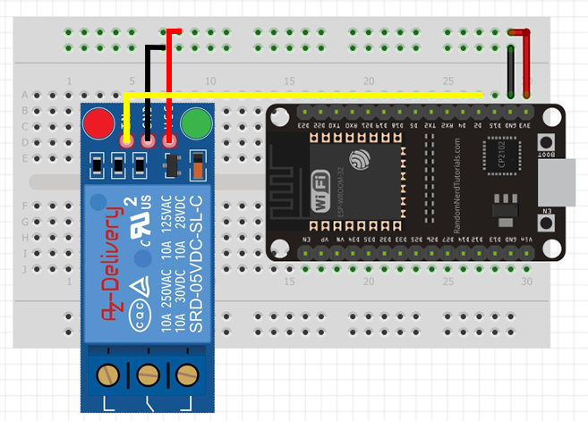

- main.cpp

~~~cpp
#include <Arduino.h>

/**************************************************
 * Para la activación de un rele solo necesitamos
 * controlar el estado de una terminal  del ESP32
 **************************************************/

#define Rele 2  //terminal 2
#define ON LOW  //para activarlo se hace con un 0 lógico
#define OFF HIGH //para desactivarlo se hace con un 1
byte valor;

void setup() {

  Serial.begin(9600);              // Inicializamos la comunicación serial
  pinMode(Rele, OUTPUT);           // Establecemos la terminal PinRele como salida 
  digitalWrite(Rele, OFF);         //Apagamos el relevador

}

void loop() {
  
  while(Serial.available()){
    valor = Serial.read();  //leo el valor introducido en consola 
    /* Si el valor recibido es igual a ‘a’, el relevador encenderá */
    if(valor == 'a'){
      digitalWrite(Rele, ON);
      Serial.write(valor); //con write me imprime la letra
      Serial.println();
    }else{
      digitalWrite(Rele, OFF);
      Serial.write(valor);
      Serial.println();
    }
  }
  
}
~~~

## Motor de CD

- Un motor de CD es aquel en el que no controlas su posición
  - Tiene 2 terminales, según la polaridad gira en una dirección u otra
  - El método más básico es con un transistor, una resistencia y un diodo de protección

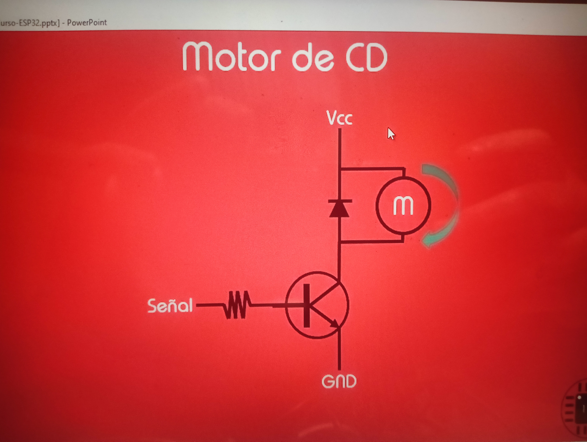

- Le entra una señal al transistor, lo cual entra en una zona de saturación, lo que permite la corriente del colector a emisor y hace que se active el motor
- El diodo está como protección
- Pero nosotros usaremos un puente H

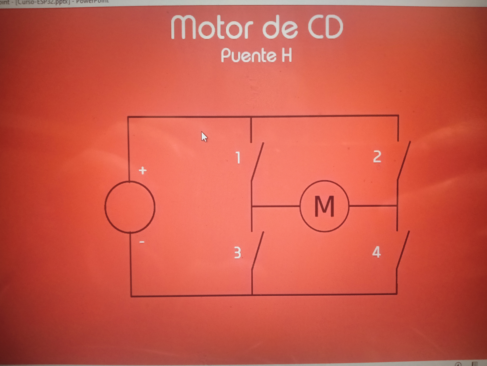

- Tenemos 4 interruptores
  - Si cerramos el interuptor 1 y el 4, y dejamos abierto el 2 y el 3 la corriente va a tomar la dirección de las agujas del reloj 


- Si hacemos lo mismo a la inversa (2 y 3 abiertos, 1 y 4 cerrados), la corriente toma la dirección contraria
- Hay varios integrados para manejar esto, aquí usaremos el L293 o L293D (los dos son puentes H y funcionan de la misma forma)
  - El L293D tiene los diodos integrados

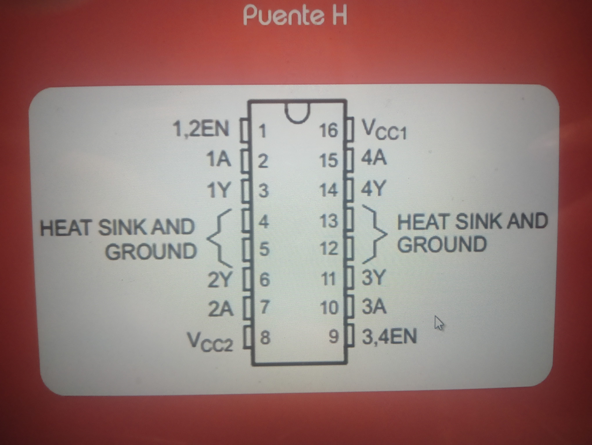


- Las terminales 4,5,12,13 son la tierra (donde se puede agregar un dispador)
- 16 VCC (5v) alimenta al integrado
- 8 Vcc2 (alimentación de los motores)
- Tiene cuatro buffers, la entrada del primer buffer es 1A y la salida 1Y. La del segundo la entrada es 2A y la salida 2Y
- En la terminal 1 tenemos 1,2EN, es el ENABLE, es lo que habilita el primer y segundo buffer 
- En la terminal 9 tenemos 3,4EN que es lo que habilita los otros dos buffers
- En la foto podemos ver como con el lado izquierdo del integrado podemos controlar un motor en ambos sentidos, mientras que con el lado derecho podemos controlar dos motores solo en 1 sentido
  - Entonces, podemos controlar 4 motores en un solo sentido o dos motores en ambos sentidos
  - Si tienes un alto (H) en la entrada vas a tener un alto en la salida
  - Si tienes un bajo (L) en la entrada vas a tener un bajo a la salida (siempre y cuando el EENABLE (EN) esté habilitado)
  - Si el ENABLE (EN) está en bajo (L) no importa lo que tengas a la entrada, la salida va a ser 
- Ejemplo:
  - Si en la terminal 2 ponemos un 1, que es la entrada del primer buffer, a la salida (terminal 3) tendremos un 1
  - Si en la terminal 7 ponemos un 0, a la salida (terminal 6) tendremos un 0 
  - Esto hará que tenga positivo arriba y negativo abajo, lo que hará que gire en un sentido


- Para controlar la velocidad vamos a tener que generar un PWM que inyecatremos en el ENABLE, que va a estar habilitando y deshabilitando los buffers, de esta manera se va a ir controlando la velocidad
- El esquema sería así

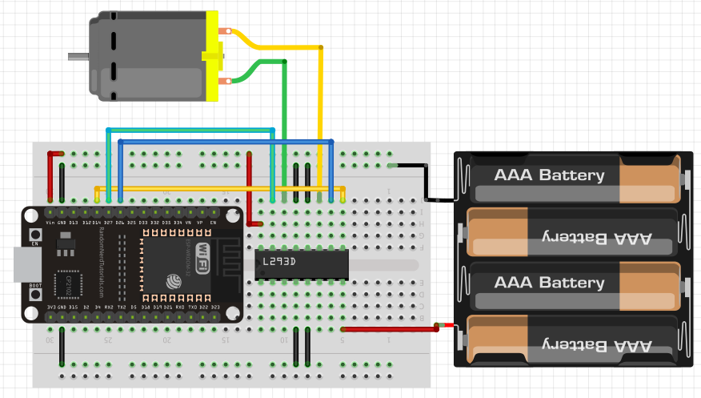

- Hay un módulo basado en el integrado L298N muy útil (también es un puente H)

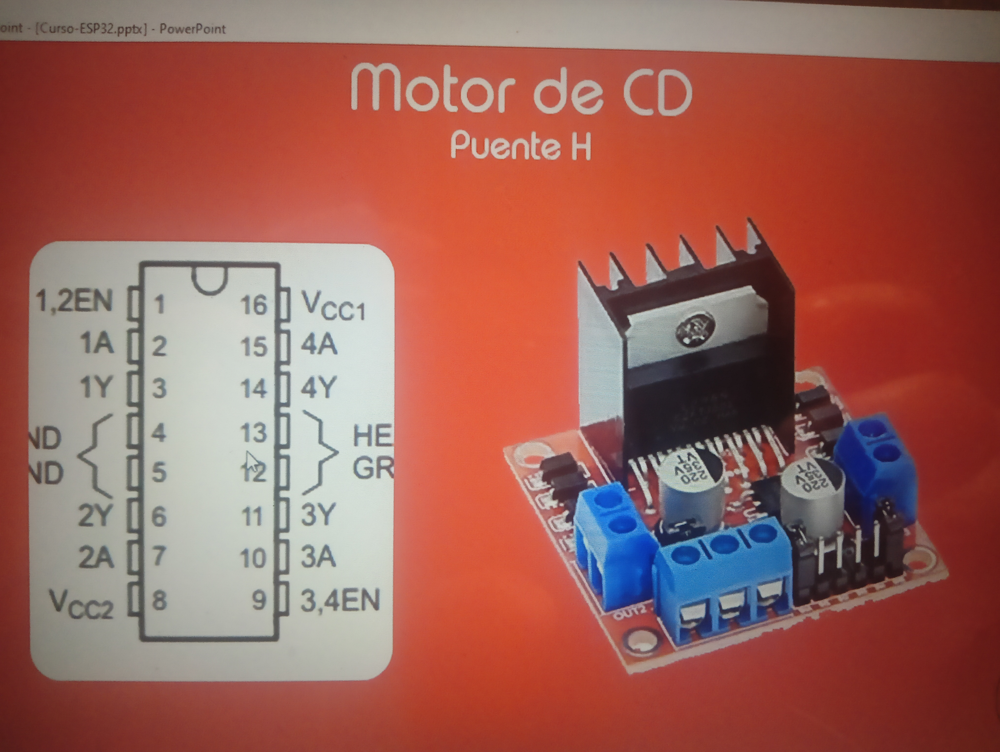

- Las 4 entradas son esas patillas con plástico negro, 1,2,3,4 de izquierda a derecha
- Las 4 salidas son los plásticos azules (bornedas) a ambos lados
- El esquema

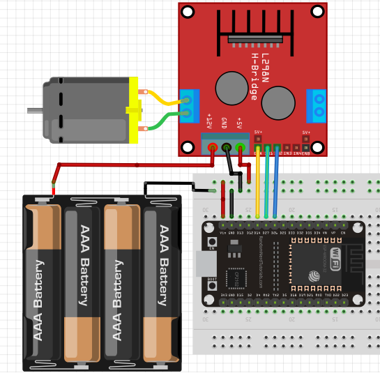

- 26 y 27 son para controlar el giro del motor
- La 14 es donde vamos a generar la PWM para controlar la velocidad (conectada al ENA)
- El motor está conectado a la salida 1 y 2 ( a la izquierda)
- Si quisiera usar las salidas 3 y 4 debería usar el IN3 e IN4 y el ENB (ENABLE B)
- El Vin del ESP32 está conectado al positivo del USB, que es dde donde saca los 5 Volts para alimentar el integrado del módulo
- El GND tiene que estar conectado
- Los 12 volts para alimentar el motor vienen de las pilas (puede ser más o menos voltaje, es prudente ver la hoja de datos del integrado)
- main.cpp

~~~cpp
#include <Arduino.h>
/****************************************************
 * Tendremos dos terminales como salida y un PWM 
 * para controlar la velocidad.
 ****************************************************/

#define A1 27       // Para el control del giro
#define A2 26       // Para el control del giro
#define EN_A 14     // Para el control de la velocidad 

//Parámteros del PWM
#define Canal_0 0   //canal 0
#define Freq 50     //Frecuencia de 50 Hz
#define Resolucion 10  //10 bits
int Velocidad = 0;

#define Derecha 'd'
#define Izquierda 'a'
#define Aumentar 'w'
#define Disminuir 's'
byte Dato; 

void setup() {

  Serial.begin(9600); //iniciamos la comunicación serial

  pinMode(A1, OUTPUT); //seteo los pines
  pinMode(A2, OUTPUT);

  ledcSetup(Canal_0, Freq, Resolucion); //seteamos la PWM
  ledcAttachPin(EN_A, Canal_0); //indicamos la terminal en que va a salir el PWM

}

void loop() {

  while(Serial.available()){ //esperamos un dato              
    Dato = Serial.read();  //leemos el dato y lo guardamos
    
    switch (Dato){
      case Derecha:   // Derecha
        digitalWrite(A1, HIGH);
        digitalWrite(A2, LOW);
        Serial.println("Derecha");
        break;

      case Izquierda:   // Izquierda
        digitalWrite(A1, LOW);
        digitalWrite(A2, HIGH);
        Serial.println("Izquierda"); 
        break;

      case Aumentar:   // Aumentar
        Velocidad+=10;
        //La PWM tiene una resolucion de 10 bits, solo puede tomar valores de 0 a 1024
        Velocidad = Velocidad>1024?1024:Velocidad; //ternario
        Serial.print("Velocidad: ");
        Serial.println(Velocidad);
        break;

      case Disminuir:   // Disminuir
        Velocidad-=10;
        Velocidad = Velocidad<0?0:Velocidad;
        Serial.print("Velocidad: ");
        Serial.println(Velocidad);
        break;
    }            

  }

  ledcWrite(Canal_0, Velocidad); //le paso la velocidad al PWM
                                

}
~~~

## Servo Motor

- El servomotor está diseñado principalmente para controlar el ángulo de rotación, no la velocidad directamente.
- Este motor tiene tres terminales
  - Rojo (alimentación (+5V))
  - Marrón/Negro : GND
  - Naranja: señal PWM
- Este motor toma grado, de 0 a 180º
- Lo vamos a controlar con un PWM (debe tener una frecuencia de 50Hz o un periodo de 20 milisegundos)
- El ciclo útil debe de tener un tiempo de 1 milisegundo para que el motor tenga un aposición de 0º
- Para 180º 2 milisegundos

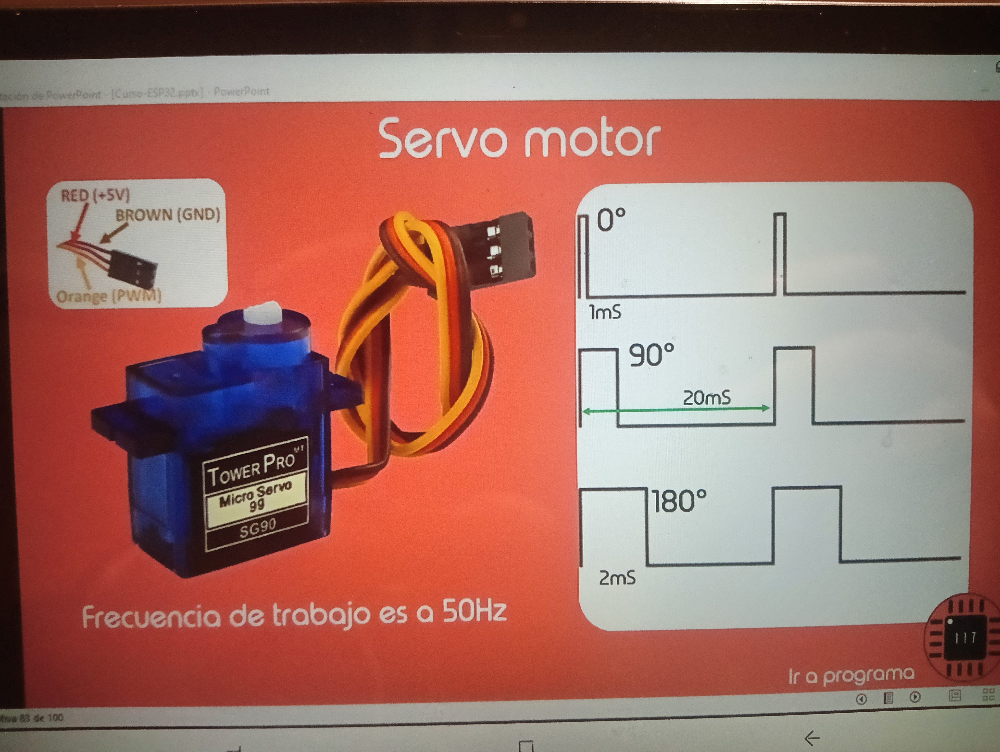

- El esquema


- Tenemos una biblioteca que nos va a yudar llamada Servo.h
- main.cpp

~~~cpp
#include <Arduino.h>
#include <Servo.h>

Servo servo;                        // Creamos un objeto de tipo Servo
int Giro = 0;                       //para controlar el ángulo
#define Aumentar 'w'
#define Disminuir 's'
byte Dato;                          //variable para guardar lo que recibamos por  consola

void setup() {
  Serial.begin(9600);
  servo.attach(13);                 // Indicamos con que terminal controlaremos el servo 
}

void loop() {

  while(Serial.available()){               
    Dato = Serial.read();  //Dato = w o s, aumentar o disminuir 
    
    switch (Dato){
    case Aumentar:   // Aumentar
      Giro++;
      Giro = Giro>180?180:Giro; //solo puede girar hasta 180º
      /* Con servo.write(grados) posicionamos el servo, admite valores de 0° a 180° */
      servo.write(Giro);       //la función nos permite indicarle los grados     
      Serial.print("Giro: ");
      Serial.println(Giro);
      break;

    case Disminuir:   // Disminuir
      Giro--;
      Giro = Giro<0?0:Giro;
      /* Con servo.write(grados) posicionamos el servo, admite valores de 0° a 180° */
      servo.write(Giro);
      Serial.print("Giro: ");
      Serial.println(Giro);
      break;
    }            

  }
}
~~~

## Motor a pasos

- Veremos un motor a pasos unipolar de 4 bobinas. Los hay de 4,5,6 hilos, bipolares..
- Para que puedan dar un giro tenemos que ir activando las bobinas en determinada secuencia

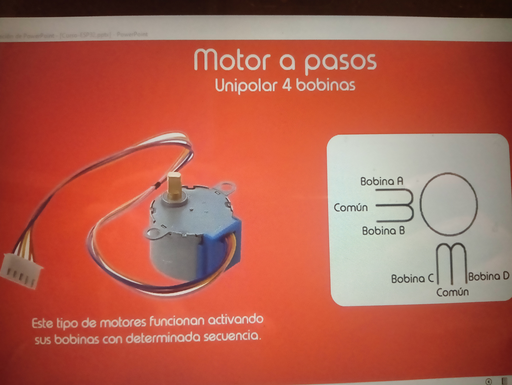

- Esta es la primera secuencia (paso completo)
- El motor tiene más bobinas (no solo A,B,C,D), pero de esta manera se entiende mejor
- En el primer paso activamos la bobina A, cuando queremos que avance el motor activamos la bobina B. Y asi
- Si quiero que vaya a la A, desactivo la D y activo la A

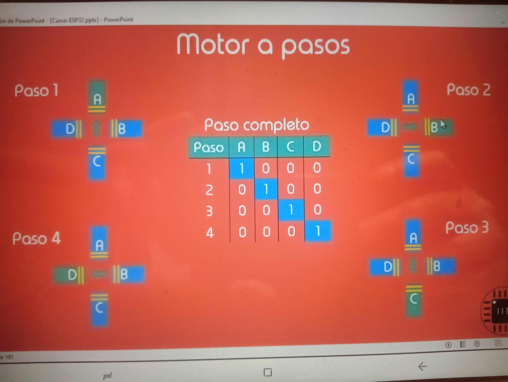

- La siguiente se llama también paso completo pero activamos las bobinas de 2 en 2 (A y B, luego B y C, etc)

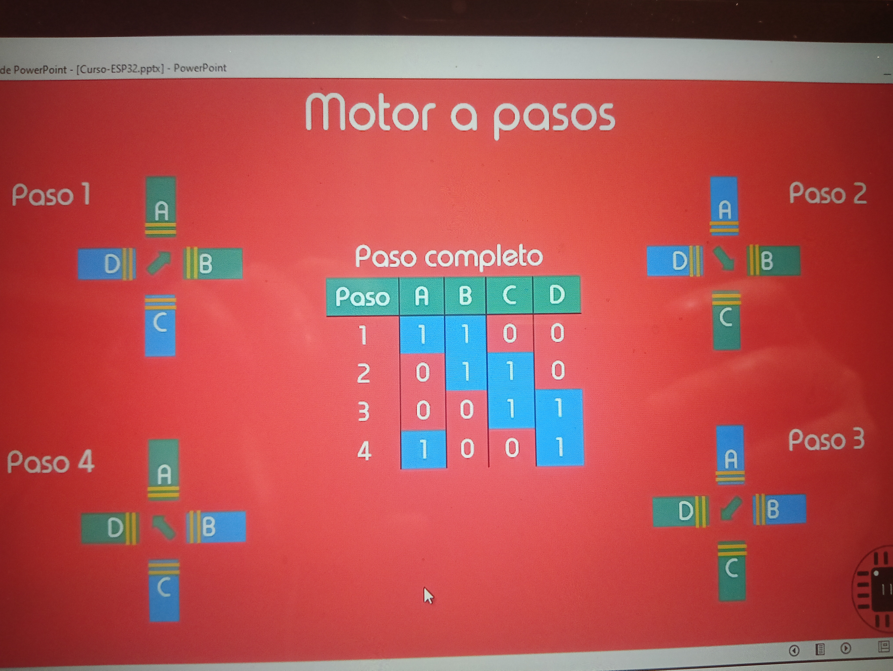

- La última secuencia son medios pasos, es como una mezcla de las dos anteriores
- En el paso 1 activamos la bobina A, en el paso 2 la bobina A y B, en el paso 3 la bobina B, en el 4 la B y C, etc
- Avanzamos de mitad en mitad

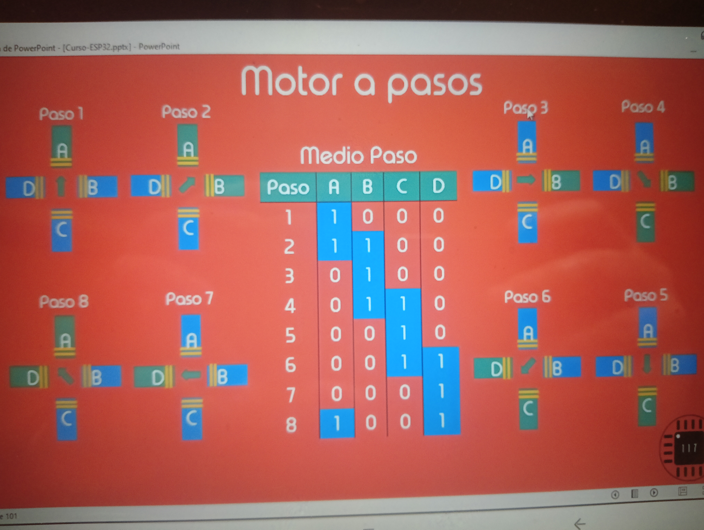

- Usaremos un motor que ya contiene una caja reductora. La salida de la caja reductora es lo que da vueltas
- 1 vuelta son 64 pasos, cada paso da 5.625º
- El motor tiene una caja reductora de 1/64
- 64x64 = 4096 para dar una vuelta completa, cada paso avanza 0.0878º
- Teóricamente la frecuencia máxima de trabajo son 100 Hz. Quizá te puedas pasar un poco pero si te pasas se va a trabar
- Para controlar el sentido del giro, si empezamos por el 1 y acabamos en el 8 gira en el sentido horario, y si empezamos en el 8 y acabamos en el 1 en el sentido contrario
- Se usa un módulo con un integrado ULN2003 para manejar el motor
- También se puede usar un puente H
  - La entrada 1A,2A,3A,4A van al ESP
  - Las salidas 1Y,2Y,3Y,4Y al motor
  - Las bobinas deben ir en orden
  - las terminales 4,5,12,13 como vimos son GND
  - El ENABLE1 y 2 y el ENABLE3 y 4 van a Vcc1 (5V) (para que el puente siempre esté activo)
  - Vcc2 es la alimentación externa del motor
- El esquema


- main.cpp

~~~cpp
#include <Arduino.h>

//terminales
#define Pin1 12
#define Pin2 14
#define Pin3 27
#define Pin4 26 

int Secuencia0[4][4] ={     // Secuencia paso completo
// 0  1  2  3
  {1, 0, 0, 0},
  {0, 1, 0, 0},
  {0, 0, 1, 0},
  {0, 0, 0, 1}
};

int Secuencia1[4][4] ={     // Secuencia paso completo 2
// 0  1  2  3
  {1, 1, 0, 0},
  {0, 1, 1, 0},
  {0, 0, 1, 1},
  {1, 0, 0, 1}
};

int Secuencia2[8][4] ={     // Secuencia medio paso
// 0  1  2  3
  {1, 0, 0, 0},
  {1, 1, 0, 0},
  {0, 1, 0, 0},
  {0, 1, 1, 0},
  {0, 0, 1, 0},
  {0, 0, 1, 1},
  {0, 0, 0, 1},
  {1, 0, 0, 1}
};

int i=0;
boolean Giro = true; //nos dirá si recorremos la matriz del 0 al 7 o del 7 al 0 (el sentido)
#define Izquierda 'a'
#define Derecha 'd'
#define Aumentar 'w'
#define Disminuir 's'
#define Iniciar 'q'  //inicia el conteo de la secuencia
#define Detener 'e'
#define vueltaCompleta 'v'
byte Dato;

/* timer */
hw_timer_t *timer = NULL; //apuntador
void IRAM_ATTR onTimer(); //función de interrupción del timer guardada en IRAM (Instruction RAM)
float Frecuencia = 5; 
double Disparo = 200000; //le dirá al contador cuando ejecutar onTimer

void setup() {
  Serial.begin(9600);

  /* Configuración de salidas */
  pinMode(Pin1, OUTPUT);
  pinMode(Pin2, OUTPUT);
  pinMode(Pin3, OUTPUT);
  pinMode(Pin4, OUTPUT);

  /* Configuración del timer */                   // usamos el timer 0 (tenemos 4), true para contar hacia arriba
  timer = timerBegin(0, 80, true);                // 80Mhz/80 = 1Mhz de Frecuencia (el prescaler, 1 microsegundo)
  //le pasamos el timer, la función a ejecutar cuando el contador alcance a Disparo
  //true para la activación de flanco de subida
  timerAttachInterrupt(timer, &onTimer, true); 

  //le pasamos el timer, cual es el numerito que tiene que alcanzar, 
  //true para que el timer regrese a 0 cuando alcance Disparo
  timerAlarmWrite(timer, Disparo, true);          // 5Hz => 0.2s        0.2/0.000001 = 200000
                                                  // 200hz => 0.005     0.005/0.000001 = 5000
}

void loop() {

   while(Serial.available()){
    Dato = Serial.read();

    switch (Dato){
    case Izquierda:   // Izquierda
      Serial.println("Izquierda");
      Giro = true;
      break;

    case Derecha:   // Derecha
      Serial.println("Derecha");
      Giro = false;
      break;

    case Aumentar:   // Aumentar velocidad
      Frecuencia += 10; //Frecuencia esta inicializada en 5
      Frecuencia = Frecuencia>1500?1500:Frecuencia;           // Limitamos la frecuencia
      //para calcular el Disparo calculamos el inverso de la frecuencia y dividirlo entre  1 microsegundo
      // 1 microsegundo pq es el inverso de 1 MHz, que es el tiempo que tarda en incrementar el contador
      Disparo = 1/Frecuencia/0.000001;
      //actualizamos el Disparo, le pasamos el nuevo valor para que sepa dónde tiene que llegar
      timerAlarmWrite(timer, (int)Disparo, true);             // Actualizamos el valor al que tiene que llegar el contador del timer.
      Serial.print("Frecuencia: ");                           // Mostramos los valores en el monitor serial.
      Serial.print(Frecuencia);
      Serial.println(" Hz");
    break;

    case Disminuir:   // Disminuir velocidad
      Frecuencia -= 10;
      Frecuencia = Frecuencia<10?10:Frecuencia;               // Limitamos la frecuencia
      Disparo = 1/Frecuencia/0.000001;
      timerAlarmWrite(timer, (int)Disparo, true);             // Actualizamos el valor al que tiene que llegar el contador del timer.
      Serial.print("Frecuencia: ");                           // Mostramos los valores en el monitor serial.
      Serial.print(Frecuencia);
      Serial.println(" Hz");
    break;

    case Detener:   // Detener
      Serial.println("Detener");
      timerAlarmDisable(timer);
    break;

    case Iniciar:   // Iniciar
      Serial.println("Iniciar");
      timerAlarmEnable(timer);
    break;

    case vueltaCompleta:   //Vuelta completa
      Serial.println("Vuelta completa");
      for(int j=0; j<512; j++){
        for(int k=0; k<8; k++){
          digitalWrite(Pin1, Secuencia2[k][0]);
          digitalWrite(Pin2, Secuencia2[k][1]);
          digitalWrite(Pin3, Secuencia2[k][2]);
          digitalWrite(Pin4, Secuencia2[k][3]);
          delay(5);
        }
      }
    break;
    } 
   }

}

// Función de interrupción.
//qué tan rápido se va a ejcutar? Depende de la frecuencia que modificamos en loop()
void IRAM_ATTR onTimer() {

  //les asignamos a los pines un valor de la matriz
  //hemos iniciado i en 0, por lo que le pasamos la fila 0 {1,0,0,0}
  digitalWrite(Pin1, Secuencia2[i][0]);
  digitalWrite(Pin2, Secuencia2[i][1]);
  digitalWrite(Pin3, Secuencia2[i][2]);
  digitalWrite(Pin4, Secuencia2[i][3]);

  if(Giro){ //Giro está en true
    i++;
    i = i<8? i:0;
  }else{  //Si Giro esta en false, el motor girará en la otra dirección
    i--;
    i = i>=0? i:7;
  }
  
}

/*int Secuencia2[8][4] ={     // Secuencia medio paso
//  0  1  2  3
0  {1, 0, 0, 0},
1  {1, 1, 0, 0}, <---Para acceder al segundo 1 es [1][1]
2  {0, 1, 0, 0}, <--- Para acceder al 1 es [2][1] 
3  {0, 1, 1, 0},
4  {0, 0, 1, 0},
5  {0, 0, 1, 1},
6  {0, 0, 0, 1},
7  {1, 0, 0, 1}
};*/
~~~

Perfecto 👍 te la voy a explicar paso por paso y en palabras simples.

Ese `case Aumentar:` seguramente está dentro de un `switch`, y se ejecuta cuando quieres **aumentar la velocidad** (probablemente de un motor paso a paso).

---

# 🔎 Línea por línea

```cpp
case Aumentar:   // Aumentar velocidad
```

Cuando ocurre el evento **Aumentar**, entra aquí.

---

```cpp
Frecuencia += 10; // Frecuencia esta inicializada en 5
```

Estás aumentando la frecuencia en 10 Hz cada vez.

Si estaba en 5 Hz:

```
5 → 15 → 25 → 35 ...
```

💡 En motores paso a paso:

* Más frecuencia = más pulsos por segundo
* Más pulsos por segundo = más velocidad

---

```cpp
Frecuencia = Frecuencia > 1500 ? 1500 : Frecuencia;
```

Esto es un operador ternario (una forma corta de `if`).

Significa:

👉 Si `Frecuencia` es mayor que 1500
→ entonces ponla en 1500
👉 Si no
→ déjala como está

📌 Esto limita la velocidad máxima a **1500 Hz**

Es como decir:

```cpp
if(Frecuencia > 1500){
   Frecuencia = 1500;
}
```

---

# 🧠 Parte importante: el cálculo de `Disparo`

```cpp
Disparo = 1/Frecuencia/0.000001;
```

Vamos a entender esto bien.

Sabemos que:

* La frecuencia está en Hz (ciclos por segundo)
* El periodo es el inverso de la frecuencia

Fórmula básica:

```
Periodo = 1 / Frecuencia
```

Ejemplo:
Si Frecuencia = 100 Hz

```
Periodo = 1 / 100 = 0.01 segundos
```

Pero tu timer trabaja en **microsegundos** porque lo configuraste así:

```cpp
timerBegin(0, 80, true);
```

Eso significa:
👉 1 tick = 1 microsegundo

Entonces conviertes segundos a microsegundos dividiendo entre 0.000001:

```
0.01 / 0.000001 = 10000 microsegundos
```

Entonces realmente estás haciendo:

```
Disparo = Periodo en microsegundos
```

💡 En forma más clara sería:

```cpp
Disparo = 1000000 / Frecuencia;
```

Es exactamente lo mismo pero más entendible.

---

# ⏱ Ahora esta línea:

```cpp
timerAlarmWrite(timer, (int)Disparo, true);
```

Le estás diciendo al timer:

👉 “Genera la interrupción cuando el contador llegue a este valor”

Como el timer cuenta en microsegundos:

Si Disparo = 10000
→ la interrupción ocurre cada 10000 µs
→ o sea cada 0.01 segundos
→ o sea 100 Hz

- Esto significa que cada 0.01 segundos va a ejecutar la función onTimer (que es la que dispara la interrupción)
- La velocidad del motor depende directamente de la frecuencia con la que se ejecuta onTimer()
👉 onTimer() se ejecuta 100 veces por segundo
👉 El motor avanza 100 pasos por segundo
El `true` al final de la función significa:
👉 que el disparo es repetitivo (auto-reload)

# 🎯 ¿Qué está haciendo realmente todo el bloque?

1. Aumenta la frecuencia
2. La limita a 1500 Hz
3. Calcula el nuevo periodo en microsegundos
4. Actualiza el timer con ese nuevo periodo
5. Muestra el valor por pantalla

---

# 🧩 ¿Por qué esto cambia la velocidad?

Si el timer genera interrupciones más rápido:
→ Genera pulsos más rápidos
→ El motor recibe más pasos por segundo
→ El motor gira más rápido

- Porque:

* Más frecuencia
* Menos tiempo entre pulsos
* Más velocidad del motor
----------

