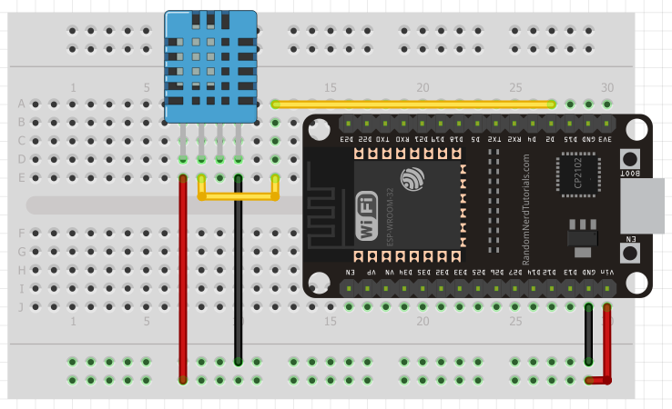
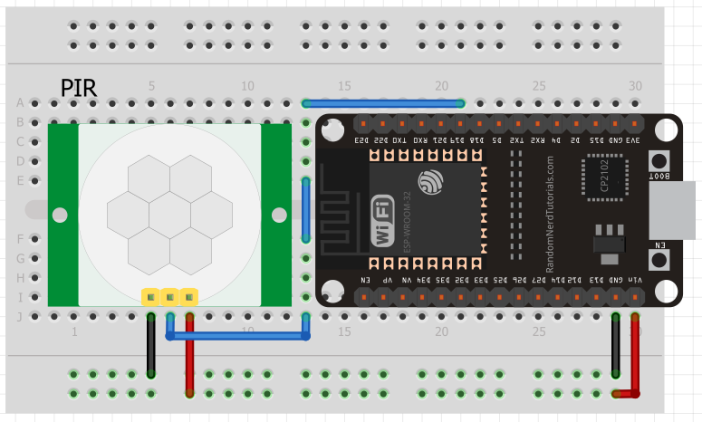
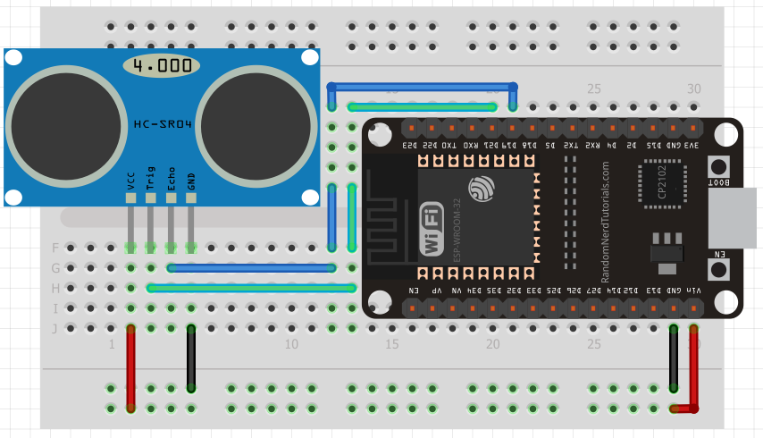

# PlatformIO - Módulos

## DHT11

- El esquema



- main.cpp

~~~cpp
#include <Arduino.h>
#include <Adafruit_Sensor.h>
#include <DHT.h>

/**
 * Adafruit Unified Sensor by Adafruit
 * DHT sensor library by Adafruit
 */

#define DHTPIN 2
float humedad, tempC, tempF;

DHT dht(DHTPIN, DHT11);

void setup() {
  Serial.begin(9600);
  dht.begin();
}

void loop() {
  
  humedad = dht.readHumidity();
  tempC = dht.readTemperature();
  tempF = dht.readTemperature(true);

  if(isnan(humedad) | isnan(tempC) | isnan(tempF)){
    Serial.println("Error en DHT");
  }else{
    
    Serial.print("Humedad: "); Serial.print(humedad); Serial.println(" %");
    Serial.print("Temperatura: "); Serial.print(tempC); Serial.println(" °C");
    Serial.print("Temperatura: "); Serial.print(tempF); Serial.println(" °F");
    Serial.println();
  }

  delay(1500);

}
~~~


## Sensor PIR

- El esquema



- main.cpp

~~~cpp
#include <Arduino.h>

#define Interrupcion 19 //terminal 19
boolean move = false;
int cont = 0;

void IRAM_ATTR funcionDeInterrupcion(); // guardo la función que disparará la interrupción en la IRAM

void setup() {
  Serial.begin(9600);
  pinMode(Interrupcion, INPUT_PULLDOWN); 
  //le paso el PIN para la interrupción, la función
  //RISING significa que la interrupción se activará cuando la señal cambie de un valor bajo (LOW) a un valor alto (HIGH). 
  attachInterrupt(digitalPinToInterrupt(Interrupcion), funcionDeInterrupcion, RISING);
}

void loop() {
  
  if(move){
    cont++;
    Serial.print("Movimiento detectado "); Serial.println(cont);
    move = false;
  }
  delay(10);
}

void IRAM_ATTR funcionDeInterrupcion() {
  move = true;
}
~~~

Estás detectando el movimiento en el **momento en que el sensor PIR cambia su señal de baja a alta**. Esto ocurre cuando el sensor PIR detecta un cambio en la radiación infrarroja, generalmente cuando una persona o un objeto se mueve frente al sensor.

### ¿Cómo funciona este proceso?

1. **Sensor PIR en reposo (sin movimiento):**

   * El sensor PIR generalmente tiene una salida que permanece en **`LOW`** cuando no hay movimiento, lo que significa que no se detecta ninguna variación de radiación infrarroja.

2. **Detectando movimiento (cambio a `HIGH`):**

   * Cuando el sensor PIR detecta un cambio en la radiación infrarroja, por ejemplo, cuando una persona entra en el rango de detección, la señal en el pin de salida del sensor cambia de **`LOW`** a **`HIGH`**. Este cambio de **`LOW`** a **`HIGH`** es lo que provoca la interrupción.

3. **La interrupción:**

   * La interrupción se activa **en el flanco ascendente**, es decir, cuando la señal cambia de **`LOW` a `HIGH`**.
   * Esto es lo que ocurre cuando el sensor detecta movimiento, y tu función `funcionDeInterrupcion` se ejecuta, lo que cambia la variable `move` a `true`.

### Explicación detallada con tu código:

```cpp
attachInterrupt(digitalPinToInterrupt(Interrupcion), funcionDeInterrupcion, RISING);
```

* El **`attachInterrupt`** se encarga de escuchar cambios en el pin que has definido (en este caso, el pin `19`).
* La interrupción se activará **cuando el pin pase de `LOW` a `HIGH`** (cuando la señal suba, es decir, se detecte movimiento).

### En resumen:

El **movimiento** se detecta en el **momento en que la señal del sensor PIR pasa de `LOW` a `HIGH`** (flanco ascendente). Esto ocurre porque el sensor está configurado para emitir un pulso alto cuando detecta movimiento. En ese instante, se ejecuta la función de interrupción (`funcionDeInterrupcion`), que cambia el valor de la variable `move` a `true`, indicando que el sensor ha detectado movimiento.

Luego, en el `loop()`, el código revisa si `move` es `true`, y en ese caso, incrementa el contador de movimientos y lo imprime en el monitor serie.


## UltraSónico HCSR04

- El esquema 
  - Tiene VCC , GND, Trig (Disparo) y Echo



- main.cpp

~~~cpp
#include <Arduino.h>
#include <Ultrasonic.h>

/**
 * Ultrasonic by Erik Simoes
 */

Ultrasonic ultrasonico(21, 19); // (Disparo, Echo)
int distancia;

void setup() {
  Serial.begin(9600);
}

void loop() {

  Serial.print("Sensor ultrasonico: ");
  distancia = ultrasonico.read();           // Obtenemos la distancia en centímetros.
  Serial.print(distancia);                  // Mostramos la distancia en el monitor serial.
  Serial.println(" cm");
  
  delay(1000);
}
~~~