# Microcontroladores PIC con C

- ¿Qué tenemos en un microcontrolador?
    - La memoria RAM (volátil) y la ROM (persistente, donde va el código)
    - La CPU
        - ALU (Unidad de Aritmética Lógica). Se encarga de realizar todas las operaciones aritméticas o lógicas
        - UC (Unidad de Control). Se encarga de decodificar las instrucciones
        - PC (Contador de programa)
            - Se encarga de apuntar siempre a la siguiente instrucción
        - IR (Registro de instrucción)
            - Almacena la instrucción que se está ejecutando en la CPU
        - ACC (Acumulador) o "W" en los PIC (Working Register)
            - Asociado con las operaciones aritméticas y lógicas que se producen en la ALU
        - RDD (Registro de Direcciones de Datos) o "FSR" en los PIC (File Select Register)
            - Se utiliza para el direccionamiento indirecto de datos y almacena la dirección de los datos en memoria
        - STATUS (Registro de Estado)
            - Se encarga de dar soporte con indicadores a la ALU (por ejemplo, señalando si el resultado de una operación es positivo o no)
        - SP (Stack Pointer o Pila). Los PIC no tienen este registro implementado y su pila es independiente de la memoria
            - Zona de memoria de datos que se usa en ocasiones que se quiera guardar cierta información
    - Los periféricos (dispositivos de entrada y salida)
        - E/S serie
        - E/S paralelo
        - E/S analógica
        - Comparadores, LCDs, Convertidores, teclados matriciales, timers, comunicaciones
- Los buses son vias de transmisión para intercambiar y comunicar información entre estos bloques
    - El bus de direcciones especifica la ubicación de los datos
    - El bus de control especifica el tipo de operación a realizar (lectura y escritura) y el momento en que se realiza
    - El bus de datos es por donde viaja la información
- **Todos los microcontroladores necesitan un oscilador para funcionar**
    - Un cristal junto a la CPU que va a determinar la velocidad en la que se producen las operaciones
    - Hay 3 ciclos
        - Ciclo de reloj (la frecuencia del oscilador)
            - Es el periodo de la señal de nuestro reloj
        - Ciclo máquina
            - Es el tiempo que tarda el microcontrolador en acabar una operación interna
            - Depende directamente del oscilador principal
        - Ciclo de instrucción
            - Es la cantidad de tiempo que tarda el microcontrolador en llevar a cabo una instrucción
            - Es un múltiplo del ciclo máquina
            - La mayoría de instrucciones dadas en este curso tardan un ciclo máquina en realizarse
- Las arquitecturas que hay cuando hablamos de un juego de instrucciones
    - CISC (Complex Instruction Set Computer)
        - Hace referencia a instrucciones complejas
        - CPU complejo
        - Velocidades de procesamiento lentas
    - RISC (Reduced Instruction Set Computer)
        - Operaciones simples
        - CPU simple
        - Velocidades de procesamiento rápidas
- **RISC es la arquitectura predominante en el sXX**
- **Arquitecturas Von Neumann y Harvard**
- Hacen referencia a como intercambian la CPU la info con la memoria de datos y la memoria de programa (la RAM y la ROM)
- En la Neumann los buses de dirección, datos y control están compartidos para las memorias
    - No vamos a poder acceder a la vez a memoria de programa y de datos
    - Tener menos buses hace que el intercambio de información sea más lento
    - Se necesitan menos recursos. Esta reducción se puede resumir en una reducción de terminales
        - Esto es algo que los microprocesadores agradecen muchísimo. 
    - Arquitectura destinada a microprocesadores

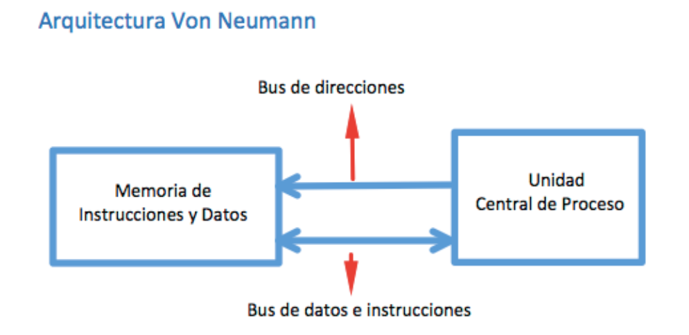

- En la Harvard los buses de dirección, datos y control están duplicados
    - El intercambio de info es más rápido
    - Arquitectura destinada a los microcontroladores 

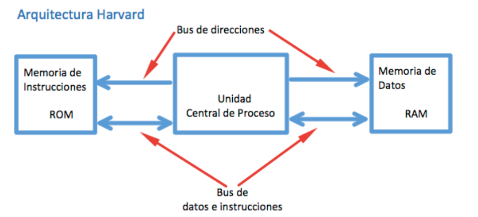

- **Programación de microcontroladores**
    - Lenguaje máquina
        - Es el único lenguaje que entiende el microcontrolador
        - Es código binario que representa las instrucciones
    - Lenguaje ensamblador
        - Transforma los grupos de bits en mnemotécnicos, siendo más fácil para el programador representar estas instrucciones
        - Necesita el ensamblador, que traduzca el código ensamblador a lenguaje máquina
        - Para juntar los diferentes módulos con el código se usa el enlazador 
    - Lenguaje C (este curso)
        - Lenguaje de alto nivel
        - Necesita compilarse a lenguaje ensamblador

## Microcontroladores PIC

- Microcontroladores PIC (Microchip) concretamente PIC16F877A
- Este es de gama media
- Hay gama baja, media y alta
- Hay varias familias, PIC10, PIC12, PIC16, PIC17, PIC18, PIC24, PIC32...
- También en función del número de bits: 8 bits, 16 bits, 32 bits
- Los PIC16 son de gama media y tienen un total de 35 instrucciones de 14 bits
- **Ciclos máquina y ciclos de instrucción**
    - Partiremos de la frecuencia de nuestro oscilador (que será la que tenga que ser)
    - Dentro del PIC se utiliza esta señal de CLOCK para crear 4 señales diferentes
        - Q1,Q2,Q3,Q4
        - Su total se define como un ciclo máquina, el tiempo que tarda el microcontrolador en hacer un proceso interno
    - Para ejecutar una instrucción el microcontrolador deberá hacer varios pasos
        - Primero tendrá que buscar una instrucción
        - Cuando la encuentre la meterá en el bus de instrucciones o de datos y la llevará a la CPU
        - Una vez en la CPU se decodifica, se interpreta y se ejecuta
    - El paso de buscar una instrucción y traerla lo vamos a llamar **Búsqueda de la instrucción**
        - Los PIC van a tardar un ciclo máquina en realizar la Búsqueda de la instrucción
    - Una vez en la CPU se interpreta ys e ejecuta. A esta parte la vamos a llamar **Ejecución de la instrucción**
        - Los PIC tardan otro ciclo máquina en realizarla
    - Un total de 2 ciclos máquina (uno para buscar la instrucción y otro para ejecutarla)
- Existe una cosa que se llama pipelina, es un método con el que se solapa el procesamiento de las instrucciones
    - Para entenderlo, primero se separan los bloques de búsqueda de la instrucción y el de decodificación y ejecución
    - Cuando se quiere procesar una instrucción se va al bloque de búsqueda de la instrucción (1 ciclo máquina)
    - Este se transfiere al bloque de ejecución
    - Se va por la siguiente instrucción, en lugar de esperar la decodificación y ejecución de la anterior
- **PIC16F877A**
    - Es un microcontrolador de 8 bits de gama media diseñado bajo una arquitectura Harvard
    - Set de 35 instrucciones de 14 bits
    - 8K de memoria flash para programa
    - 368 bytes de memoria SRAM  para datos volátil
    - 256 bytes de memoria EPROM para datos no volàtil
    - 5 puertos de entrada/salida (E/S)
    - 15 interrupciones
    - 3 timers, 2 módulos CCP, USART, MSSP, PSP (periféricos)
    - Conversión analógico/digital de 10 bits
    - 2 Comparadores Analógicos

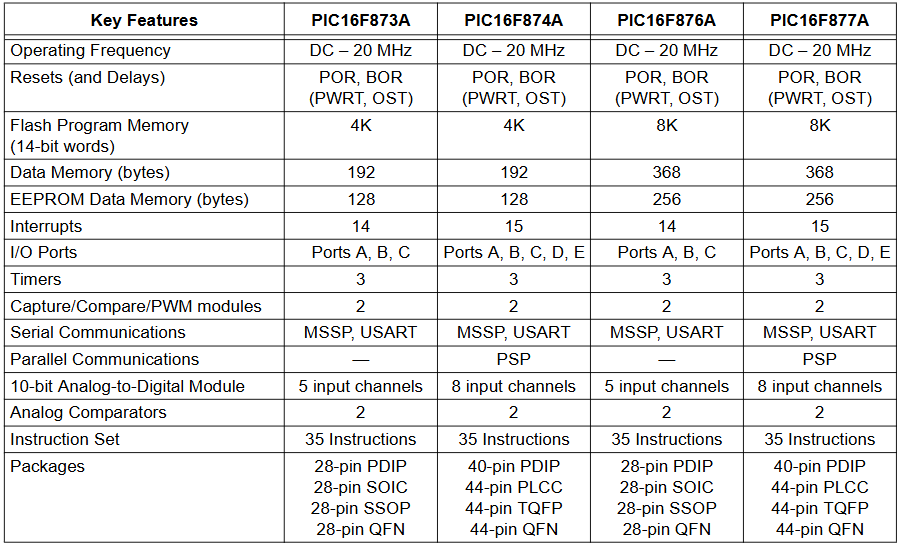

- Módulos
    - CPU (tenemos la ALU, el Registro de Trabajo W, el Registro FSR, el Registro de Estado, el Program Counter, la Pila, el Registro de Instrucciones, la Unidad de Control y finalmente el controlador del oscilador)
    - Memorias: la memoria no volátil FLASH, necesitamos la memoria volátil para datos (la RAM), añade la EPROM
    - Periféricos (todo lo que hay a la derecha y abajo, los timer, etc)
    - Oscilador (4 mHz)
    - Puertos
    - Bits de configuración 
        - Power-Up timer
        - Oscilator Start-Up Timer
        - Power-On Reset
        - Watchdog Timer
        - Brown-out Reset
        - In-Circuit Debugger
        - Low-Voltage Programming

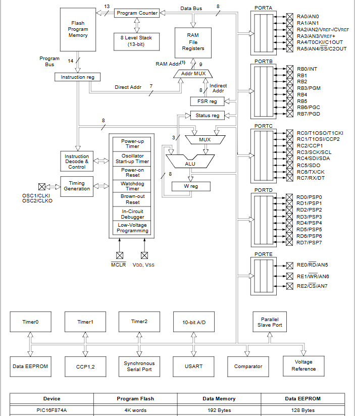

## Organización de la Memoria PIC16F877A

- Palabra: conjunto de bits de un tamaño determinado
    - El bit más significativo a la izquierda (MSB, Most Significant Bit) y el menos significativo a la derecha (LSB, Less Significant Bit)
    - Lo normal es que sean de 8,12,14,16 o 32 bits
- Celda: bloque de memoria dentro del microcontrolador que contiene una palabra de n bits, y que está localizada por una dirección
- **Estructura de la memoria**
    - Vemos una pila, una detrás de otra, de forma secuencial
~~~
celda 1 //Dirección 00h
celda 2 //Dirección 01h
celda 3
celda 4
celda 5
...
celda n
~~~

- Esta es una organización lineal
- Cuando la memoria es demasiado grande, **se usa la paginación**
- Se divide la memoria en varios bloques de celdas llamados páginas
- La primera dirección de la primera celda de la segunda página es la siguiente dirección de la última celda de la primera página
- Así sucesivamente hasta llegar al final de la memoria
- **Memoria no volátil**
    - Es una memoria tipo FLASH (en nuestro caso)
    - Instrucciones de 14 bits (palabras de 14 bits), cada una de estas palabras va a estar introducida en una celda
    - 8k (8192 direcciones)
    - Memoria dividida en 4 páginas. Cada página con un total de 2k (x14 bits)
    - Página 0 - 0000h => 07FFh
    - Página 1 - 0800h => 0FFFh
    - Página 2 - 1000h => 17FFh
    - Página 3 - 1800h => 1FFFh
- Se puede ver que la página 0 empieza en la dirección 5 
    - Esto es porque la dirección 0 está reservada para el vector de reset, y la 4 para el vector de interrupciones

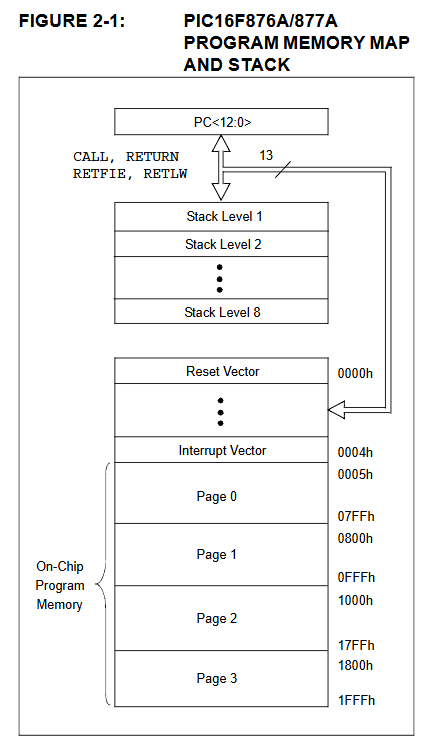

- **Memoria volátil (SRAM)**
    - 368 bytes, en cada celda o Registro hay una palabra de 1 byte
    - Memoria dividida en 4 páginas. A cada página se le llama **Banco**
        - Cada banco tiene un total de 128 bytes, 128 posiciones en memoria o 128 registros
        - **512 totales pero 368 para el programador**
        - Banco 0 - 00h => 7Fh
        - Banco 1 - 80h => FFh
        - Banco 2 - 100h => 17fh
        - Banco 3 - 180h=> 1FFH
- Dentro de la memoria de datos vamos a tener dos tipos de celdas (Registros)
    - Registros de Función Especial (SFR) 
        - Son los registros de configuración que controlan el microcontrolador
        - Periféricos, interupciones, los pines, el direccionamiento
    - Registros de Propósito General (GPR)
        - Son los registros de libre acceso para datos
        - No controlan nada y tienen la finalidad de dar soporte de almacenamiento a los datos que se crean en los programas
- Los bits RP1 y RP 0 van a seleccionar el banco

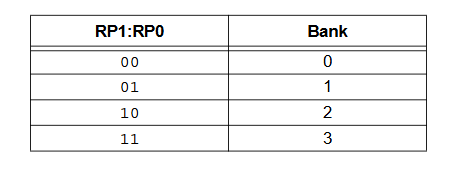

- Aquí podemos ver estructurados todos los registros del microcontrolador
    - Todos los que tienen un nombre son Registros de Función Especial
    - Algunos están duplicados, están destinados a controlar alguna parte del micro
    - Los registros en gris son los no implementados y se leen como un 0
    - En la última parte de cada banco están los registros de propósito general
        - Si sumamos todos estos bytes de propósito general nos da un total de 368 bytes
    - En la última parte de la memoria del banco 1,2,3 se puede acceder a la última parte de la memoria del banco 0
        - Va de la 70 a la 7Fh
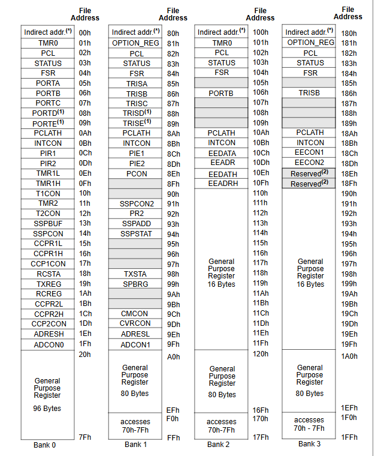

## Bits de configuración PIC16F877A

- Estos modos de configuración están controlados por una serie de bits que se encuentran en un registro de la memoria de programa
    - Este registro está en la dirección 2007, con un tamaño de 14 bits y se denomina Configuration Word
    - Aquí dentro vamos a encontrar un total de 11 bits configurables, por defecto es 3FFF, todos los bits a 1 a menos que se cambien
    - Para modificarlos existe una limitación. Solo podemos acceder a la zona en la que están cuando se programa el controlador
        - Una vez funcionando no se pueden modificar
    - tienen que ver con el oscilador, los resets, de la protección de memoria, la depuración, y la programación 

- **Oscilador**
    - Existen 4 posibles configuraciones
    - Son gobernados por los 2 bits al final del cuadro 14-1, donde pone Fosc1 y Fosc0
        - 00- Oscilador tipo LP (Low-Power Crystal) - Entre 32kHz y 200kHz
        - 01- Oscilador tipo XT (Crystal/Resonator) - Entre 100kHz y 4MHz
        - 10- Oscilador tipo HS (High Speed Crystal/Resonator) - Entre 4 MHz y 20MHz
        - 11- Oscilador tipo RC (Resistor/Capacitor) - Hasta 4MHz
- Si colocamos 00 tendremos configurado un oscilador de tipo LP (baja potencia)
- **Configuración del oscilador**
    - Para los modos LP, XT o HS
    - Colocando un cristal o un resonador cerámico de esta manera, entre las patillas OSC1 y OSC2
    - Tendremos que añadir sus respectivos condensadores/resonadores

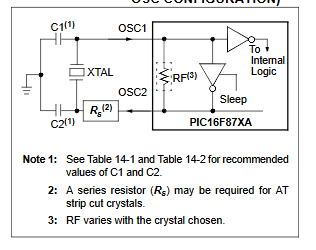

- Resonadores cerámicos

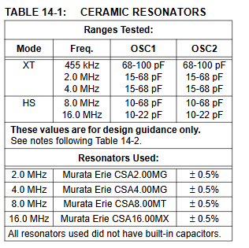

- Cristales

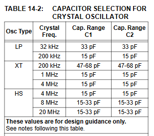

- En función de la elección del condensador tendremos unas características u otras
- Si usamos mayores capacidades aumentará la estabilidad del oscilador, pero también aumentará su tiempo de inicialización
- Estos valores son orientativos, siempre es mejor consultar el manual del cristal o resonador elegido 
- **Otra opción** es no colocar ni un resonador ni un cristal e introducir por la patilla OSC1 un Clock
    - Es decir, colocar una señal de clock externa en el pin OSC1
    - Esta señal tendremos que haberla generado desde un circuito externo
- **Para el modo RC** se recomienda la siguiente configuración

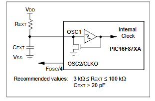

- Dice que la resistencia debería de ser entre 3k y 100k y el condensador mayor de 20 PicoFaradios
- **Resets del microcontrolador**
- Son los bits BOREN, PWRTEN y WDTEN como se ve en el Registro Configuration Word

- Este microcontrolador tiene 4 tipos de reset
    - El reset Power-Up Timer - PWRTEN
    - Reset por Brown-Out - BOREN
    - Reset por Watch-Dog - WDTEN
    - Reset por Hardware - MCLR

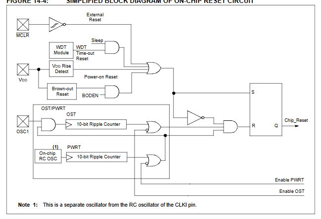

- El que sale del OSC1 (el de abajo) es el PWRTEN
    - Viene controlado por el bit nº 3 del Configuration Word (la figura 14-1)
- El Brown-Out se ve justo encima
    - O por caída de alimentación
    - Está controlado por el bit llamado BOREN
- Otro reset es el de Watch-Dog, que corresponde con el bit nº 2 del registro (poniendo que el primer bit de la derecha es el 0)
- Hay un reset externo por hardware que va directamente por la patilla MCLR del microcontrolador
- **PWRTEN**
    - Cuando alimentamos el microcontrolador se genera el Power-On Reset
    - Es un pulso que ocurre cuando se detecta una subida de tensión, cuando Vdd está entre 1.2 y 1.7 voltios
    - Cuando esto ocurre, el Power-Up Timer se activa poniendo el bit de configuración a 0
        - Por defecto está deshabilitado
        - Si este está habilitado, el microcontrolador se quedará un tiempo fijo llamado tiempo del  Power-UP Timer, en un estado de reset
        - Este tiempo lo determina el fabricante, en este caso es de 72 milisegundos
        - Se utiliza para que la alimentación del micro haya podido llegar a un nivel aceptable antes del comienzo de funcionamiento normal del microcontrolador
- Esto también pasa con el oscilador
    - Cuando encendemos el micro el oscilador va a tener un retraso de 1024 ciclos de reloj
    - Este retraso se genera en un Power-On Reset, siempre y cuando no hayamos elegido la configuración RC del oscilador
    - Este retraso puede ocurrir de dos maneras diferentes
        - En el caso de que el Power-Up Timer esté activado(PWRTEN=0), cuando se produce un Power-On Reset se espera el delay de 72ms del Power-Up Timer y a continuación se produce elretraso de 1024 ciclos de reloj
        - En el caso de que el Power-Up Timer no esté activado (PWRTEN=1), cuando se produce un Power-On Reset se produce el retraso de 1024 ciclos de reloj
- **BOREN**
    - Es el reset que se genera por una caída de tensión
    - Si el Vdd (pin de alimentación) cae por debajo de una tensión de referencia por un tiempo mayor al de referencia se producirá un Brown-Out
    - Estas referencias las proporciona el fabricante, en este caso son 4 voltios y 100 microsegundos
    - En cuanto ocurre un Brown-Out se reseta el microcontrolador
    - El micro sigue reseteado hasta que la tensión de la alimentación se recupera
    - Una vez se recupera la tensión, se espera el tiempo del Power-Up Timer (72 milisegundos) independientemente del bit PWRTEN
- En el siguiente cuadro, podemos ver la columna Value on: POR, BOR y determina el valor que va a tener el registrod e función especial justo después de un Power-On Reset o Brown-Out Reset
    - **Gracias al reseteo vamos a poder fijar el valor inicial de un registro**
        - Esto va a ser importante para poder tener nuestra zona de memoria de registros de función especial controlada
- **WDTEN**
    - Watch-Dog es un reset que sirve para reiniciar el controlador si este opera de manera incorrecta
    - Es un reset temporizado. En cuanto el tiempo se acabe, micro se va a resetear
    - Si el micro hace las cosas bien, el perro guardián no hará nada
    - Si no encuentra la instrucción, se perderá y no encontrará la instrucción que hemos puesto nosotros para resetear este temporizado, por lo que llegará a su limite y reseteará el micro
- **MCLR**
    - Fuera de los registros de configuración especial tenemos este otro reset (por hardware)
- **Protección de la Memoria**

- Son los bits WRT1 y WRT0
- Sirven para proteger la memoria FLASH contra escritura
    - 00=> 2 ceros protegen la mitad de la memoria, la que se encuentra entre la dirección 0 y la 0FFh
    - 01=> protege solo 1/4, de la dirección 0 a la 07FFh
    - 10=> protege las primeras 256 celdas (1/36), la protección llegaría hasta la 00FFh
    - 11=> dejando toda la memoria habilitada para escritura
- Los bits CP y CPD del Configuration Word también son para la protección de la memoria
    - CP: sirve para proteger la lectura de la memoria FLASH
        - 0 => protección de memoria FLASH activada (no se puede leer)
        - 1 => protección desactivada
    - CPD: sirve para proteger la EEPROM de lectura
        - 0 => protección de datos EEPROM activada (no se puede leer)
        - 1 => protección desactivada
-**Depuración**
    - Podemos activar un modo de depuración especial, es el bit DEBUG del Configuration Word
    - Cuando el micro se haya programado correctamente el depurador obtiene l control del micro
    - De esta manera, el usuario puede ir ejecutando el código y observar que ocurre con la memoria y los registros
    - Habilita al programador a monitorizar la ejecución real del programa y descubrir errores 
    - 0 => Activa la depuración In-Circuit. RB6 y RB7 están dedicados al depurador
    - 1 => Desactiva In-Circuit. 
    RB6 y RB7 son pines I/O (Entrada y Salida, E/S) de propósito general
- **Programación a baja tensión**
    - Es el último bit que queda del registro, el **LVP** (Low Voltage Programming)
    - Sirve para reducir el valor que necistamos para programar el micro, además de modificar algunos pines
        - Con un 0 la activamos y con un 1 la desactivamos

## Placa de desarrollo

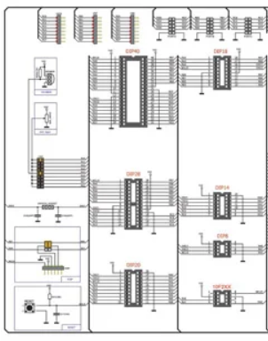

- Tenemos el ICSP, que es el cuadrado que hay encima del cuadrado que hay abajo a la izquierda de la foto
    - Significa In-Circuit Serial Programming, con las patillas que vamos a necesitar para programar el micro
- Debajo de este está el botón de RESET del micro. Se conecta a la patilla MCLR
- En el centro ( ya la derecha) tenemos el módulo donde instalamos el microcontrolador, se pueden colocar un total de 7 encapsulados diferentes. Según el manual esta placa soporta más de 300 microcontroladores PIC
- Hay un módulo con puertos de expansión para comunciar con otra placa
- Vamos con los periféricos
    - En uno de los módulos tendremos 8 leds independientes, cada uno con una resistencia de 330 Ohmnios
    - En otro módulo tenemos 3 botones y un joystick
        - El joystick son 5 botones (arriba, abajo, derecha, izquierda, centro)
        - Todos los botones tienen una resitencia de Pull Up de 1K
    - Tenemos un módulo con un display de 7 segmentos
    - Tenemos un bloque de 4 displays de 7 segmentos
        - Este bloque esta controlado por el driver 74HC138 (sirve unicamente para controlar que display está encendido)
    - Tenemos un módulo para conectar un LCD
        - En la otra parte del módulo se puede conectar un LCD gráfico
    - Tenemos un módulo destinado a un teclado matricial
    - Otro módulo es para la conversión AD y un sensor de temperatura
        - Viene con un potenciometro
        - La tensión del potenciometro puede variar entre Vdd y masa
        - El otro socket es para un sensor de temperatura DS18B20 (no viene con la placa, es un sensor digital que se comunicaría a través de un protocolo 1 wayer)
    - Tenemos el módulo compuesto por el driver que nos permite tener un protocolo RS232, con una zona para conectar un motor paso a paso con el driver VLN2003A, sirve para aumentar la potencia eléctrica que llega al motor
        - Tiene una zona para conectar un receptor de infrarojos, uno que se podría colocar es el 1838V 
    - El último módulo de perifericos es el que está compuesto por 4 periféricos diferentes
        - PS2 (interfaz de teclados antiguos)
        - El speaker (un buzzer)
        - Reloj de timepo real
        - Memoria EEPROM, funciona bajo el protocolo I2C y la podemos utilizar siempre que la necesitemos
    - El módulo de alimentación puede crear un voltaje estable de 5 o 3.3 voltios
        - Se puede conectar con un usb o una pila entre 7 y 12 voltios
        - Con el usb se puede conectar al microcontrolador, pero solo los de alta gama, como el PIC 18
        