# Microcontroladores PIC - Diseño de un proyecto

- C-Aware IDE es una opción
- Hay 4 tipos de compiladores diferentes
    - PCB: para micros de 8 bits con un set de 12 bits de instrucciones
        - Aquí se encuentran muchos PICS de las familias 10, 12 y 16
    - PCM: para micros de 8 bits con un set de 14 bits de instrucciones
        - Aquí tenemos la PIC 10,12,14 y 16
    - PCH: para micros de 8 bits con un set de instrucciones de 16 bits. Es algo más complejo
    - PCD: para micros de 16 bits con sets de instrucciones de 32 bits
- El compilador que ofrece C-Aware es PCW incluye PCB y PCM 
    - El PCWH nos incluye todos los compiladores para micros de 8 bits
    - PCWHD los incluye todos
- Es de pago
- Otra opción es **MPLAB IDE**
    - Podemos tener 3 compiladores
        - XC8 (para 8 bits)
        - XC16 (para 16 bits)
        - XC32 (para 32 bits)
    - Tiene menos drivers y ventajas pero es totalmente gratuito
- Una vez tengamos el código lo probaremos en el simulador con Proteus
- Es común que el programa no funcione a la primera
- Para ello haremos la depuración
    - Se puede hacer en Proteus o en MPLAB
- Luego de comprobar que el código funciona, haremos el volcado en el micro
- Necesitaremos dos herramientas
    - Hardware (Programador)
        - Usaremos el PICKIT 4 o PICKIT 3
    - Software
        - Usaremos MPLAB IDE y MPLAB IPE

## Estructura de un programa - CSS C COMPILER

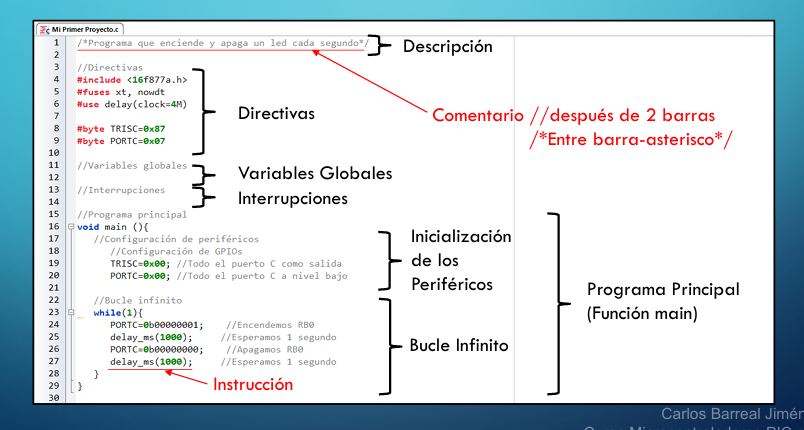

- Con la directiva **#use** delay(clock=Frequency) define la frecuencia a la que funciona la CPU
    - Es decirle al compilador cual es la frecuencia de nuestro clock
    - En este curso vamos a usar un cristal de 4 MHz
- Otra directiva es **fuses** "bits de configuración"

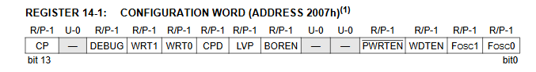

- Los fusibles del PIC 16F877A disponibles son:
    - LP,XT,HS,RC,NOWDT,WDT,PUT,NOPUT,NOBROWNOUT,BROWNOUT,NOLVP,LVP,CPD,NOCPD,WRT_1000,WRT_800,WRT_100,NOWRT,DEBUG,NODEBUG,PROTECT,NOPROTECT
    - Corresponden con algunos de los bits de configuración de Configuration Word

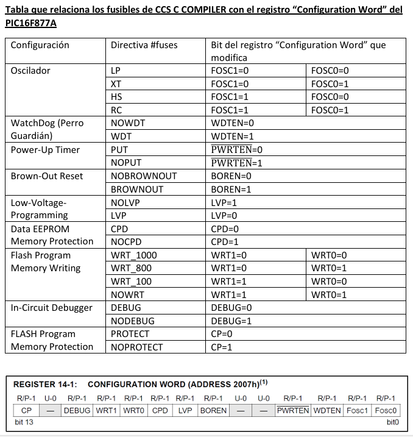

- Con todo en 1 por defecto, activaría el WatchDog y el Brown-Out Reset. Todo lo demás desactivado
- Pero el compilador también tiene una configuración automática
- Con la directiva #fuses (CCS_C_COMPILER) el compilador configura ciertos fusibles en función de nuestro código
    - Por defecto el fusible NOLVP se activa (Desactiva la programación a baja tensión)
    - Por defecto el fusible PUT se activa (activa el Power-Up Timer)
    - Si no hay ninguna función restart_wdt() en el código, se selecciona el fusible NOWDT. Si si hay una función restart_wdt() se selecciona el fusible WDT
    - El oscilador se selecciona en función de la directiva #use delay() elegida
    - Si está habilitado el depurador en el PCE IDE, el fusible DEBUG se activa
- **Nuestra elección:**
    - #fuses XT,NOWDT 
        - Con XT seleccionamos el Reloj standard de hasta 4 MHz, NOWDT selecciona sin perro guardián
        - Activados por defecto Power-Up Timer, Brown-Out Reset
        - Desactivados por defecto Low-Voltage Programming, Data EEPROM Protection, Flash Program Writting Protection, In-Circuit Debugger, Flash Program Protection 
- Entre las directivas #asm y #endasm vamos a poder poner código en lenguaje ensamblador
- En el CSS Compiler, en el icono superior derecho de ? (HELP), en Content, está toda la ayuda con la sintaxis y demás
    - Hay dos bloques importantes
        - Las directivas del pre-procesador. Clicando sobre cualquiera hay una explicación
        - Las built-in functions

## Creación de un programa

- En el CCS C Compiler New/Project Wizard (normal, no el de 24 bits)

- En Devices selecciono la familia y el dispositivo
- Debajo tengo la activación del perro guardián y seleccionar cada cuanto tiempo quiero que actúe

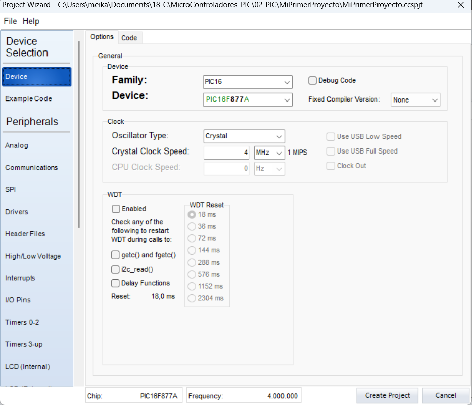

- En Example Code hay ejemplos con leds, LCD, etc

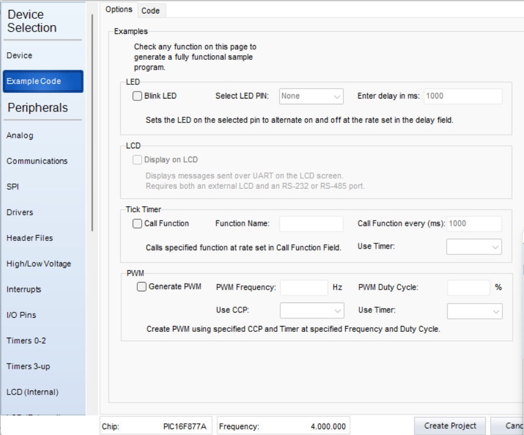

- En Analog puedo configurar los pines analógicos del micro

- En Comunications hay algunos protocolos de comunicaciones, como RS-232 y I2C

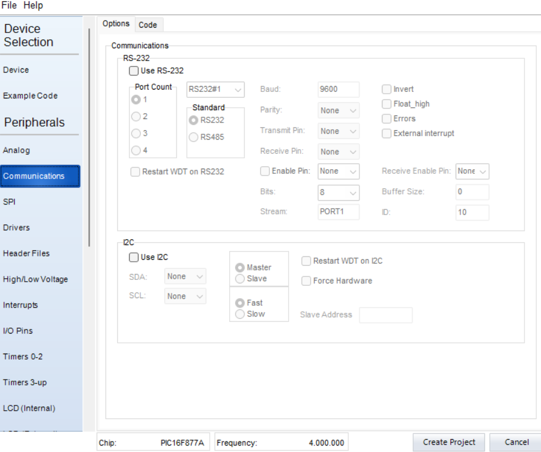

- En SPI podemos configurar la interfaz SPI

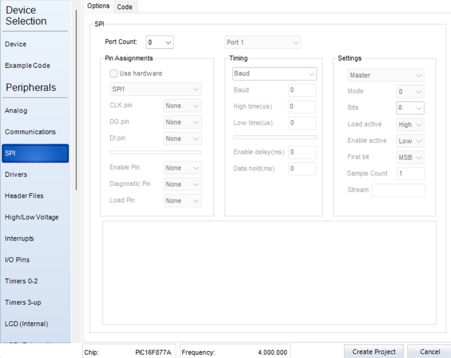

- Drivers CCS ofrece una serie de drivers 

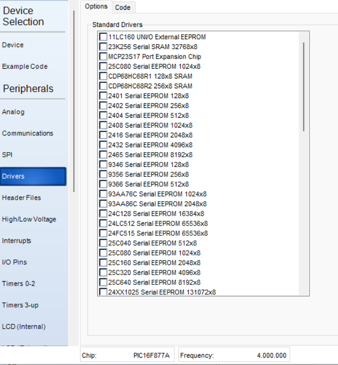

- En Header Files podemos importar librerías

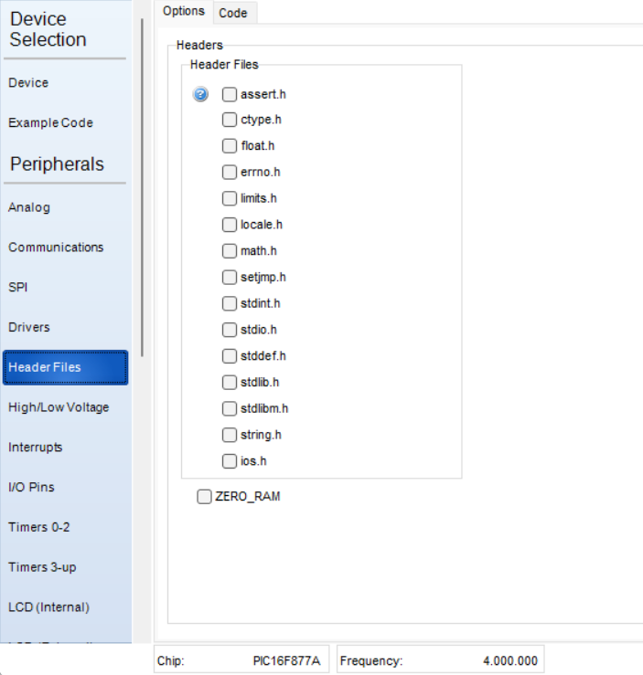

- En HighLowVoltage podemos asignar los valores de nivel alto y nivel bajo digital

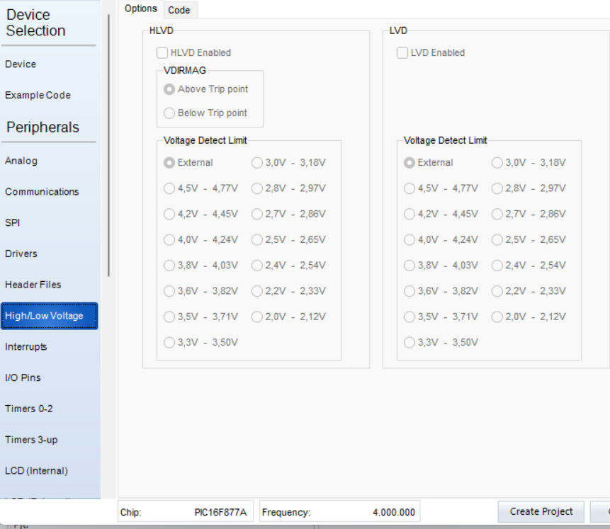

- Seleccionar que interrupciones vamos a utilizar

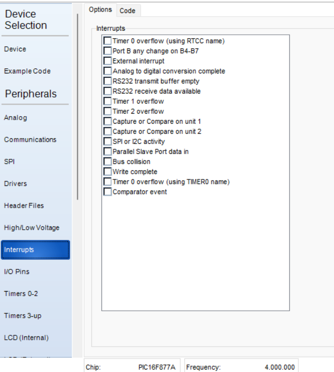

- En I/O Pins podemos configurar tiodos los pines del micro, si son de entrada, salida o las dos

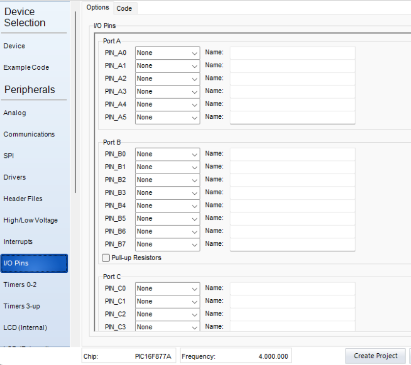

- Tenemos los tres timers que tiene el micro

- LCD interno y externo

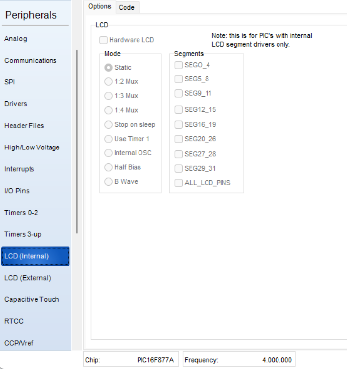
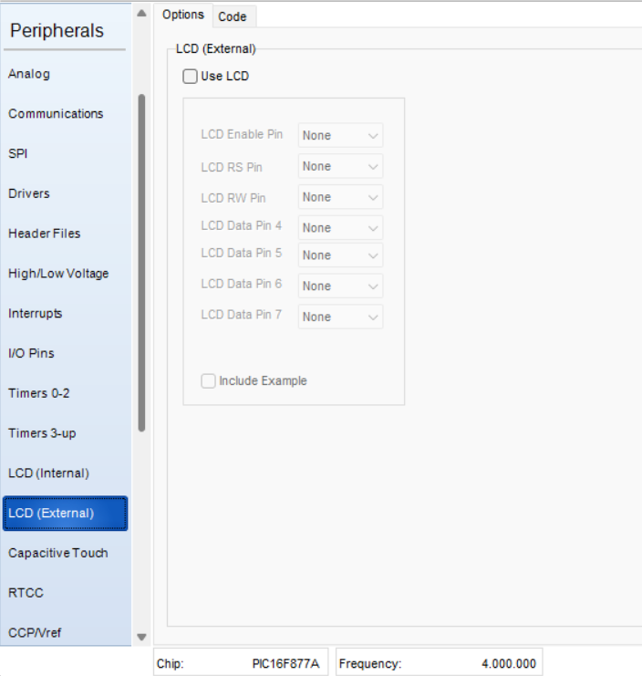

- Y demás configuraciones

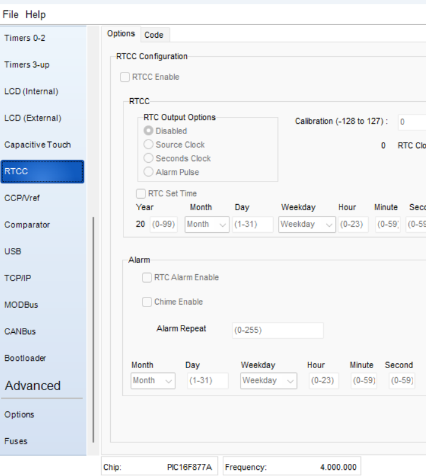

- En este curso no vamos a usar el asistente, lo vamos a programar todo nosotros
- Le doy a crear proyecto
- Esto me crea un archivo .c que llama con #include a un archivo .h que ha creado el asistente que contiene las configuraciones que le hemos pedido
- MiPrimerProyecto.c

~~~c
#include <MiPrimerProyecto.h>

void main()
{

   while(TRUE)
   {

      //TODO: User Code
   }

}
~~~

- Si selecciono con el cursor todo el nombre del archivo .h, clic derecho, open File at cursor
- MiPrimerProyecto.h

~~~h
#include <16F877A.h>
//#device ADC=10 esto no lo sabemos todavía
#use delay(crystal=4MHz)
~~~

- También puedo usar New/SourceFile, crear el directorio y dentro crear el archivo
- Veamos un ejemplo con la plantilla del curso
    - Las directivas de include, fuses y use delay siempre va a ser la misma
        - Va a estar activado el Power-Up Reset y el Brown-Out Reset

~~~c
//Directivas
#include <16F877A.h>
#fuses xt,nowdt //oscilador tipo xt, sin WatchDog
#use delay(crystal=4MHz) //asigna el clock

#byte TRISC=0x87
#byte PORTC=0x07

//Variables globales

//Interrupciones

//Programa principal
void main()
{
   //Configuración de periféricos
   //Configuración de GPIOs
   TRISC=0x00; //Todo el puerto C como salida
   PORTC=0x00; //Todo el puerto C a nivel bajo
   
   //Bucle infinito
   while(1)
   {
      PORTC=0b00000001;//encendemos RB0
      delay_ms(1000); //esperamos 1 segundo
      PORTC=0b00000000; //apagamos RB0
      delay_ms(1000); //esperamos 1 segundo
      
   }

}
~~~

- Para compilar le doy clic a Compile

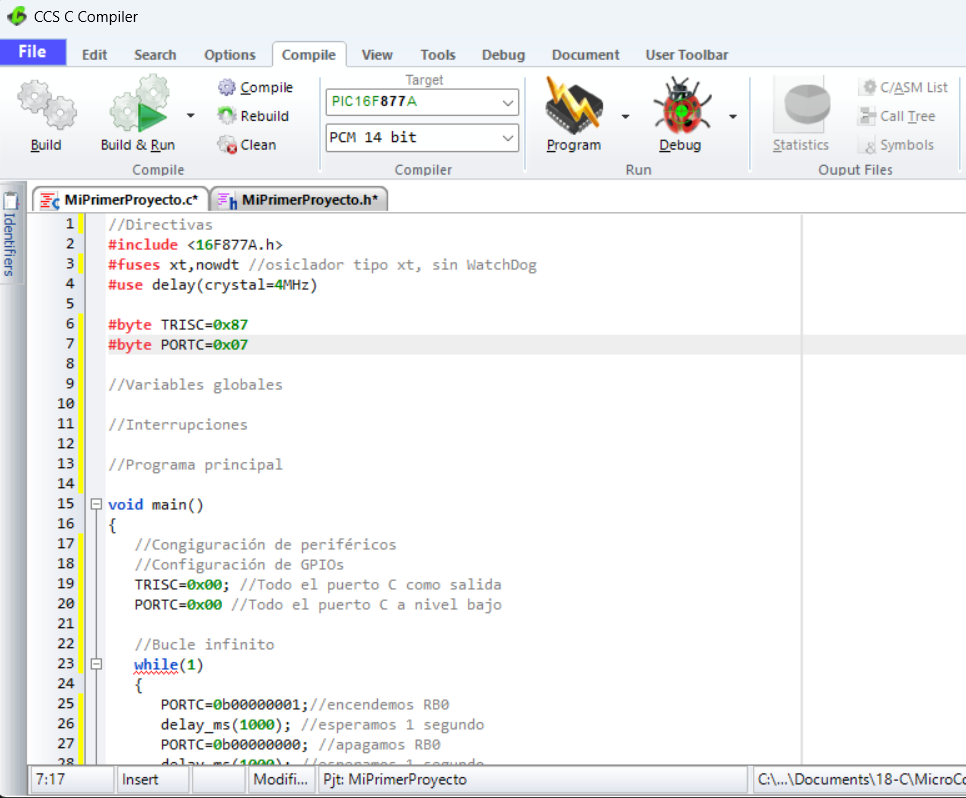

- Si compilo (si no hay ningún error) veré una serie de archivos en el directorio donde he creado el programa

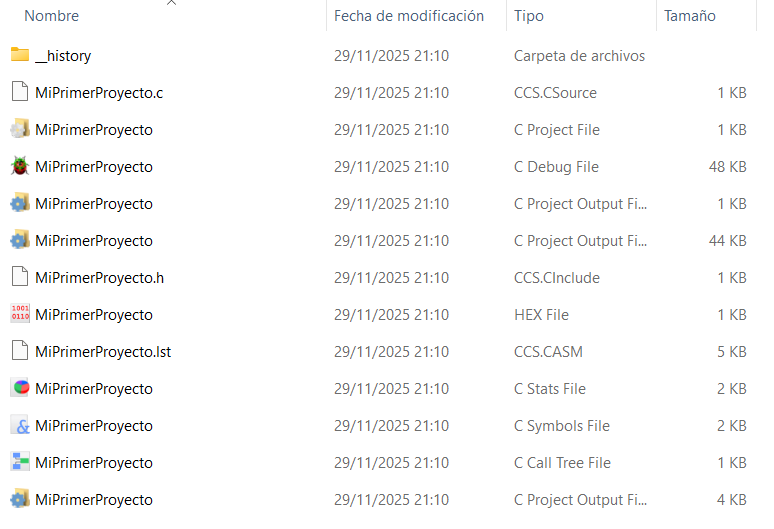

- El primero es .c, es el fichero que contiene el código C
- El siguiente acaba en .pjt, contiene toda la info relacionada con el proyecto
- El siguiente acaba en .cof, muy útil destinado a simulación
- El siguiente .err, contiene los errores que se han podido producir en el proyecto
- El siguiente .esym  contiene info relacionada con los registros y las variables del proyecto
- El siguiente es el fichero más importante, el HEX. Es el que vamos a instalar en el microcontrolador. Contiene el código máquina de nuestro proyecto
- El siguiente .lst contiene el código C y ensamblador del proyecto
- El .sta contiene info estadistica sobre las memorias y la pila
- El .sym contiene información
- El penúltimo, .tre contiene un resumen sobre las funciones que tenemos
- El último, el .xsym contiene info sobre el proyecto
- Veamos algunas opciones del CSS C Compiler
    - Tenemos Search para buscar cualquier palabra que tengamos en el código
    - En Options/IDE podemos modificar el tamaño de las letras, márgenes, colores, etc
    - En la pestaña Compile, en C/ASM List tenemos nuestro código en ensamblador
        - Call_tree nos muestra la info de las funciones (en este caso solo el main)
        - En symbols se nos abre el fichero que contiene registros y variables

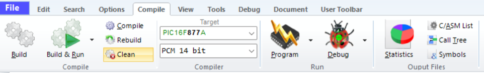 

- En la pestaña View podremos ver todas las interrupciones clicando en interrupts
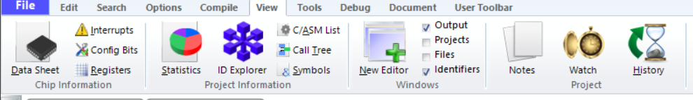

- También podemos ver todos los bits de configuración en Config Bits, están todos los que podemos poner con la directiva #fuses
- En Registers veremos la organización de toda la memoria de nuestro PIC
    - Tenemos su dirección, su nombre de registro de función especial y al grupo al que pertenece
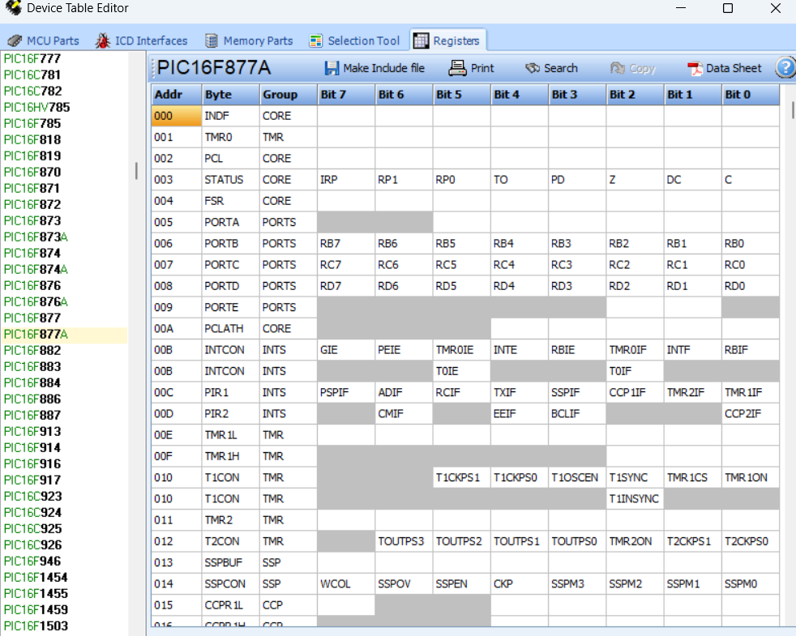

- En MCU tenemos todas las características del micro

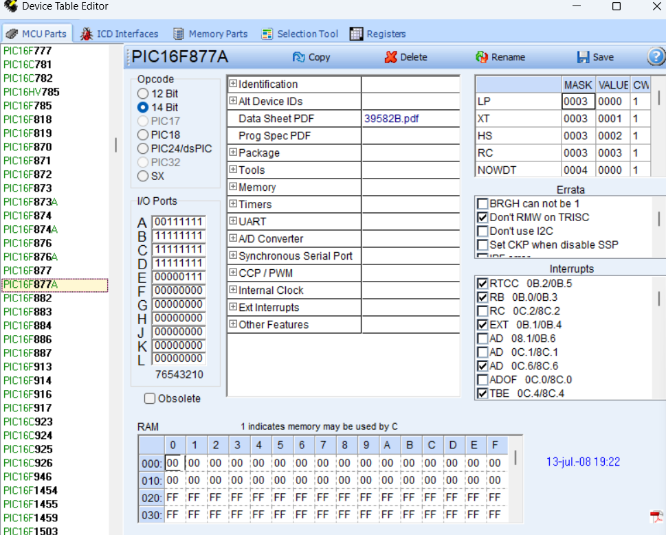

## Simulación y depuración

- Con Proteus podemos simular prácticamente cualquier circuito
- Creo el proyecto con New Project
    - Sin plantilla (DEFAULT)
    - Tampoco creamos la placa de circuito impreso, porque solamente queremos simular en el esquemático
    - Tampoco queremos firmware
- Los componentes están en la parte izquierda
    - En el primer icono debajo de  la flecha

- En la P tengo para elegir los devices

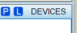

- Si escribo PIC Micro en el buscador, aparecen todos los PIC con los que puedo trabajar

- Elegimos el PIC 16F877A con doble clic se agrega a la lista 
- Escribimos res gen en el buscador
    - Elijo RES DEVICE, (empezando por abajo la 4)
 - Elejimos LED blue
 - Clic en el item listado y clic sobre el tablero para color
- Coloco todos los items
    - Doble clic en la resistencia, la cambio a 330 (ohmnios)
    - Doble clic en el micro, le pongo 4Mhz     

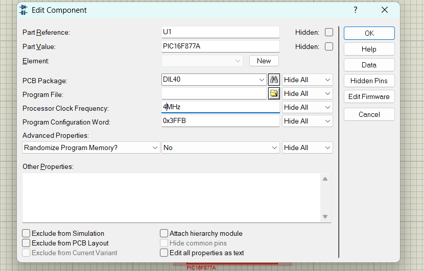

- Debajo podemos cambiar el valor que se carga en los bits de configuración
- Añadimos alimentación y masa (Seleccionando Terminals mode a la izquierda)
    - Hacemos clic en el icono terminals mode

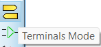

- Con POWER introduciremos alimentación
- Con GROUND masa
- En el programa que hemos hecho, el pin que enciende el LED está en el RC0
- Si pongo el mouse sobre el pin se ilumina para hacer la conexión
    - Lo conectamos a la resistencia
    - La otra patilla del LED la envío a masa
    - Cargo la alimentación en Vpp
    - Clico en el PIC para abrir el menú y en Program File selecciono la ruta del archivo HEX
        - Nos deja cargar el .hex que es el que cargaremos, y el otro es .cof que es para DEPURACIÓN 
- Le damos al PLAY en la parte inferior izquierda de la pantalla
- Veremos que el LED se enciende y se apaga

- Vamos a conectar una serie de LEDS que están conectados al puerto C, para esto nos vale poner todo 1 a PORTC

~~~c
 while(1)
   {
      PORTC=0b11111111;//cambiamos todos a 1
      delay_ms(1000); //esperamos 1 segundo
      PORTC=0b00000000; //apagamos RB0
      delay_ms(1000); //esperamos 1 segundo
      
   }
~~~

- Compilamos
- En el simulador agregamos resistencias y leds a todos los puertos C (están todos en 1)
- Utilizaremos un bus para conectar los LEDS
    - Hacemos clic en el icono de la izquierda que pones BUSES MODE

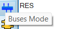

- Pinto el bus clicando en el plano
- Conecto las resistencias a 330 ohmnios
- A las resistencias conecto los LEDS
- Los LEDS se conectan a tierra (para encontrar la tierra en el listado lo pongo en Terminal mode a la izquierda)
- Conecto el BUS a los PINES (de C)
- Para conectar los pines a los LEDS elijo el modo Wire Label Mode

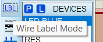

- Clico encima de cada cable que une el BUS con la resistencia y vo colocando LED 1, LED 2, etc
- Debo asociar los pines del micro a las etiquetas que he creado con el mismo nombre de etiqueta para el cable que une el pin y el bus

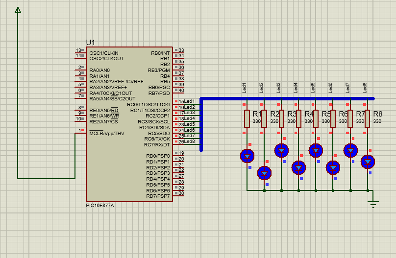

- Hay otro medo que puede considerarse mejor
- Borra etiquetas y bus
- Selecciona en la izquierda Terminals mode
- El DEFAULT lo coloco en cada pin
- Si le doy doble clic le podemos poner una etiqueta
    - Los componentes que tengan la misma etiqueta van a estar conectados
- Hago lo mismo con las resistencias, les coloco el DEFAULT y los nombro igual que las etiquetas de los pines
- Si le doy al play funciona, y queda mucho más limpio

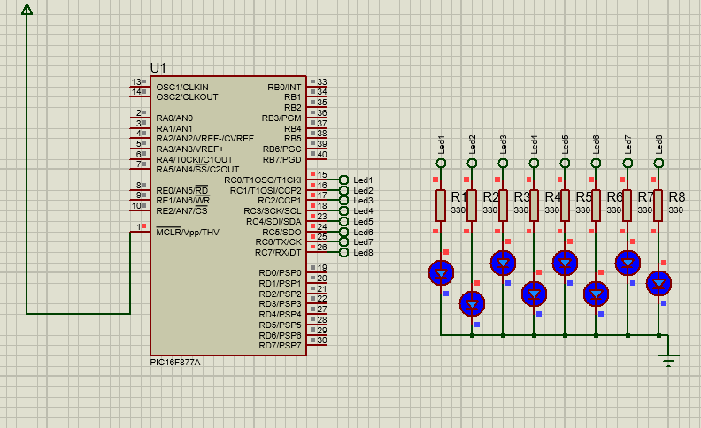

- Ahora coloco el archivo de DEPURACIÓN haciendo doble clic en el controlador/Program FIle, el .cof
- Nos va a valer para ejecutar paso a paso el código
- No le damos a play, sino en la barra de las herramientas (en el top), Debug/Start VSM Debugging
- Se nos abre el fichero fuente y una ventana con las variables para comprobar los registros
- Podemos ver más opciones en Debug/ Watch Windows
    - Puede ser por nombre o por dirección de memoria que tiene
    - Por memoria podemos introducir memoria de datos, memoria EEPROM, memoria de programa o memoria interna
    - También podemos elegir el formato, binario, hexadecimal, octal, entero

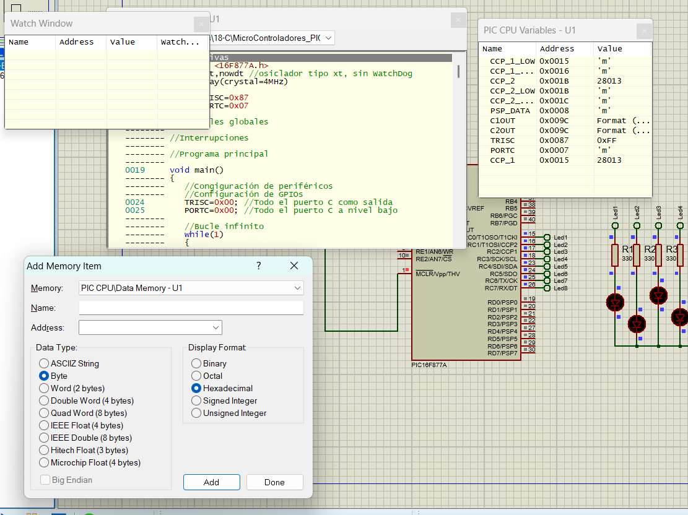

- En Debug/PIC CPU (abajo de todo) tenemos todas las visualizaciones posibles (del código, las memorias, etc)

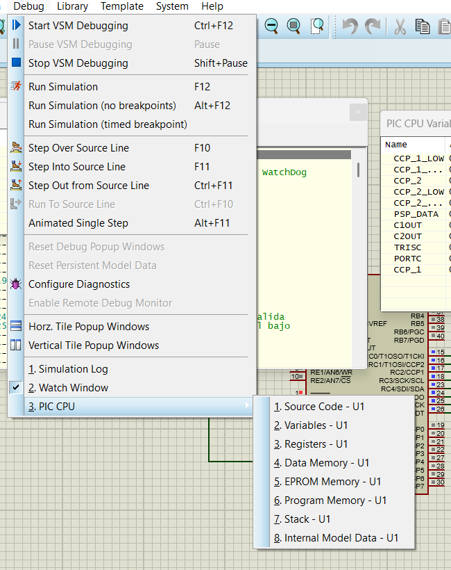

- Para dar un paso F10, F11 para retroceder

## Creación y Depuración con MPLAB

- File/New Project
- En Samples podemos seleccionar plantillas para el proyecto
- No seleccionaremos ninguna, seleccionamos **microchip embedeed y stand alone project**
- Seleccionamos la familia: gama media 8 bits
- Seleccionamos PIC 16F877A
- Nos pregunta si vamos a usar algún programa, vamos a elegir el **simulador**
- Seleccionamos el compilador de CCS
- Nombramos el proyecto

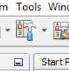

- Donde pone Source Files vamos a introducir el archivo .c
    - Clic derecho, new/C main File
- Pego el programa anterior en el archivo
- Para compilar le doy al icono y selecciono Build Main Project
- Si voy al directorio donde he guardado el proyecto veremos los diferentes archivos que se generan

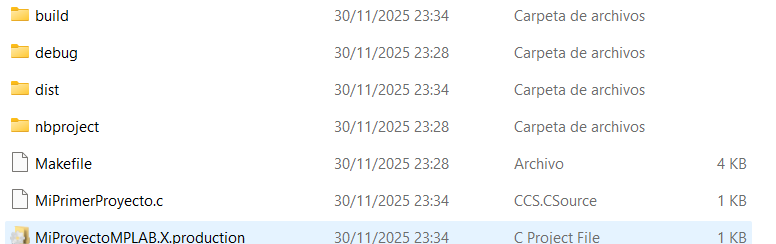

- En build/default/production/ encontramos los ficheros que ya hemos visto anteriormente
- En dist/default/production encontraremos los dos ficheros que contienen el código (.cof y .hex)
- **Para depurar** vamos a la pestaña del IDE de MPLAB Debug, y le damos a Debug Main Project
- Aparecen nuevos iconos en la barra de herramientas superior típicos de la depuración
- Abajo aparecen pestañas importantes
    - breakpoints nos indica que puntos de parada tenemos en el código
        - Para colocar uno simplemente hacemos doble clic en la linea del programa dónde lo queremos
    - variables: vemos el valor de los registros
        - Para borrarlas todas, botón derecho/Delete all
        - Podemos arrastrar la pestaña a la parte izquierda para tenerla más a mano
        - Para controlar una variable es tán fácil como escribir su nombre
        - Puedo abrir los registros para ver cada uno de sus bits

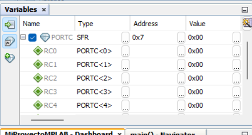

- Para crear un estímulo a una entrada (llevarle un valor que necesite) Window/Simulator/Stimulus
    - En PIN selecciono el pin del micro dónde quiero generar el estímulo

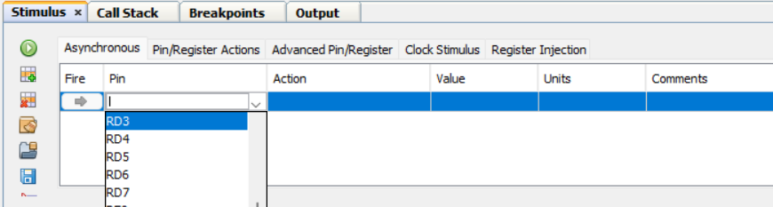

- En Action elijo lo que le pasa: poner a 1, a 0, conmutar, crear un pulso alto/bajo o establecer un voltaje determinado
- En Units podemos introducir cuanto tiempo va a durar, si va a ser en ciclos o en tiempo real
    - Cuando estemos depurando y hagamos clic en la flecha donde dice Fire enviaremos el pulso
- Para dar un paso le damos Step Into, en la barra de herramientas superior

## Volcado de código

- Para volcar ekl código necesitamos el PICk it 3 (hardware)
- Necesitaremos también el MPLABX IDE/MPLABX IPE
- Veamos como se conectan

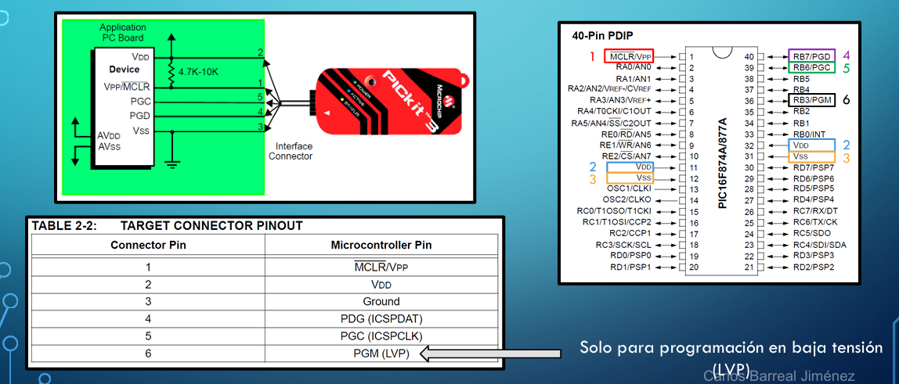

- Usaremos los 5 pins (el 6 es solo para programación en baja tensión , LVP)
- Se recomienda colocar una resistencia entre el PIN de alimentación VDD y el PIN de RESET MCLR
    - Una resistencia entre 4.7K a 10K
- En la placa adquirida lo pone muy fácil

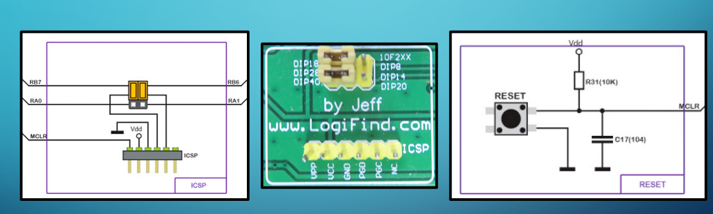

- Está preparado para conectar directamente el Pick it 3
- El primer PIN (de la izquierda) se conecta a MCLR
- El segundo y el tercero  a alimentación y masa
- El cuarto y el quinto el de datos y el del clock
    - En el PIC16F877A hay que conectar el PIN PGD a RB7 y el PIN PGC a RB6
- En el módulo del RESET ya existe una resistencia de PULL UP de MCLR a Vdd
- Usamos los cables de conexión, conecto del tirón los 5 cables que corresponden empezando por la izquierda
- Lo conectamos al Pick it 3, respetando el orden
    - La pestañita blanca nos indica que es el PIN 1
- Una vez hecho esto abrimos el MPLABX IDE con el proyecto que queramos cargar
- Vamos a la barra de herramientas donde pone default y hacemos clic en customize...

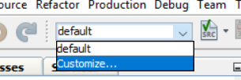

- En connected Hardware Tool seleccionamos el Pick it 3 (que debe estar enchufado por USB)

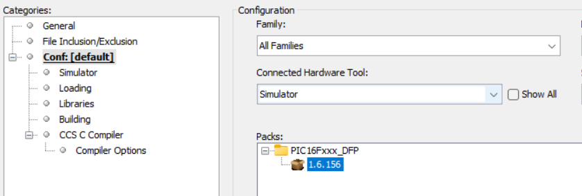

- Si aplicamos los cambios, en la parte izquierda de la ventana podremos acceder a su configuración
- Si seleccion Power en la parte superior, vamos a tener dos posibilidades para alimentar el circuito
    - Una es usando el Pick it 3
    - No necesitamos activar esta opción ya que la placa ya tiene su alimentación
- Tenemos el Pick it 3 conectado a los Pines, y el Pick it 3 y la placa conecatdas al PC para alimentarse
- En el IDE le damos al icono que dice Make and Programm Device (el primero de la foto empezando por la izquierda)

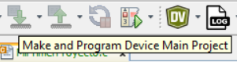

- Saldrá una pantalla diciendo que hemos seleccionado un dispositivo de 5 voltios
    - Como el micro funciona a 3.3 voltios, nos dice de corregirlo
    - Como el Pick it 3 funciona con 5 voltios, aceptamos
- Para que el LED se encienda debo pasar un cable del PIN del microcontrolador seleccionado a uno de los LEDS del módulo de la placa
- Se puede entrar en modo depuración en tiempo real desde los iconos del IDE
- También leer la memoria de programa
- Este proceso se puede hacer con MPLABX IPE
    - Seleccionamos la familia del micro
    - Seleccionamos el micro PIC16F877A
    - Seleccionamos la herramienta de volcado (el Pick it 3)
- En Settings/Advance Mode
    - El password es "microchip"
    - En power es donde tendríamos que activar la casilla para alimentar el micro con el Pick it 3, pero ya hemos dicho que no necesitamos esta opción
- En la pestaña Operate comunicamos el Pick it con el micro clicando en Connect
    - También sale la ventana de si el valor de voltaje del micro es el correcto
- Una vez acabado el volcado se ha activado la zona de programación
    - En la zona File es donde tenemos que cargar nuestro código (buscamos el archivo)
    - Le damos a Program para hacer el volcado

    