# 03 Microcontroladores PIC - GPIOs

## GPIOs

- General Pourpouse Input Output
- Hace referencia a la cantidad de pines integrados en el micro que podemos configurar como entradas y salidas
- Estos pines se dividen en grupos llamados puertos
- El PIC16F877A tiene 5 puertos de hasta 8 pines
- A(6), B(8), C(8), D(8), E(3)

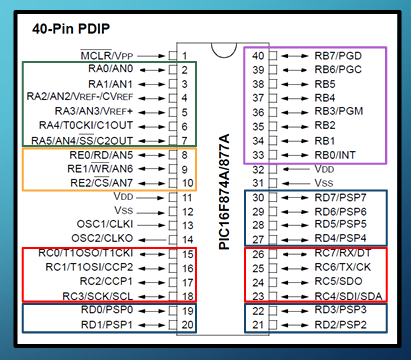

- La flecha bidireccional significa de entrada y salida
- Tenemos dos registros por puerto
    - En el registro TRISx(n) Se usa 0 para outuput 1 para input
        - TRIS_letra_del_puerto(n)
    - PORTx: PORT_letra_del_puerto
        - Es por donde viajarán los datos
- **Estructura general de un GPIO**

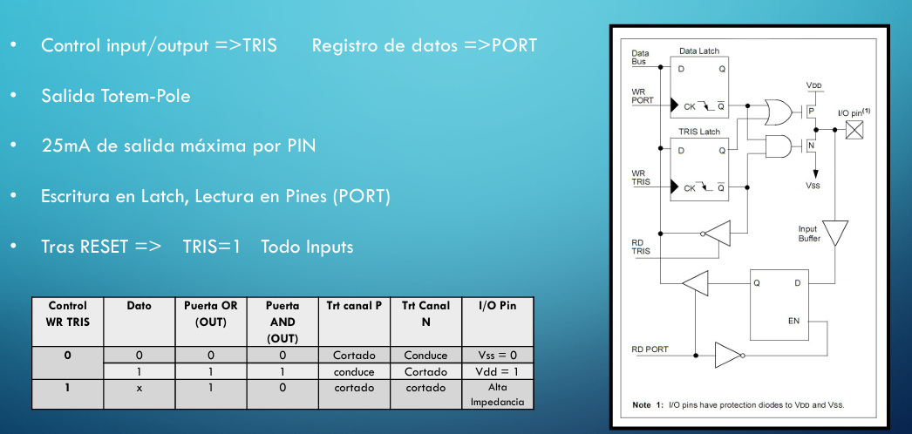

- Fijémonos en la parte superior
- Tenemos el biestable PORT y el biestable TRIS
    - Si colocamos un 0 en el biestable del registro TRIS (en la bolita al lado de la D) en la Q (patilla de la puerta OR) saldrá un 0 y en la Q' (patilla de la puerta AND) saldrá un 1
    - Si colocamos un 0 en el biestable del registro PORT, tendremos un 1 en Q' (la patilla de la puerta AND) tendremos un 1 tanto en la otra patilla de la puerta OR como en la otra patilla de la puerta AND
    - Esto hace que tengamos un 1 en la salida de la puerta OR y un 1 en la salida de la puerta AND

- Los siguientes transistores que nos encontramos están en una configuración TOTEM POLE
    - Esto significa que si colocamos un 1 en la puerta del transistor de arriba, este se corta
    - Si colocamos un 1 en el de abajo, este conduce
    - Funcionarán al revés si tienen 0 en la puerta (el transistor de arriba conducirá, y el de abajo estará cortado)
- Como en el ejemplo tenemos dos 1 en las dos puertas, el único transistor que conduce es el de canal N
    - Por lo tanto la salida del PIN va a Vss (que es masa), o sea que sacamos un 0 a la salida cuando introducimos un 0 en el BUS de DATOS
- Si colocamos un 0 en TRIS y un 1 en PORT, esto va a hacer que tengamos dos 0 a la salida de las puertas
    - Cuando tenemos dos 0 el único transistor que conduce es el de canal P, que va a Vdd (o sea, un 1 digital)

- Si colocamos un 1 en TRIS, hará que en una de las patillas de la puerta OR tengamos un 1
    - Esto hace que la salida de esta puerta se un 1 si o si, por lo tanto el transistor de canal P entra en corte

- Poniendo un 1 en el biestable, colocará un 0 en la puerta AND, lo que dará salida 0 de la puerta AND, lo que hará que el transistor de canal N también se corte
- Así tendremos la entrada de nuestro PIN con los dos transistores cortados, osea en un estado de ALTA IMPEDANCIA

- Para leer se usa el biestable que hay abajo a la derecha en el diagrama (que pone EN)
    - Sale directamente del PIN
- Tras un RESET o al iniciar el micro, los registros TRIS (o sea, los registros de control) van a estar a 1 hasta que los modifiquemos. Es decir, todos los pines están configurados como entradas
- **El puerto A**
    - Tiene un total de 6 bits bidireccionales
    - Además de poderse configurar como I/O digitales, sus pines también pueden configurarse para trabajar con el módulo analógico-digital, con el módulo SPI, o con el Timer 0, o el comparador

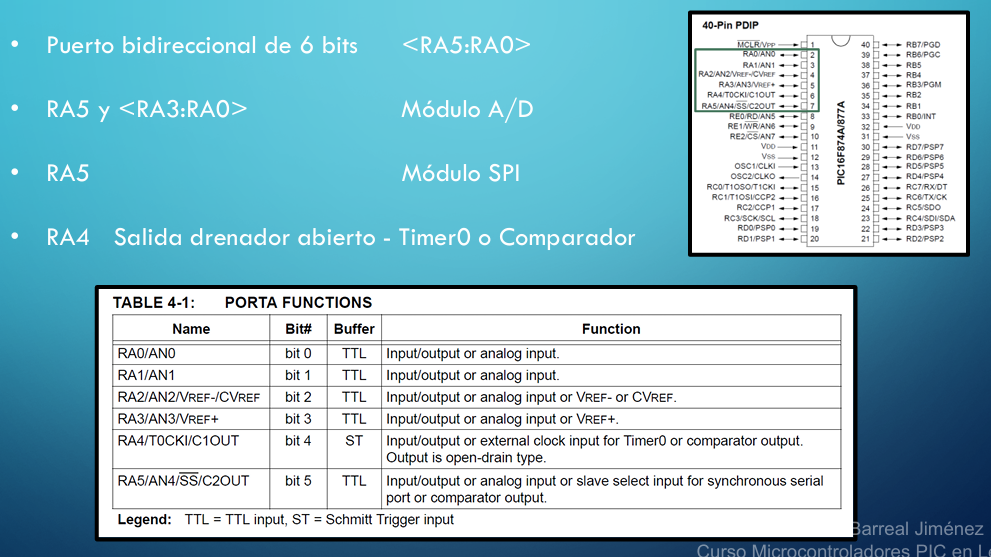

- Aquí están los registros asociados al PUERTO A
- Los más importantes ahora (como en el resto de puertos) van a ser PORTA (datos) y TRISA (control)
- También mencionar el registro ADCON1 que sirve para las entradas analógicas
    - Después de un reset o iniciar el micro, este registro estará a 0
    - Esto va a hacer que las entradas del PUERTO A esten iniciadas siempre como ENTRADAS ANALÓGICAS
    - Si las quisieramos digitales, tendriamos que definir el registro ADCON1 como sale en la foto (0bxx011x)

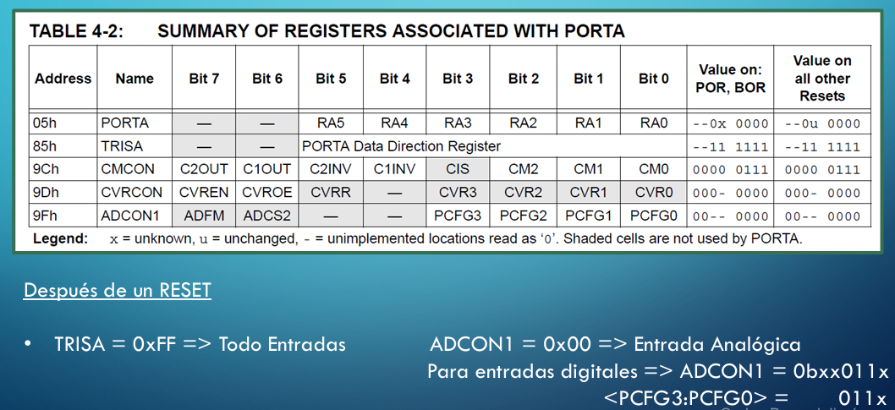

- **El puerto B**
    - Es un puerto bidireccional de 8 bits
    - RB0 se utiliza para una interrupción externa por flanco
    - Los PINES de RB7 a RB4 se pueden configurar también para trabajar con una interrupción por cambio de nivel

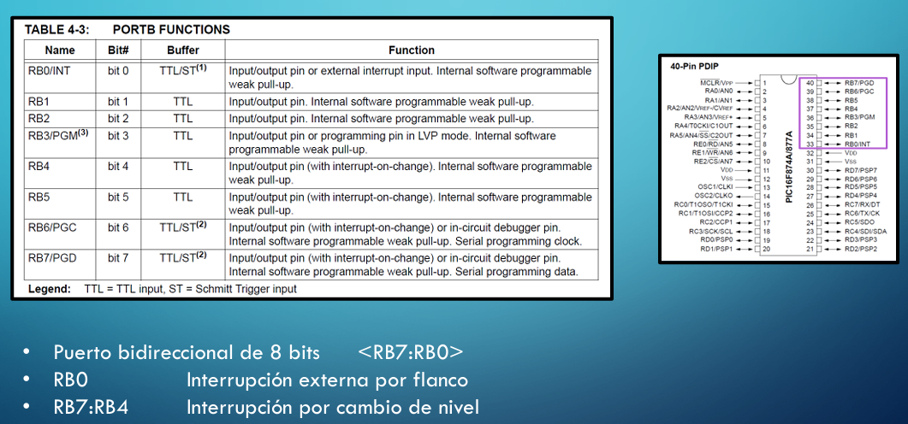

- Es importante saber de este puerto que cuando los PINES de este puerto trabajan como entradas pueden tener una resistencia de PULL UP asociada
    - Esto se hace tocando el bit RBPU (bit 7) del registro OPTION_REG
    - Si RBPU está a 0 las resistencias pull up están activadas
    - Si está a 1 las resistencias pull up están desactivadas (por defecto o tras un reset)

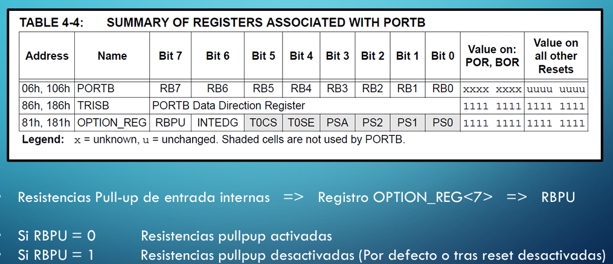

- **El puerto C**
    - Tiene un total de 8 PINES bidireccionales
    - Los primeros 3 bits pueden configurarse para trabajar con el Timer 1 o los módulos CCP
    - El resto para tipos de comunicación, SPI, I2C, SSP o USART

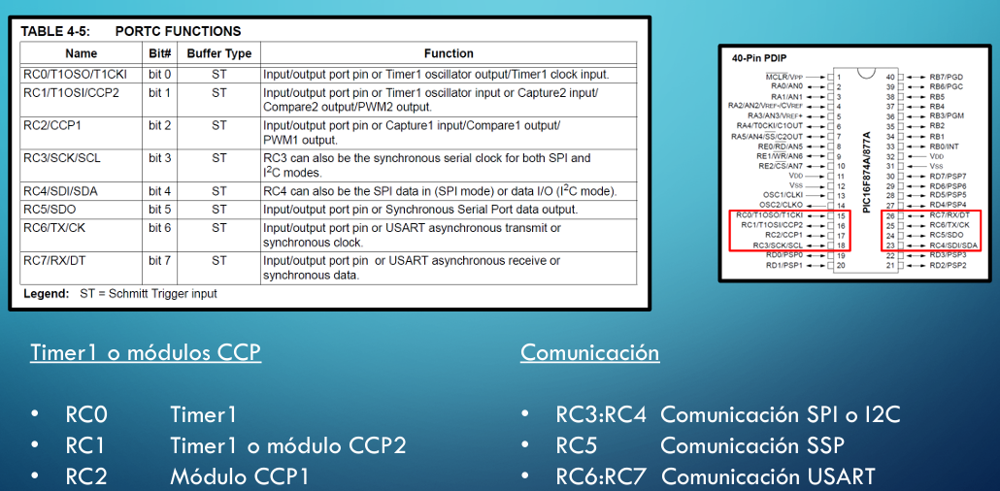

- **El puerto D**
    - Es el último de los puertos que también tiene 8 bits bidireccionales
    - Se puede configurar para que trabaje como puerto paralelo esclavo de 8 bits de un microprocesador
    
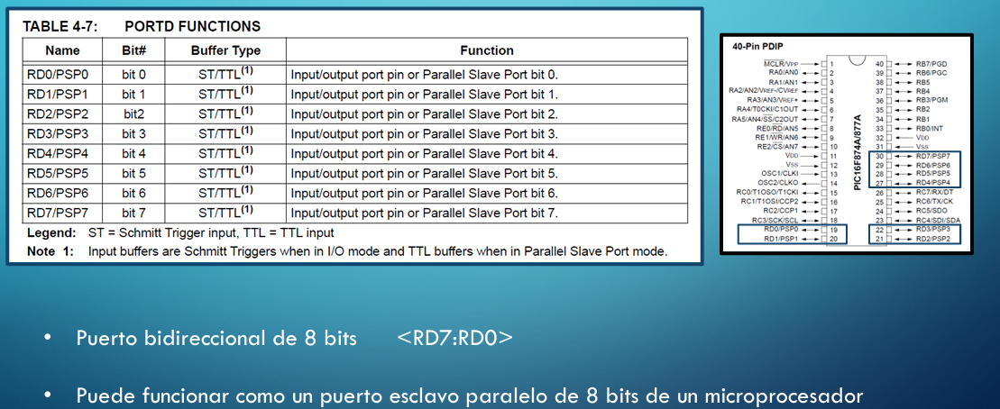

- Para activar este modo tendremos que tocar el bit PSPMODE (bit 4) del registro TRISE
    - Si ponemos este bit a 1 activaremos el puerto paralelo esclavo
    - En 0 (por defecto) podremos usar este puerto para I/O digitales

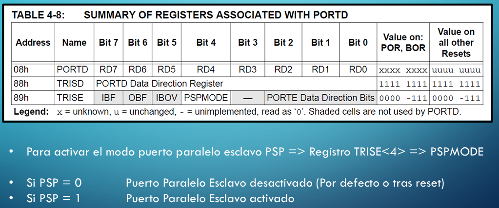

- **El puerto E**
    - Solo tiene 3 bits bidireccionales 
    - Se pueden configurar para trabajar con el módulo analógico-digital o como entradas de control del puerto paralelo esclavo

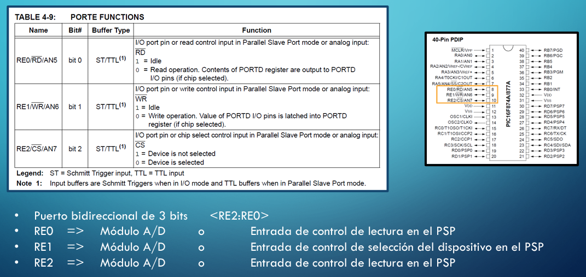

- Con este puerto tenemos que tener en cuenta dos cosas
    - Como utiliza el módulo analógico-digital, vigilar ADCON1 como en el puerto A 
    - Si se trabaja con el puerto paralelo esclavo, vigilar con PSPMODE como en el puerto D

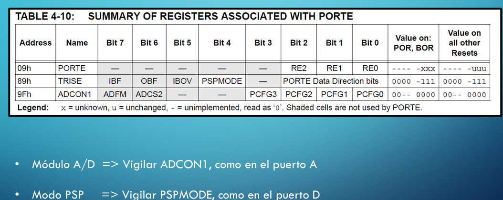

- **Resumen de puertos**
    - Si queremos configurar como entrada/salida un puerto tenemos que configurar dos bits
        - TRISx (control)
        - PORTx (datos)
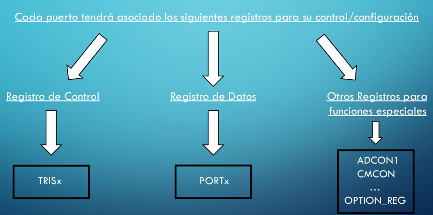

## GPIOs en C - #byte y #bit

- Cómo configurar la GPIOs en C
- Hay dos maneras posibles
    - Utilizando las directivas de control de memoria
        - #byte
        - #bit
    - Utilizando directivas que asocian a ciertas librerías y funciones predefinidas
        - #USE FAST_IO
        - #USE STANDARD_IO
        - #USE FIXED_IO
- Existe una función para activar las resistencias pull-up del puerto B, independiente de las directivas a usar

> port_b_pullups(valor) //valor true o false

- **#byte** sirve para asociar cierta zona de memroia RAM a una variable

> #byte variable = dirección

- En hexadecimal sería

> #byte TRISC = 0x87

- En binario sería

> #byte PORTC= 0b00000111 (8 bits después de la letra)

- Para escribir en el puerto

> TRISC = 0x00; //Todo el puerto C se configura como salidas
> PORTC = 0x0F; //coloca ceros en los 4 bits más significativos del registro PORTC y cuatro 1 en los menos significativos

- Es decir, 0b00001111
- Para leer del puerto

> valor = TRISC;
> valor2 = PORTC;

- Esto se puede hacer también con cualquier registro de función especial
- Una vez introducida la dirección de memoria RAM en la variable, podemos escribir o leer en el puerto
- Con **#bit** podemos definir bits especificos de la RAM en una variable

> #bit variable = dirección.bit

- Donde .bit es el bit específico que queremos seleccionar

> #bit RC0= 0x07.0 //en hexadecimal
> #bit RC5= 0b00000111.5 //binario
> #bit RBPU = 0x81.7
- Ahora para escribir en el bit

> RC0=0; //Se coloca un cero en el bit RC= con dirección 0x07.0
> RBPU = 1; //Se coloca un uno en 0x81.7, equivale a desactivar las resistencias de Pull-up del puerto B

- Para leer del bit, lo mismo

> valor_del_bit= RC0;

- **Hay varias funciones interesantes para trabajar con bits**
- Para poner a 0

> bit_clear(var,bit) //Ejemplo: bit_clear(PORTB,5) pone a 0 el bit 5 del puerto B 

- Para poner a 1

> bit_set(var,bit)

- Leer bit

> bit_test(var,bit)

- Intercambiar nibbles

> swap(var) //Intercambia los 4 bits de menos peso de la variable, PORTC por ejemplo, por los 4 bits de mayor peso

- **Resumen**
    - Definimos los puertos que vamos a usar en la zona de directivas con #byte 
        - #byte TRISB=0x86
            - Esto indica en binario que el registro es 100000110
                - Bit 7 (más significativo): 1 → Pin RB7 como entrada.
                - Bit 6: 0 → Pin RB6 como salida.
                - Bit 5: 0 → Pin RB5 como salida.
                - Bit 4: 0 → Pin RB4 como salida.
                - Bit 3: 0 → Pin RB3 como salida.
                - Bit 2: 1 → Pin RB2 como entrada.
                - Bit 1: 1 → Pin RB1 como entrada.
-               - Bit 0 (menos significativo): 0 → Pin RB0 como salida.
                - **TRIS configura los pines como entradas o salidas**
        - #byte PORTB=0x06
            - 0x06 es la dirección de registro de datos del PUERTO B de los PIC 16, que interactúa con los pines del puerto B
            - Si el PIN está configurado como salida (su TRISB en 0) el valor de PORTB puede escribirse en ese PIN
            - Si está como configurado como entrada (TRISB = 1) entonces PORTB leerá el valor de ese PIN

    - Inicialización de puertos (en la función main)
        - TRISB=0x00 //PUERTO B configurado como salidas
        - PORTB=0x00 //sacamos todo ceros por el puerto B de Inicio
    - Programación de puertos
        - En la función main, dentro del bucle infinito while
~~~c
while(true){
    PORTB=0b00001111;
    delay_ms(1000);
    PORTB=0b11110000; //podría hacerse con swap(PORTB)
    delay_ms(1000);
}
~~~

- Siempre que el PIN esté configurado como SALIDA podré escribir un valor en él
- **NOTA: PARA LEER RÁPIDO UN HEXADECIMAL en BINARIO**
- Pasar un número hexadecimal a binario de manera rápida es bastante sencillo si sabes cómo funciona la conversión. Cada dígito hexadecimal se puede convertir directamente en un bloque de **4 bits** binarios. Esto se debe a que un número hexadecimal tiene base 16, y 16 en base 10 es igual a ( 2^4 ), lo que significa que cada dígito hexadecimal se representa con 4 bits binarios.

### Pasos para convertir un hexadecimal a binario:

1. **Escribe el número hexadecimal.**
2. **Convierte cada dígito hexadecimal a su equivalente binario.**
3. **Agrégales ceros a la izquierda (si es necesario) para que cada dígito hexadecimal se represente con exactamente 4 bits.**

### **Tabla de equivalencias hexadecimal a binario:**

| Hexadecimal | Binario |
| ----------- | ------- |
| 0           | 0000    |
| 1           | 0001    |
| 2           | 0010    |
| 3           | 0011    |
| 4           | 0100    |
| 5           | 0101    |
| 6           | 0110    |
| 7           | 0111    |
| 8           | 1000    |
| 9           | 1001    |
| A           | 1010    |
| B           | 1011    |
| C           | 1100    |
| D           | 1101    |
| E           | 1110    |
| F           | 1111    |

### **Ejemplo 1:**

Vamos a convertir el número hexadecimal **`0xA3`** a binario.

* **`A`** en hexadecimal es **`1010`** en binario.
* **`3`** en hexadecimal es **`0011`** en binario.

Por lo tanto, **`0xA3`** en binario es **`10100011`**.

### **Ejemplo 2:**

Vamos a convertir **`0x7F`** a binario.

* **`7`** en hexadecimal es **`0111`** en binario.
* **`F`** en hexadecimal es **`1111`** en binario.

Por lo tanto, **`0x7F`** en binario es **`01111111`**.

### **Convertir rápidamente usando un ejemplo más grande:**

Digamos que quieres convertir **`0x3E9`** a binario.

* **`3`** en hexadecimal es **`0011`** en binario.
* **`E`** en hexadecimal es **`1110`** en binario.
* **`9`** en hexadecimal es **`1001`** en binario.

Por lo tanto, **`0x3E9`** en binario es **`001111101001`**.

- Para convertir de binario a hexadecimal dividir el número binario en grupos de 4 empezando por la dereca
- Si la última agrupación no son 4 digitos añadir 0 a la izquierda
- Teniendo los grupos de 4 puedes ir codificando a hezadecimal sin problema

## EJERCICIO

- Crearemos un código que defina, inicialice y configure el puerto B y el C para su correcto funcionamiento. Esta definición deberá de ser utilizando la directiva #byte y #bit. En el PIN RC5 se colocará una resistencia Pull-UP con un botón, si se pulsa un botón entrará a 0, si no, un 1. Con la directiva #bit, controlar el PIN RC5, y si se pulsa el botón, encender todos los LEDS que hay conectados en el PUERTO B

### Gestión de puertos

~~~c
//Directivas
#include <16F877A.h>
#fuses xt,nowdt //osiclador tipo xt, sin WatchDog
#use delay(crystal=4M)

#byte TRISB=0x86 //puerto B completo pasándole su dirección (mirar en el datasheet)
#byte PORTB=0x06 //registro PORT con su dirección
#bit TRISC_RC5=0x87.5 //El TRISC tiene la dirección 0x087, el el bit 5 del registro
#bit PORTC_RC5=0x07.5 //El PORTC tiene la dirección 0x07, elijo el bit 5

//Variables globales

//Interrupciones

//Programa principal

void main()
{
   //Congiguración de periféricos
   //Configuración de GPIOs
   TRISB=0x00; //todos los pines del puerto B como salidas
   PORTB=0x00; //hacemos que esas salidas de inicio estén a 0
   
   TRISC_RC5=1; //RC5 configurado como entrada
   
   //Bucle infinito
   while(1)
   {
      //si se pulsa el botón activamos todas las salidas del puerto B
      //para que se enciendan los leds
      if(PORTC_RC5==0){ //lo comparamos a 0 porque es una resitencia pull up
         PORTB=0xFF; //todos los pines a 1
      }
      else{
      PORTB=0x00; //apagamos todos los pines
      }    
   }
}
~~~

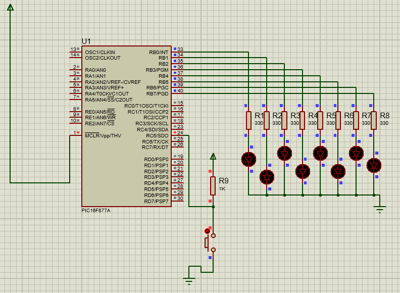

- Si pulso el botón enciendo todos los leds

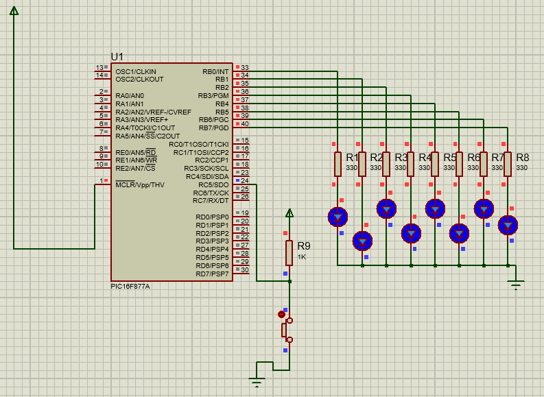

- Para usarlo en la placa, colocamos un cable del RC5 al módulo de botones
- Colocándolo en la primera posición, será el primer botón empezando por abajo

- Luego conectamos los puertos B al módulo de los LEDS

- Hay que cargar con el PIck it 3 el programa en el controlador
- Solo tengo que conectar el USB a la placa y darle al switch del ON
- Si pulso el botón se encienden todos los LEDS

## GPIOs en C - #USE

- Otra forma que tenemos en C para configurar las GPIOs
- Consiste en usar ciertas directivas del CCS C Compiler
    - #USE FAST_IO
    - #USE STANDARD_IO
    - #USE FIXED_IO
- Recordar que el PUERTO B tiene unas resistencias de Pull-Up internas

> port_b_pullups(valor) //true (se activan) o false para desactivar las resistencias

- **Funciones para trabajar con los puertos**

- Para escribir en un puerto

> OUTPUT_x(valor); // Ej: OUTPUT_B(0xFF); Pone el puerto B todo a 1

- Para leer de un puerto

> INPUT_x(); // Ej: valor=INPUT_C(); Lee el puerto C y lo mete en el valor

- Configurar puerto como entrada o salida

> SET_TRIS_x(valor); // Ej: SET_TRIS_D(0b00001111); de RD3:RD0 == entradas (1), de RD7:RD4 son salidas (0)

- Para leer la configuración de los puertos

> GET_TRIS_x(); // Ej: valor=GET_TRIS_D();  Lee el registro TRISD y lo mete en valor

- **Para trabajar solo con los pines en vez de los puertos completos** tenemos funciones
- Habrá que introducir el PIN que queremos modificar, que vienen incluidos en el fichero PIC16F877A.h que incorporamos con la directiva #include
- Se usa PIN_nombre_del_pin

> #define PIN_A0 40

- Estoy guardando 40 en PIN_A0
- Estas constantes están en el archivo PIC16F877A.h

~~~h
// Constants used to identify pins in the above are:

#define PIN_A0  40
#define PIN_A1  41
#define PIN_A2  42
#define PIN_A3  43
#define PIN_A4  44
#define PIN_A5  45

#define PIN_B0  48
#define PIN_B1  49
#define PIN_B2  50
#define PIN_B3  51
#define PIN_B4  52
#define PIN_B5  53
#define PIN_B6  54
#define PIN_B7  55

#define PIN_C0  56
#define PIN_C1  57
#define PIN_C2  58
#define PIN_C3  59
#define PIN_C4  60
#define PIN_C5  61
#define PIN_C6  62
#define PIN_C7  63

#define PIN_D0  64
#define PIN_D1  65
#define PIN_D2  66
#define PIN_D3  67
#define PIN_D4  68
#define PIN_D5  69
#define PIN_D6  70
#define PIN_D7  71

#define PIN_E0  72
#define PIN_E1  73
#define PIN_E2  74

//////////////////////
~~~

- Los registros están puestos uno después de otro en memoria
- Cada uno de ellos tiene una capacidad de 8 bits
- El Byte 0 va del 0:7 
- El Byte 1 va del 8:15 (dónde el bit 0 es 8 y el bit 7 es 15)
- El Byte 2 va del 16:23
- El Byte 3 va del 24:31
- El Byte 4 va del 32:39
- El Byte 5 va del 40++:47
- El Byte 6 va del 48:55
- El Byte 7 va del 56:63
- Entonces el **40** sería el bit 0 del sexto registro (Byte 5, empiezo a contar desde 0)
    - Cálculo rápido: cada registro tiene 8 bits, y 5 Bytes que tiene antes, 8*5 = 40
- Si busco en el datasheet el registro 6 (sería el 05h, empiezo a contar desde el 0) veo que tengo **PORTA**

- El siguiente que sería 48, tengo PORTB (06h), es el primer bit (bit 0) del séptimo registro (Byte 6)
- Esta definición únicamente esta hecha para los PINES de los PUERTOS

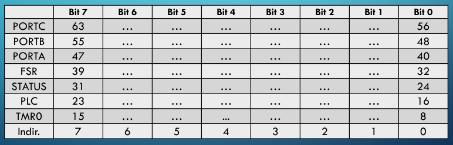

- Veamos las funciones

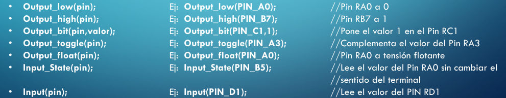

- OUTPUT_TOGGLE que va a complementar el valor del PIN y lo que hace realmente es pasar al PIN al estado invertido, si estaba en 1 pasa a 0 y si estaba a 0 pasa a 1
- OUTPUT_FLOAT(pin) pone el pin a tensión flotante, lo que significa simular una salida en drenador abierto
    - Estas haciendo que l PIN quede en alta impedancia, flotante, como drenador abierto cuando está apagado
    - Estado flotante significa que el PIN no está conectado ni a 5v ni a tierra. 
        - Es como desconectar el PIN del circuito
- **Vamos con las directivas**
- Dependiendo de las directivas #use xxxx_io usemos (fast_io, standard_io o fixed_io) las funciones afectarán de una manera u otra a los registros asociados a los puertos
- **#USE FAST_IO(PUERTO)**
    - El compilador no genera código que modifique los registros TRIS al escribir o leer de un PUERTO
    - Hay que asegurarse de que cuando escribamos en el PUERTO esté configurado como SALIDA y que cuando leemos esté configurado como entrada, habiendo configurado el registro TRIS con anterioridad
    - Función **SET_TRIS_X(valor)** OBLIGATORIA PARA DEFINIR EL PUERTO
    Ej: #USE FAST_IO(B) //Le decimos al compilador que no queremos que nos genere código que modifique el registro TRIS cuando escribamos o leamos en los pines del PUERTO B
- **#USE STANDARD_IO(PUERTO)**, es la directiva por defecto
    - El compilador genera código que modifica los registros TRIS al escribir o leer de un puerto
    - Para escribir en un puerto o pin tiene que estar configurado como salida. Esta directiva crea un código que modifica la zona de registro TRIS correspondiente con ceros, para asegurarse de que el PUERTO está configurado como salida
    - Para leer de un puerto o pin tiene que estar configurado como entrada. Por tanto, esta directiva crea un código que modifica la zona de registro TRIS correspondiente con unos, para asegurarse de que el PUERTO está configurado como entrada
    - No es necesaria la función SET_TRIS_x(valor)
    - Ej: #USE STANDARD_IO(B) // Se generará el código cuando se utilice el puerto B para leer o escribir
    - Que generará código se refiere a que el compilador insertará automáticamente instrucciones máquina (o sea, código ensamblador) para configurar el TRIS cada vez que tu programa use ese puerto.
    - Esto significa que si escribo o leo un pin o registro, se generará código automáticamente para que justo antes de realizar la acción se configure el pin como entrada o salida según convenga
- **#USE FIXED_IO(PUERTO_OUTPUTS=PIN_XX...,PIN_YY)**
    - El compilador genera código para definir los puertos de acuerdo a la información que introducimos en la directiva. Solamente hace falta indicar cuales van a ser los puertos o pines de salida
    - PIN_XX son las definiciones de los pines que se encuentran en el fichero #include 16F877A.h
    - Ej: #USE FIXED_IO(a_outputs=PIN_A2, PIN_A3) // Los pines RA2 y RA3 se configuran como salidas
- Haremos el mismo ejercicio del tema anterior con las tres directivas xxx_io en vez de #byte
    - Los LEDS irán al PUERTO C y el botón al PIN 3 del PUERTO B
    - Activar las resistencias internas de PUll-Up del PUERTO B
        - El botón lo pondremos en el PIN 3 del PUERTO B, así no necesitaremos la resitencia de Pull-Up externa
    - Comparar con las diferentes directivas que ocurre con el registro TRISB debbuggeando en MPLAB X IDE cuando se usa una directiva standard o una fast
 
~~~c
//Directivas
#include <16F877A.h>
#fuses xt,nowdt //osiclador tipo xt, sin WatchDog
#use delay(crystal=4M)

//#USE FAST_IO(PUERTO)
#USE FAST_IO(B)
#USE FAST_IO(C)

//#USE STANDARD_IO(PUERTO)
/*
#USE STANDARD_IO(B)
#USE STANDARD_IO(C)

//#USE FIXED_IO(PUERTO_OUTPUT=PIN_A0,..., PIN_A4)
#USE FIXED_IO(B_OUTPUTS=) //de B solo necesitamos un pin de entrada, aquí solo se declaran las salidas
#USE FIXED_IO(C_OUTPUTS=PIN_C0,PIN_C1,PIN_C2,PIN_C3,PIN_C4,PIN_C5,PIN_C6,PIN_C7)
*/
//Programa principal

void main()
{
  //EL PUERTO B lo declaranmos como todo entradas (a 1)
  SET_TRIS_B(0xFF);     //SOLO PARA FAST_IO
  //C como todo salidas
  SET_TRIS_C(0x00);     //SOLO PARA FAST_IO
  
  //para activar las resistencias de pull-up (poner a 0 el bit 7 de OPTION_REG)
  //podemos usar la función port_b_pullups
  port_b_pullups(true);
  
  
   //Bucle infinito
   while(1)
   {
   if(INPUT(PIN_B3)==0){ //usamos INPUT para leer si se ha pulsado el botón
                    //el pin B3 a 0 porque es resistencia PULL UP
   OUTPUT_C(0xFF); //PINES A 1 para encender los leds
   }
   else{
      OUTPUT_C(0x00);
   }

   }
}
~~~

- Vemos la simulación como se encienden los LEDS

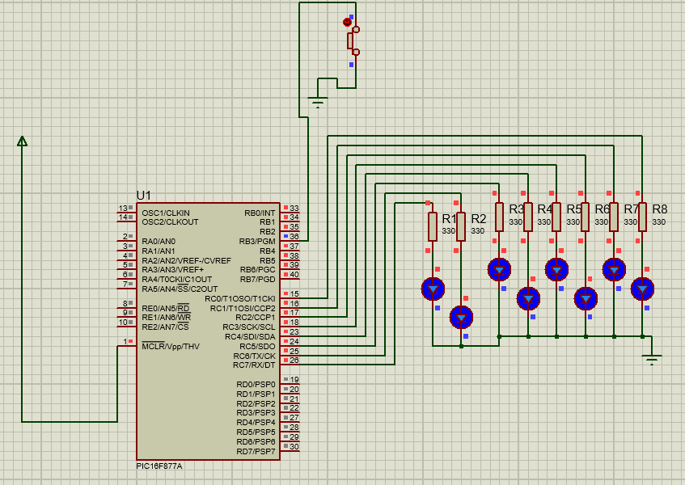

- En lugar de poner una resistencia en cada LED se puede usar un integrado RX8 y conectar cada led en una de las patillas y en las patillas del otro lado cablear a los pines del microcontrolador
- Si usamos #USE STANDARD_IO no necesitamos usar SET_TRIS
- Con comentar la función SET_TRIS es suficiente
- Para #USE FIXED_IO solo necesito comentar el STANDARD_IO y SET_TRIS y compilar
- **NOTA**: Está hecho así con fines didácticos, en la vida real solo usaríamos una de estas directivas
- Puedo pasar el código a MLAB para debuguear
- El botón es de la barra de herramientas superior, Debug Main Project
- Añado las variables TRISC, TRISB, PORTC, PORTB y OPTION_REG que es donde está el registro para las resistencias Pull-Up

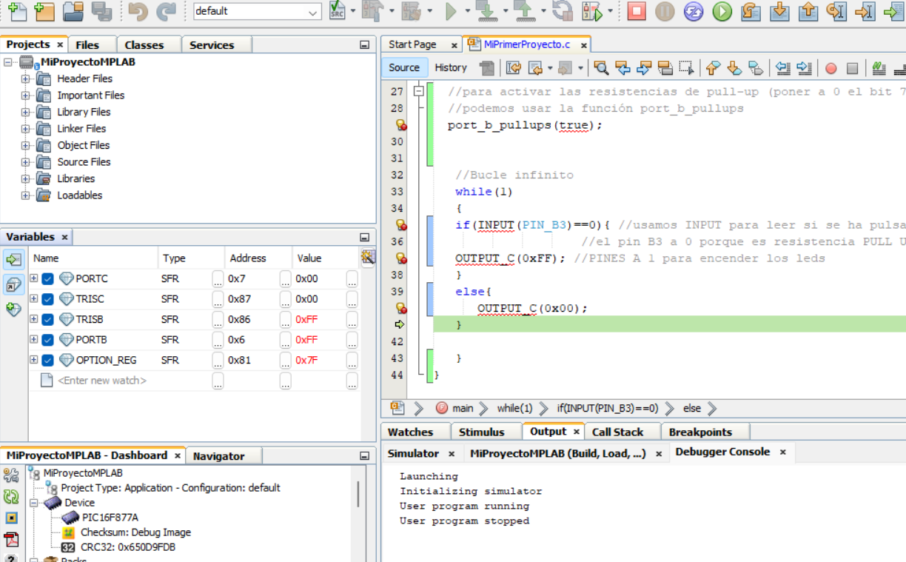

- Puedo ver como todas las salidas del PUERTO C están a 0

- Le aplico el estímulo a B3 

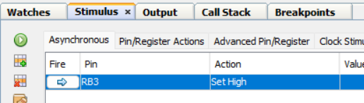

- Ahora todos los pines del PUERTO C están a 1

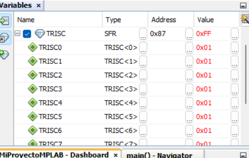

- Después ejecutamos la función port_b_pullups que tiene que ponernos a 0 el bit que se llama RBPU
- Vemos como está a 1

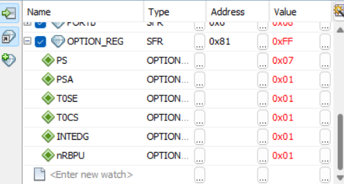

- Le doy a step into en la barra de herramientas para avanzar en el código hasta la función port_b_pullups

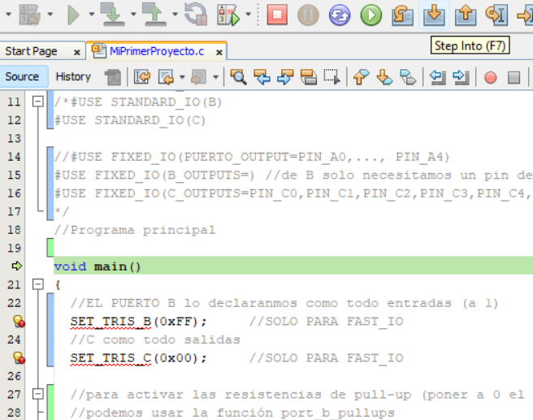

- Una vez paso la función veo que el registro se ha quedado a 0

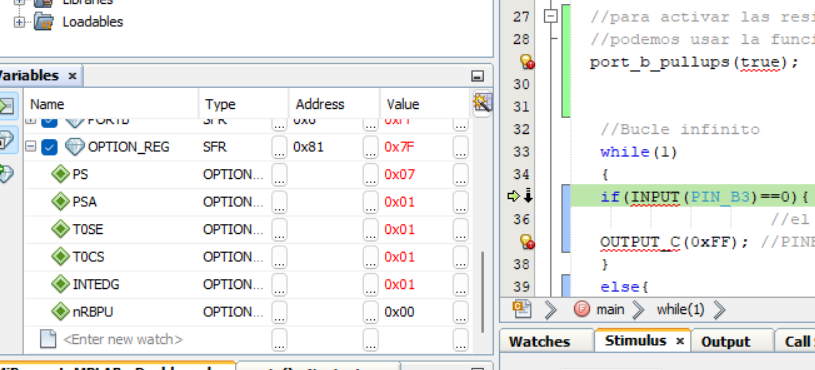

- Gracias a esto he podido conectar el botón Pull-Up sin resistencia externa
- Podemos poner a 0 el PIN RB3 (LOW) y enviar el estímulo
- Podemos probar con las otras directivas
- Con la StANDARD veremos como siempre que escribamos o leamos de un PUERTO se va a crear un código que nos asegure que el puerto está habilitado para lectura o escritura automáticamente y sin usar SET_TRIS

## Rotación LEDS

- En el caso de rotar a la izquierda un bit en una palabra de 8 bits
    - Para que solo haya un bit encendido y rotarlo multiplicaremos o dividiremos por 2 según vayamos a izquierda o derecha
    - 1 = 01, 2 = 10, 4= 100, 8 = 1000
- Usaremos un long para la rotación, **int16**, porque necesitamos llegar hasta 256 y si fuera int llegaría solo a 255
- Es importante inicializarla en 1
- Para rotar a la izquierda, lo primero es inicializar el puerto B desde su bit menos significativo que es el 1, así que guardamos rotación en PORTB
- A continuación multiplicamos rotación x 2
- En la rotación a la derecha ponemos de limite 0, porque cuando Rotacion llegue a 1 y se divida entre 2 dará 0
    - Esto es porque lo hemos declarado como un entero y no un float
- Ponemos Rotacion a 128 porque es el último valor activo

~~~c
//Directivas
#include <16F877A.h>
#fuses xt,nowdt //osiclador tipo xt, sin WatchDog
#use delay(crystal=4M)

#byte TRISB=0x86
#byte PORTB=0x06
#byte TRISC=0x87
#byte PORTC=0x07

void main()
{
   //configuración de GPIOs
   TRISB=0x00; //Puerto B como salida
   bit_set(TRISC,4);//RC4 configurado como entrada
   
  int16 Rotacion=1;
  
   //Bucle infinito
   while(1)
   {
      //Si RC4 es 1 no lo he pulsado, rotaremos a la izquierda 
      //Si RC4 es 0 es que lo he pulsado y lo rotaremos a la derecha 
      
      if(bit_test(PORTC,4)==1){ //Si RC4 está en 1
         //Rotar izquierda
         PORTB=Rotacion;
         Rotacion=Rotacion*2;
         if(Rotacion==256){
            Rotacion=1;
         }
      }
      else{
         //Rotar a derecha
         PORTB=Rotacion;
         Rotacion=Rotacion/2;
         if(Rotacion==0)Rotacion=128;
      }
      delay_ms(200);
   }
}
~~~

- Compilamos y ejecutamos en PRoteus
- Si clicamos con clic derecho encima de bit_test y seleccionamos Help se nos abre una ventana
    - Si vamos a la sección Built-in Functions (funciones prediseñadas por el compilador)
    - En la sección de Byte Manipulation, vemos que hay las funciones rotate_left() y rotate_right()

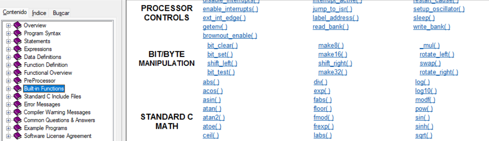

- Podemos usarlas para rotar los bits. Para usarla vamos a tener que darle un puntero con la dirección indicada

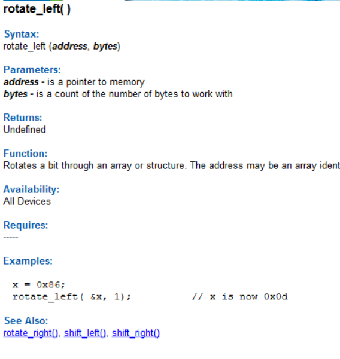

> rotate_left(&PORTB, 1); //colocamos un 1, la cantidad de bits que queremos rotar
- Inicializamos PORTB con un LED, con PORTB=0x01

## Segmentos (Display de 7 segmentos)

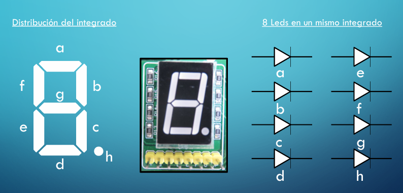

- Consta de 8 leds
- Cada uno de los leds tiene una patilla de control para activarse o desactivarse
- El primero es arriba a, y se va girando en el sentido de las agujas del reloj
- Tiene también un punto (h)
- Existen 2 tipos de 7 segmentos, los de ánodo común y los de cátodo común
- Los de ánodo común están todos conectados a un ánodo común
    - Solo tendremos que poner un 0 en el cátodo para encender cada uno de los leds
    - Hay que colocar la correspondiente resistencia para no quemar el led
    - Si quiero colocar un 7 tengo que colocar un 0 en las patillas a,b y c

- La tabla completa es esta

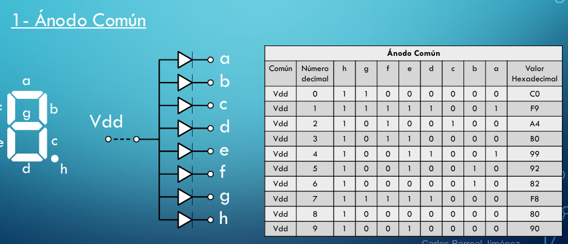

- Los de cátodo común es la tabla invertida, tienen todos un cátodo común conectado que deriva a masa
- Pondremos un 1 en el caso del led que queramos activar

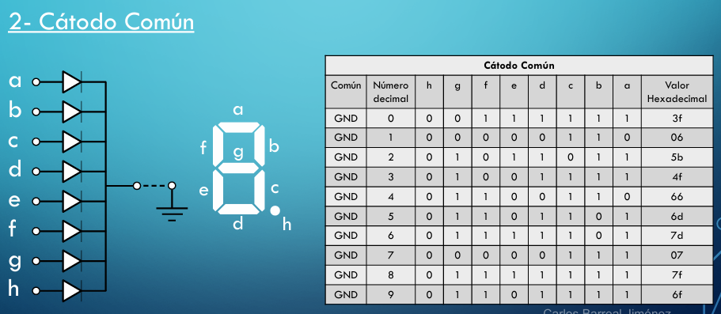

- En el caso de nuestro display, es de cátodo común como se ve en el dibujo, pues se conectan a masa

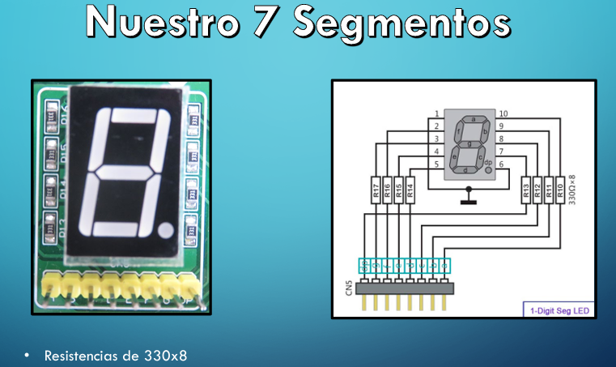

- En el caso de los 7 segmentos x 4 (display de 4 dígitos) significaria 32 pines del microcontrolador solo para el display
- Esto se soluciona con una señal de control para activar un display, luego el otro, para compartir las señales de los segmentos
- Si se hace suficientemente rápido engañará al ojo humano creyendo que están todos encendidos
- Esto ya está inventado, y es el 74HC138

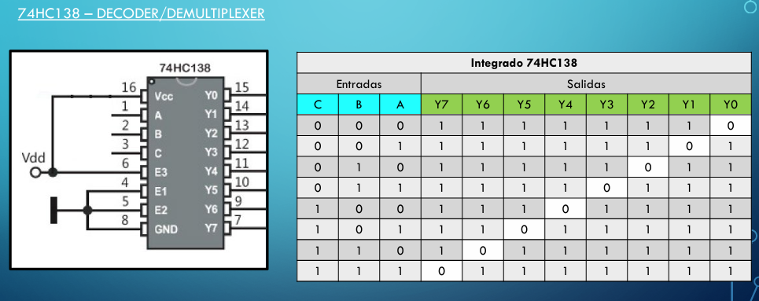

- Podemos configurar las entradas ABC para que en las salidas tengamos unicamente una patilla a nivel bajo que es lo que necesitamos para activar cada uno de los displays, ya que trabajamos con cátodo común
- A la izquierda están las señales de control individual de cada uno de los segmentos (CN6), y a la derecha el control de cada uno de estos (CN3)
- Al tener solo 4 displays, solo necesitamos 4 salidas (Y0, Y1, Y2, Y3)

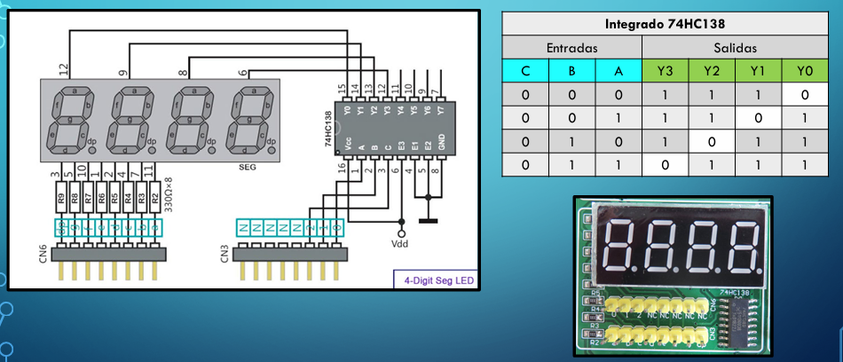

- **Ejercicios**
    - 1: Que al apretar un botón, un display de 7 segmentos de cátodo común aumente su cuenta cada 200 ms
        - Si lo mantenemos pulsado irá incrementándose cada 200ms
        - Si lo pulsamos rápidamente se incrementará solo una vez
    - 2: Hacer una cuenta contínua de 0 a 9999 y que luego vuelva a empezar
        - El delay entre incrementos debe ser solo de 1ms
        - Si se pulsa un botón, se parará el número que tenga el display en ese momento

## Primer ejercicio segmentos

- Incrementar display de cátodo común en función de si se ha pulsado o no un botón
    - Si el botón está pulsado dejaremos que el display se incremente cada 200ms
    - Si no el número se quedará fijo
- Acordarse siempre de estas directivas

~~~c
#include <16F877A.h>
#fuses xt,nowdt //tipo de fusible, sin perro guardian
#use delay(crystal=4MHz)
~~~

- Declaro una matriz con los valores del display de tipo byte

~~~c
#include <16F877A.h>
#fuses xt,nowdt
#use delay(crystal=4MHz)

//para el botón vamos a usar el puerto A
//les asignamos su dirección según el datasheet
#byte TRISA=0x85
#byte PORTA=0x05

//para el display
#byte TRISB=0x86
#byte PORTB=0x06

void main()
{
   //declaro la matriz tipo byte con los valores en hexadecimal parta el display
   byte CONST DISPLAY[10]={0x3f,0x06,0x5b,0x4f,0x66,0x6d,0x7d,0x07,0x7f,0x6f};
   
   
   while(TRUE)
   {

      //TODO: User Code
   }

}
~~~

- Pero ¿qué es esto de tipo byte?
- Si vamos al fichero de 16F877A vemos que BYTE está definido como un entero de 8, y arriba, el entero de 8 está definido como una variable char
- Es como si nuestra matriz la estuvieramos definiendo como una variable char 
- 16F877A.h

~~~c
{...}
#define int8 char
{...}
#define BYTE int8
~~~

- Los valores que hay en la matriz son los que vimos en la tabla como equivalentes hexadecimales a 0,1,2,3,4...en la tabla de segmentos
- Vamos con la configuración de los perifericos
- Usaremos el botón 4 del puerto A. Este pin, cuando funciona como entrada, su buffer es TRIGGER_SMITH
- Usamos bit_set para escribir un 1
- El puerto B lo configuramos todo como salida

~~~c
void main()
{
   //declaro la matriz con los valores en hexadecimal parta el display
   byte CONST DISPLAY[10]={0x3f,0x06,0x5b,0x4f,0x66,0x6d,0x7d,0x07,0x7f,0x6f};
   int seleccion=0; //nos ayudará a seleccionar de la matriz
   //Configuración de los periféricos (GPIOs)
   //El botón, pin 4 del puertoA como entrada
   bit_set(TRISA,4);
   
   //puertoB como salida
   TRISB=0x00;
   
   
   while(TRUE)
   {

      //TODO: User Code
   }

}
~~~

- Vamos con el programa

~~~c
while(TRUE)
   {
      //para cambiar el número según se aprieta el botón
      //si es = a 0 porque vamos a poner una resistencia de Pull-Up
      if(bit_test(PORTA,4)==0){
         seleccion++;
         delay_ms(300);
      }
      
      if(seleccion==10) seleccion=0;
      
      //introducimos el valor a cargar en el display
      PORTB=DISPLAY[seleccion]; //por defecto 0

   }
~~~

- En Proteus funciona!

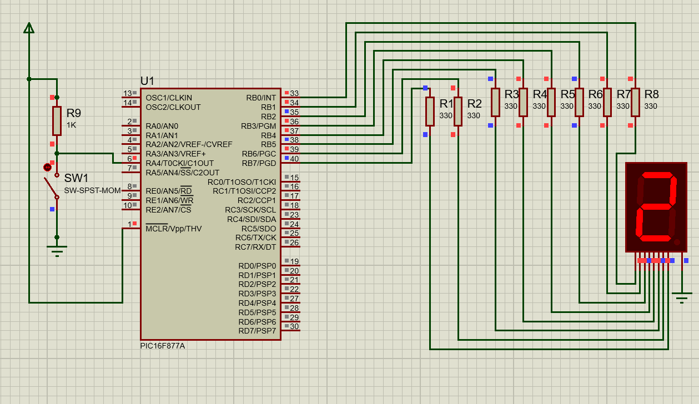

## Segmentos x 4

- Nos toca hacer una cuenta de 0 a 9999 en 4 displays de 7 segmentos
- Los incrementos serán de 1 ms
- Crearemos un botón que hará que el display se pare con el número que tenga en ese momento
- Hay que declararle al compilador que la función existe
- La variable de control C (en nuestro caso RC2) siempre está a 0
- Para ello uso bit_clear(PORTC,2), etc
- Para crear el botón de pausa vamos a usar un FLAG llamado salir, una variable local inicializada a 1

~~~c
#include <16F877A.h>
#fuses xt,nowdt
#use delay(crystal=4MHz)

//El puerto para el botón
#byte TRISA=0x85 
#byte PORTA=0x05

//para el display
#byte TRISB=0x86
#byte PORTB=0x06

//puerto C para gobernar que display está activado
#byte TRISC=0x87
#byte PORTC=0x07

byte CONST DISPLAY[10]={0x3f,0x06,0x5b,0x4f,0x66,0x6d,0x7d,0x07,0x7f,0x6f};
   int seleccion=0; //nos ayudará a seleccionar de la matriz

//hay que decirle al compilador que existe esta función  
void mostrar_numero_display(int unidades, int decenas, int centenas, int millares);
   
void main()
{
   //Configuración de GPIOs
   
   //para el pin de entrada del botón
   bit_set(TRISA,4); //RA4 como entrada, que tiene un buffer trigger smith
   TRISB=0x00; //Puerto B como salida
   //RC0,RC1,RC2 como salidas
   TRISC=0b11111000;//3 pines como salida, los bits menos significativos
   //4 variables (unidades,decenas,centenas...)
   int unidades=0, decenas=0, centenas=0, millares=0;
   int salir=1;
   
   while(TRUE)
   {
     for(millares=0; millares<10;millares++){
      for(centenas=0; centenas<10;centenas++){
         for(decenas=0; decenas<10;decenas++){
            for(unidades=0; unidades<10;unidades++){
               //para el botón
               if(bit_test(PORTA,4)==0){
               delay_ms(50); //metemos un delay para evitar los rebotes del botón
               salir=0;
               }
               while(salir==0){
               if(bit_test(PORTA,4)==1){
                  delay_ms(50);
                  salir=1;
               }
               mostrar_numero_display(unidades,decenas,centenas,millares);
               }
               //mostrar los numeros correctamente
               mostrar_numero_display(unidades,decenas,centenas,millares);            
            }
          }
        }
     }
      millares=0;
      centenas=0;
      decenas=0;
      unidades=0;
   }

}

void mostrar_numero_display(int unidades, int decenas, int centenas, int millares){
   //control de los 7 segmentos de izquierda a derecha
   //segmentos
   bit_clear(PORTC,2);  //RC2 siempre a 0
   //millares
   bit_clear(PORTC,0);  //Para millares RC0 a 0 y RC1 a 0   
   bit_clear(PORTC,1);
   //seleccionado el display tenemos que sacar los miles que tenemos por el puerto C
   PORTB=DISPLAY[millares];
   delay_ms(1);
   
   //Centenas
   bit_set(PORTC,0);  //Para centenas RC0 a 1 y RC1 a 0   
   bit_clear(PORTC,1);
   //seleccionado el display tenemos que sacar los miles que tenemos por el puerto C
   PORTB=DISPLAY[centenas];
   delay_ms(1);
   //Decenas
   bit_clear(PORTC,0);  //Para decenas RC0 a 0 y RC1 a 0   
   bit_set(PORTC,1);
   //seleccionado el display tenemos que sacar los miles que tenemos por el puerto C
   PORTB=DISPLAY[decenas];
   delay_ms(1);
   //Unidades
   bit_set(PORTC,0);  //Para unidades RC0 a 1 y RC1 a 1   
   bit_set(PORTC,1);
   //seleccionado el display tenemos que sacar los miles que tenemos por el puerto C
   PORTB=DISPLAY[unidades];
   delay_ms(1);
}
~~~

- Para la simulación recuerda que hemos conectado un 74HC138 para usar los bits de control para los displays

- Los componentes

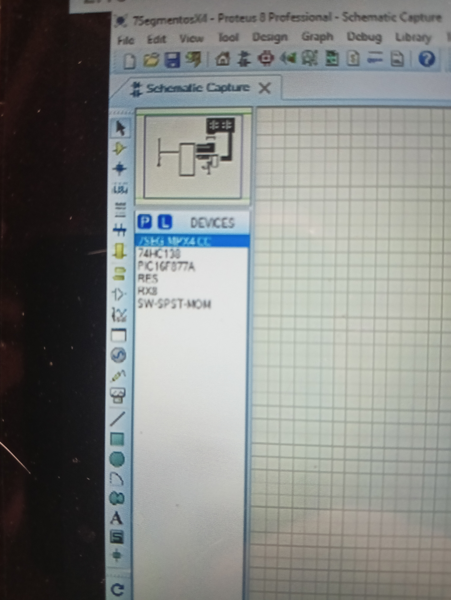

## lcd (Liquid Cristal Display)

- Usaremos el modelo NMTC-S20200XRGHS-10B
    - Tiene 2 lineas de 20 caracteres
    - Databus de 4 u 8 bits
    - 204 caracteres preprogramados
    - Zona de memoria programable paracrear hasta 8 cracateres a criterio del usuario

[gpio_46](./images/46-gpio.png)

- De memoria ROM
    - Tiene CGROM- Character Generator ROM de 1260 Bytes (204 caracteres)
- De memoria RAM
    - CGRAM- Character Generator RAM de 64 bytes (8 caracteres)
    - DDRAM- Display Data RAM de 80 bytes (40 visibles, 20 por linea)
- Tenemos que decirle que caracter de la memoria ROM (o de la RAM si lo creamos nosotros) queremos en qué lugar de la pantalla
- Estos caracteres se crean en una matriz de 5x8 puntos
- En la CGRAM podremos crear ciertos dígitos usando 1 y 0

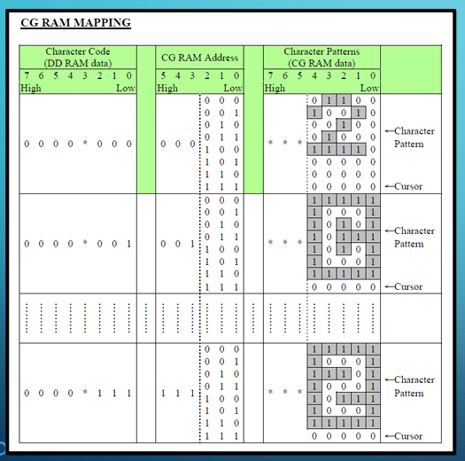

- La máxima cantidad de cracateres que podemos crear es 8 (por cada caracter necesitamos 8 bytes y tenemos 64 de memoria)
- La DDRAM es donde se colocan los caracteres

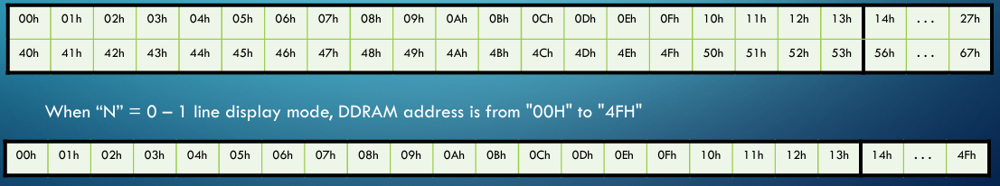

- Tenemos 80 bytes de memoria, pero solo podemos tener 20 caracteres por linea, lo que hace un total de 40 visualizables
- Posibilidad de desplazar la pantalla (shifting)
- Hay dos maneras de configurar la pantalla
    - Hay un bit que llamaremos N que se utiliza para configurar estos modos
    - El modo más normal es con N=1
        - Se usan las dos lineas del display
    - Con N=0 hace que solo usemos una linea del display
- Los pines
    - El primer pin a masa
    - El segundo a alimentación
    - El tercer pin Vee sirve para modificar el contraste
        - Lo más normal es conectarlo a masa si se quiere que el contraste sea estable
        - Si se quiere cambiar se tiene que conectar un potenciómetro y que los valores de este estén entre alimentación y masa
    - Los siguientes 3 bits sirven para controlar el lcd
        - Le diremos al controlador si le enviamos una orden o si queremos enviar o leer cierto caracter
        - tenemos una señal de habilitación que hay que activar una serie de tiempos pero no lo vamos a ver
    - Los siguientes 8 bits son para crear el bus de información
        - Aquí enviaremos que orden le estamos mandando al controlador del micro o el caracter que queremos leer o escribir
    - La patilla 15 y 16 sirven para configurar el brillo del lcd
        - No suele estar incluida en todos los modelos

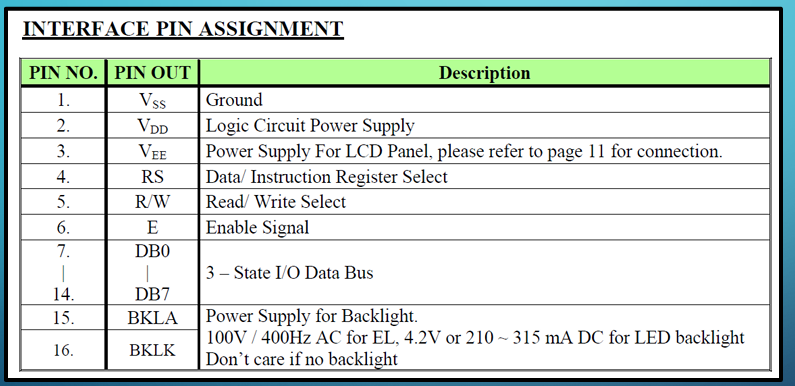    

## lcd en C

- Usaremos la biblioteca lcd.c
- Cuando un display de este tipo se inicia hay que enviarle una serie de instrucciones de control para configurarlo
- Si vamos a usar una interfaz de 4 u 8 pines
- Si vamos a incrementar o decrementar el cursor
- Si la pantalla se va a mover cuando seguimos poniendo caracteres o va a estar fija
- Todo esto hay que hacerlo **respetando una serie de tiempos**
    - Con **lcd_init()** nos olvidamos de todo esto
        - Esta función se llama antes de cualquier otra
        - Borra el lcd
        - Bus de datos en modo de 4 bits
        - Dos lineas de 5x8 puntos
        - Modo encendido, cursor apagado y sin parpadeo
- Una vez llamada esta función podemos usar la que más nos convenga

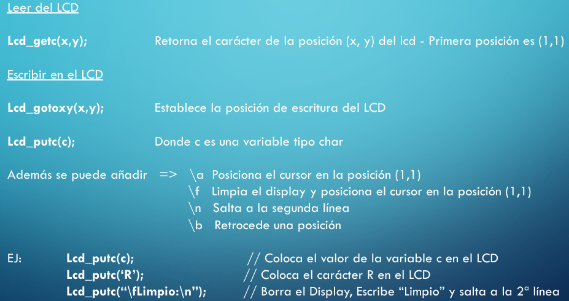

- Con **lcd_getc(x.y)** donde x e y es la posición de la pantalla que queremos leer
    - La posición 1,1 es la de más arriba a la izquierda
    - La primera de la linea de abajo sería 1,2
- Para escribir usaremos **lcd_gotoxy(x,y)** para establecer la posición de escritura del lcd
- Con **lcd_putc(c)** introducimos el caracter de tipo char  
- Con \a posicionamos el cursor en 1,1
- Con \f limpiamos el display y nos posicionamos en 1,1
- Con \n salta a la segunda linea
- Con \b retrocede una posición (de memoria DDRAM)
- Para introducir frases enteras podemos usar **printf**. Le pondremos tres cosas
    - **printf(funcion, cstring, variable1...ultima_variable)**
        - Donde función es lcd_putc()
        - cstring es una cadena que debe ir entre comillas
        - variable1, ultima_variable indica las variables a sustituir en cstring. Las sustituciones se hacen en orden
    - Ejemplo:
~~~c
int dato=20;
float cuadrado = dato*dato;
printf(lcd_putc, "%d al cuadrado es %f", dato, cuadrado)
~~~

- El %nt donde n es el número de caracteres que tiene que mostrar la variable y t indica el tipo de variable
    - Cuando n es de 0-9: dice cuantos caracteres se tienen que mostrar en la variable
    - Cuando n es de 01-09: para indicar la cantidad de ceros a la izquierda
    - Cuando n es 1.1, 1.9: para coma flotante. Indicaremos cuantos números queremos mostrar después de la coma

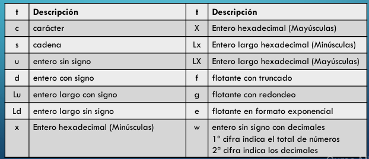

- Para crear caracteres, lo primero es crear una matriz con la forma de nuestro caracter personalizado
- Después de crear la matriz y usar la función, debo volver a colocar el cursor y luego escribir el valor

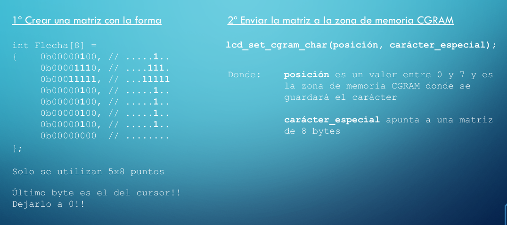

- Elegir el puerto del lcd
    - Por defecto se usa el puerto D para trabajar
    - Para cambiar usar #define lcd_DATA_PORT getenv("SFR:PORTX")
        - Donde PORTX es el puerto que se quiere usar
    - Se debe colocar antes de la directiva #include
- Conexiones Proteus

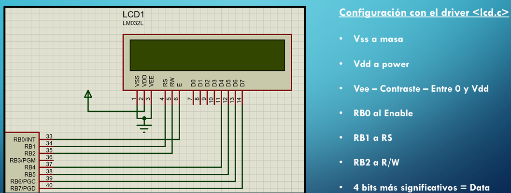

- Si introducimos en el editor de código el #include lcd.c, lo subrayamos y damos a clic derecho go to file, podremos ver todas las funciones (y más) de las que hemos hablado
- Sale lcd_cursor_on(), se le pasa true o false en función de si se quiere encender o apagar el cursor (on=FALSE)
- **Ejercicios**
    - Ejercicio 1: Se desea crear un menú para el control de 3 leds
        - Encender solo el led 1
        - Encender solo el led 2
        - encender solo el led 3
    - De inicio se mostrará solo una opción, pero apretando un botón, iremos pasando una a una por el resto de opciones
    - Tendremos otro botón que se encargará de ejecutar la opciópn del lcd
    - Ejercicio 2: crearemos un caracter especial en la CGRAM
        - Lo mostraremos en la posición 1,1 e irá avnzando hacia la derecha hasta llegar al final, pasará a la segunda linea y volverá hacia la izquierda
        - Tendremos un botón para vover a hacer el recorrido

## Ejercicio lcd Menu

- Si no ponemos nada, el fichero lcd.c está configurado para trabajar con el puerto D
- Usaremos el puerto C para los LEDS y el puerto B para los botones
- Normalmente usamos byte para configurar los puertos, pero ahora usaremos la directiva use standard_io
    - De esta manera el compilador se encarga de configurar como entrada o salida directamente cuando usemos una función que necesite entradas o salidas
- En la configuración de GPIOs, como no tenemos que configurar si son entradas o salidas con TRIS, por lo que solo activaremos las resistencias de Pull-Up del puerto B
- Para configurar el lcd, primero usamos la función init
- Para el ejercicio tenemos tres opicones diferentes
    - Crearemos una variable que se llame selección y que vamos a ir rotando de 1 a 3 para poder tener estas tres opciones en el display
- Declaramos dos funciones, una para escribir el menú en el display según la selección y otra para encender un led u otro según la selección
- Recuerda que cuando declaras una función, hay que declarar los prototipos antes del main
- Donde las variables locales hacemos una inicialización previa del lcd con la opción 1 (selección está inicializada a 1)
- Crearemos también una variable boton_soltado, ya que cuando toquemos el botón que hace que cambie el botón vamos a entrar y tardará muy poco tiempo en hacer lo que nos pide. Como el tiempo que tardamnos en soltar el botón es mucho ayor al tiempo que tardamos en hacer todo esto, vamos a entrar varias veces (lo que hará que rtoremos varias veces en el menú)
- Botón_soltado la vamos a usar para bloquear el menú hasta que sepamos que hemos soltado el botón

~~~c
#include <16F877A.h>
#fuses xt, nowdt
#use delay(crystal=4MHz)

#include <lcd.c>

#use standard_io(C)
#use standard_io(B)

void Escribir_Menu(int);
void LEDs(int);

void main()
{
      //Configuración de las GPIOs
      port_b_pullups(true); //activamos las resistencias de pull up del puerto B
      //LCD
      lcd_init();
      
      int seleccion=1;
      
      int boton_soltado=1;
      
      
      //Inicialización previa
      Escribir_Menu(seleccion);
      

   while(TRUE)
   {
      if(input(PIN_B0)==0 && boton_soltado == 1){
         delay_ms(20); //delay para evitar los rebotes del botón
         boton_soltado=0;
         seleccion++;
         if(seleccion==4) seleccion=1;
         Escribir_Menu(seleccion);
      }
      
      //controlar soltar botón
      if(input(PIN_B0)==1 && boton_soltado==0){
         delay_ms(20);
         boton_soltado=1;
      }
   
      if(input(PIN_B1)==0){ //si está pulsado
         delay_ms(20); //usamos el delay para quitarnos los rebotes del botón
         LEDs(seleccion);
      }

      
   }

}

void Escribir_Menu(seleccion){
   switch(seleccion){
      case 1: lcd_putc('\f'); //limpiamos el LCD y lo llevamos a la posición 1,1
              lcd_putc("Encender led 1");
              break;
      case 2: lcd_putc('\f'); //limpiamos el LCD y lo llevamos a la posición 1,1
              lcd_putc("Encender led 2");
              break;
      case 3: lcd_putc('\f'); //limpiamos el LCD y lo llevamos a la posición 1,1
              lcd_putc("Encender led 3");
              break;
      default: 
              break;
   }
}

void LEDs(seleccion){
   switch(seleccion){
      case 1: OUTPUT_HIGH(PIN_C0);
              OUTPUT_LOW(PIN_C1);
              OUTPUT_LOW(PIN_C2);
              break;
      case 2: OUTPUT_HIGH(PIN_C1);
              OUTPUT_LOW(PIN_C0);
              OUTPUT_LOW(PIN_C2);
              break;
      case 3: OUTPUT_HIGH(PIN_C2);
              OUTPUT_LOW(PIN_C0);
              OUTPUT_LOW(PIN_C1);
              break;
      default: 
              break;
   }
}
~~~

- Para hacer el esquemático de Proteus, he usado etiquetas. recuerda que se hacía señalando el componente DEFAULT y luego labels para conectarlas

- En la placa la conexión sería tal que así

- Para escribir un caracter especial

~~~c
#include <16F877A.h>
#fuses xt, nowdt
#use delay(crystal=4MHz)

#byte TRISA=0x85
#byte PORTA=0x05

//usaremos el puerto B en lugar del D
#define LCD_DATA_PORT getenv("SFR:PORTB")
#include <lcd.c>

void main(){
    //configuración de las GPIOs
    bit_set(TRISA,4);
    lcd_init(); //inicializamos el LCD

    int Fantasma[8] =
    {
        0b00001110,
        0b00011111,
        0b00010101,
        0b00011111,
        0b00011111,
        0b00011111,
        0b00010101
        
    };

    int columnas = 20;

    //Inicialización del caracter, lo guardamos en cgram
    lcd_set_cgram_char(0, Fantasma);
    //como usamos el cursor para escribir este caracter en la cgram, necesitamos que vuelva a la pantalla
    lcd_gotoxy(1,1);//volvemos a la posición inicial
    lcd_putc(0); //le indicamos la zona de memoria donde lo hemos guardado

    while(true){
        if(bit_test(PORTA,4)==0){ //si pulsamos el botón
                delay_ms(20);//eliminamos rebotes
        
        //nos encontramos en 2,1 puesto que ya hemos escrito algo en pantalla y el cursor siempre salta a la siguiente posición
        //queremos ir a la derecha, después bajar, después hacia la izquierda y subiremos a la posición inicial

        //tenemos que escribir de la columna numero 2 a la numero 20
        for(int i=2; i<=columnas; i++){
            //ir a la derecha (borramos el caracter que tenemos en pantalla)
            lcd_putc("\b "); // \b para retroceder un espacio y un espacio en blanco
            lcd_putc(0); //ahora que está borrado lo volvemos a escribir
            delay_ms(200); //delay para ver el movimiento
        }

        //Ahora estamos en la posición 21,1
            lcd_putc("\b "); //Retrocedemos y borramos el caracter
            lcd_gotoxy(columnas,2); // saltamos a la zona de wscritura correcta
            lcd_putc(0);
            delay_ms(200);

        //para ir a la izquierda
        for(int j =columnas; j>=2; j--){
            lcd_putc("\b \b\b"); //Ahora no escribimos, Tenemos que retorceder borrar y retroceder dos veces para poder escribir correctamente
            lcd_putc(0);
            delay_ms(200);
        }

        //cuando estemos aquí estaremos en la posición 2,2
        //Solo nos queda volver al inicio

        lcd_putc('\f'); //limpiamos y volvemos al incio
        lcd_putc(0); //para volver a escribir el caracter al principio
        delay_ms(200);

        }
    }
}
~~~

## Teclado Matricial

- Los botones de cada fila van a tener una patilla conectada entre si
- Cada columna va a unir los pines restantes que quedan
- En la fila 1 tendremos los primeros cuatro botones conectados, en la segunda los segundos 4 botones
- Para las columnas lo mismo

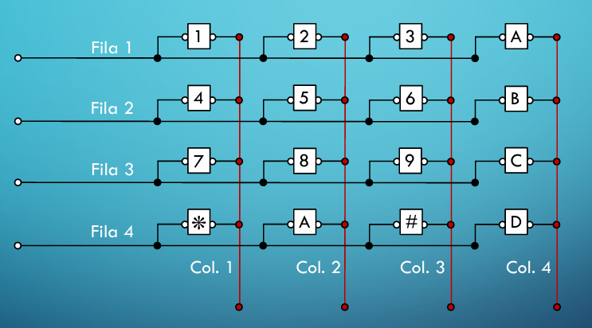

- Este teclado representa el típico de móvil antiguo
- Lo que haremos será declarar una matriz que tenga la misma cantidad de filas y columnas que el teclado matricial

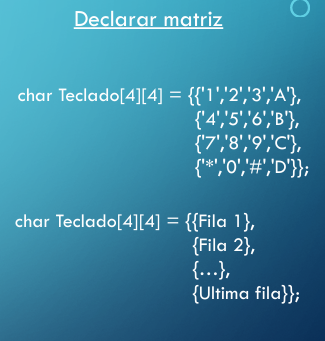

- Normalmente se colocan resistencias de Pull-Up minimo en todas las filas o todas las columnas, o las 2
- Como sería demasiado dedicar un pin por cada botón, se separaán en filas y columnas
    - cada fila se conecta a un pin del micro, lo mismo con las columnas

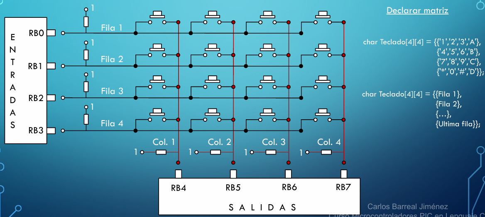

- Si pulso un botón, se crea un contacto directo entre la patilla de la fila y la columna correspondiente

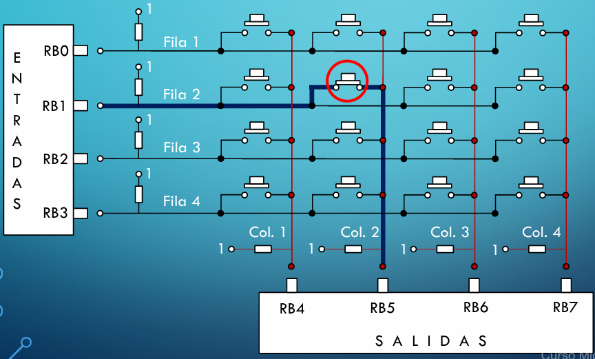

- Aprovechando esto podemos generarun driver con el que sepamos qué botón se ha pulsado y le asignaremos el valor de la matriz correspondiente
    - Así nos ahorramos muchos pines del micro
- Existen dos estrategias principales para saber qué tecla se ha pulsado
- Las dos constan de exploración continua
    - Define uno de los bloques como entradas y otro como salidas
    - Después, asignando ciertos valores a nuestro bloque de salidas, chequearemos elbloque de entrada para buscar un dato determinado que nos indique la tecla pulsada
    - El primer método se llama exploración secuencial
        - El bloque de entradas tiene que tener (si o si) resistencia de pullup
        - Si no se pulsa ningún botón, en las entradas siempre vamos a tenr un 1, independientemente de lo que tengamos en las salidas
        - Tendremos el pin a 0 de la fila que haya hecho contacto el botón
        - Lo primero que vamos a hacer es rotar un 0 en todas las salidas
            - Es decir, el RB4 a 0 y todos los demás a 1
            - Luego vamos a chequear todos los valores de las entradas (RB0, RB1, RB2,RB3)
            - Si uno de estos valores, en lugar de estar a 1 está en 0 ya sabremos que columna y fila está el botón, podremos asiganrle el valor de la matriz
            - Al rotar el 0 en las salidas, tenemos el contacto eléctrico de la fila con la columna
            - hay que acabar el ciclo de rotar el 0 en las salidas (y el resto a 1)
    - El segundo método es la exploración simultánea
        - Es más rápido
        - Todas las salidas a 0 (las columnas)
        - Se hace un chequeo por las entradas (las filas, a ver cual está a 0)
        - Una vez detectado, se intercambian las salidas por las entradas y las entradas por las salidas
        - Ahora las filas son salidas y las columnas entradas, y hacemos lo mismo
        - Ponemos a 0 todas las nuevas salidas y chequeamos las nuevas entradas
        - La columna que esté a 0. Sabiendo ya columna y fila, podremos asiganrle el valr de la matriz
        - Este método solo se puede hacer si se cumplen dos condiciones
            - Que los pines del micro sean bidireccionales
            - Que todas las filas y todas las columnas tengan su resistencia de pull-up
- El teclado matricial de nuestra placa
    - Las filas y columnas están comunicadas entre si como hemos descrito anteriormente
    - Tiene incorporadas sus resistencias pull-up

- El ejercicio:
    - Crearemos un driver para un teclado de exploración secuencial (el método 1)
    - Cuando se pulse un botón se pondrá en el LCD qué botón se ha pulsado
    - Será esta matriz

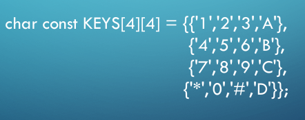

## Ejercicio

- Las filas como entradas y las columnas como salidas
- Los 4 primeros bits de PORTB corresponden a las filas (configuradas como entradas), y los últimos 4 bits corresponden a las columnas (configuradas como salidas).
- El ciclo for recorre las 4 columnas, pero lo hace usando i + fila como índice para manipular los pines. El índice i recorre las columnas, mientras que fila indica el número de filas.
- ¿Por qué i + fila?
    - i recorre las columnas (0 a 3) en cada ciclo del bucle.
    - fila es el número de filas. En tu caso, fila está en 4, lo que significa que estás trabajando con las filas que están en los 4 primeros pines del puerto B.
- ¿Qué hace i en este ciclo?
    - En un teclado matricial 4x4, tienes 4 filas y 4 columnas. En el código, columna es 4, lo que significa que el ciclo va a iterar 4 veces, desde i = 0 hasta i = 3. Esas 4 iteraciones corresponden a las 4 columnas.
- ¿Qué hace i + fila?
    - El puerto PORTB tiene 8 bits. Según tu configuración:
    - Los primeros 4 pines (0, 1, 2, 3) se configuran como entradas para las filas.
    - Los últimos 4 pines (4, 5, 6, 7) se configuran como salidas para las columnas.
    - Dado que el valor de fila es 4, entonces estás manipulando las columnas a través de los pines 4, 5, 6, 7 de PORTB.
    - ¿Por qué usas i + fila?
        - i varía de 0 a 3, lo que corresponde a las 4 columnas del teclado.
        - Cuando haces bit_clear(PORTB, i + fila);, lo que estás haciendo es poner a 0 uno de los pines correspondientes a las columnas. 
- Aquí está el desglose:
    - Cuando i = 0, i + fila = 4, es decir, el primer pin de las columnas (PORTB.4) se pone a 0.
    - Cuando i = 1, i + fila = 5, es decir, el segundo pin de las columnas (PORTB.5) se pone a 0.
- Y así sucesivamente hasta i = 3, donde i + fila = 7, y se pone a 0 el último pin de las columnas (PORTB.7).
- Por lo tanto, **el propósito de bit_clear(PORTB, i + fila); es activar (poner a 0) una columna a la vez, mientras mantienes las demás columnas en 1 (apagadas)**.
- PROBLEMA: cuando pulsemos un botón, ese botón va a estar pulsado por unos milisegundos
    - Eso va a hacer que nuestra variable k tenga un valor diferente de 0 todos estos milisegundos
    - Como queremos hacer este bucle varias veces en esos milisegundos,  en vez de escribir solamente en la pantalla una vez el caracter, vamos a escribirlo unas cuantas veces
- El código

~~~c
#include <16F877A.h>
#fuses xt, nowdt
#use delay(crystal=4MHz)

//usaremos el puerto B
#define LCD_DATA_PORT getenv("SFR:PORTC")
#include <lcd.c>

//para el teclado usaremos el puerto B
#byte TRISB=0x86
#byte PORTB=0x06

char comprobar_tecla(int,int);

void main()
{
      //configuración GPIO
      //usamos las resistencias internas del puerto B
      port_b_pullups(true);
      //configurar LCD
      lcd_init();
      lcd_putc("\fLISTO...\n"); //limpio e imprimo listo en el LCD
      //variables localesint 
      int filas=4, columnas =4;
      char k=0; //le vamos a meter a esta variable lo que nos devuelva la función

   while(TRUE)
   {
      k=comprobar_tecla(filas,columnas);

      //mostramos la tecla pulsada en el LCD
      if(k!=0){
         if(k=='D'){//limpiamos pantalla
         lcd_putc("\fLISTO...\n"); 
         }
         else{
         lcd_putc(k);
         }
         //solución problema botón apretado y milisegundos
         delay_ms(300); //asegurarnos de que hemos dejado de pulsar la tecla      
      }
      
   }

}

char comprobar_tecla(int fila, int columna){
   char const KEYS[4][4]={{'1', '2', '3', 'A'},
                          {'4', '5', '6', 'B'},
                          {'7', '8', '9', 'C'},
                          {'*', '0', '#', 'A'}
                           };
                           
   char tecla=0; 
   
   TRISB=0x0F; //00001111; los menos significativos entradas, las filas
               //los 4 bits más significativos las salidas, las columnas
   //Para seguir el método, tenemos que tener a 0 una de las salidas
   PORTB=0xFF; //las ponemos todas las salidas a 1 de momento;
   //rotemos el 0 por las 4 salidas
   for(int i=0; i<columna; i++){ //elegimos la columna
      bit_clear(PORTB,i+fila);   //la ponemos a 0
     //comprobamos que fila esta a 0 (botón presionado)
      for(int j=0; j<fila;j++){ //con la columna elegida miramos la fila
         if(bit_test(PORTB, j)==0){
            //le asigno el valor de la matriz
            tecla=KEYS[i][j]; //primero las filas y luego las columnas
            delay_ms(20); //eliminamos rebote
         }
      }
   bit_set(PORTB, i+fila); //lo ponemos a 1
   
   }
   
   return tecla;
}
~~~

- No confundir los botones del teclado de la simulación, nosotros los hemos configurado de otra manera

- En la placa lo conectamos así, el LCD está en el Puerto C

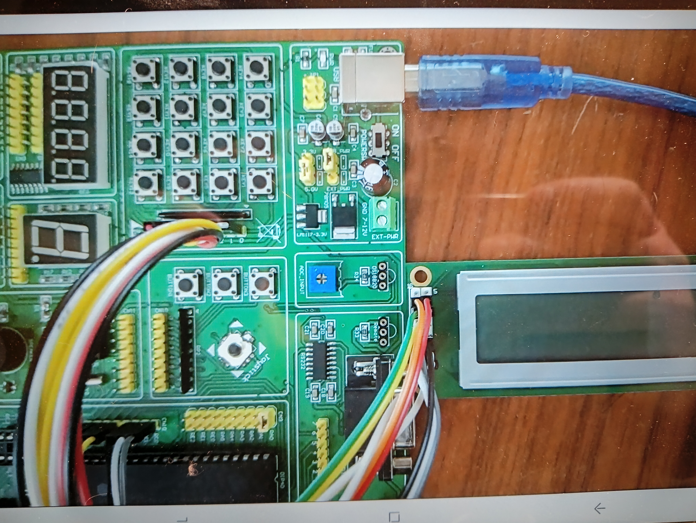

