# Microcontroladores PIC - Interrupciones

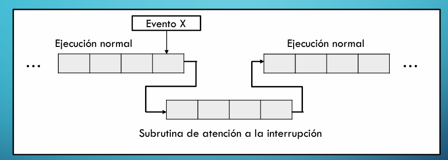

- Una interrupción es un evento externo interno que hace que pausemos la ejecución normal del programa principal para atender a ese evento producido
- Una vez atendido se vuelve a la zona de memoria dónde se encontraba el micro y se continúa
- ¿Cómo lo hace el micro?

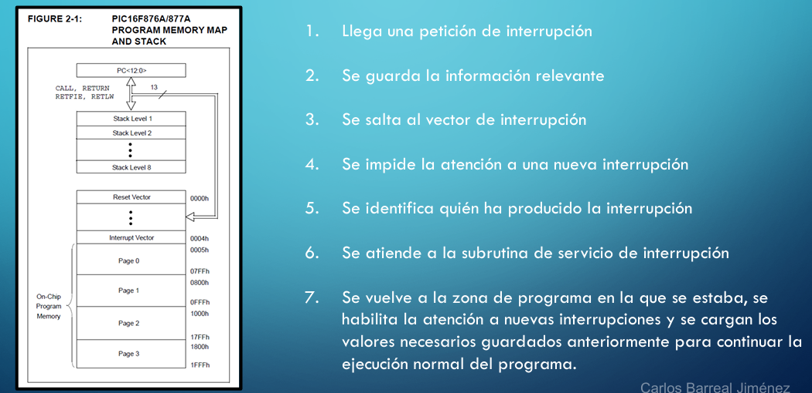

- Hay otros micros que contienen un vector determinado de interrupción para cada tipo de interrupción, pero no es este caso
- En los PIC de gama alta hay prioridad, la importancia que tiene cada interrupción de ser atendida
    - Si entrara una interrupción de prioridad alta y estábamos atendiendo a una de prioridad baja, dejaríamos de atender a la de prioridad baja para atender la de prioridad alta
- Todas las interrupciones (en nuestro caso) saltan al mismo vector de interrupción
- **Control de interrupciones**
    - Flag de interrupción
        - Un bit colocado en cierta zona de memoria RAM del microcontrolador que cuando se active indicará que el evento X debe ser atendido
- Es posible que las interrupciones estén enmascaradas, puede que tengan un bit de habilitación. Si está hbailitado se saltará al vector de interrupción cuando se habilite el Flag
    - Y si no, aunque se active la interrupción, no se le hará caso y el micro continuará haciendo lo que estaba haciendo
    - Sirve para controlar cuando queremos parar a atender un evento o no
- El bit de habilitación global, si no está a 1, no se atenderá a ninguna interrupción
- La habilitación secundaria o periférica, si no está a 1, no se atenderán a las interrupciones asociadas a él

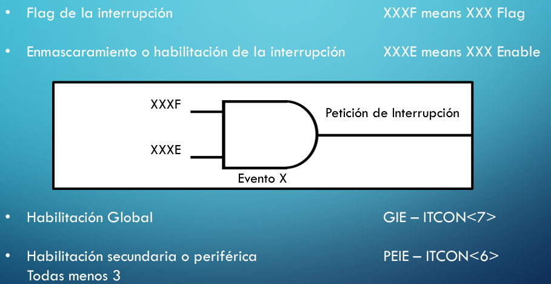

- Echémosle un vistazo al PIC
    - Tenemos 15 posibles interrupciones (todas las puertas que se ven)
    - Algunos pueden ser timers, el módulo CCP, escritura EEPROM
    - Todas las interrupciones son enmascarables
    - tenemos el bit de configuración global y el periférico, que tiene la capcidad de enmascarar 12 de las 15 interrupciones

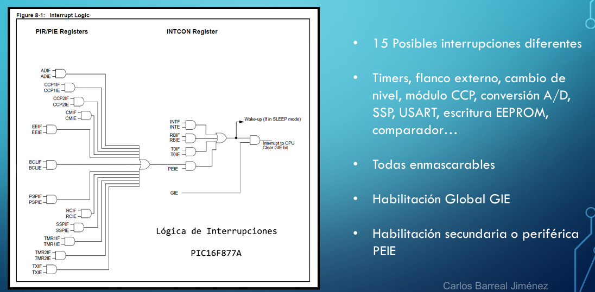

- Registros asociados a interrupciones
    - En el registro **INTCON** se van a encontrar el bit de habilitación global, el bit de habilitación secundaria, y la gestión de 3 eventos
        - El de timer 0, el de la entrada por RB0 de un flanco externo de bajada o de subida, y de un cambio de nivel de RB7:RB4
        - Cada uno de estos eventos tiene asociados dos bits
            - Los que acaban en F (Flag de interrupción) que sirven para indicar que ese evento quiere ser atendido
            - Los que acaban en E de Enable, de enmascarar o no ese flag de interrupción
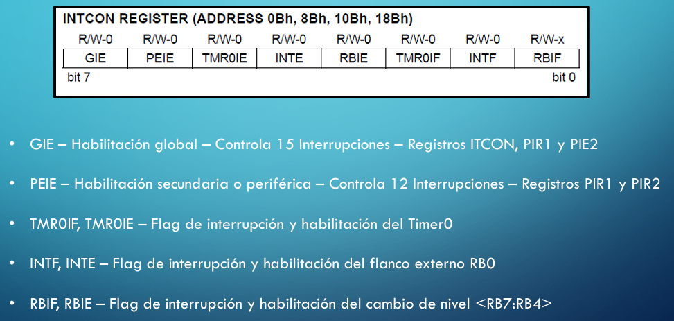

- Las 12 interrupciones restantes  las podemos encontrar en estos 4 registros
    - PIR1 y PIR2 que se encargan de guardar los flags de interrupción
    - PIE1 y PIE2 que se encragan de enmascarar o no los flags de los registros PI1 y PI2

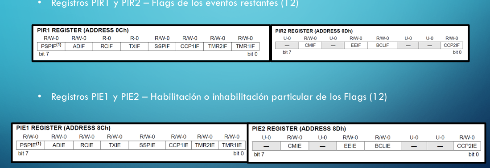

- La primera interrupción que vamos a ver es la de **flanco externo por RB0**
    - Si ponemos a 1 el bit de habilitación global de interrupciones y el bit de habilitación particular por flanco externo en RB0, podremos parar la ejecución normal de nuestro código para hacer absolutamente lo que queramos cuando nos llegue un flanco de subida o de bajada por esta patilla
    - Para configurar si el flanco es de subida o de bajada iremos al registro OPTION_REG

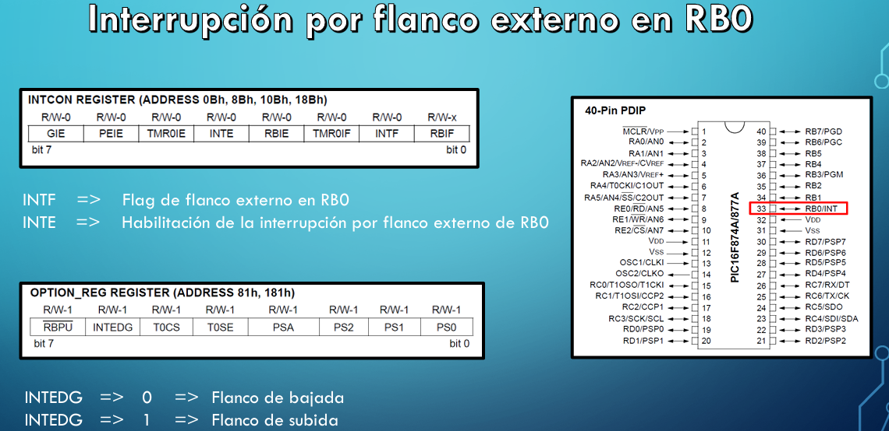

- La segunda interrupción es la de **por cambio de nivel en RB7:RB4**
    - Tendremos que tener a 1 el bit de habilitación global de interrupciones en INTCON
    - También el bit particular de esta interrupción, que es RBIE
- Hecho esto, en cuanto haya un cambio de nivel en cualquiera de las patillas marcadas en la figura (RB7:RB4) tendremos una interrupción
    - Saltaremos al vector de interrupción y atenderemos a la subrutina que hayamos puesto nosotros

## Interrupciones en C

- **Vectores de interrupción y subrutinas**
- Cuando se produce una interrupción, se salta al vector de interrupción. Y ahí, lo primero que hay que hacer, es saber quién ha producido la interrupción
- Todo esto ya nos lo hace el compilador. Una vez lo sepa saltará a su subrutina correspondiente
- Para decirle a dónde tiene que saltar, lo único que tenemos que hacer es escribir la directiva **#INT_evento-correspondiente**
- En esta tabla están todas las posibles interrupciones que podemos generar

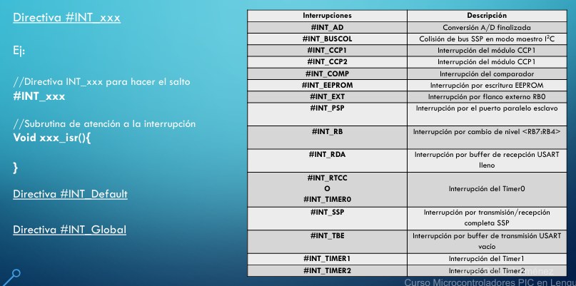

- Por ejemplo, si usamos una directiva #INT_AD, lo que le vamos a decir al compilador que la función que esté después de esta directiva, va a ser la subrutina de conversión AD
- Le estamos diciendo a qué parte del código tiene que saltar, si una vez analizada la interrupción, es del tipo de conversión AD
- Una vez ejecutada esa función, el compilador también se encarga de poner a 0 otra vez el flag
- **#INT_Default** implica que se utilizará la función asociada a esta directiva si se activa una interrupción y no hay ningún flag que se haya activado
- **#INT_Global** sustituirá las demás directivas, y solo se ejecutará su rutina de interrupción. No crea código de inicio ni de limpieza, y tampoco guarda los registros. Es poco utilizada y si se utiliza se debe usar con cuidado
- **Habilitación o inhabilitación de interrupciones**
- Las interrupciones son enmascarables, para esto tenemos dos funciones
    - enable_interrupts(nivel) para habilitar las interrupciones, tanto globales como especificas
    - disable_interrupts(nivel) para deshabilitarlas
- Con ellas vamos a modificar los registros PIE2, PIE1, e ITCON

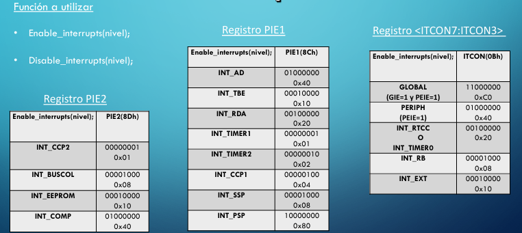

- Si utilizamos la palabra GLOBAL en la función, estaremos habilitando las interrupciones generales y secundarias o perifericas
- Si usamos la palabra PERIPH solo activaremos las periféricas
- Las demás palabras representan la habilitación específica de cada interrupción
- Para habilitar una interrupción, **hay que habilitar todas las interrupciones de manera global y además la específica**
- **Interrupción por flanco externo por RB0**
- Puede ser por flanco de subida o de bajada
- Para configurarlo necesitamos la siguiente función
- Ext_int_edge(H_TO_L)  para flanco de bajada 
- Ext_int_edge(L_TO_H_) para flanco de subida
- Debo habilitar las interrupciones con Enable_interrupts(Global)
- Debo habilitar la interrupción específica con Enable_interrupts(Int_ext)
- Después usar #INT_EXT seguido de la función de subrutina
- **Ejercicios**:
    - **1 Por flanco externo**: con un botón se hará sonar un segundo el Buzzer. En el caso de que llegue un flanco externo por RB0 se incrementará un segundo el Buzzer por cada flanco que ha entrado
    - 2 **Por cambio de nivel entre las patillas RB7:RB4**: colocar un joystick en estos 4 pines y en función de cual se pulse, habrá que cambiar los parámetros de funcionamiento de un motor paso a paso unipolar

## Buzzer

- Un Buzzer no es más que un dispositivo electrónico que utiliza la piezoelectricidad para crear sonido cuando se le aplica cierta señal eléctrica. Con tensión el material se deforma y produce un sonido
- Hay Buzzers activos y pasivos, según tienen oscilador interno o no
- Con oscilador funciona con corriente continua, solo tiene un tono a frecuencia fija
- Sin oscilador interno no funciona con corriente continua, el control de volumen es mediante una señal PWM. Duty_cycle=50% max volumen, con diferentes tonos según la frecuencia de la señal
- El buzzer de la placa está controlado por un transistor
    - Si aplicamos un 0, entrará en corte 
    - Si aplicamos un 1, entrará en saturación, generando un sonido
- Para comprobar si el buzzer es activo o pasivo, no tenemos más que aplicarle un tensión constante
    - Si suena, es que tiene un oscilador interno, por lo tanto es activo
- Ahora, vamos con el ejercicio 1

## Ejercicio 1

- Con un botón se hará sonar un segundo el Buzzer. En el caso de que llegue un flanco externo por RB0 (con un botón) se incrementará un segundo el Buzzer por cada flanco que ha entrado
- Con este código, si apretamos un botón suena el buzzer durante un segundo

~~~c
#include <16F877A.h>
#fuses xt, nowdt
#use delay(crystal=4MHz)

#byte TRISB=0x86
#byte PORTB=0x06

void main()
{
     //Configuración periféricos
     //Configuración GPIOs
     TRISB=0x00000011; //todo salidas excepto RB0 (interrupción) y RB1 (hacer sonar)

   //Configuración de la interrupción externa por RB0
   ext_int_edge(H_TO_L); //config por flanco de bajada
   
   //habilitación de las interrupciones (para poder saltar al vector de interrupción)
   enable_interrupts(global); //pone a 1 los bits GIE y PEIE
   enable_interrupts(int_ext); //pone a 1 el bit INTE
   
   while(TRUE)
   {
      //el botón va a estar en RB1
      if(bit_test(PORTB,1)==0){
         //encendemos el buzzer que va a estar en el pin 7
         bit_set(PORTB,7);
         delay_ms(1000);
         bit_clear(PORTB,7);
      }  
   }
}
~~~

- Ahora falta aumentar en un segundo el buzzer usando el botón (por interrupción)
- Creamos una variable segundos, la inicializamos en 0
- Usamos la directiva de la interrupción (int_ext)
- Pondremos el delay dentro de un for que dependa de segundos (de la cantidad de veces que se ha pulsado el botón)
- Cuando usamos binario usamos **0b**, cuando usamos hexadecimal usamos **0x**
~~~c
#include <16F877A.h>
#fuses xt, nowdt
#use delay(crystal=4MHz)

#byte TRISB=0x86
#byte PORTB=0x06

int segundos=0;

//Interrupciones
#int_ext
void ext_isr(){
   segundos++;
}

void main()
{
     //Configuración periféricos
     //Configuración GPIOs
     TRISB=0b00000011; //todo salidas excepto RB0 (interrupción) y RB1 (hacer sonar), usamos binario por eso 0b

   //Configuración de la interrupción externa por RB0
   ext_int_edge(H_TO_L); //config por flanco de bajada
   
   //habilitación de las interrupciones (para poder saltar al vector de interrupción)
   enable_interrupts(global); //pone a 1 los bits GIE y PEIE
   enable_interrupts(int_ext); //pone a 1 el bit INTE
   
   while(TRUE)
   {
      //el botón va a estar en RB1
      if(bit_test(PORTB,1)==0){
         //encendemos el buzzer que va a estar en el pin 7
         bit_set(PORTB,7);
         
         for(int i =0; i <= segundos; i++){ //bucle proporcional a la cantidad de veces que se ha pulsado RB0
            delay_ms(1000);
         }
         
         bit_clear(PORTB,7);
         segundos=0;
      }
   }
}
~~~

- Aprieto el botón 1 unas 3 veces, si aprieto el botón 2 suena el buzzer unos 4 segundos
- Veamos las conexiones en la placa 
    - El buzzer corresponde al pin numero 2 de su módulo
    - A su vez está conectado con la patilla RB7 del microcontrolador
    - Para los botones vamos a usar el 0 y el 2
        - El número 0 es para incrementar el tiempo que está sonando el buzzer
        - El número 2 (el primero empezando por arriba) es para hacerlo sonar
        - Están conectados a las patillas RB0 y RB1

- Debido a los rebotes, durante el experimento, ha sonado 16 segundos en vez de 10
- Estos botones dependen de un muelle, la transición de 0 a 1 o de 1 a 0 no es instantánea
- Puede ser una solución por hardware, pero emplearemos una solución por software
- Lo que tenemos que hacer básicamente es en los momentos que sepamos que se van a tener rebotes, no hacer caso al valor del botón
- Nos valdría con dos delays (se puede usar un osciloscopio para saber cuanto duran estos rebotes)
- Usaremos un flag boton_pulsado para identificar cuando está presionado el botón
- Vamos a optimizar el código

~~~c
#include <16F877A.h>
#fuses xt, nowdt
#use delay(crystal=4MHz)

#byte TRISB=0x86
#byte PORTB=0x06

int segundos=0;
int1 boton_pulsado=false; //flag para saber cuando está pulsado el botón

//Interrupciones
#int_ext
void ext_isr(){
   segundos++;
   delay_ms(20); //eliminar rebotes al pulsar el botón
   boton_pulsado=true; //el botón se ha pulsado
   
   while(boton_pulsado=true){
      if(bit_test(PORTB,0)==1){ //si ha soltado el botón
         delay_ms(20); //para eliminar los rebotes al soltar el botón
         boton_pulsado=false;
      }
   }
   
}

void main()
{
     //Configuración periféricos
     //Configuración GPIOs
     TRISB=0b00000011; //todo salidas excepto RB0 (interrupción) y RB1 (hacer sonar)

   //Configuración de la interrupción externa por RB0
   ext_int_edge(H_TO_L); //config por flanco de bajada
   
   //habilitación de las interrupciones (para poder saltar al vector de interrupción)
   enable_interrupts(global); //pone a 1 los bits GIE y PEIE
   enable_interrupts(int_ext); //pone a 1 el bit INTE
   
   while(TRUE)
   {
      //el botón va a estar en RB1
      if(bit_test(PORTB,1)==0){
         //encendemos el buzzer que va a estar en el pin 7
         bit_set(PORTB,7);
         
         for(int i =0; i <= segundos; i++){ //bucle proporcional a la cantidad de veces que se ha pulsado RB0
            delay_ms(1000);
         }
        
         bit_clear(PORTB,7);
         segundos=0;
      }
   }
}
~~~

## Motor paso a paso

- Este tipo de motores, al contrario que los de corriente continua, se caracterizan porque son capaces de un giro rotatorio por medio de desplazamientos fijos que son llamados pasos o steps. Significa que vamos a poder rotar el motor a la posición que queramos
- Para ello vamos a necesitar un control, que será mediante una serie de pulsos en un orden específico
- Existen dos tipos de motores paso a paso, y se diferencian en el tipo de rotor que utilizan

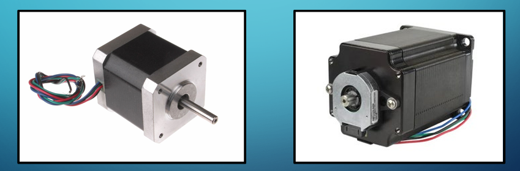

- Motores de reluctancia variable (rotor dentado de un material ferromagnético)
- Motores de imán permanente (más común)
    - Motor paso a paso unipolar
    - Motor paso a paso bipolar
    - Híbrido
- Nos centraremos en los unipolares
- Vayamos con las bases físicas que usan los motores para funcionar

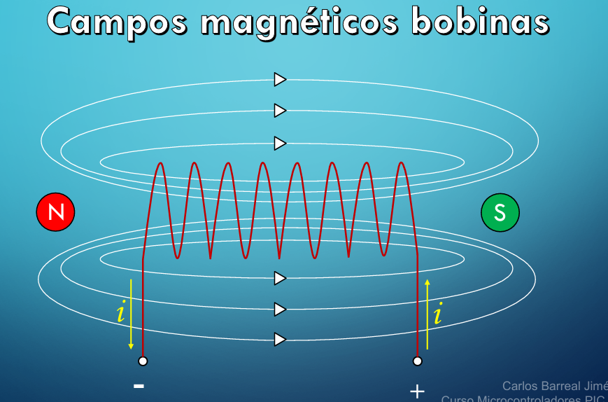

- Si le suministramos una tensión a una bovina de forma que tenga una corriente eléctrica entrante por una de las patillas y la misma corriente eléctrica saliente por la otra, se genera un campo electromagnético con una dirección idéntica a la de la intensidad
- Por la parte de la bovina que entre la corriente, entrará también el campo magnético
- Este campo magnético va a tener dos polos diferenciados: por donde esté entrando la corriente (polo sur) y por donde sale (polo norte)
- El motor está compuesto por dos partes diferenciadas
    - El estator (parte fija)
    - Rotor (parte móvil)

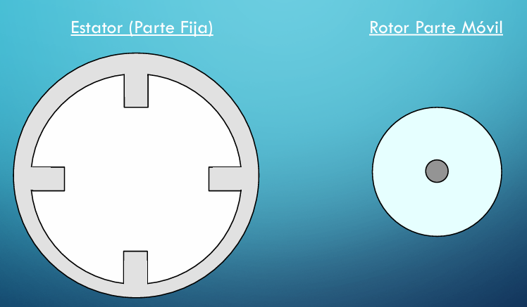

- En un motor paso a paso de imán permanente, vemos la bovina en el estator

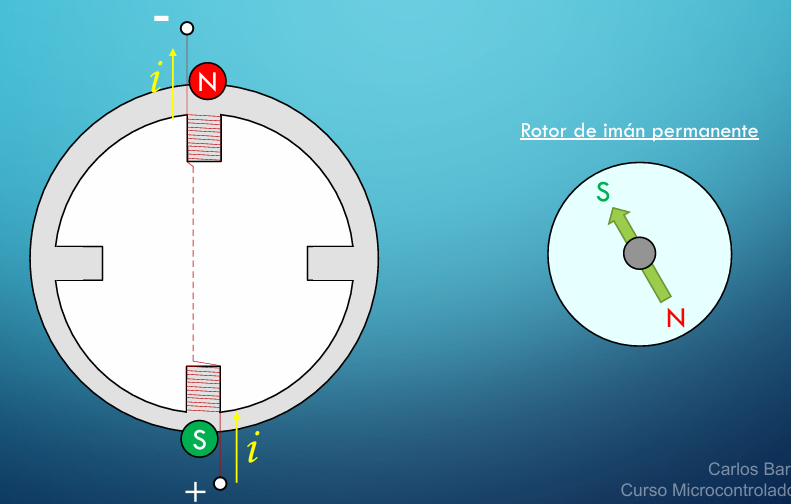

- El rotor tiene un polo sur y un polo norte. Los polos opuestos se atraen

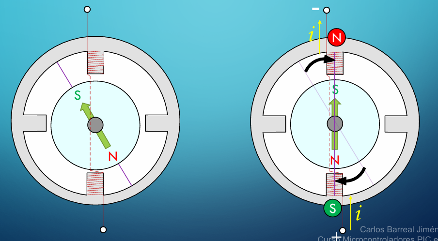

- Qué pasa si colocamos más bovinas (2 verticales y 2 horizontales)
    - La roja la vamos a usar para crear una corriente ascendente (un polo norte en la parte superior)
    - La verde la vamos a usar para generar un campo magnético inverso a la roja (corriente descendente) generando un polo norte en la zona inferior del estator
    - En la zona horizontal vamos a colocar otras dos bovinas
        - La azul la vamos a usar para generar un polo norte en la parte derecha del estator
        - La naranja para generar un polo norte en la parte izquierda

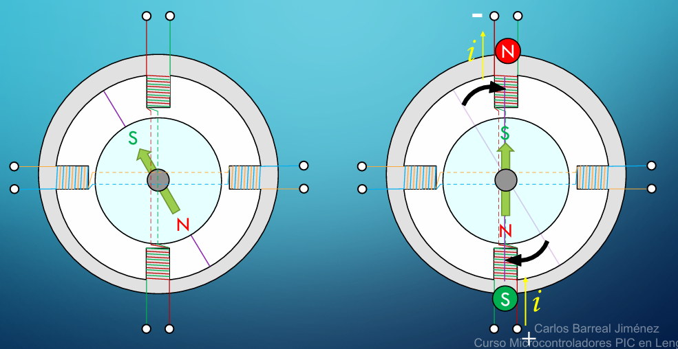

- Alimentando primero la bovina vertical superior y luego desactivándola y activando la bovina izquierda generamos un paso, luego hacemos lo mismo con la bovina inferior y la de la derecha, tenemos un círculo completo 
- Entonces, el movimiento se realiza mediante pasos que controlamos mediante estos impulsos

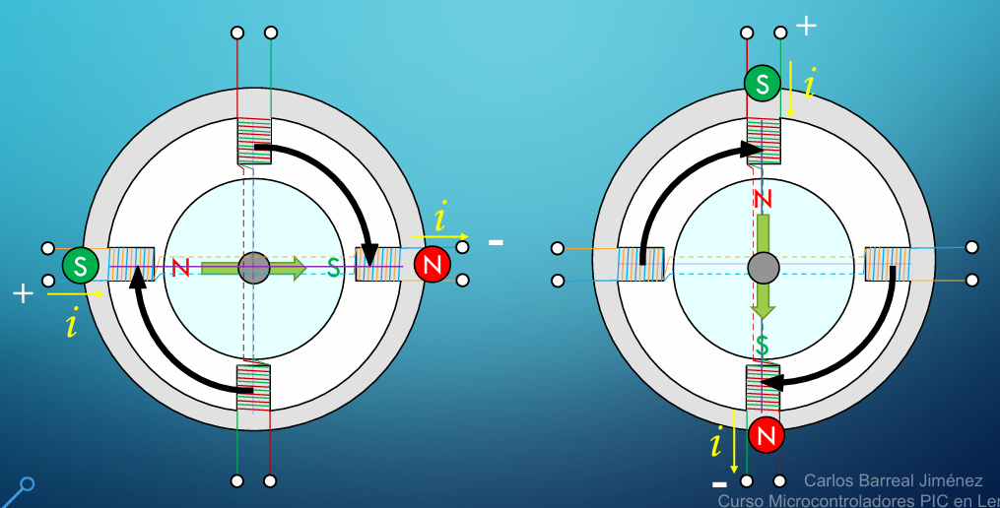
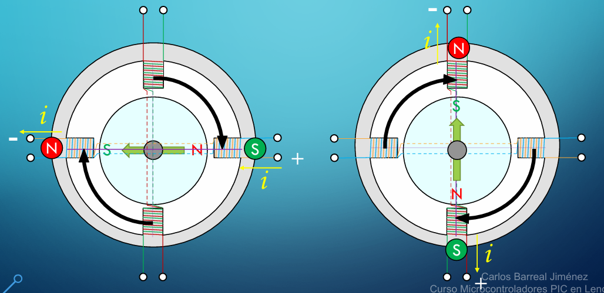
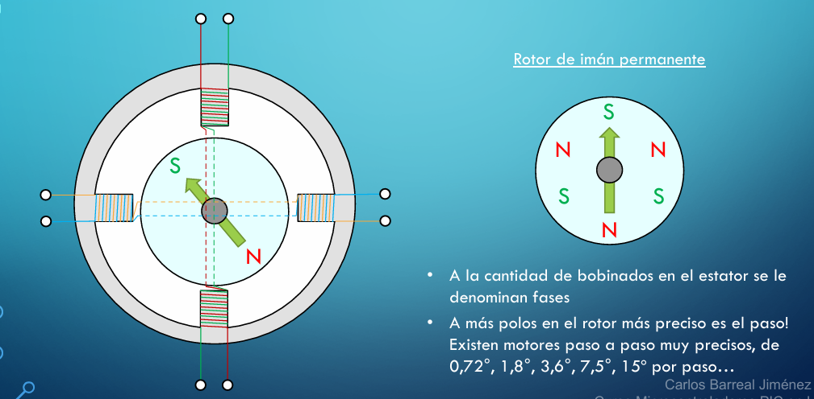

- A la cantidad de bovinados en el estator se les denomina fases
- Hemos hecho el ejemplo solo con dos polos, pero si tuviera más polos cada desplazamiento sería más pequeño
- **Motor paso a paso unipolar**
    - Sigue las mismas condiciones que lo expuesto anteriormente, salvo que las dos bovinas verticales y las dos bovinas horizontales **tienen que estar conectadas entre si**. Este punto común se tiene que llevar a un 1 digital
    - Con esto vamos a conseguir que pongamos un 0 en el otro pin de la bovina que tiene libre, generemos el campo magnético
    - Con esta conexión, vamos a conseguir también que las dos bovinas verticales generen un campo magnético opuesto 
        - Cuando llevemos a 0 la bovina roja generará un campo magnético al de la bovina verde cuando la llevemos a 0
        - Lo mismo con las horizontales
- Para definir los bovinados y las conexiones de los motores paso a paso unipolares se suele usar el esquema de la derecha

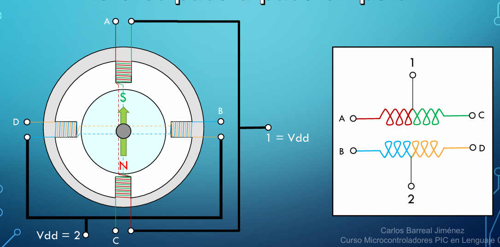

- Este tipo de motor va a necesitar unas caracteristicas eléctricas que el PIC no va a ser capaz de suministrar

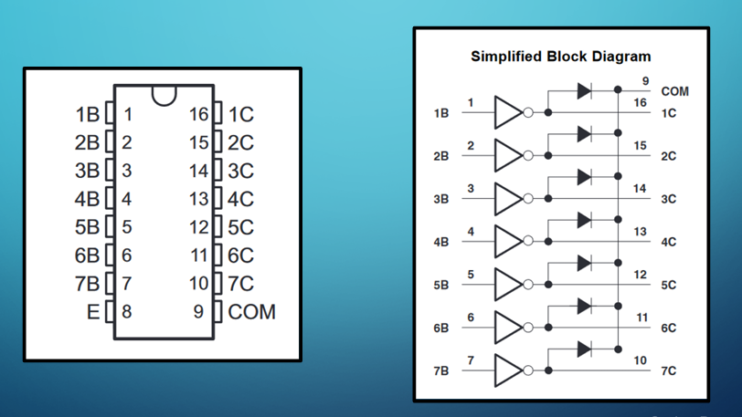

- Al usar este componente, como usa puertas NOT vamos a tener que usar 1 en vez de 0 para activar el bovinado correspondiente
- Veamos los impulsos que hay que enviar para lograr todos los pasos
- Un modo típico es el Full Step, activando las bovinas de 2 en 2

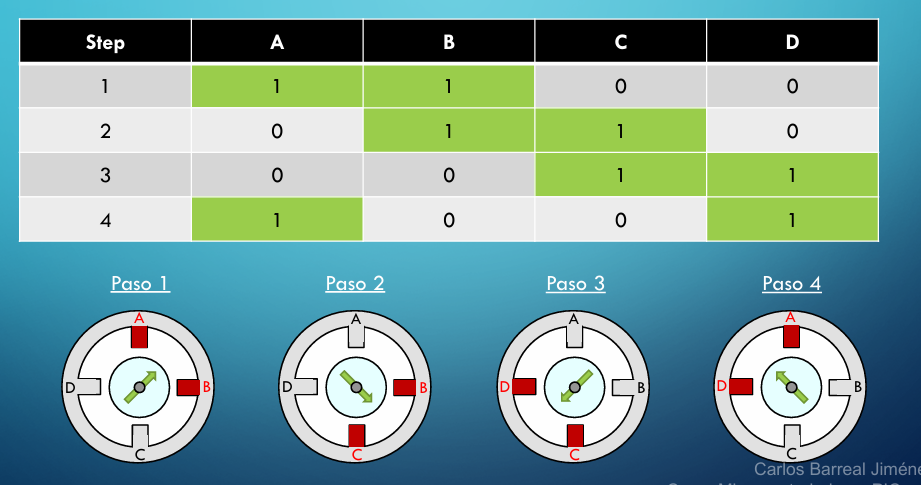

- Otra manera es el Wave Drive (activando unicamente una bovina)
    - Menos consumo pero el pard e fuerza es inferior
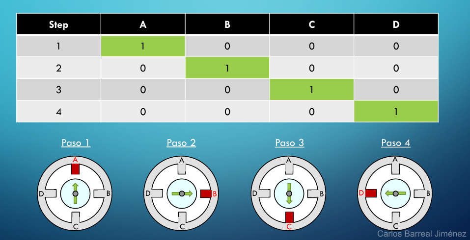

- Otra manera es el Half Step (activando dos bovinas y desactivando una de ellas)
    - Vamos a tener el doble de precisión, pero vamos a tardar el doble en dar una vuelta

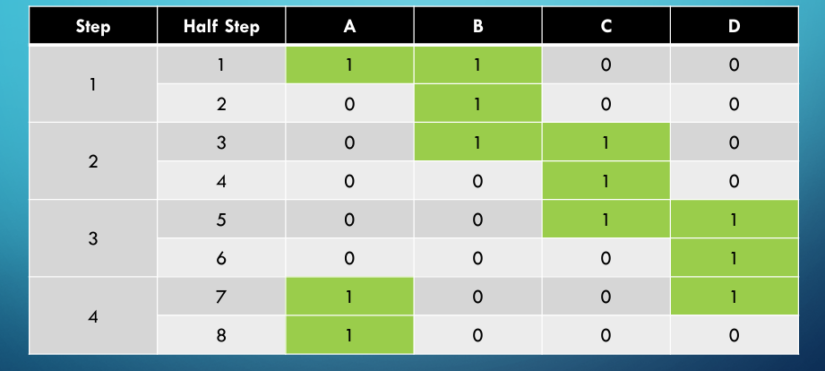
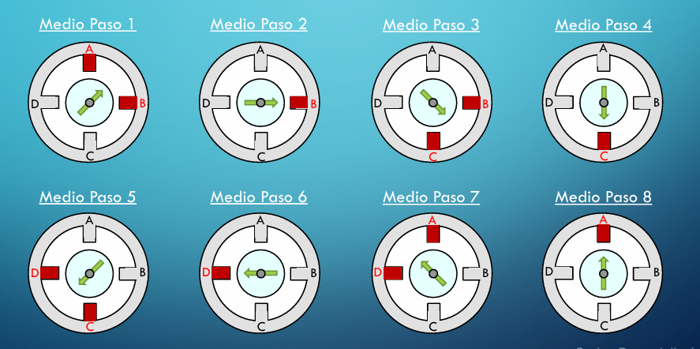

- ¿Cómo hacer esto en C?
    - Primero asignar los bovinados en orden a las patillas del micro
    - Usar bit_set y bit_clear para activar y desactivar los bovinados

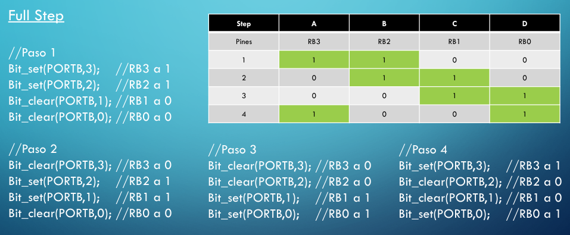

- Es mucho más eficiente usando matrices
- Definimos una matriz y en un bucle vamos a ir sacando los diferentes valores, enviando así todos los pulsos necesarios para mover el rotor

- El motor a usar en la práctica es el 28BYJ-48

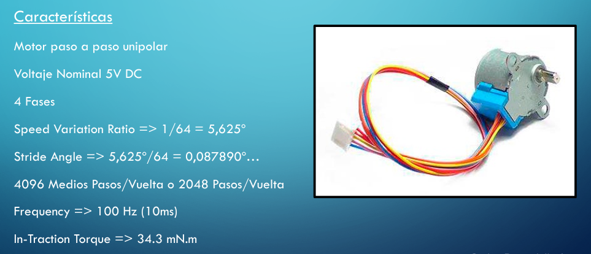

- 5V de corriente continua
- De tipo unipolar
- Tiene un total de 4 fases (4 bovinados)
- Se necesitan 64 pasos para dar una vuelta completa
    - Da 5.625º por paso
- El motor tiene una caja reductora en su interior (engranajes) que hace que la cantidad de pasos para dar una vuelta completa sea aún menor
    - Otros 64, lo que hace que la precisión sea de 0.087890º. En este caso el fabricante hace referencia al medio paso con Stride Angle
- La frecuencia entre pulsos tiene que ser de 100 Hz
- El Torque que se genera es de 34.3 miliNewton por metro
- **Relación entre velocidad y el torque**
- Esta es una gráfica de un motor de más calidad
    - Entre los pulsos que se envían (la velocidad de rotación) y el torque que se genera no es constante
    - Una vez que se aumenta considerablemente la velocidad de giro, perdemos el torque
    - Hasta que llegue un momento que enviemos los pulsos tan rápido que el motor no sea capaz de seguirlos y el motor se bloquée y no gire

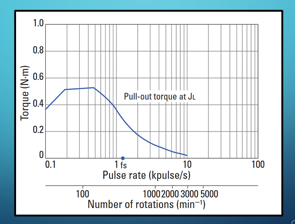

- Vamos con el cableado de este motor
- Tiene un total de 5 cables
    - Los primeros 4 son los de las 4 bovinas
    - El 5 son los dos comunes que ya vienen unidos internamente (el rojo)
    - El rojo siempre tiene que ir conectado a alimentación

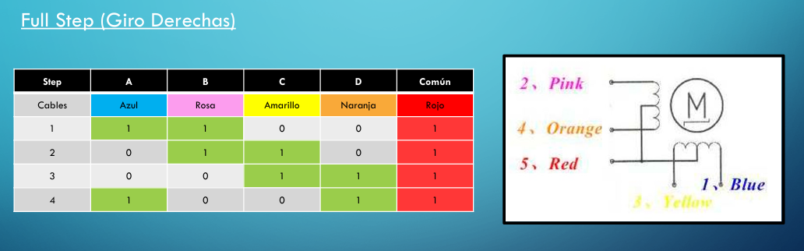

- Como lo tenemos montado nosotros en la placa de desarrollo
    - El común ya está conectado a alimentación
    - Los otros 4 van directos al integrado ULN2003A
    - Las salidas van a unos jumpers
    - sto es importante porque si no nos podemos equivocar de girrar el motor a derechas o izquierdas

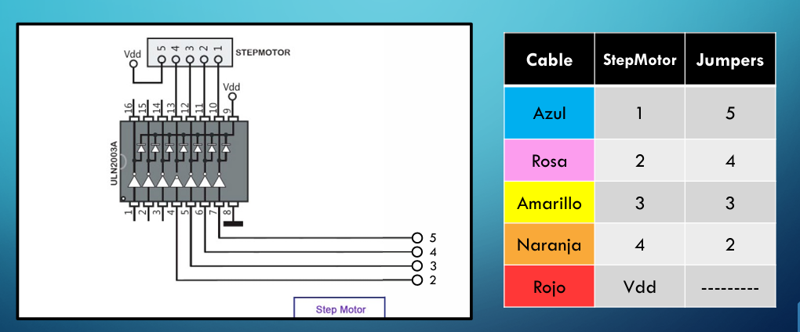

- El ejercicio
- Controlar un motor paso a paso unipolar por medio de medios pasos
    - Para controlarlo se utilizará un joystick
    - Sus controles deberán ser:
        - Derecha: girar a derechas (clockwise)
        - Abajo: Reducir velocidad de giro (aumentar delay entre pulsos)
        - Izquierda: Girar a izquierdas (anti-clockwise)
        - Arriba: Aumentar velocidad de giro (reducir delay entre pulsos)
- El joystick se controlará por las interrupciones de cambio de nivel de los pines RB7:RB4
- El sentido de giro y la velocidad (delay entre pulsos) se deberá mostrar en un LCD

## Ejercicio 2

- En la interrupción por cambio de nivel, en cuanto se produce un cambio de 1 a 0 o de 0 a 1 en las patillas de RB7:RB4 se genera una interrupción
- Cuando se activa se pone a 1 el bit RBIF
    - Esto ocurre cuando el bit 3, el RBIE del registro INTCON está puesto a 1
    - En la dirección 0B está INTCON. El bit 0 es RBIF, el bit 3 es RBIE
    - Si miras a la derecha de RBIF verás 0000 000x, lo que significa que después del reset el valor de este bit es desconocido
    - Necesitamos partir de un lugar conocido para que no se produzcan errores, por lo que vamos a tener que poner este bit a 0 nosotros

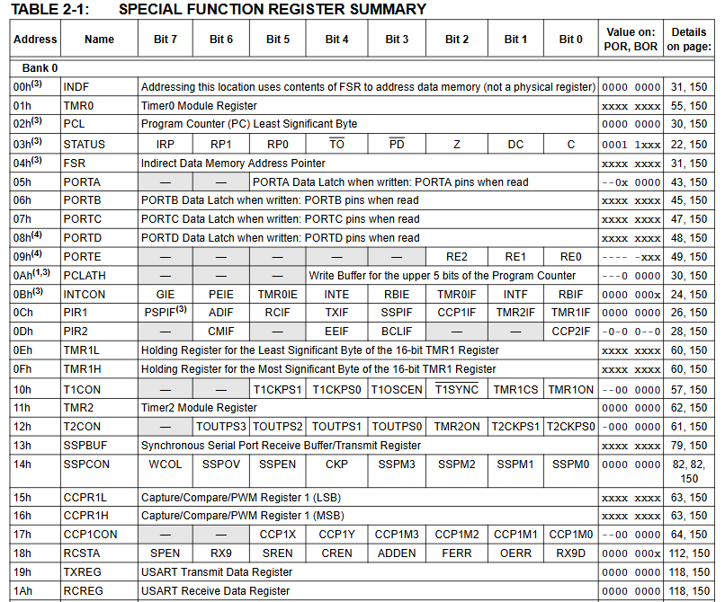

- Usaremos la variable global delaytime definida por mi para el tiempo de delay entre pasos. El fabricante recomienda un mínimo de 10
- Según como recorramos la matriz haremos que el motor gire a izquierda o derecha
    - Para ello definimos la variable global sentido, donde 0 sea derechas y 1 sea a izquierdas
    - Uso la directiva define para que quede más claro
- En el caso de elegir full_step o wave_drive deberemos cambiar el valor 7 por el 3 (ya que estas matrices solo tienen 4 elementos)
- Con esto ya le mandamos las indicaciones necesarias al motor para medio paso a izquierdas y a derechas

~~~c
#include <16F877A.h>
#fuses xt, nowdt
#use delay(crystal=4MHz)

//Los 4 botones del joystick irán del RB7:RB4
#byte TRISB=0x86
#byte PORTB=0x06

//Motor en el puerto C, RC3:RC0
#byte TRISC=0x87
#byte PORTC=0x07

#bit rb_flag=0x0b.0 //flag de la interrupción por nivel de RB7:RB4

#define derechas 0
#define izquierdas 1

//Variables globales
int delaytime_ms=15; //para la velocidad de giro
int sentido=derechas; //para dirigir a izquierda(1) o derecha(0)

void main()
{
   //Perifericos
   //Gpios
   TRISC=0xF0; //11110000
   PORTC=0b00001100; //Situación inicial del motor
   //Configuración de la interrupción por nivel de RB7:Rb4
   rb_flag=0;
   //Habilitacion de las interrupciones
   enable_interrupts(global);
   enable_interrupts(int_rb);
   
   //variables locales
   int const half_step_derechas[8]={0b00001100,0b00000100,0b00000110,0b00000010,0b00000011,0b00000001,0b00001001,0b00001000};
   //int const full_step_derechas[4]={0b00001100,0b00000110,0b00000011,0b00001001};
   //int const wave_drive_derechas[4]={0b00001000,0b00000100,0b00000010,0b00000001};
   int i = 0;
   
   while(TRUE)
   {
      PORTC=half_step_derechas[i]; //ejecutamos medio paso
      delay_ms(delaytime_ms);
      //Giro a la derecha
      if(sentido=derechas){
         if(i==7) i =0;
         else i++;
      }
      
      //Giro a la izquierda
       else{
         if(i==0)i=7;
         else i--;
       }
   }
}
~~~

- Pero esto no tiene que ser constante, sino que debemos poder cambiarlo con el joystick (por medio de interrupciones)
- Definimos con la directiva específica la interrupción #int_rb
- Vamos a saltar a la interrupción cada vez que toquemos un botón (joystick) y cada vez que lo soltemos
- Nosotros queremos solo modificar algo cuando pulsamos, por lo tanto un flanco de bajada
- Crearemos una variable flanco_bajada que nos indique si ha ocurrido esto o no
- Primero tenemos que identificar primero qué botón se ha pulsado con el joystick para saber qué tenemos que hacer, si ir a izquierdas, a derechas, aumentar o disminuir la velocidad
- Para ello declararemos una matriz con 4 valores, igual que las opciones con el joystick
    - Primera posición será derecha, segunda será abajo (más lento), 3era será izquierda y cuarta será arriba (más rápido)
- Lo que tenemos que hacer es algo parecido a la práctica del teclado matricial
    - Chequear que botón se ha pulsado  y en función de cual se haya pulsado vamos a guardar un 1 en la posición de la matriz que corresponda
- Creo una función actualizar estado que invoco si el flag de flanco de bajada es 1

~~~c
#include <16F877A.h>
#fuses xt, nowdt
#use delay(crystal=4MHz)

//Los 4 botones del joystick irán del RB7:RB4
#byte TRISB=0x86
#byte PORTB=0x06

//Motor en el puerto C, RC3:RC0
#byte TRISC=0x87
#byte PORTC=0x07

#bit rb_flag=0x0b.0 //flag de la interrupción por nivel de RB7:RB4 que con reset se queda indefinido lo definimos aqui

#define derechas 0
#define izquierdas 1

//Variables globales
int delaytime_ms=15; //para la velocidad de giro
int sentido=derechas; //para dirigir a izquierda(1) o derecha(0)
int flanco_bajada= 0; //flag para saber si el salto al vector de interrupción 
                     //se ha realizado por flanco de subida o de bajada
int mando[4]={0,0,0,0}; //Derecha, abajo (más lento), izquierda, arriba (más rápido)

//Prototipos
void actualizar_estado();
void disminuir_velocidad();
void aumentar_velocidad();

//Interrupciones
#int_rb
void rb_isr(){
//como el joystick es equivalente a apretar un botón hay que eliminar rebotes
   delay_ms(20); //eliminar rebotes
   //comprobamos que botón se ha pulsado entre RB7:RB4
   for(int i=4; i<=7; i++){
   if(bit_test(PORTB,i)==0){ //si es igual a 0 porque es pull up, si lo hemos pulsado
      mando[i-4]=1; //guardamos la opción elegida poniéndola a 1 
      //como hemos hemos entrado aquí es que hemos entrado por flanco de bajada
      flanco_bajada=1; //Activamos el flag de flanco de bajada
   }
   else mando[i-4]=0;  //Ponemos a 0 la opción no elegida
  }
  //realizamos lo que se nos ha pedido en función de lo que hay en mando
  //y de si hemos entrado por flanco de bajada
  
  if(flanco_bajada==1){
  actualizar_estado();
   flanco_bajada=0;
  }

}

void main()
{
   //Perifericos
   //Gpios
   TRISC=0xF0; //11110000
   PORTC=0b00001100; //Situación inicial del motor
   //Configuración de la interrupción por nivel de RB7:Rb4
   rb_flag=0;
   //Habilitacion de las interrupciones
   enable_interrupts(global);
   enable_interrupts(int_rb);
   
   //variables locales
   int const half_step_derechas[8]={0b00001100,0b00000100,0b00000110,0b00000010,0b00000011,0b00000001,0b00001001,0b00001000};
   //int const full_step_derechas[4]={0b00001100,0b00000110,0b00000011,0b00001001};
   //int const wave_drive_derechas[4]={0b00001000,0b00000100,0b00000010,0b00000001};
   int i = 0;
   

   
   
   while(TRUE)
   {
      PORTC=half_step_derechas[i]; //ejecutamos medio paso
      delay_ms(delaytime_ms);
      //Giro a la derecha
      if(sentido=derechas){
         if(i==7) i =0;
         else i++;
      }
      //Giro a la izquierda
       else{
         if(i==0)i=7;
         else i--;
       }
      
   
   }

}

//función que realiza la orden pedida por el joystick
//girar a derechas, reducir la velocidad, girar a izquierdas o aumentar la velocidad de giro
void actualizar_estado(){
   //la opción está en la matriz mando
   for(int i = 0; i<4;i++){
      if(mando[i]==1){
         switch (i){
            //Girar a derechas
            case 0:   sentido=derechas;
            
               break;
            //Reducir velocidad
            case 1:  disminuir_velocidad();
            
               break;
            //Girar a izquierdas
            case 2: sentido=izquierdas;
            
               break;
            //Aumentar velocidad   
            case 3:   aumentar_velocidad();
            
               break;
                
         }
      }
   }
   
}

//Función disminuye velocidad de giro aumentando deklay entre pasos
void disminuir_velocidad(){
  if(delaytime_ms=20) delaytime_ms=20;
  else delaytime_ms = delaytime_ms+1;
  
}

void aumentar_velocidad(){
  if(delaytime_ms=10) delaytime_ms=10; //El tope minimo que indica el fabricante es 100Hz = 10 milisegundos
  else delaytime_ms = delaytime_ms-1;  
}
~~~

- Para indicar en el LCD lo que está haciendo el motor, primero debemos incluir su driver

~~~c
#include <16F877A.h>
#fuses xt, nowdt
#use delay(crystal=4MHz)

//driver lcd
#include <lcd.c>

//Los 4 botones del joystick irán del RB7:RB4
#byte TRISB=0x86
#byte PORTB=0x06

//Motor en el puerto C, RC3:RC0
#byte TRISC=0x87
#byte PORTC=0x07

#bit rb_flag=0x0b.0 //flag de la interrupción por nivel de RB7:RB4

#define derechas 0
#define izquierdas 1

//Variables globales
int delaytime_ms=15; //para la velocidad de giro
int sentido=derechas; //para dirigir a izquierda(1) o derecha(0)
int flanco_bajada= 0; //flag para saber si el salto al vectro de interrupción 
                     //se ha realizado por flanco de subida o de bajada
int mando[4]={0,0,0,0}; //Derecha, abajo (más lento), izquierda, arriba (más rápido)

//Prototipos
void actualizar_estado();
void disminuir_velocidad();
void aumentar_velocidad();

//Interrupciones
#int_rb
void rb_isr(){
//como el joystick es equivalente a apretar un botón hay que eliminar rebotes
   delay_ms(20); //eliminar rebotes
   //comprobamos que botón se ha pulsado entre RB7:RB4
   for(int i=4; i<=7; i++){
   if(bit_test(PORTB,i)==0){ //si es igual a 0 porque es pull up, si lo hemos pulsado
      mando[i-4]=1; //guardamos la opción elegida poniéndola a 1 
      //como hemos hemos entrado aquí es que hemos entrado por flanco de bajada
      flanco_bajada=1; //Activamos el flag de flanco de bajada
   }
   else mando[i-4]=0;  //Ponemos a 0 la opción no elegida
  }
  //realizamos lo que se nos ha pedido en función de lo que hay en mando
  //y de si hemos entrado por flanco de bajada
  
  if(flanco_bajada==1){
  actualizar_estado();
   flanco_bajada=0;
  }

}

void main()
{
   //Perifericos
   //Gpios
   TRISC=0xF0; //11110000
   PORTC=0b00001100; //Situación inicial del motor
   //Configuración LCD
   lcd_init();
   //Configuración de la interrupción por nivel de RB7:Rb4
   rb_flag=0;
   //Habilitacion de las interrupciones
   enable_interrupts(global);
   enable_interrupts(int_rb);
   
   //puesta en marcha del LCD
   printf(lcd_putc,"\fSentido = Right");
   printf(lcd_putc,"\nSpeed = %2d ms",delaytime_ms); // \n para usar la segunda linea, %2 porque son 2 digitos
   //variables locales
   int const half_step_derechas[8]={0b00001100,0b00000100,0b00000110,0b00000010,0b00000011,0b00000001,0b00001001,0b00001000};
   //int const full_step_derechas[4]={0b00001100,0b00000110,0b00000011,0b00001001};
   //int const wave_drive_derechas[4]={0b00001000,0b00000100,0b00000010,0b00000001};
   int i = 0;
   

   
   
   while(TRUE)
   {
      PORTC=half_step_derechas[i]; //ejecutamos medio paso
      delay_ms(delaytime_ms);
      //Giro a la derecha
      if(sentido=derechas){
         if(i==7) i =0;
         else i++;
      }
      //Giro a la izquierda
       else{
         if(i==0)i=7;
         else i--;
       }
      
   
   }

}

//función que realiza la orden pedida por el joystick
//girar a derechas, reducir la velocidad, girar a izquierdas o aumentar la velocidad de giro
void actualizar_estado(){
   //la opción está en la matriz mando
   for(int i = 0; i<4;i++){
      if(mando[i]==1){
         switch (i){
            //Girar a derechas
            case 0:   sentido=derechas;
                        lcd_gotoxy(1,1); //no situamos al inicio del LCD
                        printf(lcd_putc,"\fSentido = Right");
            
               break;
            //Reducir velocidad
            case 1:  disminuir_velocidad();
            
               break;
            //Girar a izquierdas
            case 2: sentido=izquierdas;
                     lcd_gotoxy(1,1); //no situamos al inicio del LCD
                        printf(lcd_putc,"\fSentido = Left");
               break;
            //Aumentar velocidad   
            case 3:   aumentar_velocidad();
            
               break;
                
         }
         
         lcd_gotoxy(1,2);
         printf(lcd_putc,"\nSpeed = %2d ms", delaytime_ms);
      }
   }
   
}

//Función disminuye velocidad de giro aumentando deklay entre pasos
void disminuir_velocidad(){
  if(delaytime_ms=20) delaytime_ms=20;
  else delaytime_ms = delaytime_ms+1;
  
}

void aumentar_velocidad(){
  if(delaytime_ms=10) delaytime_ms=10; //El tope minimo que indica el fabricante es 100Hz = 10 milisegundos
  else delaytime_ms = delaytime_ms-1;  
}
~~~

- Salen unos warnings que indican que se me deshabilitan las interrupciones caundo ejecutamos las funciones aumentar_velocidad y disminuir_velocidad
- Es porque en la subrutina debajo de la directiva de interrupción llamamos a la función actualizar_estado (y llamamos a estas funciones)
- Si salimos de la función y vuelve a generarse otra interrupción volveríamos a esta subrutina no habiendo realizado lo que teniamos que hacer
- Por lo tanto, es indispensable que se deshabiliten las interrupciones hasta salir de la función
- Si no se hiciese automáticamente lo tendríamos que hacer nosotros
- Para ver el archivo en ensamblador voy al botón C/ASM List. Tiene 1700 lineas!! (madre mía)
- Veamos el esquemático de Proteus

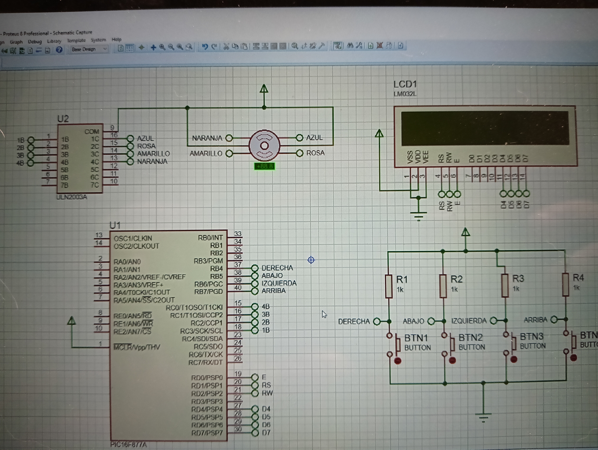

- Los componentes son 
    - BUTTON
    - LM032L
    - MOTOR_STEPPER
    - PIC16F877A
    - RES
    - ULN2003A
- El LCD está conectado a todo el puerto D
    - RD0, RD1 y RD2 para las señales de control
    - RD4, RD5,RD6 y RD7 para mandar la información
- El puerto B es para el joystick, lo he simulado con botones
    - RB4 derecha
    - RB5 abajo
    - RB6 izquierda
    - RB7 arriba
- Si hacemos doble clic sobre el motor modifico varios parámetros
    - Voltaje nominal: 5V
    - Step Angle: 0.17578 el ángulo que se tiene que mover por cada paso (Este motro tiene el medio paso de 0.088, lo multiplico por 2)
    - Maximum RPM (velocidad máxima del motor en revoluciones por minuto): 30000 (poner un valor por encima del valor real del límite del motor)
        - En caso de no saber el máximo vale con introducir un número muy alto
    - Col Resistance: 120
    - Col Indcutance 100mH
- Los dos cables del medio del motro son los comunes, hay que juntarlos y llevar a alminetación
- Según las conexiones de Azul, rosa, amarillo, naranja se hará que gire a izquierdas o a derechas
- Para respetar la secuencia del motor hayq ue respetar el orden
- El motor va conectado al integrado igual que lo tenemos en la placa de desarrollo, 1C,2C,3C,4C
- En el PIC están invertidos
    - RC3 azul (1B)
    - RC2 rosa (2B)
    - RC1 amarillo (3B)
    - RC0 naranja (4B)

- El LCD está conectado al puerto de expansion
- El joystick va conectado a los 4 pines más significativos del puerto B
- El motor paso a paso encaja en el módulo de la placa. Se puede ver el integrado ULN2003A que a su vez se conecta en los pines que hay a su dereca (cable rojo y cables gris y blanco) que se conectan en los 4 pines menos significativos del puerto C