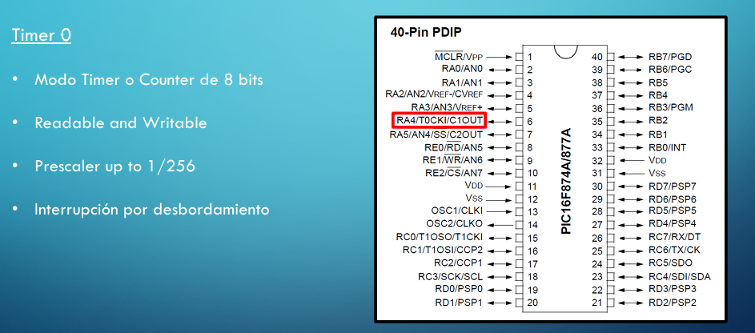
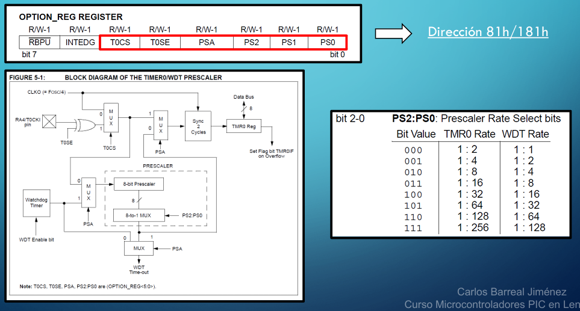
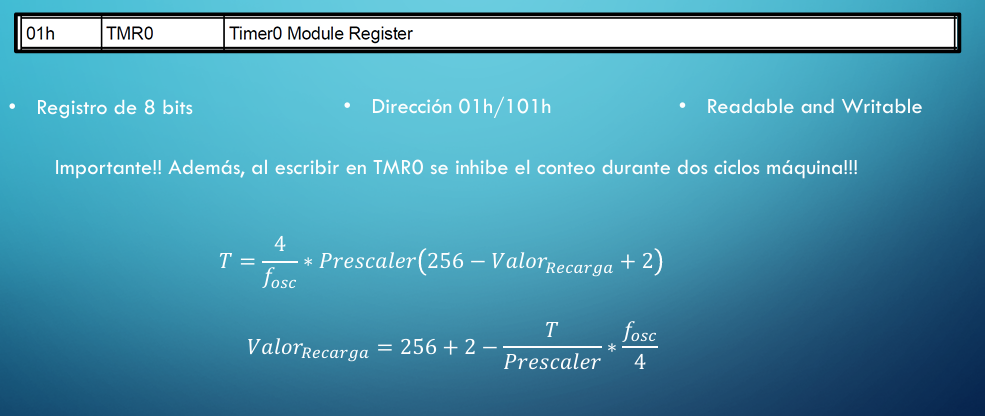
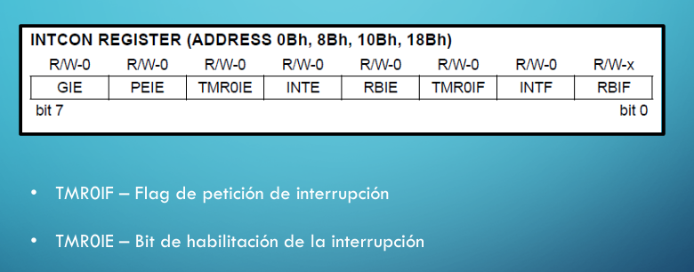
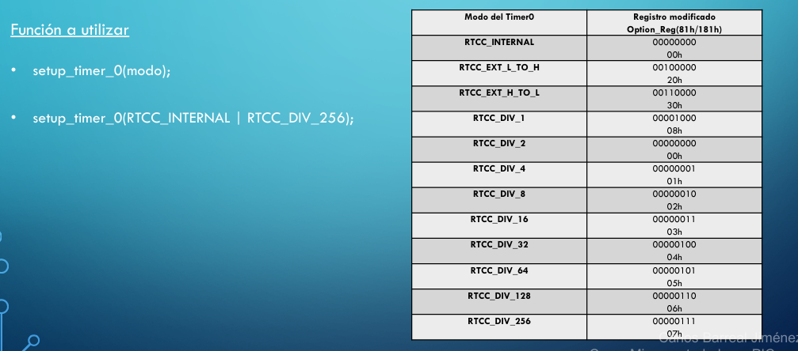
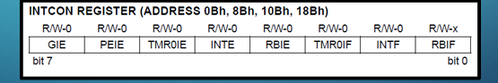
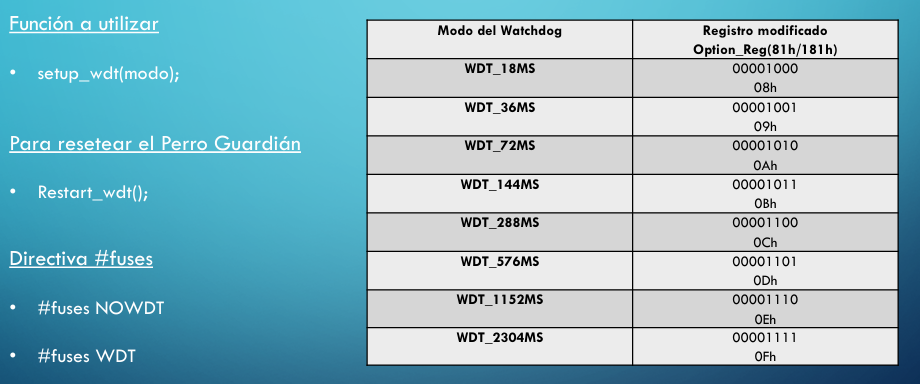

# Microcontroladores PIC - Timers / Counters

## Timer 0

- Este timer puede trabajar como temporizador o como contador
    - Si lo usamos para contar la frecuencia de nuestro oscilador interno se le llamará temporizador
    - Si utilizamos una serie de flancos externos que entran por la patilla 6 del micro (RA4 o T0CKI) se le llamará contador

- Podremos en todo momento leer o escribir en el registro de cuenta de 8 bits
- Utiliza un prescaler para dividir la frecuencia, puede dividirla hasta un máximo de 256
- También podemos decir que genera una interrupción por desbordamiento del registro de cuenta
- Para configurar el timer 0 debemos configurar los bits del registro OPTION_REG 
    - Dirección 81h o 181h
    - Los bits que nos importan son del 0 al 5
    - La elección del tipo de cuenta se hará con el bit 5 (T0CS)
        - Si está a 0 se contará con el oscilador interno
        - Si está a 1 se contará con pulsos externos
            - Para indicar siq usaremos contar esa señal externa con flancos de subida o de bajada utilizamos el registro T0SE (el bit 4)
            - Con un 0 será con flancos de subida
            - Con un 1 será con flancos de bajada
    - El bit 3 (PSA) asigna el prescaler a nuestro timer o al perro guardián
        - Este prescaler es compartido y excluyente
            - Si se lo asignamos al timer no podremos usarlo para el perro guardián y a la inversa
                - Con un 0 se lo asignamos al timer y con un 1 al perro guardián
    - Los bits 0,1 y 2 (PS0,PS1,PS2) sirven para configurar el prescaler
    - En la tabla de la derecha se ve como configurar estos bits para tener la división correspondiente

- Para la cuenta tenemos un registro de 8 bits, denominado TMR0 con la dirección 01h
- Podemos escribir y leer en este registro en cualquier momento
    - Cuando escribimos en él vamos a reiniciar el valor del prescaler y el fabricante nos dice que se inhibe el conteo durante dos ciclos máquina. El valor deseado a introducir en este registro se introduce en valor A2 (hay que restarle nuestro valor a 256, que es 2**8)
        - Para calcular este valor en función del periodo de nuestro oscilador y el prescaler se puede usar esta formula

- Para las interrupciones vamos al registro INTCON
    - El bit TMR0IF para el flag de petición de interrupción (que se activará por desbordamiento del registro de cuenta)
    - El bit TMR0IE, si está habilitado, hará que saltemos a la rutina de servicio de interrupción

## Timer 0 en C

- Para configurar el timer hay que escribir en el registro OPTION_REG
- Esto podemos hacerlo con setup_timer_0(modo)
    - Todos los modos disponibles están en la tabla de la figura
- Estos modos de funcionamiento se pueden juntar con una instrucción OR
- Si queremos trabajar con un timer interno y un presclaer de 256 podremos declararlo como aparece en la foto

- Para trabajar con el registro de guardado trabajamos con dos funciones
    - Set_timer0(int8 valor); //Donde valor es un entero de 8 bits
    - Valor=get_timer0(); //si queremos obtener el valor de cuenta usamos esta función
- Para trabajar con las interrupciones hay 2 bits a tener en cuenta en el registro INTCON, TMR0IE (habilitación de la interrupción) y TMR0IF (flag)

- Recordar que en el compilador CCS no es necesario borrar el flag del timer si utilizamos la directiva asociada a las interrupciones (#INT)
- Veamos como configurar el perro guardián
    - Para inicializarlo será con setup_wdt(modo), donde modo es el valor del prescaler
        - Los modos son los que se ven en la tabla
    - El perro guardián hay que resetearlo cada cierto tiempo, ya que si no nos hará un reset a todo el sistema
        - Para hacer esto usaremos Restart_wdt()
    - Hay que usar la directiva #fuses para indicar si queremos indicar el perro guardián o no

- Si en el editor CCS voy al archivo del PIC16F877A.h veré todas las funciones descritas anteriormente en el apartado //////////Timer 0
- Si bajamos un poco más en el archivo veremos ///// WDT (perro guardián)
    - Veremos las dos funciones mencionadas
        - setup_wdt(int16 mode);
        - restart_wdt(void);
- **Ejercicio**
    - Hacer parpadear un LED con el timer0 por interrupciones cada 1 segundo. Se deberá configurar el Timer0 para trabajar con el oscilador interno del micro y utiliza un prescaler de 4
