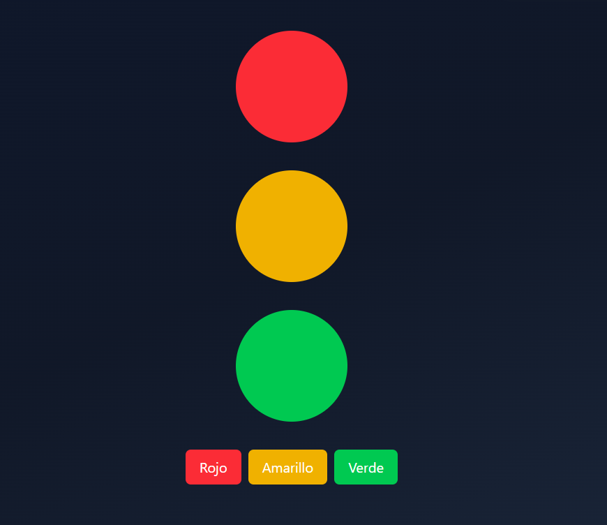

## Profundizando Hooks y React

- Vamos a analizar en profundidad useEffect ya que a veces es difícil de comprender en su totalidad y causa muchos efectos secundarios
- Comunicaremos múltiples customsHooks
- También trabajaremos con useRef
- Esto es solo la punta del iceberg

### Inicio de aplicación

> npm create vite

- Typescript + SWC

> npm i 

- Elimino lo que no necesito, dentro de src dejo solo el main y vite-env.d.ts
- Creo el componente src/HooksApp.tsx, uso el snippet rafc para crear el componente, y lo meto en el main

~~~js
import { StrictMode } from 'react'
import { createRoot } from 'react-dom/client'
import './index.css'
import { HooksApp } from './HooksApp'

createRoot(document.getElementById('root')!).render(
  <StrictMode>
    <HooksApp />
  </StrictMode>,
)
~~~

### Tailwind

> npm i tailwindcss @tailwindcss/vite

- Debo añadir el @tailwindcss/vite en el vite-config

~~~js
import { defineConfig } from 'vite'
import react from '@vitejs/plugin-react-swc'
import tailwindcss from '@tailwindcss/vite'

// https://vite.dev/config/
export default defineConfig({
  plugins: [react(), tailwindcss()],
})
~~~

- Añado @import a index.css

~~~css
@import 'tailwindcss';
~~~

- Ya tienes tailwind!
- Para probarlo

~~~jsx
export const HooksApp = () => {
  return (
    

        <h1 className="text-center text-red-800 text-2xl font-bold">
            HooksApp
        </h1>
        
    

  )
}
~~~

- Copio un gradiente que ha hecho Fernando y lo copio en index.css
- br es background right

~~~css
.bg-gradient {
  @apply bg-gradient-to-br from-slate-900 via-gray-900 to-slate-800 min-h-screen flex items-center justify-center p-4 text-white;
}
~~~

- Lo aplico al div de HooksApp

~~~js

export const HooksApp = () => {
  return (
    

        <h1 className="text-center font-bold text-red-800 text-2xl">
            HooksApp
        </h1>
    

  )
}
~~~

### useState - Estado que re-dibuja

- Creo el directorio src/01-useState
- Dentro coloco el TrafficLight.tsx

~~~js
export const TrafficLight = () => {

  return (
    

      

        

        

        

        {/* Botón para cambiar el estado de la luz */}
        

          <button
            className="bg-red-500 text-white px-4 py-2 rounded-md cursor-pointer">
            Rojo
          </button>
          <button
            className="bg-yellow-500 text-white px-4 py-2 rounded-md cursor-pointer">
            Amarillo
          </button>
          <button
            className="bg-green-500 text-white px-4 py-2 rounded-md cursor-pointer">
            Verde
          </button>
        

      

    

  );
};
~~~

- Lo renderizo en el main, quito el HooksApp
- Se ve algo así

- Para guardar el color en el que está mi semáforo creo un state
- Creo el objeto colors con los colores en tailwind
- Uso la interpolación de strings en los className de los divs del semáforo y hago la evaluación con un ternario
- Cambio el state desde los botones usando setLight

~~~js
import { useState } from "react";

export const TrafficLight = () => {

  const [light, setLight] = useState('red')

  const colors = {
    red: 'bg-red-500 animate-pulse',
    yellow: 'bg-yellow-500 animate-pulse',
    green: 'bg-green-500 animate-pulse'
  }

  return (
    

      

        

        

        

        {/* Botón para cambiar el estado de la luz */}
        

          <button
            className="bg-red-500 text-white px-4 py-2 rounded-md cursor-pointer"
            onClick={()=>setLight('red')}
            >
            Rojo
          </button>
          <button
            className="bg-yellow-500 text-white px-4 py-2 rounded-md cursor-pointer"
            onClick={()=>setLight('yellow')}
            >
            Amarillo
          </button>
          <button
            className="bg-green-500 text-white px-4 py-2 rounded-md cursor-pointer"
            onClick={()=>setLight('green')}
            >
            Verde
          </button>
        

      

    

  );
};
~~~

- Puedo tipar el state así

~~~js
const [light, setLight] = useState<'red' | 'yellow'| 'green'>('red')
~~~

- Para los objetos es preferible usar interfaces, pero para primitivos mejor usar tipos

~~~js
type TrafficLightColor = 'red' | 'yellow' | 'green'

//lo uso en el useState
const [light, setLight] = useState<TrafficLightColor>('red')
~~~

- Otra manera sería esta (usando el objeto colors)
- Es más flexible

~~~js
const colors = {
  red: 'bg-red-500 animate-pulse',
  yellow: 'bg-yellow-500 animate-pulse',
  green: 'bg-green-500 animate-pulse'
}

type TrafficLightColor = keyof typeof colors
~~~

### useEffect - Disparar efectos secundarios

- Cuando el semáforo está en verde espero que pasen los coches
- Es el efecto secundario de ponerse en verde
- Estos efectos secundarios son producto del useEffect
- Creo la carpeta 02-useEffect y copio el componente TrafficLight y lo nombro TrafficLightWithEffect
- Borro el div de los botones
- Lo renderizo en el main
- Creo una cuenta atrás con un useEffect i un setInterval
- Guardo el setInterval en una constante para poder limpiarlo y no se multiplique a si mismo con la llamada de múltiples useEffects
- Pongo el useEffect a escuchar el countdown en el arreglo de dependencias
- Pongo un return cuando el counter llega a 0

~~~js
import { useEffect, useState } from "react";

  const colors = {
    red: 'bg-red-500 animate-pulse',
    yellow: 'bg-yellow-500 animate-pulse',
    green: 'bg-green-500 animate-pulse'
  }

  type TrafficLightColor = keyof typeof colors

export const TrafficLightWithEffect = () => {

  const [light, setLight] = useState<TrafficLightColor>('red')
  const [countdown, setCountdown] = useState(5)
 
  useEffect(() => {

    if(countdown === 0) return

    const intervalId = setInterval(()=>{
      setCountdown(prev =>prev -1)
    }, 1000)

    return ()=>{
      clearInterval(intervalId)
    }

  }, [countdown])
  

  return (
    

      

        <h1 className="text-2xl text-white font-thin">
          Semáforo con useEffect
        </h1>
        <h2 className="text-white text-2xl">
          {countdown}
        </h2>
        

        

        

      

    

  );
};
~~~

- Ahora quiero que cuando pasen los 5 segundos pase a verde y vuelva a contar 5 segundos y pase a amarillo
- Yo podría usar solo un useEffect para esto de esta manera

~~~js
 const [light, setLight] = useState<TrafficLightColor>('red')
  const [countdown, setCountdown] = useState(5)
 
  useEffect(() => {

    if(countdown === 0){

      setCountdown(5)

      if(light==='red'){
        setLight('green')
        return
      }
      if(light==='yellow'){
        setLight('red')
        return
      }
      if(light==='green'){
        setLight('yellow')
        return
      }
      return
    }
  }, [countdown, light]) //debo poner light también si cambio el estado
~~~

- Pero es recomendable que los efectos tengan solo una tarea en específico
- En este caso resetear el countdown

~~~js
useEffect(() => {
  if(countdown === 0) return
  
  const intervalId = setInterval(()=>{
    setCountdown((prev)=>prev-1)
  }, 1000)

  return()=>{

    clearInterval(intervalId)
  }
}, [countdown])
~~~

- Ahora para cambiar el color

~~~js
  useEffect(()=>{
     if(countdown === 0){

      setCountdown(5)

      if(light==='red'){
        setLight('green')
        return
      }
      if(light==='yellow'){
        setLight('red')
        return
      }
      if(light==='green'){
        setLight('yellow')
        return
      }
      return
    }
  }, [countdown, light])
~~~

- Mostremos una barra de proceso

~~~jsx
 return (
    

      

        <h1 className="text-2xl text-white font-thin">
          Semáforo con useEffect
        </h1>
        <h2 className="text-white text-2xl">
          {countdown}
        </h2>
        

          

        

        

        

        

      

    

  );
~~~

- TrafficLightWithEffect tiene mucha lógica, hagamos un customHook
- Creo en 02-useEffect/hooks/useTrafficLight.tsx

~~~js
import { useEffect, useState } from "react"

 const colors = {
    red: 'bg-red-500 animate-pulse',
    yellow: 'bg-yellow-500 animate-pulse',
    green: 'bg-green-500 animate-pulse'
  }

  type TrafficLightColor = keyof typeof colors

export const useTrafficLight = () => {

  const [light, setLight] = useState<TrafficLightColor>('red')
  const [countdown, setCountdown] = useState(5)
     
      useEffect(() => {
        if(countdown === 0) return
        
        const intervalId = setInterval(()=>{
          setCountdown((prev)=>prev-1)
        }, 1000)
    
        return()=>{
    
          clearInterval(intervalId)
        }
      }, [countdown])
    
    
      useEffect(()=>{
         if(countdown === 0){
    
          setCountdown(5)
    
          if(light==='red'){
            setLight('green')
            return
          }
          if(light==='yellow'){
            setLight('red')
            return
          }
          if(light==='green'){
            setLight('yellow')
            return
          }
          return
        }
      }, [countdown, light])

    return {
        colors,
        light,
        countdown

  }
}
~~~

- Para usarlo solo tengo que usar la desestructuración dentro del componente TrafficLightWithEffect

~~~js
const {light, colors, countdown} =useTrafficLight()
~~~

- Puedo añadir nuevas propiedades al hook en el return

~~~js
return {
      colors,
      light,
      countdown,
      percentage: (countdown/ 5) * 100,
      greenLight: light === 'green' ? colors.green: 'bg-gray-500',
      yellowLight: light === 'yellow' ? colors.yellow: 'bg-gray-500',
      redLight: light === 'red' ? colors.red: 'bg-gray-500',

}
~~~

- Para usarlo en el componente

~~~js
import { useTrafficLight } from "./hooks/useTrafficLight";

export const TrafficLightWithEffect = () => {

  const {light, colors, countdown, percentage, greenLight, yellowLight, redLight} =useTrafficLight()
  

  return (
    

      

        <h1 className="text-2xl text-white font-thin">
          Semáforo con useEffect
        </h1>
        <h2 className="text-white text-2xl">
          {countdown}
        </h2>
        

          

        

        

        

        

      

    

  );
};
~~~

### Conectar varios customHooks entre si

- Creo en src 03-examples/PokemonPage.tsx

~~~jsx
export const PokemonPage = () => {
  return (
    

      <h1 className="text-2xl font-thin text-white">Pokémon</h1>
      <h3 className="text-xl font-bold text-white">#001 Bulbasaur</h3>
      

      

        
        <button className="bg-blue-500 text-white px-4 py-2 rounded-md cursor-pointer">
          Anterior
        </button>
        
        <button className="bg-blue-500 text-white px-4 py-2 rounded-md cursor-pointer">
          Siguiente
        </button>
       
      

    

  );
};
~~~

- Lo renderizo en el main
- Me muestra esto en el navegador (sin funcionalidad)

- En la img bien puedo usar un contador para ir cambiando de imagen, pero para traer el nombre tengo que hacer una petición a la API
- Enfoquémonos en el contador
- Creo otro hook 

~~~js
import { useState } from "react"

export const useCounter = (initialValue: number = 1) => {
  
    const [counter, setCounter] = useState(initialValue)

    const increment = ()=>{
        setCounter(counter+1)
    }

    const decrement = ()=>{
        if(counter <=1) return
        setCounter(counter-1)
    }

    return{
        counter,
        increment,
        decrement
    }
}
~~~

- Desestructuro del hook, uso backticks para incluir el counter en la URL, uso las funciones de decrementar e incrementar en el onClick de los botones

~~~js

import { useCounter } from "./hooks/useCounter";

export const PokemonPage = () => {

  const {counter, increment, decrement} = useCounter()

  return (
    

      <h1 className="text-2xl font-thin text-white">Pokémon</h1>
      <h3 className="text-xl font-bold text-white">#{counter} Bulbasaur</h3>
      

      

        
        <button className="bg-blue-500 text-white px-4 py-2 rounded-md cursor-pointer"
        onClick={decrement}
        > 
        Anterior
        </button>
        
        <button className="bg-blue-500 text-white px-4 py-2 rounded-md cursor-pointer"
        onClick={increment}
        >
        Siguiente
        </button>
       
      

    

  );
};
~~~

- Vamos con el usePokemon para traernos el nombre
- Si hago un fetch dentro de un useEffect tengo que usar el .then porque no puedo usar async (async devuelve una promesa, el useEffect no puede devolver una promesa, no es lo que React espera)
- Me creo una función externa getPokemonById (si esta función no necesita reaccionar basado en los cambios de estado en React puede ponerse fuera del componente/customHook)
- No es conveniente mandar funciones sin memorizar como dependencias del useEffect (en este caso el getPokemonById) para que no se re-renderice constantemente

~~~js
import { useState } from "react"

interface Pokemon{
    id: number
    name: string
    imageUrl: string
}

interface Props{
    id: number
}

export const usePokemon = ({id}: Props) => {
    
    const [pokemon, setPokemon] = useState<Pokemon | null>(null)

    const getPokemonById = async (id: number)=>{
        const response = await fetch(`https://pokeapi.co/api/v2/pokemon/${id}`)
        const data = await response.json()

        setPokemon({
            id: id,
            name: data.name,
            imageUrl: `https://raw.githubusercontent.com/PokeAPI/sprites/master/sprites/pokemon/${id}.png`
        })
    }

   useEffect(()=>{
        getPokemonById(id)
    }, [id])

    return {
        pokemon
    }
}
~~~

- En el PokemonPage hago la conexión entre ambos hooks
  - Le paso el counter como id
- Uso el pokemon.name en el h3

~~~js

import { useCounter } from "./hooks/useCounter";
import { usePokemon } from "./hooks/usePokemon";

export const PokemonPage = () => {

  const {counter, increment, decrement} = useCounter()
  const {pokemon} = usePokemon({id: counter})

  return (
    

      <h1 className="text-2xl font-thin text-white">Pokémon</h1>
      <h3 className="text-xl font-bold text-white">#{counter} {pokemon?.name}</h3>
      

      

        
        <button className="bg-blue-500 text-white px-4 py-2 rounded-md cursor-pointer"
        onClick={decrement}
        >
          Anterior
        </button>
        
        <button className="bg-blue-500 text-white px-4 py-2 rounded-md cursor-pointer"
        onClick={increment}
        >
          Siguiente
        </button>
       
      

    

  );
};
~~~

- El useCounter se encarga de cambiar un número, el usePokemon de traer la info de la API
- Este uso colaborativo de hooks es fácil y potente
- react renderiza de arriba a abajo, por lo que es conveniente que el hook que proporciona información a otro esté encima del que la recibe
- Cada vez que el id cambia se vuelve a detonar el useEffect de usePokemon
- Para mejorar el comportamiento creo un state con isLoading en usePokemon
- usePokemon.tsx

~~~js
const [isLoading, setIsLoading] = useState(true)

const getPokemonById = async (id: number)=>{
    setIsLoading(true)
    const response = await fetch(`https://pokeapi.co/api/v2/pokemon/${id}`)
    const data = await response.json()

    setPokemon({
        id: id,
        name: data.name,
        imageUrl: `https://raw.githubusercontent.com/PokeAPI/sprites/master/sprites/pokemon/${id}.png`
    })

    setIsLoading(false)
}
~~~

- Devuelvo el isLoading en el return del usePokemon
- En PokemonPage

~~~js

import { useCounter } from "./hooks/useCounter";
import { usePokemon } from "./hooks/usePokemon";

export const PokemonPage = () => {

  const {counter, increment, decrement} = useCounter()
  const {pokemon, isLoading} = usePokemon({id: counter})

  if(isLoading){
    return(
       

        <h1 className="text-2xl font-thin text-white">Pokémon</h1>
        <h3 className="text-xl font-bold text-white">
        Cargando...
        </h3>
      

    )
  }

  return (
    

      <h1 className="text-2xl font-thin text-white">Pokémon</h1>
      <h3 className="text-xl font-bold text-white">#{counter} {pokemon?.name}</h3>
      

      

        
        <button className="bg-blue-500 text-white px-4 py-2 rounded-md cursor-pointer"
        onClick={decrement}
        >
          Anterior
        </button>
        
        <button className="bg-blue-500 text-white px-4 py-2 rounded-md cursor-pointer"
        onClick={increment}
        >
          Siguiente
        </button>
       
      

    

  );
};
~~~

- Para sacar el id del pokemon y mostrarlo en pantalla, lo formateo en el return de usePokemon

~~~js
return {
      pokemon,
      isLoading,                 //padStart para que añada 3 ceros al principio 
      formattedId: id.toString().padStart(3,'0') 
  }
~~~

- En PokemonPage lo desestructuro

~~~js
const {pokemon, isLoading, formattedId} = usePokemon({id: counter})
~~~

- Se lo añado al h3

~~~js
 return (
    

      <h1 className="text-2xl font-thin text-white">Pokémon</h1>
      <h3 className="text-xl font-bold text-white">#{formattedId} {pokemon?.name}</h3>
      
      {...code}
 )
~~~

### useRef - valor que no dispara re-render

- Creo 04-useRef/FocusScreen.tsx
- El inputRef tiene que estar inicializado en null, porque el componente html al que quiero referenciar todavía no está referenciado por React (el componente input está más abajo de la declaración del useRef)
- Cuando hago clic en el botón quiero darle el foco al input (que tiene el autoFocus, lo que le pone el foco automáticamente)
- Al tipar el ref como HTMLInputElement dispongo de todos los métodos en el intellisense
- .select es similar al focus pero remarca el texto

~~~js
import { useRef } from "react"

export const FocusScreen = () => {

    const inputRef = useRef<HTMLInputElement>(null)

    const handleClick = ()=>{
        inputRef.current?.select()
    }

  return (
    

        <h1 className="text-2xl font-thin text-white">Focus Screen</h1>
        <input 
        ref={inputRef}
        type="text" 
        className="bg-white text-black rounded-md px-4 py-2"
        autoFocus
        />

        <button
        className="bg-blue-500 px-4 py-2 rounded-md cursor-pointer"
        onClick={handleClick}
        >Set focus</button>
    

  )
}
~~~