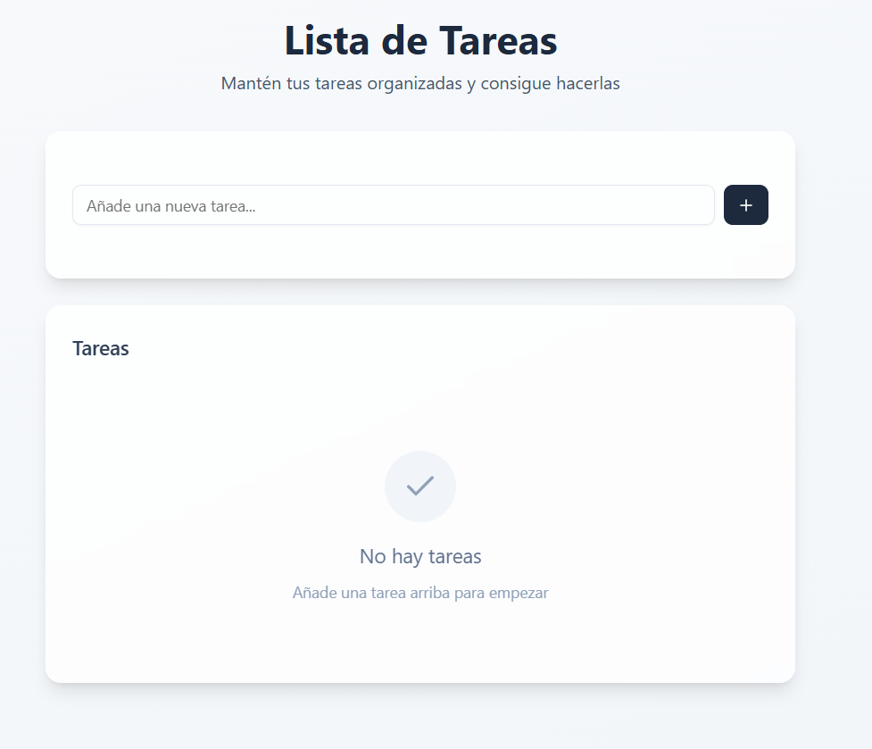
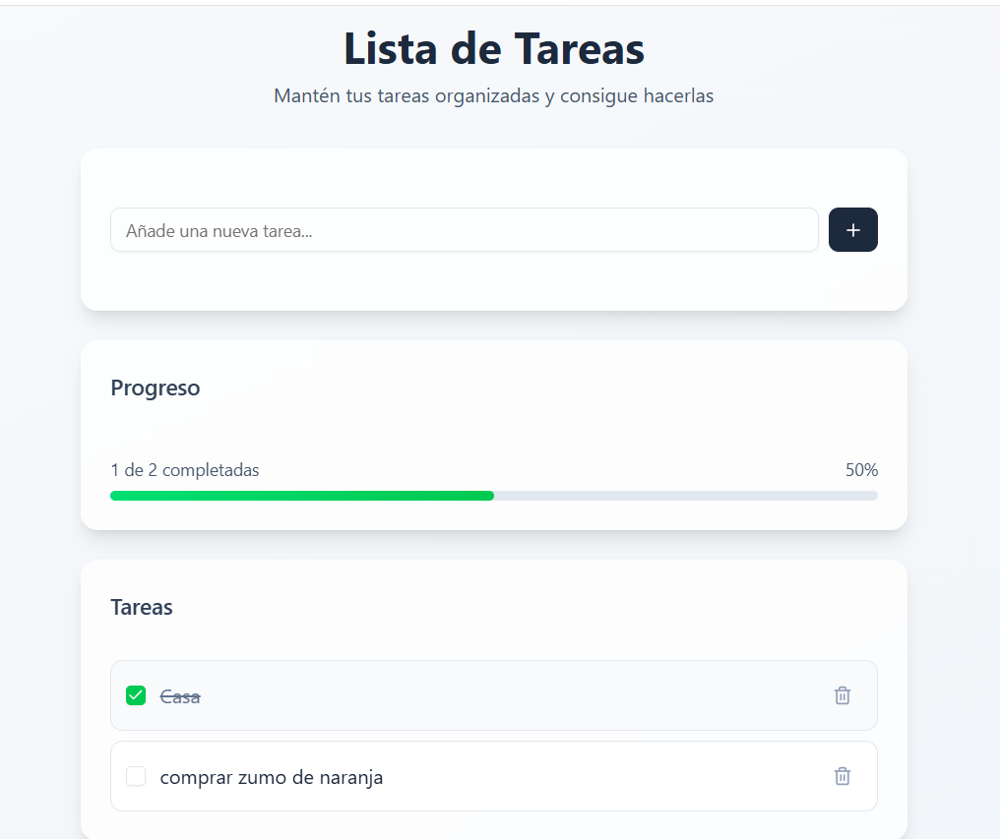
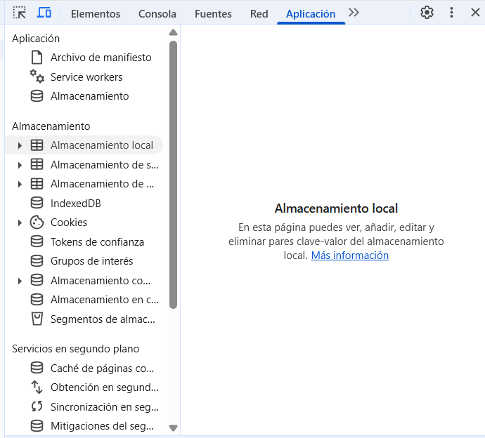
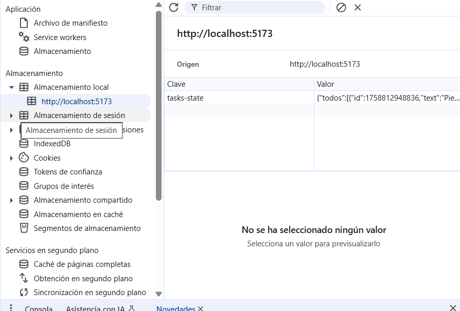
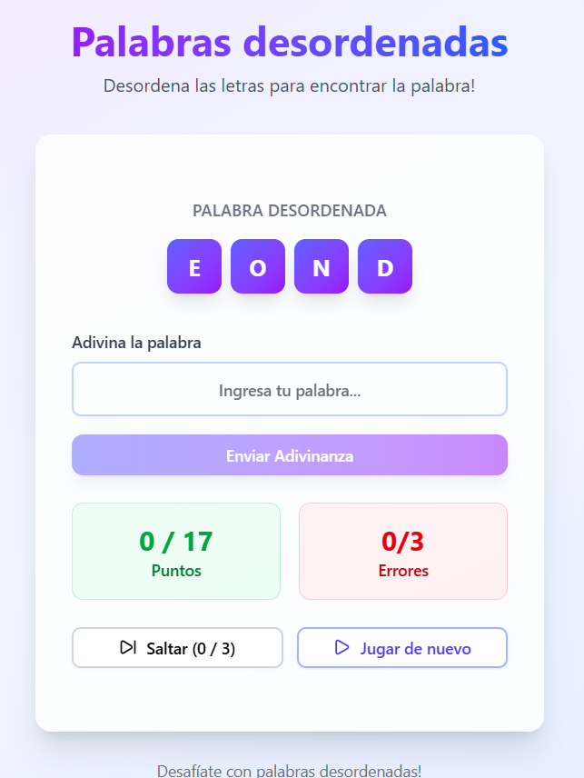

## useReducer

- Copio este componente en 05-useReducer/TaskApp.tsx

~~~jsx
import { useState } from 'react';

import { Plus, Trash2, Check } from 'lucide-react';

import { Button } from '@/components/ui/button';
import { Input } from '@/components/ui/input';
import { Checkbox } from '@/components/ui/checkbox';
import { Card, CardContent, CardHeader, CardTitle } from '@/components/ui/card';

interface Todo {
  id: number;
  text: string;
  completed: boolean;
}

export const TasksApp = () => {
  const [todos, setTodos] = useState<Todo[]>([]);
  const [inputValue, setInputValue] = useState('');

  const addTodo = () => {
    console.log('addTodo')
  };

  const toggleTodo = (id: number) => {
    console.log('Cambiar de true a false', id);

  };

  const deleteTodo = (id: number) => {
    console.log('Eliminar tarea', id);

  };

  const handleKeyPress = (e: React.KeyboardEvent) => {
    console.log('Presiono enter');

  };

  const completedCount = todos.filter((todo) => todo.completed).length;
  const totalCount = todos.length;

  return (
    

      

        

          <h1 className="text-4xl font-bold text-slate-800 mb-2">
            Lista de Tareas
          </h1>
          

            Mantén tus tareas organizadas y consigue hacerlas
          

        

        <Card className="mb-6 shadow-lg border-0 bg-white/80 backdrop-blur-sm">
          <CardContent className="p-6">
            

              <Input
                placeholder="Añade una nueva tarea..."
                value={inputValue}
                onChange={(e) => setInputValue(e.target.value)}
                onKeyDown={handleKeyPress}
                className="flex-1 border-slate-200 focus:border-slate-400 focus:ring-slate-400"
              />
              <Button
                onClick={addTodo}
                className="bg-slate-800 hover:bg-slate-700 text-white px-4"
              >
                <Plus className="w-4 h-4" />
              </Button>
            

          </CardContent>
        </Card>

        {totalCount > 0 && (
          <Card className="mb-6 shadow-lg border-0 bg-white/80 backdrop-blur-sm">
            <CardHeader className="pb-3">
              <CardTitle className="text-lg font-semibold text-slate-700">
                Progreso
              </CardTitle>
            </CardHeader>
            <CardContent className="pt-0">
              

                
                  {completedCount} de {totalCount} completadas
                
                {Math.round((completedCount / totalCount) * 100)}%
              

              

                

              

            </CardContent>
          </Card>
        )}

        <Card className="shadow-lg border-0 bg-white/80 backdrop-blur-sm">
          <CardHeader>
            <CardTitle className="text-lg font-semibold text-slate-700">
              Tareas
            </CardTitle>
          </CardHeader>
          <CardContent>
            {todos.length === 0 ? (
              

                

                  <Check className="w-8 h-8 text-slate-400" />
                

                
No hay tareas

                

                  Añade una tarea arriba para empezar
                

              

            ) : (
              

                {todos.map((todo) => (
                  

                    <Checkbox
                      checked={todo.completed}
                      onCheckedChange={() => toggleTodo(todo.id)}
                      className="data-[state=checked]:bg-green-500 data-[state=checked]:border-green-500"
                    />
                    
                      {todo.text}
                    
                    <Button
                      variant="ghost"
                      size="sm"
                      onClick={() => deleteTodo(todo.id)}
                      className="text-slate-400 hover:text-red-500 hover:bg-red-50 h-8 w-8 p-0"
                    >
                      <Trash2 className="w-4 h-4" />
                    </Button>
                  

                ))}
              

            )}
          </CardContent>
        </Card>
      

    

  );
};
~~~

- Usaremos https://ui.shadcn.com/
- En la documentación  selecciono Vite (aunque esté trabajando con React)
- En el tsconfig.json añado compilerOptions

~~~json
{
  "files": [],
  "references": [
    { "path": "./tsconfig.app.json" },
    { "path": "./tsconfig.node.json" }
  ],
  "compilerOptions": {
    "baseUrl": ".",
    "paths": {
      "@/*": ["./src/*"]
    }
  }
}
~~~

- Esto apunta al src y nos permitirá hacer las importaciones solo con @/
- Debo hacer lo mismo en el tsconfig.app.json

~~~json
{
  "compilerOptions": {
     "baseUrl": ".",
    "paths": {
      "@/*": ["./src/*"]
    },
    "tsBuildInfoFile": "./node_modules/.tmp/tsconfig.app.tsbuildinfo",
    "target": "ES2020",
    "useDefineForClassFields": true,
    "lib": ["ES2020", "DOM", "DOM.Iterable"],
    "module": "ESNext",
    "skipLibCheck": true,

    /* Bundler mode */
    "moduleResolution": "bundler",
    "allowImportingTsExtensions": true,
    "verbatimModuleSyntax": true,
    "moduleDetection": "force",
    "noEmit": true,
    "jsx": "react-jsx",

    /* Linting */
    "strict": true,
    "noUnusedLocals": true,
    "noUnusedParameters": true,
    "erasableSyntaxOnly": true,
    "noFallthroughCasesInSwitch": true,
    "noUncheckedSideEffectImports": true
  },
  "include": ["src"]
}
~~~

- Debo instalar los tipos de typescript

> npm i -D @types/node

- En vite.config debo importar path

~~~js
import path from 'path'
import { defineConfig } from 'vite'
import react from '@vitejs/plugin-react-swc'
import tailwindcss from '@tailwindcss/vite'

// https://vite.dev/config/
export default defineConfig({
  plugins: [react(), tailwindcss()],
  resolve:{
    alias:{
      "@": path.resolve(__dirname, "./src")
    }
  }
})
~~~

- Ahora ya puedo hacer la inicialización (debo tener configurado tailwind en vite)

> npx shadcn@latest init

- Selecciono el tema Neutral
- En el index.css me hace todo el css automáticamente
- Para importar un botón uso este comando

> npx shadcn@latest add button

- Crea la carpeta components/ui/ con los componentes
- Si pongo el comando solo hasta el add puedo seleccionar en consola los componentes
- Si renderizo TaskApp en el main debería ver algo así

### ShadcnUI

- @radix-ui nos permite tener la funcionalidad de algo sin necesidad de un estilo. Es un headless component library
- Solo importamos lo que necesitamos
- En lib/utils encontramos una función que le ayuda a Tailwind poder construir las clases apropiadamente cuando las sobreescribo
- Otras librerías ui son v0.dev y Lovable

### Lista de tareas con useState

~~~js
const addTodo = () => {
    if(inputValue.length === 0) return

    const newTodo: Todo ={
      id: Date.now(),
      text: inputValue.trim(),
      completed: false
    }

    setTodos([...todos, newTodo])
    setInputValue('')
  };
~~~

- Cada vez que toco el Enter se detona el handleKeyPress
- Para encontrar el tipo del evento defino el método y sitúo el cursor encima de e

~~~js
  <Input
    placeholder="Añade una nueva tarea..."
    value={inputValue}
    //situar el cursor encima de la e de event
    onChange={(e) => setInputValue(e.target.value)}
    onKeyDown={handleKeyPress}
    className="flex-1 border-slate-200 focus:border-slate-400 focus:ring-slate-400"
  />
~~~

- En este caso es un 

~~~js
e: React.ChangeEvent<HTMLInputElement>
~~~

- Se detona el handleKeyExpress cuando presiono una tecla
- Evalúo que sea Enter

~~~js
const handleKeyPress = (e: React.KeyboardEvent) => {
    if(e.key === 'Enter'){
      addTodo()
    }
};
~~~

- Ya añadimos un Todo a la lista de tareas
- Para eliminar un todo filtramos

~~~js
const deleteTodo = (id: number) => {
    const updatedTodos = todos.filter((todo)=> todo.id != id )
    setTodos(updatedTodos)
};
~~~

- Para marcar un todo como hecho

~~~js
const toggleTodo = (id: number) => {
  const updatedTodos = todos.map((todo)=>{
    if(todo.id === id){
      return {...todo, completed: !todo.completed}
    }
    return todo
  })

  setTodos(updatedTodos)

};
~~~

- Luce algo así

- Para manejar estados "compuestos" o complejos es importante entender el useReducer

### Patrón Reducer

- Creo la carpeta reducer en 05-useReducer/tasks.reducer.ts
- Un reducer debe regresar siempre un estado nuevo basado en los argumentos
- Regresa siempre un estado del mismo tipo que el que le es pasado como argumento
- La action nos va a ofrecer poder determinar un nuevo estado y no modificar el estado en si
- La action usa el state actual para determinar un nuevo estado
- Al argumento de la acción se le conoce como payload
  - Para el ADD_TODO necesito el string del input
  - Para el toggle y borrar necesito el id (un número)

~~~js
interface Todo {
  id: number;
  text: string;
  completed: boolean;
}

interface TaskState{
    todos: Todo[]
    length: number
    completed: number
    pending: number
}

type TaskAction = 
|    {type: 'ADD_TODO', payload: string} //De payload el texto del input 
|    {type: 'TOGGLE_TODO', payload: number} //voy a necesitar el id para el toggle
|    {type: 'DELETE_TODO', payload: number} //también pata borrar el todo

export const taskReducer = (state: TaskState, action: TaskAction): TaskState=>{

    return state
}
~~~

- Para hacer el toggle necesito el id del todo

### Configuración de la función reducer

- Cuando trabajamos con un reducer es común usar un switch
- Hago el spread del state (con pending, completed, length) y defino todos
- En el state tengo state.todos
- En el action tengo action.payload

~~~js
export const taskReducer = (state: TaskState, action: TaskAction): TaskState=>{

    switch (action.type) {
        case 'ADD_TODO':{
          const newTodo: Todo ={
             id: Date.now(),
             text: action.payload.trim(),
             completed: false
            }

            return {
                ...state, //si hubieran objetos anidados habría que usar structuredClone
                todos:[...state.todos, newTodo]
            };
        }

        case 'DELETE_TODO':
            return {
                ...state,
                todos: state.todos.filter(todo=> todo.id !== action.payload)
            }  

        case 'TOGGLE_TODO':{
          const updatedTodos = state.todos.map((todo)=>{
            if(todo.id === action.payload){
                return {...todo, completed: !todo.completed}
            }
            return todo
            });
            return{
                ...state,
                todos: updatedTodos
            }
        }    

        default:
            return state
    }
    return state
}
~~~

- Como es importante devolver un arreglo puedo usar todos los métodos que devuelven un arreglo (.map, filter...)
- El reducer es un patrón agnóstico, puede estar en Vue, Angular, Python, C#, etc
- En el reducer falta pasar en el return el length, completed, etc

### Solución a la tarea

- El length, los pendings y completed cambian en el caso de add_todo
- En el caso de toggle_todo el length no cambia pero pending y completed si
- En delete cambia el length y uso .filter para saber los pendings y completed declarando el arreglo fuera del return

~~~js
export const taskReducer = (state: TaskState, action: TaskAction): TaskState=>{

    switch (action.type) {
        case 'ADD_TODO':{
          const newTodo: Todo ={
             id: Date.now(),
             text: action.payload.trim(),
             completed: false
            }

            return {
                ...state, //si hubieran objetos anidados habría que usar structuredClone
                todos:[...state.todos, newTodo],
                length: state.todos.length +1,
                pending: state.pending +1
            };
        }
        case 'DELETE_TODO':{

           const currentTodos = state.todos.filter(todo=> todo.id !== action.payload)

            return {
                ...state,
                length: currentTodos.length,
                completed: currentTodos.filter(todo=> todo.completed).length ,
                pending: currentTodos.filter(todo=> !todo.completed).length,
                todos: currentTodos
            }  
        }
        case 'TOGGLE_TODO':{
          const updatedTodos = state.todos.map((todo)=>{
            if(todo.id === action.payload){
                return {...todo, completed: !todo.completed}
            }
            return todo
            });
            return{
                ...state,
                completed: updatedTodos.filter(todo=> todo.completed).length ,
                pending: updatedTodos.filter(todo=> !todo.completed).length,
                todos: updatedTodos
            }
        }
        
        default:
            return state
    }
}
~~~

- Esto es lo que vamos a consumir con el hook useReducer!

### Controlar estados complejos - useReducer

- Cuando hay muchos useState o muchos cambios en un estado complejo se presta a un useReducer
- O un gestor de estado (Zustand)
- El useReducer tiene un prevState, un intialState y los ..args (actions)
- Creo una función con el initial state (que sea una función nos ayudará luego al conectar el localStorage)
- task.reducer.ts

~~~js
export const getTasksInitialState = (): TaskState=>{
    return{
        todos: [],
        completed: 0,
        pending:0,
        length: 0
    }
}
~~~

- En TaskApp.tsx desestructuro del useReducer el state y el dispatch, que es una función que usaré para generar un nuevo state

~~~js
const [state, dispatch] = useReducer(taskReducer, getTasksInitialState())
~~~

- Para no refactorizar todo el código podemos desestructurar los valores del state
- Los renombro para no tocar el código ya escrito en el jsx

~~~js
const {todos, completed: completedCount, pending, length:totalCount} = state
~~~

- Ahora faltan los métodos, que debo llamarlos con el dispacth
- TaskApp.tsx

~~~js
export const TasksApp = () => {
  
  const [state, dispatch] = useReducer(taskReducer, getTasksInitialState())

  const [inputValue, setInputValue] = useState('');

  const {todos, completed: completedCount, pending, length:totalCount} = state

  const addTodo = ()=>{
    if(inputValue.length===0) return 

    dispatch({type: 'ADD_TODO', payload: inputValue})

    setInputValue('')
  }

  const toggleTodo = (id: number)=>{
    dispatch({type: 'TOGGLE_TODO', payload: id})
  }

  const deleteTodo = (id: number)=>{
    dispatch({type:'DELETE_TODO', payload: id})
  }

  const handleKeyPress = (e: React.KeyboardEvent) => {
    if(e.key === 'Enter'){
      addTodo()
    }
};
return(...)
}
~~~

### Persistencia local - LocalStorage

- En la consola de navegación, en Aplicación tenemos el localStorage

- En almacenamiento local, de sesión y de extensiones se almacenan objetos llave con valor (siempre es string)
- En este caso, toda aplicación que pase por el localhost y el mismo puerto va a poder acceder
- El session storage se purga cuando el navegador se cierra, no como el localStorage, que permanece hasta que se limpia
- Lo que se grabe ahí es visible para los usuarios por lo que no se debe guardar información sensible
- Hay también unas DB (IndexedDB, Tokens de confianza, etc)
- Las cookies lo que hacen es cuando se hace una petición HTTP , las cookies viajan hacia el servidor y puede retornar contenido personalizado
- Cada vez que cambie el state quiero grabarlo en el localStorage
  - Lo haré con un useEffect que esté pendiente de este state 

~~~js
useEffect(()=>{
  localStorage.setItem('tasks-state', JSON.stringify(state))
}, [state])
~~~

- En el getTaskInitialState puedo leer del localStorage si hay algún valor
- Luego validaremos que no venga manipulado
- task.reducer.ts

~~~js

export const getTasksInitialState = (): TaskState=>{

    const localStorageState = localStorage.getItem('tasks-state')

    if(!localStorageState){
        return{
            todos: [],
            completed: 0,
            pending:0,
            length: 0
        }
    }
    //aqui hay que tener cuidado pues puede haber sido manipulado
    return JSON.parse(localStorageState)//parseo el string a objeto
}
~~~

### Validadores de objetos - Zod

- Yup es otro
- Usaremos Zod. Se importa todo como z

> npm i zod

- task.reducer.ts

~~~js
import * as z from 'zod'
~~~

- Creo los objetos de validación fuera del reducer

~~~js

const TodoSchema = z.object({
    id: z.number(),
    text: z.string(),
    completed: z.boolean()

})

const TaskStateScheme = z.object({
    todos: z.array(TodoSchema),
    length: z.number(),
    completed: z.number(),
    pending: z.number()
})
~~~

- En getTaskInitialState (función que también está fuera del TaskReducer) hago la evaluación

~~~js
export const getTasksInitialState = (): TaskState=>{

    const localStorageState = localStorage.getItem('tasks-state')

    if(!localStorageState){
        return{
            todos: [],
            completed: 0,
            pending:0,
            length: 0
        }
    }
                        //zod no hace la conversión, hay que parsear lo que recibo
    const result = TaskStateScheme.safeParse(JSON.parse(localStorageState))
    if(result.error){
        return{
            todos: [],
            completed: 0,
            pending:0,
            length: 0
        }
    }

    return result.data
}
~~~

### Palabras revueltas

- Copio este componente dentro de 05-useReducer

~~~js
// ! Importante:
// Es necesario componentes de Shadcn/ui
// https://ui.shadcn.com/docs/installation/vite

import React, { useState } from 'react';
import { Button } from '@/components/ui/button';
import { Input } from '@/components/ui/input';
import { Card, CardContent } from '@/components/ui/card';
import { SkipForward, Play } from 'lucide-react';

const GAME_WORDS = [
  'REACT',
  'JAVASCRIPT',
  'TYPESCRIPT',
  'HTML',
  'ANGULAR',
  'SOLID',
  'NODE',
  'VUEJS',
  'SVELTE',
  'EXPRESS',
  'MONGODB',
  'POSTGRES',
  'DOCKER',
  'KUBERNETES',
  'WEBPACK',
  'VITE',
  'TAILWIND',
];

// Esta función mezcla el arreglo para que siempre sea aleatorio
const shuffleArray = (array: string[]) => {
  return array.sort(() => Math.random() - 0.5);
};

// Esta función mezcla las letras de la palabra
const scrambleWord = (word: string = '') => {
  return word
    .split('')
    .sort(() => Math.random() - 0.5)
    .join('');
};

export const ScrambleWords = () => {
  const [words, setWords] = useState(shuffleArray(GAME_WORDS));

  const [currentWord, setCurrentWord] = useState(words[0]);
  const [scrambledWord, setScrambledWord] = useState(scrambleWord(currentWord));
  const [guess, setGuess] = useState('');
  const [points, setPoints] = useState(0);
  const [errorCounter, setErrorCounter] = useState(0);
  const [maxAllowErrors, setMaxAllowErrors] = useState(3);

  const [skipCounter, setSkipCounter] = useState(0);
  const [maxSkips, setMaxSkips] = useState(3);

  const [isGameOver, setIsGameOver] = useState(false);

  const handleGuessSubmit = (e: React.FormEvent) => {
    // Previene el refresh de la página
    e.preventDefault();
    // Implementar lógica de juego
    console.log('Intento de adivinanza:', guess, currentWord);

  };

  const handleSkip = () => {
    console.log('Palabra saltada');

    
  };

  const handlePlayAgain = () => {
    console.log('Jugar de nuevo');
    
  };

  //! Si ya no hay palabras para jugar, se muestra el mensaje de fin de juego
  if (words.length === 0) {
    
    return (
      

        

          <h1 className="text-4xl font-bold bg-gradient-to-r from-purple-600 to-blue-600 bg-clip-text text-transparent mb-2">
            Palabras desordenadas
          </h1>
          
No hay palabras para jugar

           
          
Puntaje: {points}

           
          
Errores: {errorCounter}

           
          
Saltos: {skipCounter}

           
          <Button onClick={handlePlayAgain}>Jugar de nuevo</Button>
        

      

    );
  }

  return (
    

      

        {/* Header */}
        

          <h1 className="text-4xl font-bold bg-gradient-to-r from-purple-600 to-blue-600 bg-clip-text text-transparent mb-2">
            Palabras desordenadas
          </h1>
          

            Desordena las letras para encontrar la palabra!
          

        

        {/* Main Game Card */}
        <Card className="backdrop-blur-sm bg-white/80 border-0 shadow-xl">
          <CardContent className="p-8">
            {/* Scrambled Word Display */}
            

              <h2 className="text-center text-sm font-medium text-gray-500 mb-4 uppercase tracking-wide flex items-center justify-center gap-2">
                Palabra Desordenada
                {isGameOver && (
                   {currentWord}
                )}
              </h2>

              

                {scrambledWord.split('').map((letter, index) => (
                  

                    {letter}
                  

                ))}
              

            

            {/* Guess Input */}
            <form onSubmit={handleGuessSubmit} className="mb-6">
              

                

                  <label
                    htmlFor="guess"
                    className="block text-sm font-medium text-gray-700 mb-2"
                  >
                    Adivina la palabra
                  </label>
                  <Input
                    id="guess"
                    type="text"
                    value={guess}
                    onChange={(e) =>
                      setGuess(e.target.value.toUpperCase().trim())
                    }
                    placeholder="Ingresa tu palabra..."
                    className="text-center text-lg font-semibold h-12 border-2 border-indigo-200 focus:border-indigo-500 transition-colors"
                    maxLength={scrambledWord.length}
                    disabled={isGameOver}
                  />
                

                <Button
                  type="submit"
                  className="w-full bg-gradient-to-r from-indigo-500 to-purple-600 hover:from-indigo-600 hover:to-purple-700 text-white font-semibold py-3 rounded-lg shadow-lg hover:shadow-xl transform hover:scale-[1.02] transition-all duration-200"
                  disabled={!guess.trim() || isGameOver}
                >
                  Enviar Adivinanza
                </Button>
              

            </form>

            {/* Stats */}
            

              

                

                  {points} / {GAME_WORDS.length}
                

                
Puntos

              

              

                

                  {errorCounter}/{maxAllowErrors}
                

                
Errores

              

            

            {/* Action Buttons */}
            

              <Button
                onClick={handleSkip}
                variant="outline"
                className="border-2 border-gray-300 hover:border-gray-400 hover:bg-gray-50 transition-colors flex items-center justify-center gap-2"
                disabled={isGameOver || skipCounter >= maxSkips}
              >
                <SkipForward className="w-4 h-4" />
                Saltar ({skipCounter} / {maxSkips})
              </Button>
              <Button
                onClick={handlePlayAgain}
                variant="outline"
                className="border-2 border-indigo-300 hover:border-indigo-400 hover:bg-indigo-50 text-indigo-600 transition-colors flex items-center justify-center gap-2"
              >
                <Play className="w-4 h-4" />
                Jugar de nuevo
              </Button>
            

          </CardContent>
        </Card>

        {/* Footer */}
        

          

            Desafíate con palabras desordenadas!
             
             
            {words.join(', ')}
          

        

      

    

  );
};
~~~

- Esto se ve así

- Cuando hay tantos cambios simultáneos de state es un buen candidato para usarse un useReducer
- Solucionémoslo primero con los states y luego pasémoslo a un reducer

~~~js
const handleGuessSubmit = (e: React.FormEvent) => {

  e.preventDefault();
  console.log('Intento de adivinanza:', guess, currentWord);

  if(guess === currentWord){
    //elimino la palabra acertada del array
    const newWords = words.slice(1)
    setPoints(points +1) //sumo puntos
    setGuess('') //limpio la caja de texto
    setCurrentWord(newWords[0])
    setScrambledWord(scrambleWord(newWords[0]))
    return
  }

  setErrorCounter(errorCounter + 1)
  setGuess('')

  if(errorCounter +1 >= maxAllowErrors){
    setIsGameOver(true)
  }
};
~~~

- El handleSkip es para saltar de palabra si no se quiere o puede adivinar
- Hay un numero máximo de skips
- La función scrambleWord desordena la palabra

~~~js
const handleSkip = () => {
    if(skipCounter >= maxSkips) return

    const updatedWords = words.slice(1)
    setSkipCounter(+1)
    setWords(updatedWords)
    setCurrentWord(updatedWords[0])
    setScrambledWord(scrambleWord(updatedWords[0]))
    setGuess('')
  };
~~~

- El handlePlayAgain es para resetear el juego

~~~js
const handlePlayAgain = () => {
    const newArray = shuffleArray(GAME_WORDS)
    setPoints(0)
    setErrorCounter(0)
    setGuess('')
    setWords(shuffleArray(GAME_WORDS))
    setCurrentWord(words[0])
    setIsGameOver(false)
    setSkipCounter(0)
    setScrambledWord(scrambleWord(newArray[0]))
  };
~~~

- Un montón de cambios de state!
- Se presta a usar el useReducer

### Scramble reducer - Controla un estado complejo

- Creo en 05-useReducer/reducer/scramble-words.reducer.ts
- Creo el state, creo el type con las actions, pego el arreglo de words, pego las funciones shuffleArray y scrambleWord 
- Retorno en el reducer un estado momentáneo en duro 
- Añado el totalWords en el state para tener el length del arreglo, me será útil

~~~js
interface ScrambleWordsState{
    words: string[]
    currentWord: string
    scrambledWord: string
    guess: string
    points: number
    errorCounter: number
    maxAllowErrors: number
    skipCounter: number
    maxSkips: number
    isGameOver: boolean
    totalWords: number 
}

type ScrambleWordsAction =
| {type: 'NO_SE_QUE_ACCIONES_NECESITO_TODAVIA'}

const GAME_WORDS = [
  'REACT',
  'JAVASCRIPT',
  'TYPESCRIPT',
  'HTML',
  'ANGULAR',
  'SOLID',
  'NODE',
  'VUEJS',
  'SVELTE',
  'EXPRESS',
  'MONGODB',
  'POSTGRES',
  'DOCKER',
  'KUBERNETES',
  'WEBPACK',
  'VITE',
  'TAILWIND',
];

// Esta función mezcla el arreglo para que siempre sea aleatorio
const shuffleArray = (array: string[]) => {
  return array.sort(() => Math.random() - 0.5);
};

// Esta función mezcla las letras de la palabra
const scrambleWord = (word: string = '') => {
  return word
    .split('')
    .sort(() => Math.random() - 0.5)
    .join('');
};

export const getInitialState=():ScrambleWordsState=>{

    const shuffledWords = shuffleArray([...GAME_WORDS])

  return {
    words: shuffledWords,
    currentWord: shuffledWords[0],
    scrambledWord: scrambleWord(shuffledWords[0]),
    guess: '',
    points: 0,
    errorCounter: 0,
    maxAllowErrors: 0,
    skipCounter: 0,
    maxSkips: 3,
    isGameOver: false, 
    totalWords: shuffledWords.length
  }
}

export const scrambleWordReducer =(state:ScrambleWordsState, action:ScrambleWordsAction)=>{
        
  switch (action.type) {

  
    default:
      return state      
  }

}
~~~

- En ScrambleWords.tsx hago uso del useReducer y desestructuro todo del state

~~~js
export const ScrambleWords = () => {

  const [state, dispatch] = useReducer(scrambleWordReducer, getInitialState())

  const {
    words,
    currentWord,
    scrambledWord,
    guess,
    points,
    errorCounter,
    maxAllowErrors,
    skipCounter,
    maxSkips,
    isGameOver,
    shuffledWords
  }= state

}
~~~

- Comento el código para que no de error y poder renderizar la página
- Para que no de error le pongo un console.log al onchange y tambien cambio el valor a totalWords en lugar de la función
- Si tengo la página renderizable en el navegador puedo jugar con las acciones del reducer durante el desarrollo
- Para marcar un bloque de código usar Shift+Alt+A

~~~jsx
// ! Importante:
// Es necesario componentes de Shadcn/ui
// https://ui.shadcn.com/docs/installation/vite

import React, { useReducer} from 'react';
import { Button } from '@/components/ui/button';
import { Input } from '@/components/ui/input';
import { Card, CardContent } from '@/components/ui/card';
import { SkipForward, Play } from 'lucide-react';
import { getInitialState, scrambleWordReducer } from './reducer/scramble-words.reducer';

export const ScrambleWords = () => {

  const [state, dispatch] = useReducer(scrambleWordReducer, getInitialState())

  const {
    words,
    currentWord,
    scrambledWord,
    guess,
    points,
    errorCounter,
    maxAllowErrors,
    skipCounter,
    maxSkips,
    isGameOver,
    totalWords
  }= state

  const handleGuessSubmit = (e: React.FormEvent) => {

    /* e.preventDefault();
    console.log('Intento de adivinanza:', guess, currentWord);

    if(guess === currentWord){
      //elimino la palabra acertada del array
      const newWords = words.slice(1)
      setPoints(points +1) //sumo puntos
      setGuess('') //limpio la caja de texto
      setCurrentWord(newWords[0])
      setScrambledWord(scrambleWord(newWords[0]))
      return
    }

    setErrorCounter(errorCounter + 1)
    setGuess('')

    if(errorCounter +1 >= maxAllowErrors){
      setIsGameOver(true)
    } */
  };

  const handleSkip = () => {
    /* if(skipCounter >= maxSkips) return

    const updatedWords = words.slice(1)
    setSkipCounter(+1)
    setWords(updatedWords)
    setCurrentWord(updatedWords[0])
    setScrambledWord(scrambleWord(updatedWords[0]))
    setGuess('') */
  };

  const handlePlayAgain = () => {
    /* const newArray = shuffleArray(GAME_WORDS)
    setPoints(0)
    setErrorCounter(0)
    setGuess('')
    setWords(shuffleArray(GAME_WORDS))
    setCurrentWord(words[0])
    setIsGameOver(false)
    setSkipCounter(0)
    setScrambledWord(scrambleWord(newArray[0])) */
  };

  //! Si ya no hay palabras para jugar, se muestra el mensaje de fin de juego
  if (words.length === 0) {
    
    return (
      

        

          <h1 className="text-4xl font-bold bg-gradient-to-r from-purple-600 to-blue-600 bg-clip-text text-transparent mb-2">
            Palabras desordenadas
          </h1>
          
No hay palabras para jugar

           
          
Puntaje: {points}

           
          
Errores: {errorCounter}

           
          
Saltos: {skipCounter}

           
          <Button onClick={handlePlayAgain}>Jugar de nuevo</Button>
        

      

    );
  }

  return (
    

      

        {/* Header */}
        

          <h1 className="text-4xl font-bold bg-gradient-to-r from-purple-600 to-blue-600 bg-clip-text text-transparent mb-2">
            Palabras desordenadas
          </h1>
          

            Desordena las letras para encontrar la palabra!
          

        

        {/* Main Game Card */}
        <Card className="backdrop-blur-sm bg-white/80 border-0 shadow-xl">
          <CardContent className="p-8">
            {/* Scrambled Word Display */}
            

              <h2 className="text-center text-sm font-medium text-gray-500 mb-4 uppercase tracking-wide flex items-center justify-center gap-2">
                Palabra Desordenada
                {isGameOver && (
                   {currentWord}
                )}
              </h2>

              

                {scrambledWord.split('').map((letter, index) => (
                  

                    {letter}
                  

                ))}
              

            

            {/* Guess Input */}
            <form onSubmit={handleGuessSubmit} className="mb-6">
              

                

                  <label
                    htmlFor="guess"
                    className="block text-sm font-medium text-gray-700 mb-2"
                  >
                    Adivina la palabra
                  </label>
                  <Input
                    id="guess"
                    type="text"
                    value={guess}
                    onChange={(e) =>
                      console.log(e.target.value.toUpperCase().trim()) //pongo un console.log
                    }
                    placeholder="Ingresa tu palabra..."
                    className="text-center text-lg font-semibold h-12 border-2 border-indigo-200 focus:border-indigo-500 transition-colors"
                    maxLength={scrambledWord.length}
                    disabled={isGameOver}
                  />
                

                <Button
                  type="submit"
                  className="w-full bg-gradient-to-r from-indigo-500 to-purple-600 hover:from-indigo-600 hover:to-purple-700 text-white font-semibold py-3 rounded-lg shadow-lg hover:shadow-xl transform hover:scale-[1.02] transition-all duration-200"
                  disabled={!guess.trim() || isGameOver}
                >
                  Enviar Adivinanza
                </Button>
              

            </form>

            {/* Stats */}
            

              

                

                  {points} / {totalWords} {/*pongo aqui el total words*/}
                

                
Puntos

              

              

                

                  {errorCounter}/{maxAllowErrors}
                

                
Errores

              

            

            {/* Action Buttons */}
            

              <Button
                onClick={handleSkip}
                variant="outline"
                className="border-2 border-gray-300 hover:border-gray-400 hover:bg-gray-50 transition-colors flex items-center justify-center gap-2"
                disabled={isGameOver || skipCounter >= maxSkips}
              >
                <SkipForward className="w-4 h-4" />
                Saltar ({skipCounter} / {maxSkips})
              </Button>
              <Button
                onClick={handlePlayAgain}
                variant="outline"
                className="border-2 border-indigo-300 hover:border-indigo-400 hover:bg-indigo-50 text-indigo-600 transition-colors flex items-center justify-center gap-2"
              >
                <Play className="w-4 h-4" />
                Jugar de nuevo
              </Button>
            

          </CardContent>
        </Card>

        {/* Footer */}
        

          

            Desafíate con palabras desordenadas!
             
             
            {words.join(', ')}
          

        

      

    

  );
};
~~~

### Lógica del reducer

- Empecemos por poder escribir en el input
- Recuerda que hemos puesto un console.log en el onChange para que no de error porque no tenemos el state
- Empecemos por esta acción

~~~js
type ScrambleWordsAction =
| {type: 'SET_GUESS', payload: string}
~~~

- Siempre devuelvo un state con el spread en el switch
- Lo que quiero es amarrarlo al input, por lo que necesito recibir el valor de la caja de texto
- Este string será el payload

~~~js
export const scrambleWordReducer =(state:ScrambleWordsState, action:ScrambleWordsAction)=>{
        
  switch (action.type) {
     case "SET_GUESS":{
      return{
        ...state,
        guess: action.payload.trim().toUpperCase()
      }
     }
  
    default:
      return state      
  }
}
~~~

- En el onChange del Input lo que voy a querer es llamar el dispatch

~~~js
  <Input
    id="guess"
    type="text"
    value={guess}
    onChange={(e) =>
      dispatch({
        type: 'SET_GUESS', payload: e.target.value
      })
    }
    placeholder="Ingresa tu palabra..."
    className="text-center text-lg font-semibold h-12 border-2 border-indigo-200 focus:border-indigo-500 transition-colors"
    maxLength={scrambledWord.length}
    disabled={isGameOver}
  />
~~~

- En devTools puedo observar la info del useReducer en Components, selecciono ScrambleWords, y a la derecha, en hooks tengo la info
- Vamos con la acción CHECK_ANSWER, la acción que dispara el botón para comprobar la palabra
- No necesito payload porque lo tengo en la pieza de state

~~~js
type ScrambleWordsAction =
| {type: 'SET_GUESS', payload: string}
| {type: 'CHECK_ANSWER'}
~~~

- Vendría a ser el handleGuessSubmit escrito anteriormente

~~~js
const handleGuessSubmit = (e: React.FormEvent) => {

    e.preventDefault();
    console.log('Intento de adivinanza:', guess, currentWord);

    if(guess === currentWord){
      //elimino la palabra acertada del array
      const newWords = words.slice(1)
      setPoints(points +1) //sumo puntos
      setGuess('') //limpio la caja de texto
      setCurrentWord(newWords[0])
      setScrambledWord(scrambleWord(newWords[0]))
      return
    }

    setErrorCounter(errorCounter + 1)
    setGuess('')

    if(errorCounter +1 >= maxAllowErrors){
      setIsGameOver(true)
    }
};
~~~

- Pero con las piezas de state que tengo en el reducer
- El código escrito puede servir de guía para lo que vamos a hacer

~~~js
case "CHECK_ANSWER":{
  if(state.currentWord === state.guess){
    const newWords = state.words.slice(1)

    return{
      ...state,
      words: newWords,
      points: state.points +1,
      guess: '',
      currentWord: newWords[0],
      scrambledWord: scrambleWord(newWords[0]), //hay que tratar de evitar usar código externo
    }
  }

  return{
    ...state,
    guess: '',
    errorCounter: state.errorCounter + 1,
    //hay que hacer el +1 porque no habrá actualizado el +1 en errorCounter
    isGameOver: (state.errorCounter +1 )>= state.maxAllowErrors
  }
}
~~~

- En ScrambleWords.tsx

~~~js
const handleGuessSubmit = (e: React.FormEvent) => {
     e.preventDefault();
     dispatch({type: 'CHECK_ANSWER'})
    
  };
~~~

- Hagamos el skip
- En las acciones

~~~js
type ScrambleWordsAction =
| {type: 'SET_GUESS', payload: string}
| {type: 'CHECK_ANSWER'}
| {type: 'SKIP_WORD'}
~~~

- En el switch del reducer
- *RECUERDA*: si no haces nada, debes devolver el state. **EL REDUCER SIEMPRE RETORNA EL STATE**

~~~js
case 'SKIP_WORD':{
  if(state.skipCounter >= state.maxSkips) return state;
  const updatedWords = state.words.slice(1)
  
  return {
  ...state,
  skipCounter: state.skipCounter + 1,
  words: updatedWords,
  currentWord: updatedWords[0],
  scrambledWord: scrambleWord(updatedWords[0]),
  guess: '' 
  }
}
~~~

- Ahora solo tengo que usar el dispatch en el handleSkip

~~~js
const handleSkip = () => {
    dispatch({type: 'SKIP_WORD'})
};
~~~

- Ahora solo falta la acción de jugar de nuevo

~~~js
type ScrambleWordsAction =
| {type: 'SET_GUESS', payload: string}
| {type: 'CHECK_ANSWER'}
| {type: 'SKIP_WORD'}
| {type: 'START_NEW_GAME', payload: ScrambleWordsState}
~~~

- Devuelvo el payload, al que le pasaré el getInitialState
- *RECUERDA*: no llamar código externo en el reducer, debemos conservarla como función pura al máximo, siempre que no complique en exceso el reducer

~~~js
case 'START_NEW_GAME':{

  return action.payload
}
~~~

- En handleNewGame llamamos al dispatch con el type y el getInitialState

~~~js
const handlePlayAgain = () => {
    dispatch({type: 'START_NEW_GAME', payload: getInitialState()})
  };
~~~

- El componente y el reducer quedan así
- scramble-words.reduce.ts

~~~js

interface ScrambleWordsState{
    words: string[]
    currentWord: string
    scrambledWord: string
    guess: string
    points: number
    errorCounter: number
    maxAllowErrors: number
    skipCounter: number
    maxSkips: number
    isGameOver: boolean
    totalWords: number
}

type ScrambleWordsAction =
| {type: 'SET_GUESS', payload: string}
| {type: 'CHECK_ANSWER'}
| {type: 'SKIP_WORD'}
| {type: 'START_NEW_GAME', payload: ScrambleWordsState}

const GAME_WORDS = [
  'REACT',
  'JAVASCRIPT',
  'TYPESCRIPT',
  'HTML',
  'ANGULAR',
  'SOLID',
  'NODE',
  'VUEJS',
  'SVELTE',
  'EXPRESS',
  'MONGODB',
  'POSTGRES',
  'DOCKER',
  'KUBERNETES',
  'WEBPACK',
  'VITE',
  'TAILWIND',
];

// Esta función mezcla el arreglo para que siempre sea aleatorio
const shuffleArray = (array: string[]) => {
  return array.sort(() => Math.random() - 0.5);
};

// Esta función mezcla las letras de la palabra
const scrambleWord = (word: string = '') => {
  return word
    .split('')
    .sort(() => Math.random() - 0.5)
    .join('');
};

export const getInitialState=():ScrambleWordsState=>{

    const shuffledWords = shuffleArray([...GAME_WORDS])

  return {
    words: shuffledWords,
    currentWord: shuffledWords[0],
    scrambledWord: scrambleWord(shuffledWords[0]),
    guess: '',
    points: 0,
    errorCounter: 0,
    maxAllowErrors: 0,
    skipCounter: 0,
    maxSkips: 3,
    isGameOver: false,
    totalWords: shuffledWords.length
  }
}

export const scrambleWordReducer =(state:ScrambleWordsState, action:ScrambleWordsAction): ScrambleWordsState=>{
        
  switch (action.type) {
     case "SET_GUESS":{
      return{
        ...state,
        guess: action.payload.trim().toUpperCase()
      }
     }
     case "CHECK_ANSWER":{
      if(state.currentWord === state.guess){
        const newWords = state.words.slice(1)

        return{
          ...state,
          words: newWords,
          points: state.points +1,
          guess: '',
          currentWord: newWords[0],
          scrambledWord: scrambleWord(newWords[0]), //hay que tratar de evitar llamar funciones
        }
      }

      return{
        ...state,
        guess: '',
        errorCounter: state.errorCounter + 1,
        //hay que hacer el +1 porque no habrá actualizado el +1 en errorCounter
        isGameOver: (state.errorCounter +1 )>= state.maxAllowErrors
      }
     }

     case 'SKIP_WORD':{
       if(state.skipCounter >= state.maxSkips) return state
       const updatedWords = state.words.slice(1)
       
       return {
        ...state,
        skipCounter: state.skipCounter + 1,
        words: updatedWords,
        currentWord: updatedWords[0],
        scrambledWord: scrambleWord(updatedWords[0]),
        guess: '' 
       }
      }

      case 'START_NEW_GAME':{

        return action.payload
      }
  
    default:
      return state      
  }
}
~~~

- El componente ScrambleWord

~~~js
// ! Importante:
// Es necesario componentes de Shadcn/ui
// https://ui.shadcn.com/docs/installation/vite

import React, { useReducer} from 'react';
import { Button } from '@/components/ui/button';
import { Input } from '@/components/ui/input';
import { Card, CardContent } from '@/components/ui/card';
import { SkipForward, Play } from 'lucide-react';
import { getInitialState, scrambleWordReducer } from './reducer/scramble-words.reducer';

export const ScrambleWords = () => {

  const [state, dispatch] = useReducer(scrambleWordReducer, getInitialState())

  const {
    words,
    currentWord,
    scrambledWord,
    guess,
    points,
    errorCounter,
    maxAllowErrors,
    skipCounter,
    maxSkips,
    isGameOver,
    totalWords
  }= state

  const handleGuessSubmit = (e: React.FormEvent) => {
     e.preventDefault();
     dispatch({type: 'CHECK_ANSWER'})
    
  };

  const handleSkip = () => {
    dispatch({type: 'SKIP_WORD'})
  };

  const handlePlayAgain = () => {
    dispatch({type: 'START_NEW_GAME', payload: getInitialState()})
  };

  //! Si ya no hay palabras para jugar, se muestra el mensaje de fin de juego
  if (words.length === 0) {
    
    return (
      

        

          <h1 className="text-4xl font-bold bg-gradient-to-r from-purple-600 to-blue-600 bg-clip-text text-transparent mb-2">
            Palabras desordenadas
          </h1>
          
No hay palabras para jugar

           
          
Puntaje: {points}

           
          
Errores: {errorCounter}

           
          
Saltos: {skipCounter}

           
          <Button onClick={handlePlayAgain}>Jugar de nuevo</Button>
        

      

    );
  }

  return (
    

      

        {/* Header */}
        

          <h1 className="text-4xl font-bold bg-gradient-to-r from-purple-600 to-blue-600 bg-clip-text text-transparent mb-2">
            Palabras desordenadas
          </h1>
          

            Desordena las letras para encontrar la palabra!
          

        

        {/* Main Game Card */}
        <Card className="backdrop-blur-sm bg-white/80 border-0 shadow-xl">
          <CardContent className="p-8">
            {/* Scrambled Word Display */}
            

              <h2 className="text-center text-sm font-medium text-gray-500 mb-4 uppercase tracking-wide flex items-center justify-center gap-2">
                Palabra Desordenada
                {isGameOver && (
                   {currentWord}
                )}
              </h2>

              

                {scrambledWord.split('').map((letter, index) => (
                  

                    {letter}
                  

                ))}
              

            

            {/* Guess Input */}
            <form onSubmit={handleGuessSubmit} className="mb-6">
              

                

                  <label
                    htmlFor="guess"
                    className="block text-sm font-medium text-gray-700 mb-2"
                  >
                    Adivina la palabra
                  </label>
                  <Input
                    id="guess"
                    type="text"
                    value={guess}
                    onChange={(e) =>
                      dispatch({
                        type: 'SET_GUESS', payload: e.target.value
                      })
                    }
                    placeholder="Ingresa tu palabra..."
                    className="text-center text-lg font-semibold h-12 border-2 border-indigo-200 focus:border-indigo-500 transition-colors"
                    maxLength={scrambledWord.length}
                    disabled={isGameOver}
                  />
                

                <Button
                  type="submit"
                  className="w-full bg-gradient-to-r from-indigo-500 to-purple-600 hover:from-indigo-600 hover:to-purple-700 text-white font-semibold py-3 rounded-lg shadow-lg hover:shadow-xl transform hover:scale-[1.02] transition-all duration-200"
                  disabled={!guess.trim() || isGameOver}
                >
                  Enviar Adivinanza
                </Button>
              

            </form>

            {/* Stats */}
            

              

                

                  {points} / {totalWords} {/*pongo aqui el total words*/}
                

                
Puntos

              

              

                

                  {errorCounter}/{maxAllowErrors}
                

                
Errores

              

            

            {/* Action Buttons */}
            

              <Button
                onClick={handleSkip}
                variant="outline"
                className="border-2 border-gray-300 hover:border-gray-400 hover:bg-gray-50 transition-colors flex items-center justify-center gap-2"
                disabled={isGameOver || skipCounter >= maxSkips}
              >
                <SkipForward className="w-4 h-4" />
                Saltar ({skipCounter} / {maxSkips})
              </Button>
              <Button
                onClick={handlePlayAgain}
                variant="outline"
                className="border-2 border-indigo-300 hover:border-indigo-400 hover:bg-indigo-50 text-indigo-600 transition-colors flex items-center justify-center gap-2"
              >
                <Play className="w-4 h-4" />
                Jugar de nuevo
              </Button>
            

          </CardContent>
        </Card>

        {/* Footer */}
        

          

            Desafíate con palabras desordenadas!
             
             
            {words.join(', ')}
          

        

      

    

  );
};
~~~

- Para el testing, el reducer es fácil de probar
- Hay diferentes gestores de estado como Zustand para no tener que ir reinventando la rueda

### Efectos secundarios con un reducer

- Para el confetti hay que instalarlo y lo disparo con un useEffect
~~~js
useEffect(()=>{
  
  confetti({
    particelCount: 100,
  spread: 120,
  origin: {y: 0.6}
})

},[points])
~~~

- Si lo hago así se dispara cada vez que clico por una nueva palabra, porque los useEffect se disparan siempre que se re-rendereiza el componente
- Para evitar eso uso un if

~~~js
useEffect(()=>{
  if(points === 0) return
  
  confetti({
  particelCount: 100,
  spread: 120,
  origin: {y: 0.6}
})

},[points])
~~~
