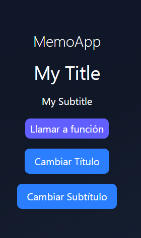
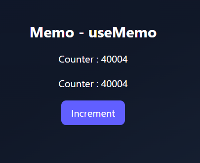
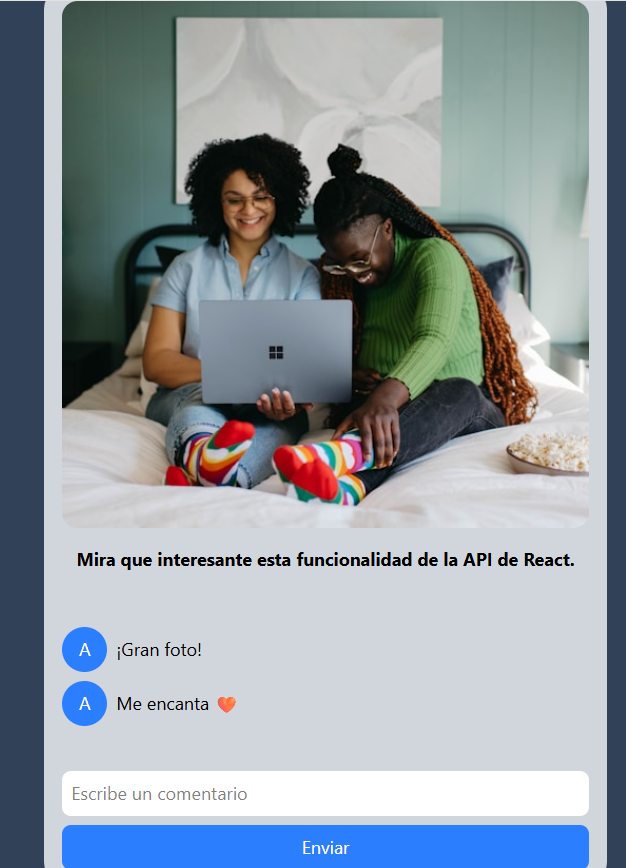

## Memorización y Optimizaciones

### Continuación

- Seguiremos con hooksApp, creo 06-memos/MemoHook.tsx (va a ser un componente, no un hook)

~~~jsx
export const MemoHook = () => {
  return (
    

        <h1 className="text-2xl font-thin text-white">MemoApp</h1>
    

  )
}
~~~

- Lo renderizo en el main
- Añado unos botones y un h1 y un h6

~~~jsx
export const MemoHook = () => {
  return (
    

        <h1 className="text-2xl font-thin text-white">MemoApp</h1>

        <h1>Mi título</h1>
        <h6>Mi Subtítulo</h6>

        <button className="bg-blue-500 text-white px-4 py-2 rounded-md cursor-pointer">
            Cambiar Título
        </button>
        
        <button className="bg-blue-500 text-white px-4 py-2 rounded-md cursor-pointer">
            Cambiar Subtítulo
        </button>

    

  )
}
~~~

- Creo la carpeta 06-memos/ui/MyTitle.tsx
- Le coloco un console.log intencionalmente

~~~js
interface Props{
    title : string
}

export const MyTitle = ({title}: Props) => {
  
    console.log('MytTitle re-render')

    return (
    <h1 className="text-3xl">{title}</h1>
  )
}
~~~

- Uso el componente en MemoHook.tsx
- Hago exactamente lo mismo con el subtítulo
- Le añado un botón

~~~jsx
interface Props{
subtitle: string
}

export const MySubtitle = ({subtitle}: Props) => {
  
    console.log('MySubtitle re-render')

    return (  
        <>
            <h6>{subtitle}</h6>
            <button className="bg-indigo-500 text-white px-2 py-1 rounded-md cursor pointer">
              Llamar a función
            </button>
        
        </>
  )
}
~~~

- Utilizo un state para colocar el título y el subtítulo

~~~js
import { useState } from "react"
import { MySubtitle } from "./ui/MySubtitle"
import { MyTitle } from "./ui/MyTitle"

export const MemoHook = () => {

    const [title, setTitle] = useState<string>("My Title")
    const [subtitle, setSubtitle] = useState<string>("My Subtitle")

  return (
    

        <h1 className="text-2xl font-thin text-white">MemoApp</h1>

        <MyTitle title={title} />

        <MySubtitle subtitle={subtitle} />

        <button className="bg-blue-500 text-white px-4 py-2 rounded-md cursor-pointer"
          onClick={()=> setTitle('Hello')}
        >
            Cambiar Título
        </button>
        
        <button className="bg-blue-500 text-white px-4 py-2 rounded-md cursor-pointer"
          onClick={()=> setSubtitle('World')}
        >
            Cambiar Subtítulo
        </button>

    

  )
}
~~~

- Se ve algo así

### React Memo - Función de memorización

- Si le doy a los botones que cambian el estado a Hello World se dispara el console.log que hay en MyTitle y MySubtitle
- Si le doy solo al botón de MyTitle el MySubtitle también se vuelve a re-renderizar, aunuqe no lo haya cambiado
- En el navegador, Components, le doy a la ruedita y marco Highlight updates when components render
- Así vemos la tarea super-pesada de re-renderización por cambiar un state viendo unas lineas en los componentes en el navegador, que se re-renderiza el componente padre (lo veo si le coloco un console.log), título y subtítulo
- En MyTitle importo React y envuelvio el componente en React.memo

~~~js
import React from "react"

interface Props{
    title : string
}

export const MyTitle = React.memo(({title}: Props) => {
  
    console.log('MytTitle re-render')

    return (
    <h1 className="text-3xl">{title}</h1>
  )
})
~~~

- Hago lo mismo con MySubtitle
- En realidad puedo usar solo memo si lo importo, no hace falta REact.memo

~~~js
import { memo } from "react"

interface Props{
subtitle: string
}

export const MySubtitle = memo(({subtitle}: Props) => {
  
    console.log('MySubtitle re-render')

    return (  
        <>
            <h6>{subtitle}</h6>
            <button className="bg-indigo-500 text-white px-2 py-1 rounded-md cursor pointer">
              Llamar a función
            </button>
        
        </>
  )
})
~~~

- Ahora, cuando le doy al botón de title, el subtitle no se re-renderiza
- Una vez he cambiado el título, como el título sigue siendo el mismo, no se redibuja nada
- Esto va a cambiar en la próxima clase!

### useCallback - Memorización de funciones 

- Le paso una función al componente MySubtitle

~~~js
import { memo } from "react"

interface Props{
subtitle: string
callMyAPI: ()=> void
}

export const MySubtitle = memo(({subtitle, callMyAPI}: Props) => {
  
    console.log('MySubtitle re-render')

    return (  
        <>
            <h6>{subtitle}</h6>
            <button className="bg-indigo-500 text-white px-2 py-1 rounded-md cursor pointer"
              onClick={callMyAPI}
            >
              Llamar a función
            </button>
        
        </>
  )
})
~~~

- Creo la función en el componente padre y se la paso a MySubtitle

~~~js
export const MemoHook = () => {

    const [title, setTitle] = useState<string>("My Title")
    const [subtitle, setSubtitle] = useState<string>("My Subtitle")

    const handleMyAPICall =()=>{
      console.log('Llamado a mi API')
    }

  return (
    

        <h1 className="text-2xl font-thin text-white">MemoApp</h1>

        <MyTitle title={title} />

        <MySubtitle subtitle={subtitle} callMyAPI={handleMyAPICall} />
  
  {...code}
  
  )}
~~~

- Ahora si le doy a cambiar título el titulo se redibuja tambie´n
- ¿Porqué? Esto es por cómo aloja las funciones de JS
  - La función apunta a un espacio en memoria
  - Cuando el componente se re-renderiza, la función se vuelve a alojar a otro espacio en memoria diferente
  - Por lo tanto, aunque las funciones hagan lo mismo, NO SON IGUALES
  - React, al ver que la función no es la misma y se le pasa al componente MySubtitle, lo re-renderiza
- ¿Qué puedo hacer para que no pase?
- Envuelvo a la función en un useCallback. Necesita un arreglo de dependencias, igual que un useEffect 

~~~js
const handleMyAPICall = useCallback(()=>{
    console.log('Llamado a mi API')
  }, [])
~~~

- Si le quiero pasar un valor, pongamos el subtítulo, tengo que poner la dependencia

~~~js
const handleMyAPICall = useCallback(()=>{
    console.log('Llamado a mi API', subtitle)
  }, [subtitle])
~~~

- Ahora solo se re-renderiza una vez cambia, si le doy más veces al botón no lo hace, porque es el mismo subtítulo
- Tampoco se re-renderiza cuando le doy al title
- Estas dos funciones (memo y useCallback) están en el punto de mira de desaparecer por el nuevo compilador de React
- **Si la función se declara fuera del componente no se re-renderiza el componente**
- **EN PRINCIPIO, EN VERSIONES POSTERIORES DE REACT; EL COMPILADOR HARÄ ESTE TRABAJO POR NOSOTROS**

### useMemo - Memorización de valores

- Creo en 06-memos/MemoCounter.tsx

~~~js
export const MemoCounter = () => {
  return (
    

      <h1
        className='text-2xl'
        >Memo - useMemo
      </h1>
    

  )
}
~~~

- Usaremos el useCounter.tsx

~~~js
import { useState } from "react"

export const useCounter = (initialValue: number = 1) => {
  
    const [counter, setCounter] = useState(initialValue)

    const increment = ()=>{
        setCounter(counter+1)
    }

    const decrement = ()=>{
        if(counter <=1) return
        setCounter(counter-1)
    }

    return{
        counter,
        increment,
        decrement
    }
}
~~~

- El componente queda así

~~~js
import { useCounter } from "@/03-Examples/hooks/useCounter"

export const MemoCounter = () => {

    const {counter, increment, decrement}=useCounter(40_000)

  return (
    

      <h1 className='text-2xl font-bold'>Memo - useMemo</h1>

      <h4>Counter : {counter}</h4>
      <h4>Counter : {counter}</h4>

      <button 
        className="bg-indigo-500 text-white px-4 py-2 rounded-md cursor-pointer"
        onClick={increment}
      >
        Increment
      </button>

    

  )
}
~~~

- Se ve algo así

- Creo una función fuera del componente con una tarea pesada

~~~js
const heavyStuff = (iterationNumber: number)=>{

    console.time('heavy_stuff')

    for (let index = 0; index < iterationNumber; index++) {
        console.log('ahi vamos')
        
    }
    
    console.timeEnd('heavy_stuff')
    return `${iterationNumber} número de iteraciones`
}
~~~

- La llamo dentro de mi componente

~~~js
const myHeavyValue = heavyStuff(counter)
~~~

- Esto renderiza dos veces 40.000 ahí vamos
- Cada vez que el componente se vuelve a redibujar se dispara la función
- Utilizo useMemo para memorizar el valor de la función, también lleva un arreglo de dependencias

~~~js
const myHeavyValue = useMemo(()=>heavyStuff(counter), [counter])
~~~

- Al haber dos counters, si le doy al botón de incrementar se vuelve a disparar la función dos veces
- **El useCallback memoriza la función. EL useMemo memoriza el valor de retorno de la función**

### useOptimistic - Preparación

- Creo la carpeta 07-useOptimistic/InstagromApp.tsx
- El useOptimistic se suele usar con el useTransition, luego lo veremos
- El componente es así
- InstagromApp.tsx

~~~js
import { useState } from 'react';

interface Comment {
  id: number;
  text: string;
  optimistic?: boolean;
}

export const InstagromApp = () => {
  const [comments, setComments] = useState<Comment[]>([
    { id: 1, text: '¡Gran foto!' },
    { id: 2, text: 'Me encanta 🧡' },
  ]);

  const handleAddComment = async () => {
    console.log('Nuevo comentario');
  };

  return (
    

      {/* Post de ejemplo */}
      

        
        

          Mira que interesante esta funcionalidad de la API de React.
        

      

      {/* Comentarios */}
      <ul className="flex flex-col items-start justify-center bg-gray-300 w-[500px] p-4">
        {comments.map((comment) => (
          <li key={comment.id} className="flex items-center gap-2 mb-2">
            

              A
            

            
{comment.text}

            {comment.optimistic && (
              enviando... 
            )}
          </li>
        ))}
      </ul>

      {/* Formulario de comentarios */}
      <form
        action={handleAddComment}
        className="flex flex-col items-center justify-center bg-gray-300 w-[500px] rounded-b-3xl p-4"
      >
        <input
          type="text"
          name="post-message"
          placeholder="Escribe un comentario"
          required
          className="w-full p-2 rounded-md mb-2 text-black bg-white"
        />
        <button
          type="submit"
          disabled={false}
          className="bg-blue-500 text-white p-2 rounded-md w-full"
        >
          Enviar
        </button>
      </form>
    

  );
};
~~~

- La app se ve así

- El optimistic en la interface no es necesario para implementar el useOptimistic, pero necesitamos algo que nos sirva de bandera para identificar cuando todavía está en algún tipo de posteo
- Entre que escribimos en el input y se envia al backend y lo regresa hay una latencia
  - El useOptimistic es considerar que el backendo respondió de manera exitosa aun cuando no tenemos ni idea de que eso va a suceder
- El form tiene una acción que llama a la función handleAddComment
  - El input no está controlado por React, en el handleAddComment recibo la data (FormData)
  - El formulario recibe la data de aquellos campos con el atributo **name**
  - La FormData (la data del formulario) tendrá en este caso una propiedad de tipo texto con el name post-message

~~~js
 <form
    action={handleAddComment}
    className="flex flex-col items-center justify-center bg-gray-300 w-[500px] rounded-b-3xl p-4"
  >
    <input
      type="text"
      name="post-message"
      placeholder="Escribe un comentario"
      required
      className="w-full p-2 rounded-md mb-2 text-black bg-white"
    />
    <button
      type="submit"
      disabled={false}
      className="bg-blue-500 text-white p-2 rounded-md w-full"
    >
      Enviar
    </button>
</form>
~~~

- Entonces handleAddComment recibe la formData del evento

~~~js
const handleAddComment = async (formData: FormData) => {
    const messageText = formData.get('post-message')
    console.log(messageText)
};
~~~

- Hay varios métodos del formData
- El formulario se reinicia por defecto después de usar este método
- El tema es que puede haber una latencia al ingresar este texto en la db
- Esparzo el state anterior, coloco as string para que no de error
  - Podríamos usar Zod para validar el string que obtengo 

~~~js
const handleAddComment = async (formData: FormData) => {
  const messageText = formData.get('post-message') as string
  //simulo la latencia
  await new Promise(resolve => setTimeout(resolve, 3000))
  setComments((prev)=>[
      ...prev,
      {
          id: new Date().getTime(),
          text: messageText
      }
  ])
};
~~~

- Lo que quiero es que el posteo aparezca inmediatamente en pantalla cuando le doy al botón de postear sin la latencia de 3 segundos

### useOptimistic

- useOptimistic muestra valores optimistas antes de que una acción sea resuelta
- El primer valor de la desestructuración del useOptimistic es el valor del state actual (lo mismo que un useState)
  - Lo segundo es una función dispatcher que defino  en el callback, donde optimisticValue es el valor que yo voy a enviar
  - El primer argumento del callback no necesito llamarlo
  - En este caso newComment es el valor que quiero enviar, aunque aparezca como una función
  - Siempre tengo que regresar un nuevo estado

~~~js
import { useOptimistic } from 'react';

function AppContainer() {
  const [optimisticState, addOptimistic] = useOptimistic(
    state,
    (currentState, optimisticValue) => {
    
    }
  );
}
~~~

- En el componente 

~~~js
const [optimisticComments, addOptimisticComment] = useOptimistic(comments, (currentComments, newComment: string)=>{
  return[...currentComments, {
      id: new Date().getTime(),
      text: newComment,
      optimistic: true //flag para renderizar ...enviando
  }]
})
~~~ 

- optimistic es un flag que uso para renderizar el ...enviando
- En lugar del comments en el .map uso optimisticComments

~~~js
<ul className="flex flex-col items-start justify-center bg-gray-300 w-[500px] p-4">
  {optimisticComments.map((comment) => (
    <li key={comment.id} className="flex items-center gap-2 mb-2">
      

        A
      

      
{comment.text}

      {comment.optimistic && ( //flag
        enviando... 
      )}
    </li>
  ))}
</ul>
~~~

- Antes de hacer la simulación de petición al backend con el timeOut uso al función de addOptimisticComment (suponiendo que todo salga bien)

~~~js
const handleAddComment = async (formData: FormData) => {
  const messageText = formData.get('post-message') as string
  
  addOptimisticComment(messageText)

  await new Promise(resolve => setTimeout(resolve, 3000))
  setComments((prev)=>[
      ...prev,
      {
          id: new Date().getTime(),
          text: messageText
      }
  ])
};
~~~

- Por la latencia aparece el post con ...enviando al lado durante 3 segundos

### useTransition

- Puede que el mensaje de un fallo de posteo
- Debo poder hacer un rollback
- useTransition permite renderizar partes del UI en el background, pueden ser vistas como actualizaciones no urgentes
- Permite tener dos piezas, la primera variable que nos dice cuando la transición está ocurriendo
- El isPending va a estar en true mientras startTransition esté sucediendo (ejecutándose)
- Todo lo que suceda en la función startTransition es conocida como una **acción** (es un callback)

~~~js
const [isPending, startTransition] = useTransition()
~~~

- No hay porqué usar los nombres isPending o startTransition pero es un standard
- Al usar el await debo hacer el callback async

~~~js
const [isPending, stratTransition] = useTransition()

const handleAddComment = async (formData: FormData) => {
  const messageText = formData.get('post-message') as string
  
  addOptimisticComment(messageText)

  startTransition(async ()=>{
      await new Promise(resolve => setTimeout(resolve, 3000))
      setComments((prev)=>[
          ...prev,
          {
              id: new Date().getTime(),
              text: messageText
          }
      ])
  })
};
~~~

- Coloco el isPending en el disabled del botón para deshabilitarlo cuando se está haciendo el posteo

~~~js
<button
  type="submit"
  disabled={isPending}
  className="bg-blue-500 text-white p-2 rounded-md w-full"
>
  Enviar
</button>
~~~

### Simular fallo en useOptimistic + sonner

- Código para revertir el proceso

~~~js
const handleAddComment = async (formData: FormData) => {
  const messageText = formData.get('post-message') as string
  
  addOptimisticComment(messageText)

  startTransition(async ()=>{
      await new Promise(resolve => setTimeout(resolve, 3000))
    /*  setComments((prev)=>[
          ...prev,
          {
              id: new Date().getTime(),
              text: messageText
          }
      ]) */

      setComments(prev => prev) //revierto el estado
  })
};
~~~

- Usaremos sonner para mandar notificaciones en pantalla

> npm i sonner

- Colocaremos el Toaster en el name, pero normalmente lo usaremos en el punto más alto de la aplicación después del main
- main.tsx

~~~js
createRoot(document.getElementById('root')!).render(
  <StrictMode>
    <Toaster />
   <InstagromApp />
  </StrictMode>,
)
~~~

- En el componente uso la función toast, que tiene tipado estricto de TypeScript incorporado

~~~js
const handleAddComment = async (formData: FormData) => {
  const messageText = formData.get('post-message') as string
  
  addOptimisticComment(messageText)

  startTransition(async ()=>{
      await new Promise(resolve => setTimeout(resolve, 3000))
    /*  setComments((prev)=>[
          ...prev,
          {
              id: new Date().getTime(),
              text: messageText
          }
      ]) */

      setComments(prev => prev)
      toast('Error al agregar el comentario',{
          description: 'Intente nuevamente',
          duration: 5_000, //5 segundos
          position: 'top-right',
          action:{
              label: 'Cerrar',
              onClick: ()=> toast.dismiss()
          }
      })
  })
};
~~~

- Sería interesante usar el patrón adaptador para usar sonner

### Use API + Suspense - Preparación del ejercicio

- Creo 08-use-suspense/ClientInformation.tsx
- No uso useSuspense en el nombre de la carpeta porque no es un hook sino una API

~~~js
import React from 'react'

export const ClientInformation = () => {
  return (
    

        <h2 className="text-4xl font-thin text-white">Miguel - #123</h2>
        
Ottawa, Canadá

        
Un rol del usuario

    

  )
}
~~~

- La idea no es renderizar info estática, sino crear otra carpeta dentro del directorio llamada api
- 08-use-suspense/api/get-user.action.ts

~~~js
export interface User{
    id: number
    name: string
    location: string
    role: string
}

export const getUserAction = async(id: number)=>{
    await new Promise(res=> setTimeout(res,3000)) //latencia simulada de una petición

    return{
        id: id,
        name: 'Miguel Castaño',
        location: 'Penedés, Catalunya',
        role: 'Desarrolador de software' 
    }
}
~~~

- Si quisiéramos hacer una petición HTTP sin usar TanstackQuery (lo haremos más adelante) usaríamos un useEffect

~~~js
import React, { useEffect } from 'react'
import { getUserAction } from './api/get-user.action'

interface Props {
    id: number
}

export const ClientInformation = ({id}: Props) => {

    useEffect(()=>{
      getUserAction(id)
        .then(user=>console.log(user))  
    }, [id])

  return (
    

        <h2 className="text-4xl font-thin text-white">Miguel - #123</h2>
        
Ottawa, Canadá

        
Un rol del usuario

    

  )
}
~~~

- Debo pasarle el id al componente
- main.tsx

~~~js
createRoot(document.getElementById('root')!).render(
  <StrictMode>
    <Toaster />
   <ClientInformation id={1}/>
  </StrictMode>,
)
~~~

- En lugar del console.log en el useEffect ocuparía usar un setState para renderizar la info y todo lo demás
- Si usara serverComponents se podría usar algo así

~~~js
import React, { useEffect } from 'react'
import { getUserAction } from './api/get-user.action'

interface Props {
    id: number
}

export const ClientInformation = async ({id}: Props) => {

//NO SE PUEDE
const user = await getUserAction(id)

  return (
    

        <h2 className="text-4xl font-thin text-white">Miguel - #123</h2>
        
Ottawa, Canadá

        
Un rol del usuario

    

  )
}
~~~

- ¿Qué alternativa tengo?
- Usar use y Suspense!

### use API + Suspense

- El componente Suspense permite desplegar un contenido hasta que sus hijos terminen de cargar algo
- Con una tarea asíncrona, el Suspense renderiza el Loading hasta que termina de cargar

~~~js
<Suspense fallback={<Loading />}>
  <Albums />
</Suspense>
~~~

- Si hay varios hijos se recomienda envolver cada uno de ellos en diferentes Suspense
- La nueva API de React **use** (no es un hook) permite leer un valor de un recurso como una promesa o contexto, suspendiendo la creación hasta tener una resolución. **Va de la mano del componente Suspense**
- use nos permite leer el valor de una fuente como son una Promesa o un Context
- Quitemos el id del componente para el ejemplo
- use me pide mandarle algo de tipo React.Usable (una promesa o context)

~~~js
import React, { use, useEffect } from 'react'
import { getUserAction } from './api/get-user.action'

export const ClientInformation = () => {

    const user = use(getUserAction(1))

  return (

    

        <h2 className="text-4xl font-thin text-white">{user.name}</h2>
        
{user.location}

        
{user.role}

    

  )
}
~~~

- Me da la pantalla en blanco!
- Sucede que al renderizarse otra vez el componente vuelve a llamar la función entrando de nuevo en el timeout
- Hay que sacar el use del componente

~~~js
import React, { Suspense, use, useEffect } from 'react'
import { getUserAction } from './api/get-user.action'

const userPromise = getUserAction(1)

export const ClientInformation = () => {

    const user = use(userPromise)

  return (
    

    <Suspense>
        <h2 className="text-4xl font-thin text-white">{user.name}</h2>
        
{user.location}

        
{user.role}

    </Suspense>
    

  )
}
~~~

- Se ve horrible que la pantalla se quede en blanco tres segundos
- Arrgelémoslo

~~~js
import './index.css'
import { StrictMode, Suspense } from 'react'
import { createRoot } from 'react-dom/client'
import { Toaster } from 'sonner'
import { ClientInformation } from './08-use-suspense/ClientInformation'

//import { InstagromApp } from './07-useOptimistic/InstagromApp'
//import { MemoCounter } from './06-memos/MemoCounter'
//import { MemoHook } from './06-memos/MemoHook'
//import { ScrambleWords } from './05-useReducer/ScrambleWordsReducer'
//import { HooksApp } from './HooksApp'
//import { TrafficLight } from './01-useState/TrafficLight'
//import { TrafficLightWithEffect } from './02-useEffect/TrafficLightWithEffect'
//import { PokemonPage } from './03-Examples/PokemonPage'
//import { FocusScreen } from './04-useRef/FocusScreen'

createRoot(document.getElementById('root')!).render(
  <StrictMode>
    <Suspense fallback={

                          <h1 className="text-white text-2xl">Cargando...</h1>
                      
}>
      <ClientInformation />
    </Suspense>
  </StrictMode>,
)
~~~

- ¿Qué pasaría si necesito pasarle un argumento determinado en algún punto de la aplicación?
- Creo una interfaz, el valor de de tipo Usable (lo importo de React) y puedo tiparlo como User

~~~js
import React, { Suspense, use, useEffect, type Usable } from 'react'
import { getUserAction, type User } from './api/get-user.action'

interface Props{
  getUser: Usable<User>
}

const userPromise = getUserAction(1)

export const ClientInformation = ({getUser}: Props) => {

    const user = use(getUser)

  return (
    

    <Suspense>
        <h2 className="text-4xl font-thin text-white">{user.name}</h2>
        
{user.location}

        
{user.role}

    </Suspense>
    

  )
}
~~~

- Tengo que enviarle la promesa al componente en el main

~~~js
createRoot(document.getElementById('root')!).render(
  <StrictMode>
    <Suspense fallback={

                          <h1 className="text-white text-2xl">Cargando...</h1>
                      
}>
      <ClientInformation getUser={getUserAction(1)}/>
    </Suspense>
  </StrictMode>,
)
~~~

- Ya no hace falta volver el componente async (que no se puede) ni usar un useEffect

