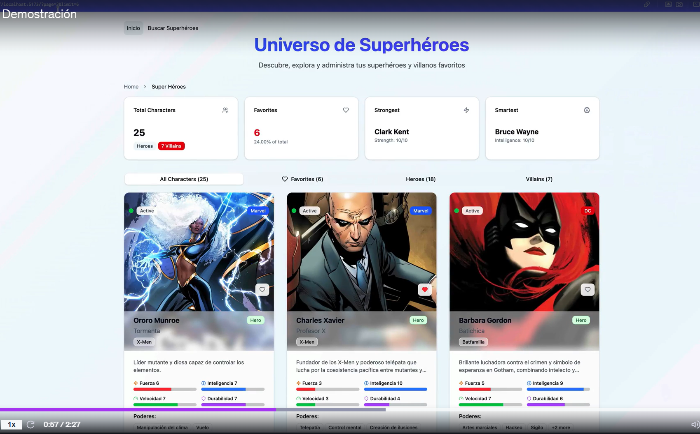
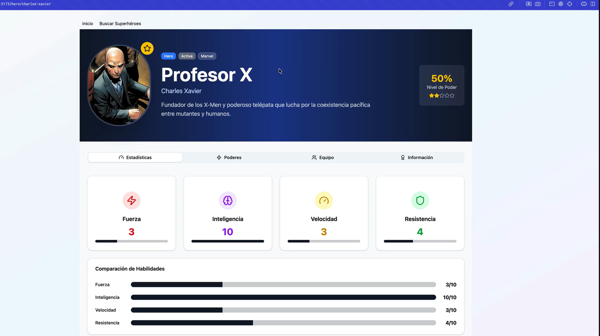
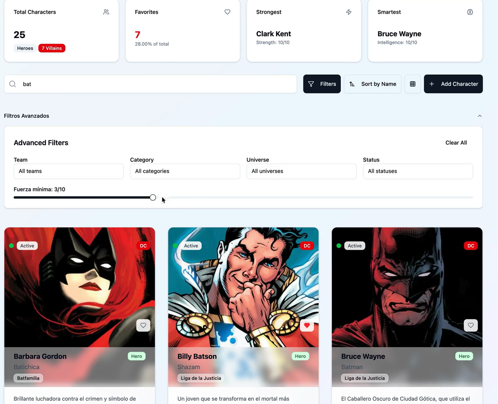
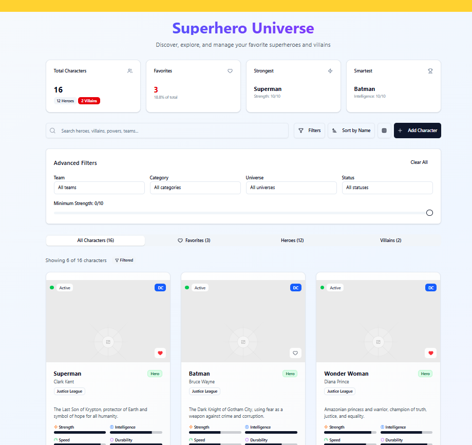
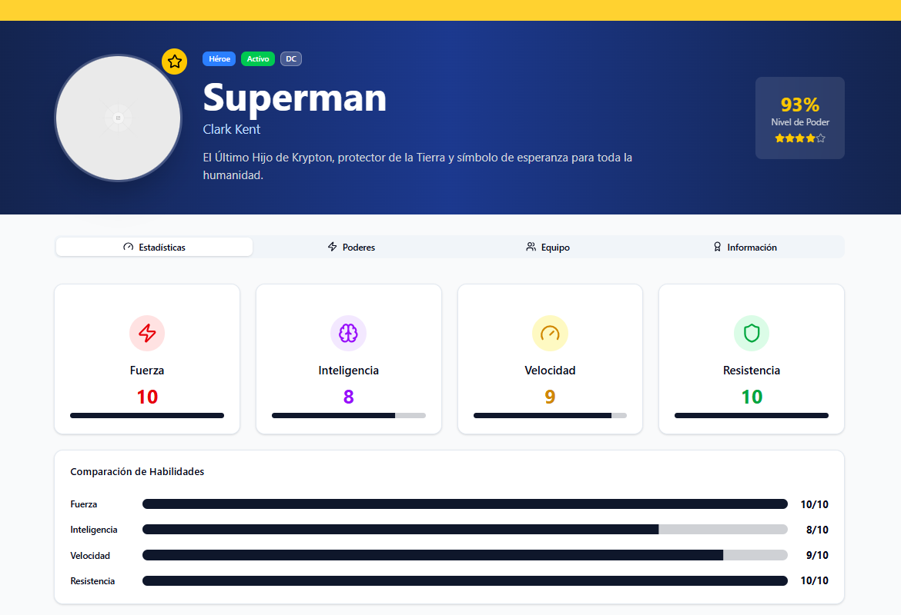
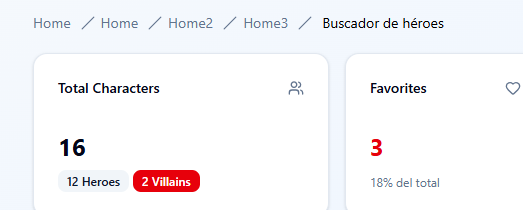

## Heroes App

- Así luce la aplicación

- Puedes marcar al héroe con un corazón y agregarlo a favoritos
- Vamos a tener un filtro

### Creación de proyecto Heroes App

> npm create vite

- Elijo TypeScript + SWC
- Dentro de la carpeta del proyecto 

> npm i

- Instalamos shadcn

> npm i tailwindcss @tailwindcss/vite

- Importamos tailwind en index.css

~~~css
@import "tailwindcss";
~~~

- Edito tsconfig.json

~~~json
  {
   "files": [],
   "references": [
    {
      "path": "./tsconfig.app.json"
    },
    {
      "path": "./tsconfig.node.json"
    }
  ],
  "compilerOptions": {
    "baseUrl": ".",
    "paths": {
      "@/*": ["./src/*"]
    }
  }
}
~~~

- Edito tsconfig.app.json, añado esto al compiler options

~~~json
 "baseUrl": ".",
    "paths": {
      "@/*": [
        "./src/*"
      ]
    }
~~~

- Instalo los types

> npm install -D @types/node

- Configuro vite.config.ts, es @vitejs/plugin-react-swc!

~~~js
import path from "path"
import tailwindcss from "@tailwindcss/vite"
import react from "@vitejs/plugin-react-swc"
import { defineConfig } from "vite"

// https://vite.dev/config/
export default defineConfig({
  plugins: [react(), tailwindcss()],
  resolve: {
    alias: {
      "@": path.resolve(__dirname, "./src"),
    },
  },
})
~~~

- Pongo en marcha el CLI

> npx shadcn@latest init

- Selecciono Slate
- Puedo observar el index.css como lo ha modificado si todo ha ido bien
- Si escribo **npx shadcn@latest add** voy a poder seleccionar varios componentes a la vez para descargar
- Me bajo un botón

> npx shadcn@latest add button

- Lo tengo en src/components/ui/button.tsx
- Añado cursor-pointer en la primera linea de tailwind

### Generadores visuales con IA

- Tenemos (a día de hoy) **Loveable y v0.dev**
- Ambos usan tailwind y shadcn
- Le puedo pedir cualquier diseño, un dashboard administrativo, lo que sea

### Creación de rutas y pantallas

- Instalamos react-router

> npm i react-router

- Creo en src /heroes/pages/hero/HeroPage.tsx, heroes/pages/home/HomePage.tsx, heroes/pages/search/SearchPage.tsx, admin/pages/AdminPage.tsx
- Creo también en src/router/app.router.tsx

~~~js
import { createBrowserRouter } from "react-router";
import { HomePage } from "@/heroes/pages/home/HomePage";
import { HeroPage } from "@/heroes/pages/hero/HeroPage";
import { SearchPage } from "@/heroes/pages/search/SearchPage";
import { AdminPage } from "@/admin/pages/AdminPage";

export const appRouter = createBrowserRouter([
    {
        path: '/',
        element: <HomePage />
    },
    {
        path: '/heroes/1',
        element: <HeroPage />
    },
    {
        path: '/search',
        element: <SearchPage />
    },
    {
        path: '/admin',
        element: <AdminPage />
    }
])
~~~

- Para hacer el enrutamiento necesitamos el **RouterProvider**
- Lo coloco en el punto más alto después del main
- Creo src/HeroesApp.tsx
- Le coloco el RouterProvider

~~~js
import { RouterProvider } from "react-router"
import { appRouter } from "./router/app.router"

export const HeroesApp = () => {
  return (
    <>
     <RouterProvider router={appRouter}/>
    </>
  )
}
~~~

- Lo renderizo en el main

~~~js
import { StrictMode } from 'react'
import { createRoot } from 'react-dom/client'
import './index.css'
import { HeroesApp } from './HeroesApp.tsx'

createRoot(document.getElementById('root')!).render(
  <StrictMode>
    <HeroesApp />
  </StrictMode>,
)
~~~

### Componente Layout

- Es común compartir un diseño entre las páginas
- Las páginas dentro de heroes van a compartir diseño, pero /admin no
- Creo dentro de /heroes/layouts/HeroesLayout.tsx
- Es un Functional Component normal y corriente

~~~js
export const HeroesLayout = () => {
  return (
    
HeroesLayout

  )
}
~~~

- Voy a necesitar que todas las pantallas excepto admin (HomePage, HeroPage, SearchPage) pasen por el mismo lugar
- Creo el array de children y le paso los objetos
- El home no lleva ruta, le pongo el index en true por ser el home

~~~js
import { createBrowserRouter } from "react-router";
import { HomePage } from "@/heroes/pages/home/HomePage";
import { HeroPage } from "@/heroes/pages/hero/HeroPage";
import { SearchPage } from "@/heroes/pages/search/SearchPage";
import { AdminPage } from "@/admin/pages/AdminPage";
import { HeroesLayout } from "@/heroes/layouts/HeroesLayout";

export const appRouter = createBrowserRouter([
    {
        path: '/',
        element: <HeroesLayout />,
        children:[
    {
        index: true,
        element: <HomePage />
    },
    {
        path: '/heroes/1',
        element: <HeroPage />
    },
    {
        path: '/search',
        element: <SearchPage />
    }
    ]},
    
    {
        path: '/admin',
        element: <AdminPage />
    }

])
~~~

- Uso el **Outlet** para renderizar los componentes hijos en el layout (LOS ESTILOS NO SON DEFINITIVOS)

~~~js
import { Outlet } from "react-router"

export const HeroesLayout = () => {
  return (
    

        <h1 className="text-white text-4xl font-bold">HEROES APP</h1>
        <Outlet />
    

    )
}
~~~

- Creo un layout también para admin (LOS ESTILOS NO SON DEFINITIVOS)

~~~js
import { Outlet } from "react-router"

export const AdminLayout = () => {
  return (
    

      

        <Outlet />
      

    

  )
}
~~~

- En el router

~~~js
import { createBrowserRouter } from "react-router";
import { HomePage } from "@/heroes/pages/home/HomePage";
import { HeroPage } from "@/heroes/pages/hero/HeroPage";
import { SearchPage } from "@/heroes/pages/search/SearchPage";
import { AdminPage } from "@/admin/pages/AdminPage";
import { HeroesLayout } from "@/heroes/layouts/HeroesLayout";
import { AdminLayout } from "@/admin/layout/AdminLayout";

export const appRouter = createBrowserRouter([
    {
        path: '/',
        element: <HeroesLayout />,
        children:[
    {
        index: true,
        element: <HomePage />
    },
    {
        path: '/heroes/1',
        element: <HeroPage />
    },
    {
        path: '/search',
        element: <SearchPage />
    }
    ]},
    
    {
        path: '/admin',
        element: <AdminLayout/>,
        children:[
            {
                index: true,
                element: <AdminPage />
            }
        ]
    }

])
~~~

- Para ver AdminPage es posible que necesite autenticación, pero el HomePage y HeroPage no
- Vamos a aprender a hacer carga perezosa (lazy load) y hacer que el HomePage y el HeroPage se carguen al inicio de la aplicación

### Lazy Load

- Importo lazy de react, este tiene un callback que llama al import

~~~js
const SearchPage = lazy(()=>import("@/heroes/pages/search/SearchPage").then(module=>({default: module.SearchPage})))
~~~

- Si importo por defecto el componente SearchPage en SearchPage.tsx puedo poner solo esto

~~~js
const SearchPage = lazy(()=>import("@/heroes/pages/search/SearchPage"))
~~~

- En el SearchPage.tsx

~~~js
const SearchPage = () => {
  return (
    
SearchPage

  )
}

export default SearchPage
~~~

- La página es cargada bajo demanda

### Pensemos en componentes reutilizables

- Copio el código de v0.dev
- Instalo los componentes con npx shadcn@latest add

> badge, button, card, dialog, input, label, progress, select, tabs, textarea

- En lugar de importar Image de next/image, borro la importación y uso la etiqueta img
- Home

~~~js
import {
  Search,
  Plus,
  Filter,
  SortAsc,
  Heart,
  Grid,
  Users,
  Zap,
  Trophy,
  Eye,
  Brain,
  Gauge,
  Shield,
  ChevronLeft,
  ChevronRight,
  MoreHorizontal,
} from "lucide-react"
import { Button } from "@/components/ui/button"
import { Input } from "@/components/ui/input"
import { Badge } from "@/components/ui/badge"
import { Card, CardContent, CardHeader, CardTitle } from "@/components/ui/card"
import { Progress } from "@/components/ui/progress"
import { Tabs, TabsList, TabsTrigger } from "@/components/ui/tabs"

export default function HomePage() {
  return (
    

      

        {/* Header */}
        

          <h1 className="text-5xl font-bold bg-gradient-to-r from-blue-600 to-purple-600 bg-clip-text text-transparent mb-4">
            Superhero Universe
          </h1>
          
Discover, explore, and manage your favorite superheroes and villains

        

        {/* Stats Dashboard */}
        

          <Card>
            <CardHeader className="flex flex-row items-center justify-between space-y-0 pb-2">
              <CardTitle className="text-sm font-medium">Total Characters</CardTitle>
              <Users className="h-4 w-4 text-muted-foreground" />
            </CardHeader>
            <CardContent>
              
16

              

                <Badge variant="secondary" className="text-xs">
                  12 Heroes
                </Badge>
                <Badge variant="destructive" className="text-xs">
                  2 Villains
                </Badge>
              

            </CardContent>
          </Card>

          <Card>
            <CardHeader className="flex flex-row items-center justify-between space-y-0 pb-2">
              <CardTitle className="text-sm font-medium">Favorites</CardTitle>
              <Heart className="h-4 w-4 text-muted-foreground" />
            </CardHeader>
            <CardContent>
              
3

              
18.8% of total

            </CardContent>
          </Card>

          <Card>
            <CardHeader className="flex flex-row items-center justify-between space-y-0 pb-2">
              <CardTitle className="text-sm font-medium">Strongest</CardTitle>
              <Zap className="h-4 w-4 text-muted-foreground" />
            </CardHeader>
            <CardContent>
              
Superman

              
Strength: 10/10

            </CardContent>
          </Card>

          <Card>
            <CardHeader className="flex flex-row items-center justify-between space-y-0 pb-2">
              <CardTitle className="text-sm font-medium">Smartest</CardTitle>
              <Trophy className="h-4 w-4 text-muted-foreground" />
            </CardHeader>
            <CardContent>
              
Batman

              
Intelligence: 10/10

            </CardContent>
          </Card>
        

        {/* Controls */}
        

          {/* Search */}
          

            <Search className="absolute left-3 top-1/2 transform -translate-y-1/2 text-gray-400 h-5 w-5" />
            <Input placeholder="Search heroes, villains, powers, teams..." className="pl-12 h-12 text-lg" />
          

          {/* Action buttons */}
          

            <Button variant="outline" className="h-12 bg-transparent">
              <Filter className="h-4 w-4 mr-2" />
              Filters
            </Button>

            <Button variant="outline" className="h-12 bg-transparent">
              <SortAsc className="h-4 w-4 mr-2" />
              Sort by Name
            </Button>

            <Button variant="outline" className="h-12 bg-transparent">
              <Grid className="h-4 w-4" />
            </Button>

            <Button className="h-12">
              <Plus className="h-4 w-4 mr-2" />
              Add Character
            </Button>
          

        

        {/* Advanced Filters */}
        

          

            <h3 className="text-lg font-semibold">Advanced Filters</h3>
            <Button variant="ghost">Clear All</Button>
          

          

            

              <label className="text-sm font-medium">Team</label>
              

                All teams
              

            

            

              <label className="text-sm font-medium">Category</label>
              

                All categories
              

            

            

              <label className="text-sm font-medium">Universe</label>
              

                All universes
              

            

            

              <label className="text-sm font-medium">Status</label>
              

                All statuses
              

            

          

          

            <label className="text-sm font-medium">Minimum Strength: 0/10</label>
            

              

                

              

              

            

          

        

        {/* Tabs */}
        <Tabs value="all" className="mb-8">
          <TabsList className="grid w-full grid-cols-4">
            <TabsTrigger value="all">All Characters (16)</TabsTrigger>
            <TabsTrigger value="favorites" className="flex items-center gap-2">
              <Heart className="h-4 w-4" />
              Favorites (3)
            </TabsTrigger>
            <TabsTrigger value="heroes">Heroes (12)</TabsTrigger>
            <TabsTrigger value="villains">Villains (2)</TabsTrigger>
          </TabsList>
        </Tabs>

        {/* Results info */}
        

          

            
Showing 6 of 16 characters

            <Badge variant="secondary" className="flex items-center gap-1">
              <Filter className="h-3 w-3" />
              Filtered
            </Badge>
          

        

        {/* Character Grid */}
        

          {/* Hero Card 1 - Superman */}
          <Card className="group overflow-hidden hover:shadow-xl transition-all duration-300 hover:-translate-y-1 bg-gradient-to-br from-white to-gray-50">
            

              

              {/* Status indicator */}
              

                

                <Badge variant="secondary" className="text-xs bg-white/90 text-gray-700">
                  Active
                </Badge>
              

              {/* Universe badge */}
              <Badge className="absolute top-3 right-3 text-xs bg-blue-600 text-white">DC</Badge>

              {/* Favorite button */}
              <Button size="sm" variant="ghost" className="absolute bottom-3 right-3 bg-white/90 hover:bg-white">
                <Heart className="h-4 w-4 fill-red-500 text-red-500" />
              </Button>

              {/* View details button */}
              <Button
                size="sm"
                variant="ghost"
                className="absolute bottom-3 left-3 bg-white/90 hover:bg-white opacity-0 group-hover:opacity-100 transition-opacity"
              >
                <Eye className="h-4 w-4 text-gray-600" />
              </Button>
            

            <CardHeader className="pb-3">
              

                

                  <h3 className="font-bold text-lg leading-tight">Superman</h3>
                  
Clark Kent

                

                <Badge className="text-xs bg-green-100 text-green-800 border-green-200">Hero</Badge>
              

              <Badge variant="outline" className="w-fit text-xs">
                Justice League
              </Badge>
            </CardHeader>

            <CardContent className="space-y-4">
              

                The Last Son of Krypton, protector of Earth and symbol of hope for all humanity.
              

              {/* Stats */}
              

                

                  

                    <Zap className="h-3 w-3 text-orange-500" />
                    Strength
                  

                  <Progress value={100} className="h-2" />
                

                

                  

                    <Brain className="h-3 w-3 text-blue-500" />
                    Intelligence
                  

                  <Progress value={80} className="h-2" />
                

                

                  

                    <Gauge className="h-3 w-3 text-green-500" />
                    Speed
                  

                  <Progress value={90} className="h-2" />
                

                

                  

                    <Shield className="h-3 w-3 text-purple-500" />
                    Durability
                  

                  <Progress value={100} className="h-2" />
                

              

              {/* Powers */}
              

                <h4 className="font-medium text-sm">Powers:</h4>
                

                  <Badge variant="outline" className="text-xs">
                    Super Strength
                  </Badge>
                  <Badge variant="outline" className="text-xs">
                    Flight
                  </Badge>
                  <Badge variant="outline" className="text-xs bg-gray-100">
                    +4 more
                  </Badge>
                

              

              
First appeared: 1938

            </CardContent>
          </Card>

          {/* Hero Card 2 - Batman */}
          <Card className="group overflow-hidden hover:shadow-xl transition-all duration-300 hover:-translate-y-1 bg-gradient-to-br from-white to-gray-50">
            

              

              

                

                <Badge variant="secondary" className="text-xs bg-white/90 text-gray-700">
                  Active
                </Badge>
              

              <Badge className="absolute top-3 right-3 text-xs bg-blue-600 text-white">DC</Badge>

              <Button size="sm" variant="ghost" className="absolute bottom-3 right-3 bg-white/90 hover:bg-white">
                <Heart className="h-4 w-4 text-gray-600" />
              </Button>

              <Button
                size="sm"
                variant="ghost"
                className="absolute bottom-3 left-3 bg-white/90 hover:bg-white opacity-0 group-hover:opacity-100 transition-opacity"
              >
                <Eye className="h-4 w-4 text-gray-600" />
              </Button>
            

            <CardHeader className="pb-3">
              

                

                  <h3 className="font-bold text-lg leading-tight">Batman</h3>
                  
Bruce Wayne

                

                <Badge className="text-xs bg-green-100 text-green-800 border-green-200">Hero</Badge>
              

              <Badge variant="outline" className="w-fit text-xs">
                Justice League
              </Badge>
            </CardHeader>

            <CardContent className="space-y-4">
              

                The Dark Knight of Gotham City, using fear as a weapon against crime and corruption.
              

              

                

                  

                    <Zap className="h-3 w-3 text-orange-500" />
                    Strength
                  

                  <Progress value={60} className="h-2" />
                

                

                  

                    <Brain className="h-3 w-3 text-blue-500" />
                    Intelligence
                  

                  <Progress value={100} className="h-2" />
                

                

                  

                    <Gauge className="h-3 w-3 text-green-500" />
                    Speed
                  

                  <Progress value={60} className="h-2" />
                

                

                  

                    <Shield className="h-3 w-3 text-purple-500" />
                    Durability
                  

                  <Progress value={70} className="h-2" />
                

              

              

                <h4 className="font-medium text-sm">Powers:</h4>
                

                  <Badge variant="outline" className="text-xs">
                    Martial Arts
                  </Badge>
                  <Badge variant="outline" className="text-xs">
                    Detective Skills
                  </Badge>
                  <Badge variant="outline" className="text-xs bg-gray-100">
                    +3 more
                  </Badge>
                

              

              
First appeared: 1939

            </CardContent>
          </Card>

          {/* Hero Card 3 - Wonder Woman */}
          <Card className="group overflow-hidden hover:shadow-xl transition-all duration-300 hover:-translate-y-1 bg-gradient-to-br from-white to-gray-50">
            

              

              

                

                <Badge variant="secondary" className="text-xs bg-white/90 text-gray-700">
                  Active
                </Badge>
              

              <Badge className="absolute top-3 right-3 text-xs bg-blue-600 text-white">DC</Badge>

              <Button size="sm" variant="ghost" className="absolute bottom-3 right-3 bg-white/90 hover:bg-white">
                <Heart className="h-4 w-4 fill-red-500 text-red-500" />
              </Button>

              <Button
                size="sm"
                variant="ghost"
                className="absolute bottom-3 left-3 bg-white/90 hover:bg-white opacity-0 group-hover:opacity-100 transition-opacity"
              >
                <Eye className="h-4 w-4 text-gray-600" />
              </Button>
            

            <CardHeader className="pb-3">
              

                

                  <h3 className="font-bold text-lg leading-tight">Wonder Woman</h3>
                  
Diana Prince

                

                <Badge className="text-xs bg-green-100 text-green-800 border-green-200">Hero</Badge>
              

              <Badge variant="outline" className="w-fit text-xs">
                Justice League
              </Badge>
            </CardHeader>

            <CardContent className="space-y-4">
              

                Amazonian princess and warrior, champion of truth, justice, and equality.
              

              

                

                  

                    <Zap className="h-3 w-3 text-orange-500" />
                    Strength
                  

                  <Progress value={90} className="h-2" />
                

                

                  

                    <Brain className="h-3 w-3 text-blue-500" />
                    Intelligence
                  

                  <Progress value={80} className="h-2" />
                

                

                  

                    <Gauge className="h-3 w-3 text-green-500" />
                    Speed
                  

                  <Progress value={80} className="h-2" />
                

                

                  

                    <Shield className="h-3 w-3 text-purple-500" />
                    Durability
                  

                  <Progress value={90} className="h-2" />
                

              

              

                <h4 className="font-medium text-sm">Powers:</h4>
                

                  <Badge variant="outline" className="text-xs">
                    Super Strength
                  </Badge>
                  <Badge variant="outline" className="text-xs">
                    Flight
                  </Badge>
                  <Badge variant="outline" className="text-xs bg-gray-100">
                    +4 more
                  </Badge>
                

              

              
First appeared: 1941

            </CardContent>
          </Card>

          {/* Hero Card 4 - Spider-Man */}
          <Card className="group overflow-hidden hover:shadow-xl transition-all duration-300 hover:-translate-y-1 bg-gradient-to-br from-white to-gray-50">
            

              

              

                

                <Badge variant="secondary" className="text-xs bg-white/90 text-gray-700">
                  Active
                </Badge>
              

              <Badge className="absolute top-3 right-3 text-xs bg-red-600 text-white">Marvel</Badge>

              <Button size="sm" variant="ghost" className="absolute bottom-3 right-3 bg-white/90 hover:bg-white">
                <Heart className="h-4 w-4 text-gray-600" />
              </Button>

              <Button
                size="sm"
                variant="ghost"
                className="absolute bottom-3 left-3 bg-white/90 hover:bg-white opacity-0 group-hover:opacity-100 transition-opacity"
              >
                <Eye className="h-4 w-4 text-gray-600" />
              </Button>
            

            <CardHeader className="pb-3">
              

                

                  <h3 className="font-bold text-lg leading-tight">Spider-Man</h3>
                  
Peter Parker

                

                <Badge className="text-xs bg-green-100 text-green-800 border-green-200">Hero</Badge>
              

              <Badge variant="outline" className="w-fit text-xs">
                Avengers
              </Badge>
            </CardHeader>

            <CardContent className="space-y-4">
              

                Your friendly neighborhood Spider-Man, with great power comes great responsibility.
              

              

                

                  

                    <Zap className="h-3 w-3 text-orange-500" />
                    Strength
                  

                  <Progress value={70} className="h-2" />
                

                

                  

                    <Brain className="h-3 w-3 text-blue-500" />
                    Intelligence
                  

                  <Progress value={90} className="h-2" />
                

                

                  

                    <Gauge className="h-3 w-3 text-green-500" />
                    Speed
                  

                  <Progress value={70} className="h-2" />
                

                

                  

                    <Shield className="h-3 w-3 text-purple-500" />
                    Durability
                  

                  <Progress value={70} className="h-2" />
                

              

              

                <h4 className="font-medium text-sm">Powers:</h4>
                

                  <Badge variant="outline" className="text-xs">
                    Wall Crawling
                  </Badge>
                  <Badge variant="outline" className="text-xs">
                    Spider Sense
                  </Badge>
                  <Badge variant="outline" className="text-xs bg-gray-100">
                    +3 more
                  </Badge>
                

              

              
First appeared: 1962

            </CardContent>
          </Card>

          {/* Hero Card 5 - Iron Man */}
          <Card className="group overflow-hidden hover:shadow-xl transition-all duration-300 hover:-translate-y-1 bg-gradient-to-br from-white to-gray-50">
            

              

              

                

                <Badge variant="secondary" className="text-xs bg-white/90 text-gray-700">
                  Active
                </Badge>
              

              <Badge className="absolute top-3 right-3 text-xs bg-red-600 text-white">Marvel</Badge>

              <Button size="sm" variant="ghost" className="absolute bottom-3 right-3 bg-white/90 hover:bg-white">
                <Heart className="h-4 w-4 fill-red-500 text-red-500" />
              </Button>

              <Button
                size="sm"
                variant="ghost"
                className="absolute bottom-3 left-3 bg-white/90 hover:bg-white opacity-0 group-hover:opacity-100 transition-opacity"
              >
                <Eye className="h-4 w-4 text-gray-600" />
              </Button>
            

            <CardHeader className="pb-3">
              

                

                  <h3 className="font-bold text-lg leading-tight">Iron Man</h3>
                  
Tony Stark

                

                <Badge className="text-xs bg-green-100 text-green-800 border-green-200">Hero</Badge>
              

              <Badge variant="outline" className="w-fit text-xs">
                Avengers
              </Badge>
            </CardHeader>

            <CardContent className="space-y-4">
              

                Billionaire genius inventor who uses his technology to protect the world.
              

              

                

                  

                    <Zap className="h-3 w-3 text-orange-500" />
                    Strength
                  

                  <Progress value={80} className="h-2" />
                

                

                  

                    <Brain className="h-3 w-3 text-blue-500" />
                    Intelligence
                  

                  <Progress value={100} className="h-2" />
                

                

                  

                    <Gauge className="h-3 w-3 text-green-500" />
                    Speed
                  

                  <Progress value={70} className="h-2" />
                

                

                  

                    <Shield className="h-3 w-3 text-purple-500" />
                    Durability
                  

                  <Progress value={80} className="h-2" />
                

              

              

                <h4 className="font-medium text-sm">Powers:</h4>
                

                  <Badge variant="outline" className="text-xs">
                    Powered Armor
                  </Badge>
                  <Badge variant="outline" className="text-xs">
                    Genius Intellect
                  </Badge>
                  <Badge variant="outline" className="text-xs bg-gray-100">
                    +3 more
                  </Badge>
                

              

              
First appeared: 1963

            </CardContent>
          </Card>

          {/* Hero Card 6 - Deadpool */}
          <Card className="group overflow-hidden hover:shadow-xl transition-all duration-300 hover:-translate-y-1 bg-gradient-to-br from-white to-gray-50">
            

              

              

                

                <Badge variant="secondary" className="text-xs bg-white/90 text-gray-700">
                  Active
                </Badge>
              

              <Badge className="absolute top-3 right-3 text-xs bg-red-600 text-white">Marvel</Badge>

              <Button size="sm" variant="ghost" className="absolute bottom-3 right-3 bg-white/90 hover:bg-white">
                <Heart className="h-4 w-4 text-gray-600" />
              </Button>

              <Button
                size="sm"
                variant="ghost"
                className="absolute bottom-3 left-3 bg-white/90 hover:bg-white opacity-0 group-hover:opacity-100 transition-opacity"
              >
                <Eye className="h-4 w-4 text-gray-600" />
              </Button>
            

            <CardHeader className="pb-3">
              

                

                  <h3 className="font-bold text-lg leading-tight">Deadpool</h3>
                  
Wade Wilson

                

                <Badge className="text-xs bg-yellow-100 text-yellow-800 border-yellow-200">Anti-Hero</Badge>
              

              <Badge variant="outline" className="w-fit text-xs">
                X-Force
              </Badge>
            </CardHeader>

            <CardContent className="space-y-4">
              

                The Merc with a Mouth, an unpredictable anti-hero with accelerated healing powers.
              

              

                

                  

                    <Zap className="h-3 w-3 text-orange-500" />
                    Strength
                  

                  <Progress value={60} className="h-2" />
                

                

                  

                    <Brain className="h-3 w-3 text-blue-500" />
                    Intelligence
                  

                  <Progress value={70} className="h-2" />
                

                

                  

                    <Gauge className="h-3 w-3 text-green-500" />
                    Speed
                  

                  <Progress value={70} className="h-2" />
                

                

                  

                    <Shield className="h-3 w-3 text-purple-500" />
                    Durability
                  

                  <Progress value={90} className="h-2" />
                

              

              

                <h4 className="font-medium text-sm">Powers:</h4>
                

                  <Badge variant="outline" className="text-xs">
                    Healing Factor
                  </Badge>
                  <Badge variant="outline" className="text-xs">
                    Martial Arts
                  </Badge>
                  <Badge variant="outline" className="text-xs bg-gray-100">
                    +3 more
                  </Badge>
                

              

              
First appeared: 1991

            </CardContent>
          </Card>
        

        {/* Pagination */}
        

          <Button variant="outline" size="sm" disabled>
            <ChevronLeft className="h-4 w-4" />
            Previous
          </Button>

          <Button variant="default" size="sm">
            1
          </Button>
          <Button variant="outline" size="sm">
            2
          </Button>
          <Button variant="outline" size="sm">
            3
          </Button>
          <Button variant="ghost" size="sm" disabled>
            <MoreHorizontal className="h-4 w-4" />
          </Button>

          <Button variant="outline" size="sm">
            Next
            <ChevronRight className="h-4 w-4" />
          </Button>
        

      

    

  )
}
~~~

- La HeroPage

~~~js
import { Badge } from "@/components/ui/badge"
import { Card, CardContent, CardHeader, CardTitle } from "@/components/ui/card"
import { Progress } from "@/components/ui/progress"
import { Tabs, TabsContent, TabsList, TabsTrigger } from "@/components/ui/tabs"
import { Shield, Zap, Brain, Gauge, Users, Star, Award } from "lucide-react"

const superheroData = {
  id: "1",
  name: "Clark Kent",
  alias: "Superman",
  powers: ["Súper fuerza", "Vuelo", "Visión de calor", "Visión de rayos X", "Invulnerabilidad", "Súper velocidad"],
  description: "El Último Hijo de Krypton, protector de la Tierra y símbolo de esperanza para toda la humanidad.",
  strength: 10,
  intelligence: 8,
  speed: 9,
  durability: 10,
  team: "Liga de la Justicia",
  image: "/placeholder.svg?height=300&width=300",
  firstAppearance: "1938",
  status: "Activo",
  category: "Héroe",
  universe: "DC",
}

export default function HeroPage() {
  const totalPower =
    superheroData.strength + superheroData.intelligence + superheroData.speed + superheroData.durability
  const averagePower = Math.round((totalPower / 4) * 10)

  const getStatusColor = (status: string) => {
    switch (status.toLowerCase()) {
      case "activo":
        return "bg-green-500"
      case "inactivo":
        return "bg-gray-500"
      case "retirado":
        return "bg-blue-500"
      default:
        return "bg-gray-500"
    }
  }

  const getCategoryColor = (category: string) => {
    switch (category.toLowerCase()) {
      case "héroe":
        return "bg-blue-500"
      case "villano":
        return "bg-red-500"
      case "antihéroe":
        return "bg-purple-500"
      default:
        return "bg-gray-500"
    }
  }

  return (
    

      {/* Header Banner */}
      

        

          

            

              
              

                

                  <Star className="w-6 h-6" />
                

              

            

            

              

                <Badge className={`${getCategoryColor(superheroData.category)} text-white`}>
                  {superheroData.category}
                </Badge>
                <Badge className={`${getStatusColor(superheroData.status)} text-white`}>{superheroData.status}</Badge>
                <Badge variant="secondary" className="bg-white/20 text-white border-white/30">
                  {superheroData.universe}
                </Badge>
              

              <h1 className="text-4xl md:text-6xl font-bold mb-2">{superheroData.alias}</h1>
              
{superheroData.name}

              
{superheroData.description}

            

            

              

                
{averagePower}%

                
Nivel de Poder

                

                  {[...Array(5)].map((_, i) => (
                    <Star
                      key={i}
                      className={`w-4 h-4 ${i < Math.floor(averagePower / 20) ? "text-yellow-400 fill-current" : "text-gray-400"}`}
                    />
                  ))}
                

              

            

          

        

      

      {/* Main Content */}
      

        <Tabs defaultValue="stats" className="w-full">
          <TabsList className="grid w-full grid-cols-4 mb-8">
            <TabsTrigger value="stats" className="flex items-center gap-2">
              <Gauge className="w-4 h-4" />
              Estadísticas
            </TabsTrigger>
            <TabsTrigger value="powers" className="flex items-center gap-2">
              <Zap className="w-4 h-4" />
              Poderes
            </TabsTrigger>
            <TabsTrigger value="team" className="flex items-center gap-2">
              <Users className="w-4 h-4" />
              Equipo
            </TabsTrigger>
            <TabsTrigger value="info" className="flex items-center gap-2">
              <Award className="w-4 h-4" />
              Información
            </TabsTrigger>
          </TabsList>

          <TabsContent value="stats" className="space-y-6">
            

              {/* Strength */}
              <Card className="text-center">
                <CardContent className="pt-6">
                  

                    

                      <Zap className="w-8 h-8 text-red-600" />
                    

                  

                  <h3 className="font-semibold text-lg mb-2">Fuerza</h3>
                  
{superheroData.strength}

                  <Progress value={superheroData.strength * 10} className="h-2" />
                </CardContent>
              </Card>

              {/* Intelligence */}
              <Card className="text-center">
                <CardContent className="pt-6">
                  

                    

                      <Brain className="w-8 h-8 text-purple-600" />
                    

                  

                  <h3 className="font-semibold text-lg mb-2">Inteligencia</h3>
                  
{superheroData.intelligence}

                  <Progress value={superheroData.intelligence * 10} className="h-2" />
                </CardContent>
              </Card>

              {/* Speed */}
              <Card className="text-center">
                <CardContent className="pt-6">
                  

                    

                      <Gauge className="w-8 h-8 text-yellow-600" />
                    

                  

                  <h3 className="font-semibold text-lg mb-2">Velocidad</h3>
                  
{superheroData.speed}

                  <Progress value={superheroData.speed * 10} className="h-2" />
                </CardContent>
              </Card>

              {/* Durability */}
              <Card className="text-center">
                <CardContent className="pt-6">
                  

                    

                      <Shield className="w-8 h-8 text-green-600" />
                    

                  

                  <h3 className="font-semibold text-lg mb-2">Resistencia</h3>
                  
{superheroData.durability}

                  <Progress value={superheroData.durability * 10} className="h-2" />
                </CardContent>
              </Card>
            

            {/* Power Comparison Chart */}
            <Card>
              <CardHeader>
                <CardTitle>Comparación de Habilidades</CardTitle>
              </CardHeader>
              <CardContent>
                

                  

                    
Fuerza

                    

                      <Progress value={superheroData.strength * 10} className="h-4" />
                    

                    
{superheroData.strength}/10

                  

                  

                    
Inteligencia

                    

                      <Progress value={superheroData.intelligence * 10} className="h-4" />
                    

                    
{superheroData.intelligence}/10

                  

                  

                    
Velocidad

                    

                      <Progress value={superheroData.speed * 10} className="h-4" />
                    

                    
{superheroData.speed}/10

                  

                  

                    
Resistencia

                    

                      <Progress value={superheroData.durability * 10} className="h-4" />
                    

                    
{superheroData.durability}/10

                  

                

              </CardContent>
            </Card>
          </TabsContent>

          <TabsContent value="powers">
            <Card>
              <CardHeader>
                <CardTitle className="flex items-center gap-2">
                  <Zap className="w-6 h-6 text-yellow-500" />
                  Superpoderes
                </CardTitle>
              </CardHeader>
              <CardContent>
                

                  {superheroData.powers.map((power, index) => (
                    

                      

                        

                          <Zap className="w-4 h-4 text-white" />
                        

                        {power}
                      

                    

                  ))}
                

              </CardContent>
            </Card>
          </TabsContent>

          <TabsContent value="team">
            <Card>
              <CardHeader>
                <CardTitle className="flex items-center gap-2">
                  <Users className="w-6 h-6 text-green-500" />
                  Afiliación de Equipo
                </CardTitle>
              </CardHeader>
              <CardContent>
                

                  

                    <Users className="w-12 h-12 text-green-600" />
                  

                  <h3 className="text-2xl font-bold text-green-700 mb-2">{superheroData.team}</h3>
                  
Miembro activo del equipo de superhéroes más poderoso

                

              </CardContent>
            </Card>
          </TabsContent>

          <TabsContent value="info">
            

              <Card>
                <CardHeader>
                  <CardTitle>Detalles Personales</CardTitle>
                </CardHeader>
                <CardContent className="space-y-4">
                  

                    Nombre Real:
                    {superheroData.name}
                  

                  

                    Alias:
                    {superheroData.alias}
                  

                  

                    Categoría:
                    <Badge className={`${getCategoryColor(superheroData.category)} text-white`}>
                      {superheroData.category}
                    </Badge>
                  

                  

                    Estado:
                    <Badge className={`${getStatusColor(superheroData.status)} text-white`}>
                      {superheroData.status}
                    </Badge>
                  

                </CardContent>
              </Card>

              <Card>
                <CardHeader>
                  <CardTitle>Información del Universo</CardTitle>
                </CardHeader>
                <CardContent className="space-y-4">
                  

                    Universo:
                    {superheroData.universe}
                  

                  

                    Primera Aparición:
                    {superheroData.firstAppearance}
                  

                  

                    Años Activo:
                    
                      {new Date().getFullYear() - Number.parseInt(superheroData.firstAppearance)} años
                    
                  

                </CardContent>
              </Card>
            

          </TabsContent>
        </Tabs>
      

    

  )
}
~~~

- Descargo el svg de placeholder.svg del repo de github y la coloco en public
- La HomePage debería verse así 

- La HeroPage

- Hay que pensar en qué cosas son parte del tema global de la app y que cosas no
- Empecemos por el HomePage
- Las primeras lineas podrían ser del layout

~~~js
import { Outlet } from "react-router"

export const HeroesLayout = () => {
  return (
   

      

        <Outlet />
      

    

    )
}
~~~

- Sustituyo los divs del HomePage que contenían estas clases por dos fragments

~~~js
export default function HomePage() {
  return (
    <> 
      <>
        {/* Header */}
        

          <h1 className="text-5xl font-bold bg-gradient-to-r from-blue-600 to-purple-600 bg-clip-text text-transparent mb-4">
            Superhero Universe
          </h1>
          
Discover, explore, and manage your favorite superheroes and villains

        

      {...code}
      </>
    </>
  )}
~~~

- El Header también lo voy a compartir, lo coloco en la carpeta components/custom/CustomJumbotron.tsx

~~~js
export const CustomJumbotron = () => {
  return (
      

          <h1 className="text-5xl font-bold bg-gradient-to-r from-blue-600 to-purple-600 bg-clip-text text-transparent mb-4">
            Superhero Universe
          </h1>
          
Discover, explore, and manage your favorite superheroes and villains

        

  )
}
~~~

- Lo hago más reutilizable

~~~js
interface Props {
title: string
description?: string
}

export const CustomJumbotron = ({title, description}: Props) => {
  return (
      

          <h1 className="text-5xl font-bold bg-gradient-to-r from-blue-600 to-purple-600 bg-clip-text text-transparent mb-4">
            {title}
          </h1>
          { description &&(
              
{description}

             )
          }
        

  )
}
~~~

- Lo inserto en el HomePage

~~~js
export default function HomePage() {
  return (
    <>
      <>
        {/* Header */}
        <CustomJumbotron title="Universo de Superhéroes" description="Descubre, explora y administra superhéroes"/>
  
  {...code}
  )}
~~~

- Uso el Jumbotron también en la SearchPage pero cambio el título por Búsqueda de Supehéroes
- Creo en heroes/components//HeroStats.tsx
- Corto todo el div de Dashboard y lo copio en el componente

~~~js
import { Badge } from "@/components/ui/badge"
import { Card, CardContent, CardHeader, CardTitle } from "@/components/ui/card"
import { Heart, Trophy, Users, Zap } from "lucide-react"

export const HeroStats = () => {
  return (
     

          <Card>
            <CardHeader className="flex flex-row items-center justify-between space-y-0 pb-2">
              <CardTitle className="text-sm font-medium">Total Characters</CardTitle>
              <Users className="h-4 w-4 text-muted-foreground" />
            </CardHeader>
            <CardContent>
              
16

              

                <Badge variant="secondary" className="text-xs">
                  12 Heroes
                </Badge>
                <Badge variant="destructive" className="text-xs">
                  2 Villains
                </Badge>
              

            </CardContent>
          </Card>

          <Card>
            <CardHeader className="flex flex-row items-center justify-between space-y-0 pb-2">
              <CardTitle className="text-sm font-medium">Favorites</CardTitle>
              <Heart className="h-4 w-4 text-muted-foreground" />
            </CardHeader>
            <CardContent>
              
3

              
18.8% of total

            </CardContent>
          </Card>

          <Card>
            <CardHeader className="flex flex-row items-center justify-between space-y-0 pb-2">
              <CardTitle className="text-sm font-medium">Strongest</CardTitle>
              <Zap className="h-4 w-4 text-muted-foreground" />
            </CardHeader>
            <CardContent>
              
Superman

              
Strength: 10/10

            </CardContent>
          </Card>

          <Card>
            <CardHeader className="flex flex-row items-center justify-between space-y-0 pb-2">
              <CardTitle className="text-sm font-medium">Smartest</CardTitle>
              <Trophy className="h-4 w-4 text-muted-foreground" />
            </CardHeader>
            <CardContent>
              
Batman

              
Intelligence: 10/10

            </CardContent>
          </Card>
        

  )
}
~~~

- Lo renderizo en HomePage
- Pego el HeroStats también en SearchPage
- Primero tratemos de crear la UI y luego centrémonos en la funcionalidad
- Exceptuando la primera Card del componente HeroStats, el resto de componentes (Cards) comparten la misma estructura: título, ícono, una cantidad y un porcentaje del total
- En components/HeroStatCard.tsx

~~~js
import { Card, CardContent, CardHeader, CardTitle } from "@/components/ui/card"
import { Heart } from "lucide-react"
import type { JSX } from "react"

interface Props{
    title: string
    icon: JSX.Element //React.Node es lo mismo
}

export const HeroStatCard = ({title, icon}: Props) => {
  return (
    <Card>
        <CardHeader className="flex flex-row items-center justify-between space-y-0 pb-2">
            <CardTitle className="text-sm font-medium">{title}</CardTitle>
            <Heart className="h-4 w-4 text-muted-foreground" />
            {icon}
        </CardHeader>
        <CardContent>
          //esto es lo único diferente entre los cards de la UI
            
3

            
18% del total

        </CardContent>
    </Card>
  )
}
~~~

- Para saber de qué tipo es el icon, coloco el icono en el componente y coloco el cursor encima de la propiedad icon

~~~js
<HeroStatCard 
    title="Favorites" 
     //coloco el cursor encima de icon para obtener el tipo para la interfaz
    icon={<Heart className="h-4 w-4 text-muted-foreground" />}
   />
~~~

- Lo único diferente después del icono en el componente serán los children 
- Extiendo la interfaz

~~~js
import { Card, CardContent, CardHeader, CardTitle } from "@/components/ui/card"
import { Heart } from "lucide-react"
import type { JSX, PropsWithChildren } from "react"

interface Props extends PropsWithChildren{
    title: string
    icon: JSX.Element //React.Node
}

export const HeroStatCard = ({title, icon, children}: Props) => {
  return (
    <Card>
        <CardHeader className="flex flex-row items-center justify-between space-y-0 pb-2">
            <CardTitle className="text-sm font-medium">{title}</CardTitle>
            <Heart className="h-4 w-4 text-muted-foreground" />
            {icon}
        </CardHeader>
        <CardContent>
            {children}
        </CardContent>
    </Card>
  )
}
~~~

- Lo renderizo en HeroStats

~~~js
<HeroStatCard 
  title="Favorites" 
  icon={<Heart className="h-4 w-4 text-muted-foreground" />}
  >
    
3

    
18% del total

</HeroStatCard>
~~~

- Hago lo propio con las otras cards
- HeroStats.tsx

~~~js
import { Badge } from "@/components/ui/badge"
import { Card, CardContent, CardHeader, CardTitle } from "@/components/ui/card"
import { Heart, Trophy, Users, Zap } from "lucide-react"
import { HeroStatCard } from "./HeroStatCard"

export const HeroStats = () => {
  return (
     

          <Card>
            <CardHeader className="flex flex-row items-center justify-between space-y-0 pb-2">
              <CardTitle className="text-sm font-medium">Total Characters</CardTitle>
              <Users className="h-4 w-4 text-muted-foreground" />
            </CardHeader>
            <CardContent>
              
16

              

                <Badge variant="secondary" className="text-xs">
                  12 Heroes
                </Badge>
                <Badge variant="destructive" className="text-xs">
                  2 Villains
                </Badge>
              

            </CardContent>
          </Card>

          <HeroStatCard 
            title="Favorites" 
            icon={<Heart className="h-4 w-4 text-muted-foreground" />}
            >
                
3

                
18% del total

            </HeroStatCard>

            <HeroStatCard
                title="Strongest"
                icon={<Zap className="h-4 w-4 text-muted-foreground" />}
                >
                  
Superman

                  
Strength: 10/10

                </HeroStatCard>

            <HeroStatCard
                title="Smartest"
                icon={<Trophy className="h-4 w-4 text-muted-foreground" />}
            >
              
Batman

              
Intelligence: 10/10

            </HeroStatCard>
        

  )
}
~~~

- Primero maquetamos, luego la funcionalidad

### Componentes de búsqueda

- En el HomePage vayamos con los Controls y el Search
- Cómo solo lo usaremos en la pantalla de búsqueda, creo la carpeta en heroes/search/ui/SearchControle.tsx

~~~js
import { Button } from "@/components/ui/button"
import { Input } from "@/components/ui/input"
import { Filter, Grid, Plus, Search, SortAsc } from "lucide-react"

export const SearchControls = () => {
  return (
    

          {/* Search */}
          

            <Search className="absolute left-3 top-1/2 transform -translate-y-1/2 text-gray-400 h-5 w-5" />
            <Input placeholder="Search heroes, villains, powers, teams..." className="pl-12 h-12 text-lg" />
          

          {/* Action buttons */}
          

            <Button variant="outline" className="h-12 bg-transparent">
              <Filter className="h-4 w-4 mr-2" />
              Filters
            </Button>

            <Button variant="outline" className="h-12 bg-transparent">
              <SortAsc className="h-4 w-4 mr-2" />
              Sort by Name
            </Button>

            <Button variant="outline" className="h-12 bg-transparent">
              <Grid className="h-4 w-4" />
            </Button>

            <Button className="h-12">
              <Plus className="h-4 w-4 mr-2" />
              Add Character
            </Button>
          

        

  )
}
~~~

- Lo renderizo en SearchPage.tsx

~~~js
import { CustomJumbotron } from "@/components/custom/CustomJumbotron"
import { HeroStats } from "@/heroes/components/HeroStats"
import { SearchControls } from "./ui/SearchControls"

const SearchPage = () => {
  return (
   <>
   <CustomJumbotron title="Búsqueda de Superhéroes" description="Descubre, explora y administra superhéroes" />
  
  {/*Stats Dashboard*/}
   <HeroStats />
   
   {/*Filter and Search*/}
   <SearchControls />
   </>
  )
}

export default SearchPage
~~~

- En SearchControls.tsx meto todo en un div y abajo pego los filtros de búsquedas avanzadas

~~~js
import { Button } from "@/components/ui/button"
import { Input } from "@/components/ui/input"
import { Filter, Grid, Plus, Search, SortAsc } from "lucide-react"

export const SearchControls = () => {
  return (
    <>
    
    

          {/* Search */}
          

            <Search className="absolute left-3 top-1/2 transform -translate-y-1/2 text-gray-400 h-5 w-5" />
            <Input placeholder="Search heroes, villains, powers, teams..." className="pl-12 h-12 text-lg" />
          

          {/* Action buttons */}
          

            <Button variant="outline" className="h-12 bg-transparent">
              <Filter className="h-4 w-4 mr-2" />
              Filters
            </Button>

            <Button variant="outline" className="h-12 bg-transparent">
              <SortAsc className="h-4 w-4 mr-2" />
              Sort by Name
            </Button>

            <Button variant="outline" className="h-12 bg-transparent">
              <Grid className="h-4 w-4" />
            </Button>

            <Button className="h-12">
              <Plus className="h-4 w-4 mr-2" />
              Add Character
            </Button>
          

        

         

          

            <h3 className="text-lg font-semibold">Advanced Filters</h3>
            <Button variant="ghost">Clear All</Button>
          

          

            

              <label className="text-sm font-medium">Team</label>
              

                All teams
              

            

            

              <label className="text-sm font-medium">Category</label>
              

                All categories
              

            

            

              <label className="text-sm font-medium">Universe</label>
              

                All universes
              

            

            

              <label className="text-sm font-medium">Status</label>
              

                All statuses
              

            

          

          

            <label className="text-sm font-medium">Minimum Strength: 0/10</label>
            

              

                

              

              

            

          

        

    </>
  )
}
~~~

- Ya lo haremos funcionar
- Cada componente va a tener acceso a un contexto de donde obtener la información
- Dejamos las tabs en el HomePage de momento porque requieren de una implementación de cómo funciona shadcn
- Borro el bloque de Result info, vayamos con el Character Grid y las Cards (y después con la paginación)

### Grid de personajes

- Compacto el div entero de Character Grid que está dentro de HomePage.tsx y lo paso a un nuevo componente
- En heroes/components/HeroGrid.tsx
- Estas son las importaciones para que no de error al transferir el código al nuevo componente HeroGrid.tsx

~~~js
import { Button } from "@/components/ui/button"
import { Badge } from "@/components/ui/badge"
import { Card, CardContent, CardHeader } from "@/components/ui/card"
import { Progress } from "@/components/ui/progress"
import { Brain, Eye, Gauge, Heart, Shield, Zap } from "lucide-react"
~~~

- Renderizo el HeroGrid en el HomePage
- Tiene sentidfo hacer las Cards como un componente independiente
- Cojo la Card de Superman y creo heroes/components/HeroCard.tsx
- **Asegúrate de importar el Progress de @components/ui/progress y no de @radix!!**
- **NOTA**: compactar el div para copiar y pegar es muy útil. Ctrl+. sobre un error para hacer todas las importaciones

~~~js
import { Card, CardContent, CardHeader } from "@/components/ui/card"
import { Badge } from "@/components/ui/badge"
import  { Button } from "@/components/ui/button"
import  { Progress } from "@/components/ui/progress"
import { Heart, Eye, Zap, Brain, Gauge, Shield } from "lucide-react"

export const HeroCard = () => {
  return (
    <Card className="group overflow-hidden hover:shadow-xl transition-all duration-300 hover:-translate-y-1 bg-gradient-to-br from-white to-gray-50">
      

        

        {/* Status indicator */}
        

          

          <Badge variant="secondary" className="text-xs bg-white/90 text-gray-700">
            Active
          </Badge>
        

        {/* Universe badge */}
        <Badge className="absolute top-3 right-3 text-xs bg-blue-600 text-white">DC</Badge>

        {/* Favorite button */}
        <Button size="sm" variant="ghost" className="absolute bottom-3 right-3 bg-white/90 hover:bg-white">
          <Heart className="h-4 w-4 fill-red-500 text-red-500" />
        </Button>

        {/* View details button */}
        <Button
          size="sm"
          variant="ghost"
          className="absolute bottom-3 left-3 bg-white/90 hover:bg-white opacity-0 group-hover:opacity-100 transition-opacity"
        >
          <Eye className="h-4 w-4 text-gray-600" />
        </Button>
      

      <CardHeader className="pb-3">
        

          

            <h3 className="font-bold text-lg leading-tight">Superman</h3>
            
Clark Kent

          

          <Badge className="text-xs bg-green-100 text-green-800 border-green-200">Hero</Badge>
        

        <Badge variant="outline" className="w-fit text-xs">
          Justice League
        </Badge>
      </CardHeader>

      <CardContent className="space-y-4">
        

          The Last Son of Krypton, protector of Earth and symbol of hope for all humanity.
        

        {/* Stats */}
        

          

            

              <Zap className="h-3 w-3 text-orange-500" />
              Strength
            

            <Progress value={100} className="h-2" />
          

          

            

              <Brain className="h-3 w-3 text-blue-500" />
              Intelligence
            

            <Progress value={80} className="h-2" />
          

          

            

              <Gauge className="h-3 w-3 text-green-500" />
              Speed
            

            <Progress value={90} className="h-2" />
          

          

            

              <Shield className="h-3 w-3 text-purple-500" />
              Durability
            

            <Progress value={100} className="h-2" />
          

        

        {/* Powers */}
        

          <h4 className="font-medium text-sm">Powers:</h4>
          

            <Badge variant="outline" className="text-xs">
              Super Strength
            </Badge>
            <Badge variant="outline" className="text-xs">
              Flight
            </Badge>
            <Badge variant="outline" className="text-xs bg-gray-100">
              +4 more
            </Badge>
          

        

        
First appeared: 1938

      </CardContent>
    </Card>
  )
}
~~~

- El HeroGrid queda algo así (todo son cards de Superman)

~~~js
import { HeroCard } from "./HeroCard"

export const HeroGrid = () => {
  return (
    

          <HeroCard />
          <HeroCard />
          <HeroCard />
          <HeroCard />
          <HeroCard />
          <HeroCard />
        

  )
}
~~~

- Para mejorar el componente Progress puedo ir a src/components/ui/progress.tsx
- También me vale Alt+click sobre el componente
- Lo que quiero es que se muestre la barrita de nivel de superpoder del color que yo quiera
- NOTA: si pongo bg-orange-500 directamente en el className me rellena de naranja la parte faltante de la barrita de nivel
- Me creo la property activeColor con un valor por defecto
- Para que no de error porque nos e encuentra en la interfaz, extiendo las props
- En lugar de usar un template literal uso la función cn de shadcn
- Sustituyo bg-primary por activeColor

~~~js
import * as React from "react"
import * as ProgressPrimitive from "@radix-ui/react-progress"

import { cn } from "@/lib/utils"

function Progress({
  className,
  value,
  activeColor='bg-primary',
  ...props
}: React.ComponentProps<typeof ProgressPrimitive.Root> & {activeColor?: string}) {
  return (
    <ProgressPrimitive.Root
      data-slot="progress"
      className={cn(
        "bg-primary/20 relative h-2 w-full overflow-hidden rounded-full",
        className
      )}
      {...props}
    >
      <ProgressPrimitive.Indicator
        data-slot="progress-indicator"
        className={cn(activeColor, 'h-full w-full flex-1 transition-all')}
        style={{ transform: `translateX(-${100 - (value || 0)}%)` }}
      />
    </ProgressPrimitive.Root>
  )
}

export { Progress }
~~~

- Ahora solo tengo que añadir la prop activeColor al Indicator

~~~js
<Progress value={100} className="h-2" activeColor="bg-purple-500" />
~~~

- Otra manera sería poner aparte la interfaz, extenderla y tipar el componente

~~~js
import * as React from "react"
import * as ProgressPrimitive from "@radix-ui/react-progress"

import { cn } from "@/lib/utils"

// Interfaz separada para las props
export interface ProgressProps extends React.ComponentProps<typeof ProgressPrimitive.Root> {
  value?: number
  activeColor?: string
}

// Componente principal
export function Progress({
  className,
  value,
  activeColor = "bg-primary",
  ...props
}: ProgressProps) {
  return (
    <ProgressPrimitive.Root
      data-slot="progress"
      className={cn(
        "bg-primary/20 relative h-2 w-full overflow-hidden rounded-full",
        className
      )}
      {...props}
    >
      <ProgressPrimitive.Indicator
        data-slot="progress-indicator"
        className={cn(activeColor, "h-full w-full flex-1 transition-all")}
        style={{ transform: `translateX(-${100 - (value || 0)}%)` }}
      />
    </ProgressPrimitive.Root>
  )
}
~~~

### Shadcn Tabs

- En el HomePage busco la sección de tabs
- Tenemos un Tabs con el value all
- Tenemos TabList con el grid de las tabs
- Tenemos los TabTrigger que son las tabs propiamente dichas

~~~js
<Tabs value="all" className="mb-8">
  <TabsList className="grid w-full grid-cols-4">
    <TabsTrigger value="all">All Characters (16)</TabsTrigger>
    <TabsTrigger value="favorites" className="flex items-center gap-2">
      <Heart className="h-4 w-4" />
      Favorites (3)
    </TabsTrigger>
    <TabsTrigger value="heroes">Heroes (12)</TabsTrigger>
    <TabsTrigger value="villains">Villains (2)</TabsTrigger>
  </TabsList>
</Tabs>
~~~

- Falta una pieza importante, el TabContent (de @/components/ui/tabs)

~~~js
  <Tabs value="all" className="mb-8">
    <TabsList className="grid w-full grid-cols-4">
      <TabsTrigger value="all">All Characters (16)</TabsTrigger>
      <TabsTrigger value="favorites" className="flex items-center gap-2">
        <Heart className="h-4 w-4" />
        Favorites (3)
      </TabsTrigger>
      <TabsTrigger value="heroes">Heroes (12)</TabsTrigger>
      <TabsTrigger value="villains">Villains (2)</TabsTrigger>
    </TabsList>
    <TabsContent value="all">
      <h1>Todos los personajes</h1>
    </TabsContent>
    <TabsContent value="favorites">
      <h1>Favoritos</h1>
    </TabsContent>
    <TabsContent value="heroes">
      <h1>Heroes</h1>
    </TabsContent>
    <TabsContent value="villains">
      <h1>Villanos</h1>
    </TabsContent>
  </Tabs>
~~~

- Para cambiar de Tab necesitamos una pieza de state
- Luego lo acabaremos removiendo para usar la URL

~~~js
const [activeTab, setActiveTab] = useState<
'all'| 'favorites'| 'heroes' |'villains'
  >("all")
~~~

- Coloco el state en el value de Tabs, este es el valor que dice cual es la tab actual

~~~js
<Tabs value={activeTab} className="mb-8">
  <TabsList className="grid w-full grid-cols-4">
    <TabsTrigger value="all">All Characters (16)</TabsTrigger>
    <TabsTrigger value="favorites" className="flex items-center gap-2">
      <Heart className="h-4 w-4" />
      Favorites (3)
      {...code}
~~~

- Al TabTrigger puedo colocarle el onClick

~~~js
<Tabs value={activeTab} className="mb-8">
  <TabsList className="grid w-full grid-cols-4">
    <TabsTrigger 
      onClick={()=>setActiveTab('all')}
      value="all">All Characters (16)</TabsTrigger>
    <TabsTrigger 
      onClick={()=>setActiveTab('favorites')}
      value="favorites" className="flex items-center gap-2">
      <Heart className="h-4 w-4" />
      Favorites (3)
    </TabsTrigger>
    <TabsTrigger 
      onClick={()=>setActiveTab('heroes')}
      value="heroes">Heroes (12)</TabsTrigger>
    <TabsTrigger 
      onClick={()=>setActiveTab('villains')}
      value="villains">Villains (2)</TabsTrigger>
  </TabsList>
  <TabsContent value="all">
    <h1>Todos los personajes</h1>
  </TabsContent>
  <TabsContent value="favorites">
    <h1>Favoritos</h1>
  </TabsContent>
  <TabsContent value="heroes">
    <h1>Heroes</h1>
  </TabsContent>
  <TabsContent value="villains">
    <h1>Villanos</h1>
  </TabsContent>
</Tabs>
~~~

- Ahora, según clico en una tab me muestra el h1 con el valor correspondiente
- Coloco el HeroGrid dentro de cada TabsContent

~~~js
<Tabs value={activeTab} className="mb-8">
  <TabsList className="grid w-full grid-cols-4">
    <TabsTrigger 
      onClick={()=>setActiveTab('all')}
      value="all">All Characters (16)</TabsTrigger>
    <TabsTrigger 
      onClick={()=>setActiveTab('favorites')}
      value="favorites" className="flex items-center gap-2">
      <Heart className="h-4 w-4" />
      Favorites (3)
    </TabsTrigger>
    <TabsTrigger 
      onClick={()=>setActiveTab('heroes')}
      value="heroes">Heroes (12)</TabsTrigger>
    <TabsTrigger 
      onClick={()=>setActiveTab('villains')}
      value="villains">Villains (2)</TabsTrigger>
  </TabsList>
  <TabsContent value="all">
  {/*Mostrar todos los personajes*/}
    <HeroGrid />
  </TabsContent>
  <TabsContent value="favorites">
    {/*Mostrar los personajes favoritos*/}
    <HeroGrid />
  </TabsContent>
  <TabsContent value="heroes">
    {/*Mostrar todos los heroes*/}
    <HeroGrid />
  </TabsContent>
  <TabsContent value="villains">
    {/*Mostrar todos los villanos*/}
    <HeroGrid />
  </TabsContent>
</Tabs>
~~~

### Componente de paginación

- Para la paginación necesitamos saber en qué página nos encontramos (para bloquear el botón de previous)
- Saber cuántas páginas tenemos en total
- El botón de Next no debe estar habilitado cuando es la última página
- Lo que vamos a paginar es el url según los parámetros 
- Esto nos hará poder reutilizar este componente de paginación en cualquier aplicación que lo que termina haciendo es un cambio en el URL
  - De esta manera se puede compartir el link del URL, con las tabs no pasa lo mismo
- Creo la paginación en src/components/custom/CustomPagination.tsx

~~~js
import { ChevronLeft, MoreHorizontal, ChevronRight } from "lucide-react"
import { Button } from "../ui/button"

export const CustomPagination = () => {
  return (
    

        <Button variant="outline" size="sm" disabled>
        <ChevronLeft className="h-4 w-4" />
        Previous
        </Button>

        <Button variant="default" size="sm">
        1
        </Button>
        <Button variant="outline" size="sm">
        2
        </Button>
        <Button variant="outline" size="sm">
        3
        </Button>
        <Button variant="ghost" size="sm" disabled>
        <MoreHorizontal className="h-4 w-4" />
        </Button>

        <Button variant="outline" size="sm">
        Next
        <ChevronRight className="h-4 w-4" />
        </Button>
    

  )
}
~~~

- Lo renderizo en HomePage, quedando el componente así

~~~js
import {Heart} from "lucide-react"
import { Tabs, TabsContent, TabsList, TabsTrigger } from "@/components/ui/tabs"
import { CustomJumbotron } from "@/components/custom/CustomJumbotron"
import { HeroStats } from "@/heroes/components/HeroStats"
import { HeroGrid } from "@/heroes/components/HeroGrid"
import { useState } from "react"
import { CustomPagination } from "@/components/custom/CustomPagination"
import { SearchControls } from "../search/ui/SearchControls"

export default function HomePage() {

  const [activeTab, setActiveTab] = useState<
  'all'| 'favorites'| 'heroes' |'villains'
    >("all")

  return (
    <>
      <>
        {/* Header */}
        <CustomJumbotron title="Universo de Superhéroes" description="Descubre, explora y administra superhéroes"/>

        {/* Stats Dashboard */}
        <HeroStats />

        {/* Advanced Filters */}
          <SearchControls />

        {/* Tabs */}
        <Tabs value={activeTab} className="mb-8">
          <TabsList className="grid w-full grid-cols-4">
            <TabsTrigger 
              onClick={()=>setActiveTab('all')}
              value="all">All Characters (16)</TabsTrigger>
            <TabsTrigger 
              onClick={()=>setActiveTab('favorites')}
              value="favorites" className="flex items-center gap-2">
              <Heart className="h-4 w-4" />
              Favorites (3)
            </TabsTrigger>
            <TabsTrigger 
              onClick={()=>setActiveTab('heroes')}
              value="heroes">Heroes (12)</TabsTrigger>
            <TabsTrigger 
              onClick={()=>setActiveTab('villains')}
              value="villains">Villains (2)</TabsTrigger>
          </TabsList>
          <TabsContent value="all">
          {/*Mostrar todos los personajes*/}
           <HeroGrid />
          </TabsContent>
          <TabsContent value="favorites">
            {/*Mostrar los personajes favoritos*/}
           <HeroGrid />
          </TabsContent>
          <TabsContent value="heroes">
            {/*Mostrar todos los heroes*/}
           <HeroGrid />
          </TabsContent>
          <TabsContent value="villains">
            {/*Mostrar todos los villanos*/}
           <HeroGrid />
          </TabsContent>
        </Tabs>

        {/* Pagination */}
        <CustomPagination />
      </>
    </>
  )
}
~~~

- Vamos con las props del CustomPagination
- En el URL debería venir la página activa, y si no viene sabemos que estamos en la página 1
- Creo un array con el length del totalPages
- Creo una constante page que será la que extraiga del URL
- Para validar el estilo del botón uso index+1 (el index empieza en 0, queremos la página que empiece en 1)
- En la última página el botón de Siguiente debe estar deshabilitado
- Lo mismo el previous en la página 1

~~~js
import { ChevronLeft, MoreHorizontal, ChevronRight } from "lucide-react"
import { Button } from "../ui/button"

interface Props{
  totalPages: number
}

export const CustomPagination = ({totalPages}: Props) => {

  const page= 1

  return (
    

        <Button variant="outline" size="sm" disabled={page === 1}>
        <ChevronLeft className="h-4 w-4" />
        Anteriores
        </Button>

        {
          Array.from({length: totalPages}).map((__, index)=>(

            <Button 
              variant={page === index+1? 'default': 'outline'} 
              size="sm"
              key={index}
              >{index+1}
            </Button>
          ))
        }

        {/*Elipsis*/}
       {/*  <Button variant="ghost" size="sm" disabled>
        <MoreHorizontal className="h-4 w-4" />
        </Button> */}

        <Button 
          variant="outline" 
          disabled={page=== totalPages}
          size="sm"
          >
        Siguiente
        <ChevronRight className="h-4 w-4" />
        </Button>
    

  )
}
~~~

- Faltan piezas cruciales, una barra de navegación para navegar entre pantallas y un Breadcrumb

### Menú superior - Identificar ruta activa

- Quiero crear una barra de navegación que me permita navegar entre la pantalla principal y la de superhéroes

> npx shadcn@latest add navigation-menu

- Lo usaré dentro de un CustomComponent mio
- src/components/custom/CustomMenu.tsx

~~~js
import { NavigationMenu, NavigationMenuItem, NavigationMenuLink, NavigationMenuList } from "@/components/ui/navigation-menu"
import { Link } from "react-router"

export const CustomMenu = () => {
  return (
    <NavigationMenu>
     <NavigationMenuList>
        <NavigationMenuItem>
        <NavigationMenuLink asChild>
            <Link to="/">Inicio</Link>
        </NavigationMenuLink>
        </NavigationMenuItem>
     </NavigationMenuList>
    </NavigationMenu>
  )
}
~~~

- Coloco el menú en el layout

~~~js
import { CustomMenu } from "@/components/custom/CustomMenu"
import { Outlet } from "react-router"

export const HeroesLayout = () => {
  return (
   

      

        <CustomMenu />
        <Outlet />
      

    

    )
}
~~~

- Añado al menú la pantalla de buscar

~~~js
import { NavigationMenu, NavigationMenuItem, NavigationMenuLink, NavigationMenuList } from "@/components/ui/navigation-menu"
import { Link } from "react-router"

export const CustomMenu = () => {
  return (
    <NavigationMenu>
     <NavigationMenuList>
        {/* Home*/}
        <NavigationMenuItem>
        <NavigationMenuLink asChild>
            <Link to="/">Inicio</Link>
        </NavigationMenuLink>
        </NavigationMenuItem>
        {/*Search*/}
        <NavigationMenuItem>
        <NavigationMenuLink asChild>
            <Link to="/search">Buscar Superhéroes</Link>
        </NavigationMenuLink>
        </NavigationMenuItem>
     </NavigationMenuList>
    </NavigationMenu>
  )
}
~~~

- Mejoremos con estilos
- Hago uso del useLocation para obtener la página dónde estoy
- **NOTA:** Si clico Ctrl+space dentro de los brackets de desestructuración del useLocation vacío obtengo las posibilidades a desestructurar (hash, key, search, pathname, state)
- Cuando quiero agregar clases dinámicas en tailwind con shadcn, **usar siempre la función cn**
- Separo el padding-2 para que no haga cosas raras y siempre esté puesta, esté activo o no

~~~js
import { NavigationMenu, NavigationMenuItem, NavigationMenuLink, NavigationMenuList } from "@/components/ui/navigation-menu"
import { cn } from "@/lib/utils"
import { Link, useLocation } from "react-router"

export const CustomMenu = () => {

    const {pathname} = useLocation()

    const isActive =(path: string)=> pathname === path

  return (
    <NavigationMenu>
     <NavigationMenuList>
        {/* Home*/}
        <NavigationMenuItem>
        <NavigationMenuLink asChild
            className={cn(isActive('/') && "bg-slate-200", "p-2 rounded-md")}
        >
            <Link to="/">Inicio</Link>
        </NavigationMenuLink>
        </NavigationMenuItem>
        {/*Search*/}
        <NavigationMenuItem>
        <NavigationMenuLink asChild
            className={cn(isActive('/search') && "bg-slate-200 " ,"p-2 rounded-md")}
        >
            <Link to="/search">Buscar Superhéroes</Link>
        </NavigationMenuLink>
        </NavigationMenuItem>
     </NavigationMenuList>
    </NavigationMenu>
  )
}
~~~

### Breadcrumb

- Breadcrumbs, de migas de pan
- En src/components/custom/CustomBreadcrumbs.tsx coloco el Breadcrumb

~~~js
import {Link} from "react-router"
import { SlashIcon } from "lucide-react"

import {
  Breadcrumb,
  BreadcrumbItem,
  BreadcrumbLink,
  BreadcrumbList,
  BreadcrumbPage,
  BreadcrumbSeparator,
} from "@/components/ui/breadcrumb"

interface Props{
    currentPage: string
}

export function CustomBreadcrumb({currentPage}: Props) {

  return (
    <Breadcrumb className="my-5">
      <BreadcrumbList>
        <BreadcrumbItem>
          <BreadcrumbLink asChild>
            <Link to="/">Home</Link>
          </BreadcrumbLink>
        </BreadcrumbItem>
        <BreadcrumbSeparator>
          <SlashIcon />
        </BreadcrumbSeparator>
        <BreadcrumbItem>
          <BreadcrumbPage className="text-black">{currentPage}</BreadcrumbPage>
        </BreadcrumbItem>
      </BreadcrumbList>
    </Breadcrumb>
  )
}
~~~

- Lo coloco en el HomePage, debajo del CustomJumbotron

~~~js
  {/*Breadcrumb*/}
  <CustomBreadcrumb currentPage="Super Héroes" />
~~~

- Vamos a profundizar en el Breadcrumb

~~~js
import {Link} from "react-router"
import { SlashIcon } from "lucide-react"

import {
  Breadcrumb,
  BreadcrumbItem,
  BreadcrumbLink,
  BreadcrumbList,
  BreadcrumbPage,
  BreadcrumbSeparator,
} from "@/components/ui/breadcrumb"

interface Breadcrumb{
  label: string
  to: string
}

interface Props{
    currentPage: string,
    breadcrumbs?: Breadcrumb[]
}

export function CustomBreadcrumb({currentPage, breadcrumbs=[]}: Props) {

  return (
    <Breadcrumb className="my-5">
      <BreadcrumbList>
        <BreadcrumbItem>
          <BreadcrumbLink asChild>
            <Link to="/">Home</Link>
          </BreadcrumbLink>
        </BreadcrumbItem>
        {
          breadcrumbs.map(breadcrumb=>(
            

              <BreadcrumbItem>
              <BreadcrumbSeparator>
                <SlashIcon />
              </BreadcrumbSeparator>
                <BreadcrumbLink asChild>
                  <Link to={breadcrumb.to}>{breadcrumb.label}</Link>
                </BreadcrumbLink>
              </BreadcrumbItem>
            

          ))
        }
        <BreadcrumbSeparator>
          <SlashIcon />
        </BreadcrumbSeparator>
        <BreadcrumbItem>
          <BreadcrumbPage className="text-black">{currentPage}</BreadcrumbPage>
        </BreadcrumbItem>
      </BreadcrumbList>
    </Breadcrumb>
  )
}
~~~

- Ahora lo renderizo en la SearchPage debajo del Jumbotron pasándole un arreglo de ejemplo

~~~js
<CustomBreadcrumb currentPage="Buscador de héroes"
  breadcrumbs={[
    {label:'Home', to: '/'},
    {label:'Home2', to: '/'},
    {label:'Home3', to: '/'},
  ]} 
  />
~~~

- Se ve así en /search

