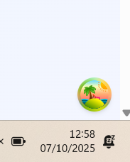

## Funcionalidad, caché y optimizaciones

- Descargo el backend en Nest de Herrera

> https://github.com/Klerith/nest-heroes-backend

- La entity de Hero es esta

~~~js
export class Hero {
  id: string;
  name: string;
  slug: string;
  alias: string;
  powers: string[];
  description: string;
  strength: number;
  intelligence: number;
  speed: number;
  durability: number;
  team: string;
  image: string;
  firstAppearance: string;
  status: string;
  category: string;
  universe: string;
}
~~~

- El controlador

~~~js
@Controller('heroes')
export class HeroesController {
  constructor(private readonly heroesService: HeroesService) {}

  @Post()
  create(@Body() createHeroDto: CreateHeroDto) {
    return this.heroesService.create(createHeroDto);
  }

  @Get()
  findAll(@Query() paginationDto: PaginationDto) {
    return this.heroesService.findAll(paginationDto);
  }

  @Get('/summary')
  getDashboardData() {
    return this.heroesService.getHeroSummary();
  }

  @Get('/search')
  findByAdvancedSearch(
    @Query() advancedSearchDto: AdvancedSearchDto = {},
  ): Hero[] {
    return this.heroesService.findByAdvancedSearch(advancedSearchDto);
  }

  @Get(':id')
  findOne(@Param('id') id: string) {
    return this.heroesService.findOne(id);
  }

  @Patch(':id')
  update(@Param('id') id: string, @Body() updateHeroDto: UpdateHeroDto) {
    return this.heroesService.update(id, updateHeroDto);
  }

  @Delete(':id')
  remove(@Param('id') id: string) {
    return this.heroesService.remove(id);
  }
}
~~~

- El servicio (no hay db, usa un arreglo de héroes)

~~~js
import {
  BadRequestException,
  Injectable,
  NotFoundException,
} from '@nestjs/common';
import { CreateHeroDto } from './dto/create-hero.dto';
import { UpdateHeroDto } from './dto/update-hero.dto';
import { Hero } from './entities/hero.entity';
import { heroesData } from 'src/data/heroes.data';
import { PaginationDto } from 'src/common/dto/pagination.dto';
import { AdvancedSearchDto } from './dto/advande-search.dto';

@Injectable()
export class HeroesService {
  private heroes: Hero[] = structuredClone(heroesData);

  create(createHeroDto: CreateHeroDto) {
    const hero = {
      ...createHeroDto,
      id: `${this.heroes.length + 1}`,
      slug: createHeroDto.name.toLowerCase().replace(/ /g, '-'),
    };

    this.heroes.push(hero);

    return hero;
  }

  findAll(paginationDto: PaginationDto) {
    const { limit = 6, offset = 0, category = 'all' } = paginationDto;

    let heroes = [...this.heroes];
    let heroCount = heroes.length;

    if (category !== 'all') {
      heroes = heroes.filter(
        (hero) => hero.category.toLowerCase() === category.toLowerCase(),
      );
      heroCount = heroes.length;
    }

    heroes = heroes.slice(offset, offset + limit);

    return {
      total: heroCount,
      pages: Math.ceil(heroCount / limit),
      heroes,
    };
  }

  findOne(idOrSlug: string) {
    const hero = this.heroes.find(
      (hero) => hero.id === idOrSlug || hero.slug === idOrSlug,
    );

    if (!hero) {
      throw new NotFoundException('Hero not found');
    }

    return hero;
  }

  update(id: string, updateHeroDto: UpdateHeroDto) {
    const hero = this.findOne(id);

    return {
      ...hero,
      ...updateHeroDto,
    };
  }

  remove(id: string) {
    const hero = this.findOne(id);

    this.heroes = this.heroes.filter((hero) => hero.id !== id);

    return hero;
  }

  getHeroSummary() {
    const heroes = this.heroes;
    const totalHeroes = heroes.length;
    const strongestHero = heroes.reduce((max, hero) =>
      hero.strength > max.strength ? hero : max,
    );
    const smartestHero = heroes.reduce((max, hero) =>
      hero.intelligence > max.intelligence ? hero : max,
    );

    const heroCount = heroes.reduce((acc, hero) => {
      if (hero.category === 'Hero') {
        return acc + 1;
      }

      return acc;
    }, 0);

    const villainCount = heroes.reduce((acc, hero) => {
      if (hero.category === 'Villain') {
        return acc + 1;
      }

      return acc;
    }, 0);

    return {
      totalHeroes,
      strongestHero,
      smartestHero,
      heroCount,
      villainCount,
    };
  }

  findByAdvancedSearch(advancedSearchDto: AdvancedSearchDto) {
    const { name, team, category, universe, status, strength } =
      advancedSearchDto;

    if (!name && !team && !category && !universe && !status && !strength) {
      throw new BadRequestException(
        'At least one search parameter is required',
      );
    }

    let filteredHeroes = [...this.heroes];

    if (name) {
      filteredHeroes = filteredHeroes.filter(
        (hero) =>
          hero.name.toLowerCase().includes(name.toLowerCase()) ||
          hero.alias.toLowerCase().includes(name.toLowerCase()),
      );
    }

    if (team) {
      filteredHeroes = filteredHeroes.filter((hero) =>
        hero.team.toLowerCase().includes(team.toLowerCase()),
      );
    }

    if (category) {
      filteredHeroes = filteredHeroes.filter((hero) =>
        hero.category.toLowerCase().includes(category.toLowerCase()),
      );
    }

    if (universe) {
      filteredHeroes = filteredHeroes.filter((hero) =>
        hero.universe.toLowerCase().includes(universe.toLowerCase()),
      );
    }

    if (status) {
      filteredHeroes = filteredHeroes.filter((hero) =>
        hero.status.toLowerCase().includes(status.toLowerCase()),
      );
    }

    if (strength) {
      filteredHeroes = filteredHeroes.filter(
        (hero) => hero.strength >= strength,
      );
    }

    return filteredHeroes.sort((a, b) => a.name.localeCompare(b.name));
  }
}
~~~

- Un objeto dentro del arreglo de heroes en heroes.data.ts luce así

~~~js
{
    id: '1',
    name: 'Clark Kent',
    slug: 'clark-kent',
    alias: 'Superman',
    powers: [
      'Súper fuerza',
      'Vuelo',
      'Visión de calor',
      'Visión de rayos X',
      'Invulnerabilidad',
      'Súper velocidad',
    ],
    description:
      'El Último Hijo de Krypton, protector de la Tierra y símbolo de esperanza para toda la humanidad.',
    strength: 10,
    intelligence: 8,
    speed: 9,
    durability: 10,
    team: 'Liga de la Justicia',
    image: '1.jpeg',
    firstAppearance: '1938',
    status: 'Active',
    category: 'Hero',
    universe: 'DC',
  },
~~~

- En public/images tengo las imágenes
- Para correr el server uso **npm run start:dev**
- Se monta en el localhost:3000

### Axios, variables de entorno y API

- Creo .env
- La variable de entorno debe empezar por VITE_

~~~
VITE_API_URL=http://localhost:3000
~~~

- Coloco el .env en el .gitignore
- Creo la copia .env.template
- Instalo axios con npm i axios
- En src/heroes/api/hero.api.ts

~~~js
import axios from 'axios'

const BASE_URL = import.meta.env.VITE_API_URL

export const heroApi = axios.create({
    baseURL: `${BASE_URL}/api/heroes`
})
~~~

- Hagamos una petición http básica
- En src/heroes/actions/get-heroes-by-page.action.ts
- El contenido de api y heroes es código agnóstico, por eso lo separo en carpetas dentro de heroes

~~~js
import { heroApi } from "../api/hero.api"

export const getHeroesByPageAction = async()=>{
    const {data} = await heroApi.get('/')

    return data
}
~~~

- Hago la petición http en el HomePage
- Es tradicional usar un useEffect

~~~js
export default function HomePage() {

  const [activeTab, setActiveTab] = useState<
  'all'| 'favorites'| 'heroes' |'villains'
    >("all")

    useEffect(()=>{
      getHeroesByPage().then(heroes=>{
        console.log({heroes})
      })
    },[])

{...code}
}
~~~

- Me imprime en consola el arreglo de heroes (dos veces por el modo estricto de React)
- Habría que manejar el error con un catch, muchas cosas pueden ir mal
- Y que tal si quiero reintentarlo, no puedo con el useEffect
- Además cada vez que se rerenderiza el componente se vuelve a disparar el useEffect
- No se aconseja usar el useEffect actualmente. Usaremos TanStackQuery

### TanStack Query - Gestor de estado asíncrono

- Voy a querer guardar el resultado de la petición en caché y que este solo viva un tiempo determinado
- Lo instalo

> npm i @tanstack/react-query

- Conviene instalar el plugin de eslint

> npm i -D @tanstack/eslint-plugin-query

- La configuración pasa por crear un queryClient, en el punto más álgido de la aplicación después del main
- HeroesApp.tsx

~~~js
import { RouterProvider } from "react-router"
import { appRouter } from "./router/app.router"
import {QueryClient, QueryClientProvider} from '@tanstack/react-query'

const queryClient = new QueryClient()

export const HeroesApp = () => {

  return (
    <QueryClientProvider client={queryClient}>
      <RouterProvider router={appRouter}/>
    </QueryClientProvider>
    
  )
}
~~~

- Hay que instalar también las devTools

> npm i @tanstack/react-query-devtools

- Las añado al HeroesApp.tsx

~~~js
import { RouterProvider } from "react-router"
import { appRouter } from "./router/app.router"
import {QueryClient, QueryClientProvider} from '@tanstack/react-query'
import {ReactQueryDevtools} from "@tanstack/react-query-devtools"

const queryClient = new QueryClient()

export const HeroesApp = () => {

  return (
    <QueryClientProvider client={queryClient}>
      <RouterProvider router={appRouter}/>
      <ReactQueryDevtools initialIsOpen={false} />
    </QueryClientProvider>
  )
}
~~~

- Se ve un icono como este en el navegador, abre una consola de Tanstak Query

- Vayamos al HomePage a mejorar la petición http con Tanstak Query
- El objeto de configuración de useQuery de Tanstak Query pide dos propiedades, la queryKey (un arreglo) que es lo que va aindicar un espacio en memoria donde queremos guardar el resultado de esta posición, el segundo argumento es el queryFunction, la función que quiero ejecutar
- staleTime guarda en caché la data de heroes el tiempo estimado (en este caso 5 minutos)
- Así evito que la petición se vuelva a realizar con cada renderizado
- Por ahora solo desestructuro la data

~~~js
export default function HomePage() {

  const [activeTab, setActiveTab] = useState<
  'all'| 'favorites'| 'heroes' |'villains'
    >("all")

  const {data} = useQuery({
    queryKey:['heroes'],
    queryFn: ()=>getHeroesByPageAction(),
    staleTime: 1000*60*5 //5 minutos
  })

  return (
    {...code}
  )}
~~~

- Añado un console.log()

~~~js
import { heroApi } from "../api/hero.api"

export const getHeroesByPageAction = async()=>{
    const {data} = await heroApi.get('/')
    console.log({data})
    return data
}
~~~

### Tipado estricto de la data

- Una manera es copiar la respuesta desde POSTMAN y usar PasteJSONAsCode
- Creo src/heroes/types/get-heroes.response.ts

~~~js
export interface HeroesResponse {
    total:  number;
    pages:  number;
    heroes: Hero[];
}

export interface Hero {
    id:              string;
    name:            string;
    slug:            string;
    alias:           string;
    powers:          string[];
    description:     string;
    strength:        number;
    intelligence:    number;
    speed:           number;
    durability:      number;
    team:            string;
    image:           string;
    firstAppearance: string;
    status:          string;
    category:        string;
    universe:        string;
}
~~~

- Corto la interfaz de Hero y la pongo en otro archivo en /types/hero.interface.ts
- Tipemos la data en getHeroesByPageAction

~~~js
import { heroApi } from "../api/hero.api"
import type { HeroesResponse } from "../types/get-heroes.response"

export const getHeroesByPageAction = async(): Promise<HeroesResponse>=>{
    const {data} = await heroApi.get<HeroesResponse>('/')
    console.log({data})
    return data
}
~~~

- De esta manera tengo tipado

~~~js
data.heroes[0]. //tengo la ayuda
~~~

- Esto infiere en la data desestructurada del useQuery en el HomePage
- Las imágenes están en mi backend, en localhost:3000/images/1.jpeg
- Hay que mapear la data

~~~js
import { heroApi } from "../api/hero.api"
import type { HeroesResponse } from "../types/get-heroes.response"

const BASE_URL = import.meta.env.VITE_API_URL

export const getHeroesByPageAction = async(): Promise<HeroesResponse>=>{
    const {data} = await heroApi.get<HeroesResponse>('/')
    
    const heroes = data.heroes.map(hero=>({
        ...hero,
        image: `${BASE_URL}/images/${hero.image}`
     }))

    return {
        ...data,
        heroes
    }
}
~~~

- Añado un console.log de la data desestructurada del useQuery en el HomePage
- Ahora en los resultados de la consola de Tanstak Query en el navegador obtengo en la propiedad image la url http://localhost:3000/images/1.jpeg en el primer héroe de los 6 que hay
- Si coloco esta url http://localhost:3000/images/1.jpeg en el navegador veo la imagen de Superman

### Mostrar la data de los héroes

- Renombro la data a heroesResponse porque puede ser que haga otras peticiones http

~~~js
const {data: heroesResponse} = useQuery({
    queryKey:['heroes'],
    queryFn: ()=>getHeroesByPageAction(),
    staleTime: 1000 * 60 * 5 //5 minutos
  })

  console.log({heroesResponse})
~~~

- Pasemos la data al componente HeroGrid del primer tab (All characters)
- HomePage.tsx

~~~js
{/* Tabs */}
<Tabs value={activeTab} className="mb-8">
  <TabsList className="grid w-full grid-cols-4">
    <TabsTrigger 
      onClick={()=>setActiveTab('all')}
      value="all">All Characters (16)</TabsTrigger>
    <TabsTrigger 
      onClick={()=>setActiveTab('favorites')}
      value="favorites" className="flex items-center gap-2">
      <Heart className="h-4 w-4" />
      Favorites (3)
    </TabsTrigger>
    <TabsTrigger 
      onClick={()=>setActiveTab('heroes')}
      value="heroes">Heroes (12)</TabsTrigger>
    <TabsTrigger 
      onClick={()=>setActiveTab('villains')}
      value="villains">Villains (2)</TabsTrigger>
  </TabsList>
  <TabsContent value="all">
  {/*Mostrar todos los personajes*/}
    <HeroGrid heroes={heroesResponse?.heroes ?? []}/> ---> AQUI!
  </TabsContent>
  <TabsContent value="favorites">
    {/*Mostrar los personajes favoritos*/}
    <HeroGrid heroes={[]}/>
  </TabsContent>
  <TabsContent value="heroes">
    {/*Mostrar todos los heroes*/}
    <HeroGrid heroes={[]}/>
  </TabsContent>
  <TabsContent value="villains">
    {/*Mostrar todos los villanos*/}
    <HeroGrid heroes={[]}/>
  </TabsContent>
</Tabs>

~~~

- En HeroGrid.tsx hago el .map

~~~js
import type { Hero } from "../types/hero.interface"
import { HeroCard } from "./HeroCard"

interface Props{
  heroes: Hero[]
}

export const HeroGrid = ({heroes}: Props) => {
  return (
    

      {heroes.map(hero=>(
        <HeroCard hero={hero} key={hero.id}/>
      ))}
    

  )
}
~~~

- Ahora puedo pasarle la info a HeroCard.tsx
- Hago el renderizado condicional del active en green o red según esté 'active' o no

~~~js

  

  <Badge variant="secondary" className="text-xs bg-white/90 text-gray-700">
    {hero.status}
  </Badge>

~~~

- Las imagenes todavía no se ven bien
- Podría renderizar un color según el Universe (DC u otros) 

~~~js
{/* Universe badge */}

{
  hero.universe === 'DC' ?(
    <Badge className="absolute top-3 right-3 text-xs bg-blue-600 text-white">{hero.universe}</Badge>
  ):(
    <Badge className="absolute top-3 right-3 text-xs bg-indigo-600 text-white">{hero.universe}</Badge>          
  )
}
~~~

- Pongo el hero.name, hero.alias, etc
- El progreso está basado en de 0 a 100 por lo que multiplico el valor por 10
- HeroCard.tsx

~~~js
import { Card, CardContent, CardHeader } from "@/components/ui/card"
import { Badge } from "@/components/ui/badge"
import  { Button } from "@/components/ui/button"
import  { Progress } from "@/components/ui/progress"
import { Heart, Eye, Zap, Brain, Gauge, Shield } from "lucide-react"
import type { Hero } from "../types/hero.interface"

interface Props{
  hero: Hero
}

export const HeroCard = ({hero}: Props) => {
  return (
    <Card className="group overflow-hidden hover:shadow-xl transition-all duration-300 hover:-translate-y-1 bg-gradient-to-br from-white to-gray-50">
      

        

        {/* Status indicator */}
        

          

          <Badge variant="secondary" className="text-xs bg-white/90 text-gray-700">
            {hero.status}
          </Badge>
        

        {/* Universe badge */}

      {
        hero.universe === 'DC' ?(
          <Badge className="absolute top-3 right-3 text-xs bg-blue-600 text-white">{hero.universe}</Badge>
        ):(
          <Badge className="absolute top-3 right-3 text-xs bg-indigo-600 text-white">{hero.universe}</Badge>          
        )
      }

        {/* Favorite button */}
        <Button size="sm" variant="ghost" className="absolute bottom-3 right-3 bg-white/90 hover:bg-white">
          <Heart className="h-4 w-4 fill-red-500 text-red-500" />
        </Button>

        {/* View details button */}
        <Button
          size="sm"
          variant="ghost"
          className="absolute bottom-3 left-3 bg-white/90 hover:bg-white opacity-0 group-hover:opacity-100 transition-opacity"
        >
          <Eye className="h-4 w-4 text-gray-600" />
        </Button>
      

      <CardHeader className="pb-3">
        

          

            <h3 className="font-bold text-lg leading-tight">{hero.alias}</h3>
            
{hero.name}

          

          <Badge className="text-xs bg-green-100 text-green-800 border-green-200">{hero.category}</Badge>
        

        <Badge variant="outline" className="w-fit text-xs">
          {hero.team}
        </Badge>
      </CardHeader>

      <CardContent className="space-y-4">
        

          {hero.description}
        

        {/* Stats */}
        

          

            

              <Zap className="h-3 w-3 text-orange-500" />
              Strength
            

            <Progress value={hero.strength*10} className="h-2" activeColor="bg-orange-500" />
          

          

            

              <Brain className="h-3 w-3 text-blue-500" />
              Intelligence
            

            <Progress value={hero.intelligence*10} className="h-2" activeColor="bg-blue-500" />
          

          

            

              <Gauge className="h-3 w-3 text-green-500" />
              Speed
            

            <Progress value={hero.speed*10} className="h-2" activeColor="bg-green-500"/>
          

          

            

              <Shield className="h-3 w-3 text-purple-500" />
              Durability
            

            <Progress value={hero.durability*10} className="h-2" activeColor="bg-purple-500" />
          

        

        {/* Powers */}
        

          <h4 className="font-medium text-sm">Powers:</h4>
          

            {hero.powers.map(power=>(
              <Badge variant="outline" className="text-xs" key={hero.id}>
                {power}
              </Badge>
            ))}
          

        

        
Primera aparición: {hero.firstAppearance}

      </CardContent>
    </Card>
  )
}
~~~

- El arreglo final con los superpoderes, algunos tienen muchos y eso ocupa mucho espacio de la card, quiero mostrar solo 3 o 4
- Usemos slice, que regresa un arreglo

~~~js
 {/* Powers */}

  <h4 className="font-medium text-sm">Powers:</h4>
  

    {hero.powers.slice(0,3).map(power=>(
      <Badge variant="outline" className="text-xs" key={power}>
        {power}
      </Badge>
    ))}
  

~~~

- Si el hero.powers pasa de 3, indico cuantos poderes más le quedan

~~~js
{/* Powers */}

  <h4 className="font-medium text-sm">Powers:</h4>
  

    {hero.powers.slice(0,3).map(power=>(
      <Badge variant="outline" className="text-xs" key={power}> 
        {power}
      </Badge>
    ))}
    {
      hero.powers.length > 3 && (
        <Badge variant="outline" className="text-xs">
        +{hero.powers.length - 3} more
      </Badge>
      )
    }
  

~~~

### Navegación manual dentro de las tarjetas

- Primero corrijamos las imágenes para que se vean bien en el HeroCard
- Le quito el overflow-hidden al div

~~~js

    
~~~

- Pero ahora no se ve el nombre del superhéroe ni el alias
- Uso el Gist de Fernando con las clases para el CardHeader

~~~js
<CardHeader className="py-3 z-10 bg-gray-100/50 backdrop-blur-sm relative top-1 group-hover:top-[-10px] transition-all duration-300">
~~~

- Como usé la etiqueta de clase group en el div principal, todos los elementos que tengan group reaccionan al mismo tiempo
- Vayamos con la navegación, usemos useNavigate
- De momento dirigiremos al /heroes/1 porque no tenemos ningñun elemento dinámico en el router
- Coloco la función en el onClick de la imagen

~~~js
export const HeroCard = ({hero}: Props) => {

  const navigate = useNavigate()

  const handleClick =()=>{
    navigate(`/heroes/1`)
  }

  return (
    <Card className="group overflow-hidden hover:shadow-xl transition-all duration-300 hover:-translate-y-1 bg-gradient-to-br from-white to-gray-50">
      

        
        {...code}
  )}
~~~

- Creo un path con * en el router para aquellas rutas que den error, redirecciono a /heroes/1
- app.router.tsx

~~~js
import { createBrowserRouter, Navigate } from "react-router";
import  HomePage  from "@/heroes/pages/home/HomePage";
import  HeroPage  from "@/heroes/pages/hero/HeroPage";
import { AdminPage } from "@/admin/pages/AdminPage";
import { HeroesLayout } from "@/heroes/layouts/HeroesLayout";
import { lazy } from "react";

const SearchPage = lazy(()=>import("@/heroes/pages/search/SearchPage"))
const AdminLayout = lazy(()=>import("@/admin/layout/AdminLayout"))

export const appRouter = createBrowserRouter([
    {
        path: '/',
        element: <HeroesLayout />,
        children:[
    {
        index: true,
        element: <HomePage />
    },
    {
        path: '/heroes/1',
        element: <HeroPage />
    },
    {
        path: '/search',
        element: <SearchPage />
    },
    {
        path: '*',
        element: <Navigate to="/heroes/1"/>
    }
    ]},
    
    {
        path: '/admin',
        element: <AdminLayout/>,
        children:[
            {
                index: true,
                element: <AdminPage />
            }
        ]
    }
])
~~~

- Los bugs de google y facebook prefieren trabajar con nombres en las urls que con ids
- Hago un pequeño cambio entonces en la url del handleClick de la imagen

~~~js
export const HeroCard = ({hero}: Props) => {

  const navigate = useNavigate()

  const handleClick =()=>{
    navigate(`/heroes/${hero.slug}`)
  }

{...code}
}
~~~

- Para crear la ruta dinámica es sencillo

~~~js
import { createBrowserRouter, Navigate } from "react-router";
import  HomePage  from "@/heroes/pages/home/HomePage";
import  HeroPage  from "@/heroes/pages/hero/HeroPage";
import { AdminPage } from "@/admin/pages/AdminPage";
import { HeroesLayout } from "@/heroes/layouts/HeroesLayout";
import { lazy } from "react";

const SearchPage = lazy(()=>import("@/heroes/pages/search/SearchPage"))
const AdminLayout = lazy(()=>import("@/admin/layout/AdminLayout"))

export const appRouter = createBrowserRouter([
    {
        path: '/',
        element: <HeroesLayout />,
        children:[
    {
        index: true,
        element: <HomePage />
    },
    {
        path: '/heroes/:idSlug', //AQUI!
        element: <HeroPage />
    },
    {
        path: '/search',
        element: <SearchPage />
    },
    {
        path: '*',
        element: <Navigate to="/heroes/1"/>
    }
    ]},
    
    {
        path: '/admin',
        element: <AdminLayout/>,
        children:[
            {
                index: true,
                element: <AdminPage />
            }
        ]
    }
])
~~~

- Para desestructurar el idSlug de la URL usaremos el useParams
- HeroPage.tsx

~~~js
const {idSlug=''} = useParams()
~~~

### QueryParameters sobre useState

- Con el useState que tengo en las tabs, cuando clico en una tab se en que tab estoy
- Pero de esta manera, si le paso un link a un amigo, ese state se pierde
- Tengo este state

~~~js
const [activeTab, setActiveTab] = useState<
'all'| 'favorites'| 'heroes' |'villains'
  >("all")
~~~

- Para solucionarlo vamos a usar queryParameters (son opcionales, siempre pueden ser null)
- setSearchParams me va a permitir añadir query parameters en la URL, como ?page=1&limit=5

~~~js
export default function HomePage() {

  const [searchParams, setSearchParams] = useSearchParams()

  console.log({searchParams}) //me devuelve size 2 si hay page y limit

  const [activeTab, setActiveTab] = useState<
  'all'| 'favorites'| 'heroes' |'villains'
    >("all")

{...code}
}
~~~

- Para obtener los queryParameters uso la función .get()
- Siempre devuelve strings

~~~js
const [searchParams, setSearchParams] = useSearchParams()

console.log(searchParams.get('page')) //obtengo el valor del queryParameter page
~~~

- Vamos a mandar un queryParameter tab, para usarlo como tab=all por ejemplo , o tab=favorites
- Uso setSearchParams para setear la tab

~~~js
import {Heart} from "lucide-react"
import { Tabs, TabsContent, TabsList, TabsTrigger } from "@/components/ui/tabs"
import { CustomJumbotron } from "@/components/custom/CustomJumbotron"
import { HeroStats } from "@/heroes/components/HeroStats"
import { HeroGrid } from "@/heroes/components/HeroGrid"
import { useState } from "react"
import { CustomPagination } from "@/components/custom/CustomPagination"
import { SearchControls } from "../search/ui/SearchControls"
import { CustomBreadcrumb } from "@/components/custom/CustomBreadcrumb"
import { getHeroesByPageAction } from "@/heroes/actions/get-heroes-by-page.action"
import { useQuery } from "@tanstack/react-query"
import { useSearchParams } from "react-router"

export default function HomePage() {

  const [searchParams, setSearchParams] = useSearchParams()

  const activeTab = searchParams.get('tab') ?? 'all'
  

  /* const [activeTab, setActiveTab] = useState<
  'all'| 'favorites'| 'heroes' |'villains'
    >("all") */

  const {data: heroesResponse} = useQuery({

    queryKey:['heroes'],
    queryFn: ()=>getHeroesByPageAction(),
    staleTime: 1000 * 60 * 5 //5 minutos
  })

  console.log({heroesResponse})

  return (
    <>
      <>
        {/* Header */}
        <CustomJumbotron title="Universo de Superhéroes" description="Descubre, explora y administra superhéroes"/>

        {/*Breadcrumb*/}
        <CustomBreadcrumb currentPage="Super Héroes" />

        {/* Stats Dashboard */}
        <HeroStats />

        {/* Advanced Filters */}
          <SearchControls />

        {/* Tabs */}
        <Tabs value={activeTab} className="mb-8">
          <TabsList className="grid w-full grid-cols-4">
            <TabsTrigger 
              onClick={()=>setSearchParams('?tab=all')}
              value="all">All Characters (16)</TabsTrigger>
            <TabsTrigger 
              onClick={()=>setSearchParams('?tab=favorites')}
              value="favorites" className="flex items-center gap-2">
              <Heart className="h-4 w-4" />
              Favorites (3)
            </TabsTrigger>
            <TabsTrigger 
              onClick={()=>setSearchParams('?tab=heroes')}
              value="heroes">Heroes (12)</TabsTrigger>
            <TabsTrigger 
              onClick={()=>setSearchParams('?tab=villains')}
              value="villains">Villains (2)</TabsTrigger>
          </TabsList>
          <TabsContent value="all">
          {/*Mostrar todos los personajes*/}
           <HeroGrid heroes={heroesResponse?.heroes ?? []}/>
          </TabsContent>
          <TabsContent value="favorites">
            {/*Mostrar los personajes favoritos*/}
           <HeroGrid heroes={[]}/>
          </TabsContent>
          <TabsContent value="heroes">
            {/*Mostrar todos los heroes*/}
           <HeroGrid heroes={[]}/>
          </TabsContent>
          <TabsContent value="villains">
            {/*Mostrar todos los villanos*/}
           <HeroGrid heroes={[]}/>
          </TabsContent>
        </Tabs>

        {/* Pagination */}
        <CustomPagination totalPages={3}/>
      </>
    </>
  )
}
~~~

- Para conservar el valor previo y que no se pierda (por ejemplo el page de ?tab=favorites%page=2) uso el previous value

~~~js
<TabsTrigger 
  onClick={()=>setSearchParams((prev)=>{
    prev.set('tab', 'all')
    return prev
  })}
  value="all">All Characters (16)</TabsTrigger>
~~~

- Lo hago con todas las tabs

~~~jsx
{/* Tabs */}
<Tabs value={activeTab} className="mb-8">
  <TabsList className="grid w-full grid-cols-4">
    <TabsTrigger 
      onClick={()=>setSearchParams((prev)=>{
        prev.set('tab', 'all')
        return prev
      })}
      value="all">All Characters (16)</TabsTrigger>
    <TabsTrigger 
          onClick={()=>setSearchParams((prev)=>{
        prev.set('tab', 'favorites')
        return prev
      })}
      value="favorites" className="flex items-center gap-2">
      <Heart className="h-4 w-4" />
      Favorites (3)
    </TabsTrigger>
    <TabsTrigger
        onClick={()=>setSearchParams((prev)=>{
        prev.set('tab', 'heroes')
        return prev
      })} 
      value="heroes">Heroes (12)</TabsTrigger>
    <TabsTrigger 
        onClick={()=>setSearchParams((prev)=>{
        prev.set('tab', 'villains')
        return prev
      })}
      value="villains">Villains (2)</TabsTrigger>
  </TabsList>
  <TabsContent value="all">
~~~

- De esta manera, si paso de all a favorites y tengo otro queryParameter en la URL no se borra
- Ahora, si alguien escribe cualquier burrada en tab=ljhouhouh se rompe la aplicación
- Para evitar esto es conveniente validar el valor de la tab

~~~js
export default function HomePage() {

  const [searchParams, setSearchParams] = useSearchParams()

  const activeTab = searchParams.get('tab') ?? 'all'
  const selectedTab = useMemo(()=>{
    const validTabs = ['all', 'favorites', 'heroes', 'villains']

    return validTabs.includes(activeTab) ? activeTab : 'all'

  },[activeTab])
{...code}
~~~

- Añado selectedTab como value 

~~~js
 {/* Tabs */}
<Tabs value={selectedTab} className="mb-8">
  <TabsList className="grid w-full grid-cols-4">
    <TabsTrigger 
      onClick={()=>setSearchParams((prev)=>{
        prev.set('tab', 'all');
        return prev
      })}
      value="all">All Characters (16)</TabsTrigger>
~~~

- Ahora si la persona escribe en la url un tab que no corresponde lo corrige a 'all'

### Paginar datos

- Si apunto un GET a /api/heroes me devuelve un JSON con un total de 25 heroes y 5 páginas (6 héroes por página, hay una página que solo tiene 1 héroe)
- Así se hizo el backend, si quieres cambiarlo será mediante queryParameters (así está hecho el backend)
- Si pongo el limit en 10 para que muestre 10 héroes, con 3 páginas se muestra todo 
- Tengo el limit y el offset
- Con el oofset si quiero la página 1 sería el 0 (con el limit en 6), si quiero la página 2 sería offset=6, la página 3 sería en 12
- La lógica es sencilla. page-1 = 0 * limit (que es 6) == 0. El oofset en 0
  - Si la página es 2, 2-1 = 1, 1*limit= 6, el offset es en 6
- En get-heroesByPageAction uso el objeto params de axios para setear el limit y el offset

~~~js
import { heroApi } from "../api/hero.api"
import type { HeroesResponse } from "../types/get-heroes.response"

const BASE_URL = import.meta.env.VITE_API_URL

export const getHeroesByPageAction = async(
    page: number, 
    limit: number = 6
    ): Promise<HeroesResponse>=>{

    const {data} = await heroApi.get<HeroesResponse>('/',{
        params:{
            limit,
            offset: (page-1) * limit
        }
    })
    
    const heroes = data.heroes.map(hero=>({
        ...hero,
        image: `${BASE_URL}/images/${hero.image}`
     }))

    return {
        ...data,
        heroes
    }
}
~~~

- La página también la vamos a recibir como queryParameter
- En el Homepage

~~~js
{...code}
const page= searchParams.get('page') ?? '1'

 const {data: heroesResponse} = useQuery({

    queryKey:['heroes'],
    queryFn: ()=>getHeroesByPageAction(+page),
    staleTime: 1000 * 60 * 5 //5 minutos
  })
{...code}
~~~

- Castear el page con + para transformar el string a úmero puede darme problemas, ya que si el usuario escribe texto me dara NaN
- En algún lugar tengo que hacer la validación de esto, la hago en la acción

~~~js
import { heroApi } from "../api/hero.api"
import type { HeroesResponse } from "../types/get-heroes.response"

const BASE_URL = import.meta.env.VITE_API_URL

export const getHeroesByPageAction = async(
    page: number, 
    limit: number = 6
    ): Promise<HeroesResponse>=>{

    if(isNaN(page)){ //AQUI!
        page=1
    }
    const {data} = await heroApi.get<HeroesResponse>('/',{
        params:{
            limit,
            offset: (page-1) * limit
        }
    })
    
    const heroes = data.heroes.map(hero=>({
        ...hero,
        image: `${BASE_URL}/images/${hero.image}`
     }))

    return {
        ...data,
        heroes
    }
}
~~~

- Si escribo un texto en page= me redirecciona a la page=1
- Para ver otros héroes apunto a otras páginas

> http://localhost:5173/?tab=all&page=2

- Voy con el limit

~~~js
{...code}
const limit = searchParams.get('limit') ?? '6'

const {data: heroesResponse} = useQuery({

    queryKey:['heroes'],
    queryFn: ()=>getHeroesByPageAction(+page, +limit),
    staleTime: 1000 * 60 * 5 //5 minutos
  })
{...code}
~~~

- La misma vaina con el limit, lo valido en la acción

~~~js
if(isNaN(limit)){
        limit=6
    }
~~~

- Lo que tengo en caché cuando miro las devTools de Tanstak Query en el navegador, no me está guardando el limit ni el offset
- Ya funciona la paginación
- Ahora falta que el componente de paginación que hay en el footer trabaje de la manera esperada

### Componente de paginación

- Si pongo el limit en 20 solo tendré 2 páginas
- Este es un cálculo que debe hacerse
- Entonces lo que debo paginar es el url
- En el HomePage coloco el totalPages que tengo en el heroesResponse
- Como puede ser undefined coloco un valor por si no viene nada

~~~js
 {/* Pagination */}
<CustomPagination totalPages={heroesResponse?.pages ?? 2}/>
~~~

- Vamos al CustomPagination
- Obtengo los parámetros de la URL con .get
- Hago la validación en el handlePage, si la página es menor de uno o mayor a totalPages se sale con el return
- Necesito preservar las tabs en el URL, por eso usamos el callback con prev en Tabs
- Hay otra manera , es usando searchParams.set 
- Al searchParams tengo que pasarle un string, por eso el toString
- Debo setear el searchParams con el nuevo valor usando el setSearchParams para que lo aplique
- Le paso la función handlePageChange al onClick del botón de anteriores con el page-1

~~~js
export const CustomPagination = ({totalPages}: Props) => {

  const [searchParams, setSearchParams] =useSearchParams()

  const queryPage = searchParams.get('page') ?? '1'

  const page = isNaN(+queryPage) ? 1 : +queryPage

  const handlePageChange = (page: number)=>{
    if(page < 1 || page > totalPages) return 
    
    searchParams.set('page', page.toString())
    setSearchParams(searchParams)
  }

  return (
    

        <Button 
        onClick={()=>handlePageChange(page-1)}
        variant="outline" size="sm" disabled={page === 1}>
        <ChevronLeft className="h-4 w-4" />
        Anteriores
        </Button>
  {...code}
  )
}
~~~

- Si coloco el queryParameter page=3 y le doy al Botón Anteriores retrocede en la página (todavía no cambia de página)
- La page es un número porque ya lo validamos
- En el array de botones le coloco index+1 porque el primer valor del índice es 0
- Hago lo mismo en el otro Botón pero con page +1

~~~js
import { ChevronLeft, ChevronRight } from "lucide-react"
import { Button } from "../ui/button"
import { useSearchParams } from "react-router"

interface Props{
  totalPages: number
}

export const CustomPagination = ({totalPages}: Props) => {

  const [searchParams, setSearchParams] =useSearchParams()

  const queryPage = searchParams.get('page') ?? '1'

  const page = isNaN(+queryPage) ? 1 : +queryPage

  const handlePageChange = (page: number)=>{
    if(page < 1 || page > totalPages) return 

    searchParams.set('page', page.toString())
    setSearchParams(searchParams)
  }

  return (
    

        <Button 
        onClick={()=>handlePageChange(page-1)}
        variant="outline" size="sm" disabled={page === 1}>
        <ChevronLeft className="h-4 w-4" />
        Anteriores
        </Button>

        {
          Array.from({length: totalPages}).map((__, index)=>(

            <Button 
            onClick={()=>handlePageChange(index+1)}
              variant={page === index+1? 'default': 'outline'} 
              size="sm"
              key={index}
              >{index+1}
            </Button>
          ))
        }

        {/*Elipsis*/}
       {/*  <Button variant="ghost" size="sm" disabled>
        <MoreHorizontal className="h-4 w-4" />
        </Button> */}

        <Button 
          onClick={()=>handlePageChange(page+1)}
          variant="outline" 
          disabled={page=== totalPages}
          size="sm"
          >
        Siguiente
        <ChevronRight className="h-4 w-4" />
        </Button>
    

  )
}
~~~

- De esta manera se mantienen los otros queryParameters (tabs, limit, etc)
- Si recargo el navegador se mantiene la info, si le paso el link a alguien lo muestra también en la página, con los tabs que yo haya puesto
- Si yo cambio a la página 2 sin recargar el navegador **no carga los héroes de la página 2**, pero si recargo el navegador si
- No se está haciendo la petición
- Si voy al HomePage donde tengo el useQuery de TanstakQuery
- El queryKey le va a indicar cuando hacer la petición. También va junto al staleTime
- Si le coloco la page, cada vez que la página cambie va a hacer la petición y la guardará en caché
- HomePage.tsx

~~~js
const {data: heroesResponse} = useQuery({

  queryKey:['heroes', {page, limit}],
  queryFn: ()=>getHeroesByPageAction(+page, +limit),
  staleTime: 1000 * 60 * 5 //5 minutos
})
~~~

- **Cuando la función dentro de Tanstak Query recibe parámetros, esos parámetros deben estar en el queryKey**
  - En este caso page y limit
- Vamos con el Summary que es la parte que hay en el header con totalCharacters, Favorites, Strongest y Smartest

### Mostrar resumen estadístico

- Olvidémonos de los favoritos de momento
- En las Tabs tenemos el número de villanos, de héroes, todos y favoritos
- En la página de búsqueda de superhéroes también tenemos el Summary
- Cuando voy a la página búsqueda de superheroes se renderiza el componente por lo que se dispara una nueva petición, no si la tengo en caché
- El endpoint es 

> /api/heroes/summary

- Me devuelve esto

~~~json
{
    "totalHeroes": 25,
    "strongestHero": {
        "id": "1",
        "name": "Clark Kent",
        "slug": "clark-kent",
        "alias": "Superman",
        "powers": [
            "Súper fuerza",
            "Vuelo",
            "Visión de calor",
            "Visión de rayos X",
            "Invulnerabilidad",
            "Súper velocidad"
        ],
        "description": "El Último Hijo de Krypton, protector de la Tierra y símbolo de esperanza para toda la humanidad.",
        "strength": 10,
        "intelligence": 8,
        "speed": 9,
        "durability": 10,
        "team": "Liga de la Justicia",
        "image": "1.jpeg",
        "firstAppearance": "1938",
        "status": "Active",
        "category": "Hero",
        "universe": "DC"
    },
    "smartestHero": {
        "id": "2",
        "name": "Bruce Wayne",
        "slug": "bruce-wayne",
        "alias": "Batman",
        "powers": [
            "Artes marciales",
            "Habilidades de detective",
            "Tecnología avanzada",
            "Sigilo",
            "Genio táctico"
        ],
        "description": "El Caballero Oscuro de Ciudad Gótica, que utiliza el miedo como arma contra el crimen y la corrupción.",
        "strength": 6,
        "intelligence": 10,
        "speed": 6,
        "durability": 7,
        "team": "Liga de la Justicia",
        "image": "2.jpeg",
        "firstAppearance": "1939",
        "status": "Active",
        "category": "Hero",
        "universe": "DC"
    },
    "heroCount": 18,
    "villainCount": 7
}
~~~

- Creo la acción en heroes/actions/get-summary.action.ts
- En heroes/types creo la interfaz usando PasteJSONasCode, uso la interfaz que ya tengo de Hero

~~~js
import type { Hero } from "./hero.interface";

export interface SummaryInformationResponse {
    totalHeroes:   number;
    strongestHero: Hero;
    smartestHero:  Hero;
    heroCount:     number;
    villainCount:  number;
}
~~~

- Tipo la response usando el BASE_URL de axios

~~~js
import { heroApi } from "../api/hero.api"
import type { SummaryInformationResponse } from "../types/summary-information.response"

export const getSummaryAction = async ()=>{

    const {data} = await heroApi.get<SummaryInformationResponse>('/summary')

    return data
}
~~~

- El componente del Summary es heroes/components/HeroStats 
- Uso Tanstak Query, renombro la data a summary
- Uso summary-information como key

~~~js
import { Badge } from "@/components/ui/badge"
import { Card, CardContent, CardHeader, CardTitle } from "@/components/ui/card"
import { Heart, Trophy, Users, Zap } from "lucide-react"
import { HeroStatCard } from "./HeroStatCard"
import { useQuery } from "@tanstack/react-query"
import { getSummaryAction } from "../actions/get-summary.action"

export const HeroStats = () => {

  const {data: summary} = useQuery({
    queryKey:['summary-information'],
    queryFn: ()=> getSummaryAction(),
    staleTime: 1000 * 60 * 5 //5 minutos
  })

  return (
     

          <Card>
            <CardHeader className="flex flex-row items-center justify-between space-y-0 pb-2">
              <CardTitle className="text-sm font-medium">Total Characters</CardTitle>
              <Users className="h-4 w-4 text-muted-foreground" />
            </CardHeader>
            <CardContent>
              
{summary?.totalHeroes}

              

                <Badge variant="secondary" className="text-xs">
                  {summary?.heroCount} Heroes
                </Badge>
                <Badge variant="destructive" className="text-xs">
                  {summary?.villainCount} Villains
                </Badge>
              

            </CardContent>
          </Card>

          <HeroStatCard 
            title="Favorites" 
            icon={<Heart className="h-4 w-4 text-muted-foreground" />}
            >
                
3

                
18% del total

            </HeroStatCard>

            <HeroStatCard
                title="Strongest"
                icon={<Zap className="h-4 w-4 text-muted-foreground" />}
                >
                  
{summary?.strongestHero.name}

                  
Strength: {summary?.strongestHero.strength}

                </HeroStatCard>

            <HeroStatCard
                title="Smartest"
                icon={<Trophy className="h-4 w-4 text-muted-foreground" />}
            >
              
{summary?.smartestHero.name}

              
Intelligence: {summary?.smartestHero.intelligence}

            </HeroStatCard>
        

  )
}
~~~

- Esta data es la misma que necesito para las tabs (all characters, heroes, villains...favoritos de momento no)
- Para eso hacemos un customHook

### CustomHook - useSummary

- Debo elevar el uso de useQuery al HomePage
- Para usarlo tipo unas props en el componente

~~~js
interface Props{
  summary: SummaryInformationResponse | undefined
}

export const HeroStats = ({summary}: Props) => {
  {...code}
}
~~~

- Elevo el useQuey al HomePage y se lo paso al componente

~~~js
{...code}

 const {data: summary} = useQuery({
    queryKey:['summary-information'],
    queryFn: ()=> getSummaryAction(),
    staleTime: 1000 * 60 * 5 //5 minutos
  })

{...code}

{/* Stats Dashboard */}
<HeroStats  summary={summary}/>

{...code}
~~~

- Ahora puedo usar la data del summary para las tabs también
- HomePage.tsx

~~~js
{/* Tabs */}
<Tabs value={selectedTab} className="mb-8">
  <TabsList className="grid w-full grid-cols-4">
    <TabsTrigger 
      onClick={()=>setSearchParams((prev)=>{
        prev.set('tab', 'all');
        return prev
      })}
      value="all">All Characters {summary?.totalHeroes}</TabsTrigger>
    <TabsTrigger 
          onClick={()=>setSearchParams((prev)=>{
        prev.set('tab', 'favorites');
        return prev
      })}
      value="favorites" className="flex items-center gap-2">
      <Heart className="h-4 w-4" />
      Favorites (3)
    </TabsTrigger>
    <TabsTrigger
        onClick={()=>setSearchParams((prev)=>{
        prev.set('tab', 'heroes');
        return prev
      })} 
      value="heroes">Heroes {summary?.heroCount}</TabsTrigger>
    <TabsTrigger 
        onClick={()=>setSearchParams((prev)=>{
        prev.set('tab', 'villains');
        return prev
      })}
      value="villains">Villains {summary?.villainCount}</TabsTrigger>
  </TabsList>
  <TabsContent value="all">
  {/*Mostrar todos los personajes*/}
    <HeroGrid heroes={heroesResponse?.heroes ?? []}/>
  </TabsContent>
  <TabsContent value="favorites">
    {/*Mostrar los personajes favoritos*/}
    <HeroGrid heroes={[]}/>
  </TabsContent>
  <TabsContent value="heroes">
    {/*Mostrar todos los heroes*/}
    <HeroGrid heroes={[]}/>
  </TabsContent>
  <TabsContent value="villains">
    {/*Mostrar todos los villanos*/}
    <HeroGrid heroes={[]}/>
  </TabsContent>
</Tabs>
~~~

- Vamos a crear un customHook para reutilizar el código
- En el objeto de useQuery además de la data puedo desestructurar el error, isLoading, etc...
- Puedo retornar el objeto entero, haciendo el hook de wrapper
- heroes/hooks/useHeroSummary.tsx

~~~js
import { useQuery } from "@tanstack/react-query"
import { getSummaryAction } from "../actions/get-summary.action"

export const useHeroSummary = () => {
    return useQuery({
    queryKey:['summary-information'],
    queryFn: ()=> getSummaryAction(),
    staleTime: 1000 * 60 * 5 //5 minutos
  })
}
~~~

- Usemos el hook en HomePage!

~~~js
const {data: summary, error, isLoading} = useHeroSummary() 
~~~

- Hago lo mismo con el useQuery de heroes en el HomePage
- heroes/hooks/useHeroes.tsx

~~~js
import { useQuery } from "@tanstack/react-query"
import { getHeroesByPageAction } from "../actions/get-heroes-by-page.action"

export const usePaginatedHeroes = (page:number, limit: number) => {
  return useQuery({

    queryKey:['heroes', {page, limit}],
    queryFn: ()=>getHeroesByPageAction(+page, +limit),
    staleTime: 1000 * 60 * 5 //5 minutos
  })
}
~~~

- Le paso el page y el limit en el HomePage

~~~js
const {data: heroesResponse} = usePaginatedHeroes(+page, +limit)
~~~

- Podemos pasar toda esta lógica de las tabs a un customHook

~~~js
export default function HomePage() {

  //ESTA LÓGICA EN UN CUSTOMHOOK
  const [searchParams, setSearchParams] = useSearchParams()

  const activeTab = searchParams.get('tab') ?? 'all'
  
  const page= searchParams.get('page') ?? '1'

  const limit = searchParams.get('limit') ?? '6'
  
  const selectedTab = useMemo(()=>{
    const validTabs = ['all', 'favorites', 'heroes', 'villains']

    return validTabs.includes(activeTab) ? activeTab : 'all'

  },[activeTab])

{...code}
}
~~~

- heroes/hooks/useQueryParameters

~~~js
import { useMemo } from "react"
import { useSearchParams } from "react-router"

export const useQueryParameters = () => {
  
  const [searchParams, setSearchParams] = useSearchParams()

  const activeTab = searchParams.get('tab') ?? 'all'
  
  const page= searchParams.get('page') ?? '1'

  const limit = searchParams.get('limit') ?? '6'
  
  const selectedTab = useMemo(()=>{
    const validTabs = ['all', 'favorites', 'heroes', 'villains']

    return validTabs.includes(activeTab) ? activeTab : 'all'

  },[activeTab])
  
    return {
        activeTab,
        page,
        limit,
        setSearchParams, 
        selectedTab
    }

}
~~~

- Lo uso en HomePage.tsx

~~~js
import {Heart} from "lucide-react"
import { Tabs, TabsContent, TabsList, TabsTrigger } from "@/components/ui/tabs"
import { CustomJumbotron } from "@/components/custom/CustomJumbotron"
import { HeroStats } from "@/heroes/components/HeroStats"
import { HeroGrid } from "@/heroes/components/HeroGrid"
import { CustomPagination } from "@/components/custom/CustomPagination"
import { SearchControls } from "../search/ui/SearchControls"
import { CustomBreadcrumb } from "@/components/custom/CustomBreadcrumb"
import { useSearchParams } from "react-router"
import { useMemo } from "react"

import { useHeroSummary } from "@/heroes/hooks/useHeroSummary"
import { usePaginatedHeroes } from "@/heroes/hooks/usePaginatedHeroes"
import { useQueryParameters } from "@/heroes/hooks/useQueryParameters"

export default function HomePage() {

  const {page, limit, setSearchParams, selectedTab}= useQueryParameters()

  const {data: heroesResponse} = usePaginatedHeroes(+page, +limit)

  const {data: summary, error, isLoading} = useHeroSummary() 

  return (
    <>
      <>
        {/* Header */}
        <CustomJumbotron title="Universo de Superhéroes" description="Descubre, explora y administra superhéroes"/>

        {/*Breadcrumb*/}
        <CustomBreadcrumb currentPage="Super Héroes" />

        {/* Stats Dashboard */}
        <HeroStats  summary={summary}/>

        {/* Advanced Filters */}
          <SearchControls />

        {/* Tabs */}
        <Tabs value={selectedTab} className="mb-8">
          <TabsList className="grid w-full grid-cols-4">
            <TabsTrigger 
              onClick={()=>setSearchParams((prev)=>{
                prev.set('tab', 'all');
                return prev
              })}
              value="all">All Characters {summary?.totalHeroes}</TabsTrigger>
            <TabsTrigger 
                 onClick={()=>setSearchParams((prev)=>{
                prev.set('tab', 'favorites');
                return prev
              })}
              value="favorites" className="flex items-center gap-2">
              <Heart className="h-4 w-4" />
              Favorites (3)
            </TabsTrigger>
            <TabsTrigger
                onClick={()=>setSearchParams((prev)=>{
                prev.set('tab', 'heroes');
                return prev
              })} 
              value="heroes">Heroes {summary?.heroCount}</TabsTrigger>
            <TabsTrigger 
                onClick={()=>setSearchParams((prev)=>{
                prev.set('tab', 'villains');
                return prev
              })}
              value="villains">Villains {summary?.villainCount}</TabsTrigger>
          </TabsList>
          <TabsContent value="all">
          {/*Mostrar todos los personajes*/}
           <HeroGrid heroes={heroesResponse?.heroes ?? []}/>
          </TabsContent>
          <TabsContent value="favorites">
            {/*Mostrar los personajes favoritos*/}
           <HeroGrid heroes={[]}/>
          </TabsContent>
          <TabsContent value="heroes">
            {/*Mostrar todos los heroes*/}
           <HeroGrid heroes={[]}/>
          </TabsContent>
          <TabsContent value="villains">
            {/*Mostrar todos los villanos*/}
           <HeroGrid heroes={[]}/>
          </TabsContent>
        </Tabs>

        {/* Pagination */}
        <CustomPagination totalPages={heroesResponse?.pages ?? 2}/>
      </>
    </>
  )
}
~~~

### Paginar por categoría

- Falta la paginación por héroes y villanos con las Tabs (además de favoritos)
- ¿Cómo le pasamos la data? Menos mal que la tenemos en caché con Tanstak Query!
- Implementemos el queryParameter category (all, Villain, Hero)
- Cuando cambiemos la categoría también vamos a tener que cambiar la paginación
- En el useQueryParameters obtengo el category

~~~js
import { useMemo } from "react"
import { useSearchParams } from "react-router"

export const useQueryParameters = () => {
  
  const [searchParams, setSearchParams] = useSearchParams()

  const activeTab = searchParams.get('tab') ?? 'all'
  
  const page= searchParams.get('page') ?? '1'

  const limit = searchParams.get('limit') ?? '6'

  const category = searchParams.get('category') ?? 'all'
  
  const selectedTab = useMemo(()=>{
    const validTabs = ['all', 'favorites', 'heroes', 'villains']

    return validTabs.includes(activeTab) ? activeTab : 'all'

  },[activeTab])
  
    return {
        activeTab,
        page,
        limit,
        setSearchParams, 
        selectedTab,
        category
    }
}
~~~

- Hay que modificar el usePaginatedHero para pasarle el category 

~~~js
import { useQuery } from "@tanstack/react-query"
import { getHeroesByPageAction } from "../actions/get-heroes-by-page.action"

export const usePaginatedHeroes = (page:number, limit: number, category: string='all') => {
  return useQuery({

    queryKey:['heroes', {page, limit, category}],
    queryFn: ()=>getHeroesByPageAction(+page, +limit, category),
    staleTime: 1000 * 60 * 5 //5 minutos
  })
}

~~~

- En heroes/actions/getHeroesByPage.avtion.ts

~~~js
import { heroApi } from "../api/hero.api"
import type { HeroesResponse } from "../types/get-heroes.response"

const BASE_URL = import.meta.env.VITE_API_URL

export const getHeroesByPageAction = async(
    page: number, 
    limit: number = 6,
    category: string = 'all'
    ): Promise<HeroesResponse>=>{

    if(isNaN(page)){
        page=1
    }

    if(isNaN(limit)){
        limit=6
    }
    const {data} = await heroApi.get<HeroesResponse>('/',{
        params:{
            limit,
            offset: (page-1) * limit,
            category
        }
    })
    
    const heroes = data.heroes.map(hero=>({
        ...hero,
        image: `${BASE_URL}/images/${hero.image}`
     }))

    return {
        ...data,
        heroes
    }
}
~~~

- En el HomePage.tsx extraigo el category del useQueryParameters y se lo paso al usePaginatedHeroes

~~~js
export default function HomePage() {

const {page, limit, setSearchParams, selectedTab, category}= useQueryParameters()

  const {data: heroesResponse} = usePaginatedHeroes(+page, +limit, category)

  const {data: summary} = useHeroSummary() 

{...code}
}
~~~

- De esta manera, usando Tanstack Query me hace la paginación por category, que además maneja el caché
- Hay algo. Deberíamos estar en la Tab de Villanos si colocamos el &category=villains
- Al hacer clicks en los tabs hay que cambiar la category
- Añado al Grid {heroesResponse?.heroes ?? []}
- heroes/pages/home/HomePage.tsx

~~~js
{/* Tabs */}
<Tabs value={selectedTab} className="mb-8">
  <TabsList className="grid w-full grid-cols-4">
    <TabsTrigger 
      onClick={()=>setSearchParams((prev)=>{
        prev.set('tab', 'all');
        prev.set('category', 'all')
        return prev
      })}
      value="all">All Characters {summary?.totalHeroes}</TabsTrigger>
    <TabsTrigger 
          onClick={()=>setSearchParams((prev)=>{
        prev.set('tab', 'favorites');
        return prev
      })}
      value="favorites" className="flex items-center gap-2">
      <Heart className="h-4 w-4" />
      Favorites (3)
    </TabsTrigger>
    <TabsTrigger
        onClick={()=>setSearchParams((prev)=>{
        prev.set('tab', 'heroes');
        prev.set('category', 'hero');
        return prev
      })} 
      value="heroes">Heroes {summary?.heroCount}</TabsTrigger>
    <TabsTrigger 
        onClick={()=>setSearchParams((prev)=>{
        prev.set('tab', 'villains');
        prev.set('category', 'villain');
        return prev
      })}
      value="villains">Villains {summary?.villainCount}</TabsTrigger>
  </TabsList>
  <TabsContent value="all">
  {/*Mostrar todos los personajes*/}
    <HeroGrid heroes={heroesResponse?.heroes ?? []}/>
  </TabsContent>
  <TabsContent value="favorites">
    {/*Mostrar los personajes favoritos*/}
    <HeroGrid heroes={[]}/>
  </TabsContent>
  <TabsContent value="heroes">
    {/*Mostrar todos los heroes*/}
    <HeroGrid heroes={heroesResponse?.heroes ?? []} />
  </TabsContent>
  <TabsContent value="villains">
    {/*Mostrar todos los villanos*/}
    <HeroGrid heroes={heroesResponse?.heroes ?? []} />
  </TabsContent>
</Tabs>
~~~

- Los favoritos lo dejamos de momento (...)
- De esta manera tengo la navegación por querys, y la paginación automática gracias a Tanstack Query
- Ahora hay otra cosa. Si yo estoy en la Tab de All Characters y voy a la página 12, y paso a la Tab de Villains no hay página 12
  - Muestra solo las páginas que contendrían los Villains pero no muestra ninguna Card
  - Debo resetear la página a la 1
- HomePage.tsx

~~~js
{/* Tabs */}
<Tabs value={selectedTab} className="mb-8">
  <TabsList className="grid w-full grid-cols-4">
    <TabsTrigger 
      onClick={()=>setSearchParams((prev)=>{
        prev.set('tab', 'all');
        prev.set('category', 'all')
        prev.set('page', '1') //Reseteo la página
        return prev
      })}
      value="all">All Characters {summary?.totalHeroes}</TabsTrigger>
    <TabsTrigger 
          onClick={()=>setSearchParams((prev)=>{
        prev.set('tab', 'favorites');
        return prev
      })}
      value="favorites" className="flex items-center gap-2">
      <Heart className="h-4 w-4" />
      Favorites (3)
    </TabsTrigger>
    <TabsTrigger
        onClick={()=>setSearchParams((prev)=>{
        prev.set('tab', 'heroes');
        prev.set('category', 'hero');
        prev.set('page', '1')
        return prev
      })} 
      value="heroes">Heroes {summary?.heroCount}</TabsTrigger>
    <TabsTrigger 
        onClick={()=>setSearchParams((prev)=>{
        prev.set('tab', 'villains');
        prev.set('category', 'villain');
        prev.set('page', '1')
        return prev
      })}
      value="villains">Villains {summary?.villainCount}</TabsTrigger>
  </TabsList>
  <TabsContent value="all">
  {/*Mostrar todos los personajes*/}
    <HeroGrid heroes={heroesResponse?.heroes ?? []}/>
  </TabsContent>
  <TabsContent value="favorites">
    {/*Mostrar los personajes favoritos*/}
    <HeroGrid heroes={[]}/>
  </TabsContent>
  <TabsContent value="heroes">
    {/*Mostrar todos los heroes*/}
    <HeroGrid heroes={heroesResponse?.heroes ?? []} />
  </TabsContent>
  <TabsContent value="villains">
    {/*Mostrar todos los villanos*/}
    <HeroGrid heroes={heroesResponse?.heroes ?? []} />
  </TabsContent>
</Tabs>
~~~

### Página del héroe

- Voy a tener que pasar esta data basada en Tanstack Query

~~~js
const superheroData = {
  id: "1",
  name: "Clark Kent",
  alias: "Superman",
  powers: ["Súper fuerza", "Vuelo", "Visión de calor", "Visión de rayos X", "Invulnerabilidad", "Súper velocidad"],
  description: "El Último Hijo de Krypton, protector de la Tierra y símbolo de esperanza para toda la humanidad.",
  strength: 10,
  intelligence: 8,
  speed: 9,
  durability: 10,
  team: "Liga de la Justicia",
  image: "/placeholder.svg?height=300&width=300",
  firstAppearance: "1938",
  status: "Activo",
  category: "Héroe",
  universe: "DC",
}
~~~

- El endpoint es

> /api/heroes/clark-kent

- Creo la acción heroes/actions/get-hero.action.ts

~~~js
import { heroApi } from "../api/hero.api"
import type { Hero } from "../types/hero.interface"

const BASE_URL = import.meta.env.VITE_API_URL

export const getHeroAction =async (idSlug: string)=>{

    const {data} = await heroApi.get<Hero>(`/${idSlug}`)

    return {
        ...data,
        image: `${BASE_URL}/images/${data.image}`
    }
}
~~~

- Ahora creo el wrapper para el useQuery de Tanstack Query en /heroes/hooks/useHero.tsx

~~~jsx
import { useQuery } from "@tanstack/react-query"
import { getHeroAction } from "../actions/get-hero.action"

export const useHero=(idSlug: string)=>{

    return useQuery({
        queryKey:['heroes', idSlug],
        queryFn: ()=>getHeroAction(idSlug),
        staleTime: 1000 * 60 * 5
    })
}
~~~

- Puedo aislar el HeroPage por componentes (tarea!)
- En HeroPage extraigo el idSlug de los params
- Uso el hook para extraer la data, la renombro
- Me marca errores porque la data puede venir undefined
- Hago la validación de si viene la data y muestro un loading si no viene

~~~js
import { Badge } from "@/components/ui/badge"
import { Card, CardContent, CardHeader, CardTitle } from "@/components/ui/card"
import { Progress } from "@/components/ui/progress"
import { Tabs, TabsContent, TabsList, TabsTrigger } from "@/components/ui/tabs"
import { useHero } from "@/heroes/hooks/useHero"
import { Shield, Zap, Brain, Gauge, Users, Star, Award } from "lucide-react"
import { useParams } from "react-router"

const superheroData = {
  id: "1",
  name: "Clark Kent",
  alias: "Superman",
  powers: ["Súper fuerza", "Vuelo", "Visión de calor", "Visión de rayos X", "Invulnerabilidad", "Súper velocidad"],
  description: "El Último Hijo de Krypton, protector de la Tierra y símbolo de esperanza para toda la humanidad.",
  strength: 10,
  intelligence: 8,
  speed: 9,
  durability: 10,
  team: "Liga de la Justicia",
  image: "/placeholder.svg?height=300&width=300",
  firstAppearance: "1938",
  status: "Activo",
  category: "Héroe",
  universe: "DC",
}

export default function HeroPage() {

  const {idSlug=''} = useParams()

  const {data: superheroData}= useHero(idSlug)

  if(!superheroData){
    return <h3>Loading...</h3>
  }

  const totalPower =
    superheroData.strength + superheroData.intelligence + superheroData.speed + superheroData.durability
  const averagePower = Math.round((totalPower / 4) * 10)

  const getStatusColor = (status: string) => {
    switch (status.toLowerCase()) {
      case "activo":
        return "bg-green-500"
      case "inactivo":
        return "bg-gray-500"
      case "retirado":
        return "bg-blue-500"
      default:
        return "bg-gray-500"
    }
  }

  const getCategoryColor = (category: string) => {
    switch (category.toLowerCase()) {
      case "héroe":
        return "bg-blue-500"
      case "villano":
        return "bg-red-500"
      case "antihéroe":
        return "bg-purple-500"
      default:
        return "bg-gray-500"
    }
  }

  return (
    

      {/* Header Banner */}
      

        

          

            

              
              

                

                  <Star className="w-6 h-6" />
                

              

            

            

              

                <Badge className={`${getCategoryColor(superheroData.category)} text-white`}>
                  {superheroData.category}
                </Badge>
                <Badge className={`${getStatusColor(superheroData.status)} text-white`}>{superheroData.status}</Badge>
                <Badge variant="secondary" className="bg-white/20 text-white border-white/30">
                  {superheroData.universe}
                </Badge>
              

              <h1 className="text-4xl md:text-6xl font-bold mb-2">{superheroData.alias}</h1>
              
{superheroData.name}

              
{superheroData.description}

            

            

              

                
{averagePower}%

                
Nivel de Poder

                

                  {[...Array(5)].map((_, i) => (
                    <Star
                      key={i}
                      className={`w-4 h-4 ${i < Math.floor(averagePower / 20) ? "text-yellow-400 fill-current" : "text-gray-400"}`}
                    />
                  ))}
                

              

            

          

        

      

      {/* Main Content */}
      

        <Tabs defaultValue="stats" className="w-full">
          <TabsList className="grid w-full grid-cols-4 mb-8">
            <TabsTrigger value="stats" className="flex items-center gap-2">
              <Gauge className="w-4 h-4" />
              Estadísticas
            </TabsTrigger>
            <TabsTrigger value="powers" className="flex items-center gap-2">
              <Zap className="w-4 h-4" />
              Poderes
            </TabsTrigger>
            <TabsTrigger value="team" className="flex items-center gap-2">
              <Users className="w-4 h-4" />
              Equipo
            </TabsTrigger>
            <TabsTrigger value="info" className="flex items-center gap-2">
              <Award className="w-4 h-4" />
              Información
            </TabsTrigger>
          </TabsList>

          <TabsContent value="stats" className="space-y-6">
            

              {/* Strength */}
              <Card className="text-center">
                <CardContent className="pt-6">
                  

                    

                      <Zap className="w-8 h-8 text-red-600" />
                    

                  

                  <h3 className="font-semibold text-lg mb-2">Fuerza</h3>
                  
{superheroData.strength}

                  <Progress value={superheroData.strength * 10} className="h-2" />
                </CardContent>
              </Card>

              {/* Intelligence */}
              <Card className="text-center">
                <CardContent className="pt-6">
                  

                    

                      <Brain className="w-8 h-8 text-purple-600" />
                    

                  

                  <h3 className="font-semibold text-lg mb-2">Inteligencia</h3>
                  
{superheroData.intelligence}

                  <Progress value={superheroData.intelligence * 10} className="h-2" />
                </CardContent>
              </Card>

              {/* Speed */}
              <Card className="text-center">
                <CardContent className="pt-6">
                  

                    

                      <Gauge className="w-8 h-8 text-yellow-600" />
                    

                  

                  <h3 className="font-semibold text-lg mb-2">Velocidad</h3>
                  
{superheroData.speed}

                  <Progress value={superheroData.speed * 10} className="h-2" />
                </CardContent>
              </Card>

              {/* Durability */}
              <Card className="text-center">
                <CardContent className="pt-6">
                  

                    

                      <Shield className="w-8 h-8 text-green-600" />
                    

                  

                  <h3 className="font-semibold text-lg mb-2">Resistencia</h3>
                  
{superheroData.durability}

                  <Progress value={superheroData.durability * 10} className="h-2" />
                </CardContent>
              </Card>
            

            {/* Power Comparison Chart */}
            <Card>
              <CardHeader>
                <CardTitle>Comparación de Habilidades</CardTitle>
              </CardHeader>
              <CardContent>
                

                  

                    
Fuerza

                    

                      <Progress value={superheroData.strength * 10} className="h-4" />
                    

                    
{superheroData.strength}/10

                  

                  

                    
Inteligencia

                    

                      <Progress value={superheroData.intelligence * 10} className="h-4" />
                    

                    
{superheroData.intelligence}/10

                  

                  

                    
Velocidad

                    

                      <Progress value={superheroData.speed * 10} className="h-4" />
                    

                    
{superheroData.speed}/10

                  

                  

                    
Resistencia

                    

                      <Progress value={superheroData.durability * 10} className="h-4" />
                    

                    
{superheroData.durability}/10

                  

                

              </CardContent>
            </Card>
          </TabsContent>

          <TabsContent value="powers">
            <Card>
              <CardHeader>
                <CardTitle className="flex items-center gap-2">
                  <Zap className="w-6 h-6 text-yellow-500" />
                  Superpoderes
                </CardTitle>
              </CardHeader>
              <CardContent>
                

                  {superheroData.powers.map((power, index) => (
                    

                      

                        

                          <Zap className="w-4 h-4 text-white" />
                        

                        {power}
                      

                    

                  ))}
                

              </CardContent>
            </Card>
          </TabsContent>

          <TabsContent value="team">
            <Card>
              <CardHeader>
                <CardTitle className="flex items-center gap-2">
                  <Users className="w-6 h-6 text-green-500" />
                  Afiliación de Equipo
                </CardTitle>
              </CardHeader>
              <CardContent>
                

                  

                    <Users className="w-12 h-12 text-green-600" />
                  

                  <h3 className="text-2xl font-bold text-green-700 mb-2">{superheroData.team}</h3>
                  
Miembro activo del equipo de superhéroes más poderoso

                

              </CardContent>
            </Card>
          </TabsContent>

          <TabsContent value="info">
            

              <Card>
                <CardHeader>
                  <CardTitle>Detalles Personales</CardTitle>
                </CardHeader>
                <CardContent className="space-y-4">
                  

                    Nombre Real:
                    {superheroData.name}
                  

                  

                    Alias:
                    {superheroData.alias}
                  

                  

                    Categoría:
                    <Badge className={`${getCategoryColor(superheroData.category)} text-white`}>
                      {superheroData.category}
                    </Badge>
                  

                  

                    Estado:
                    <Badge className={`${getStatusColor(superheroData.status)} text-white`}>
                      {superheroData.status}
                    </Badge>
                  

                </CardContent>
              </Card>

              <Card>
                <CardHeader>
                  <CardTitle>Información del Universo</CardTitle>
                </CardHeader>
                <CardContent className="space-y-4">
                  

                    Universo:
                    {superheroData.universe}
                  

                  

                    Primera Aparición:
                    {superheroData.firstAppearance}
                  

                  

                    Años Activo:
                    
                      {new Date().getFullYear() - Number.parseInt(superheroData.firstAppearance)} años
                    
                  

                </CardContent>
              </Card>
            

          </TabsContent>
        </Tabs>
      

    

  )
}
~~~

- Si alguien pone en la URL bruce-wayne123 tengo un error (de los 3 reintentos por defecto de Tanstack Query)
- Puedo poner el retry en false para que directamente lance el error

~~~js
import { useQuery } from "@tanstack/react-query"
import { getHeroAction } from "../actions/get-hero.action"

export const useHero=(idSlug: string)=>{

    return useQuery({
        queryKey:['heroes', idSlug],
        queryFn: ()=>getHeroAction(idSlug),
        staleTime: 1000 * 60 * 5,
        retry: false
    })
}
~~~

- Puedo extraer el isError del customHook en HeroPage

~~~js
const {data: superheroData, isError}= useHero(idSlug)

  if(isError){
    return <Navigate to="/" />
  }
~~~

- Falta lo de favoritos, los corazoncitos y el manejo de las búsquedas
