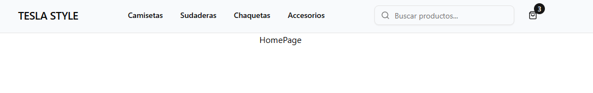
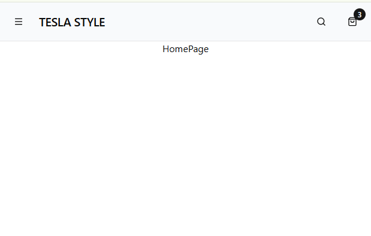
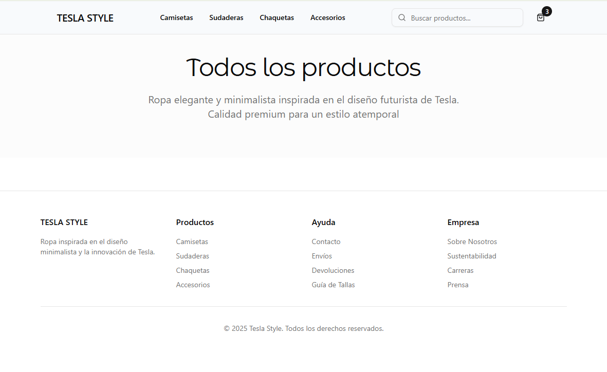
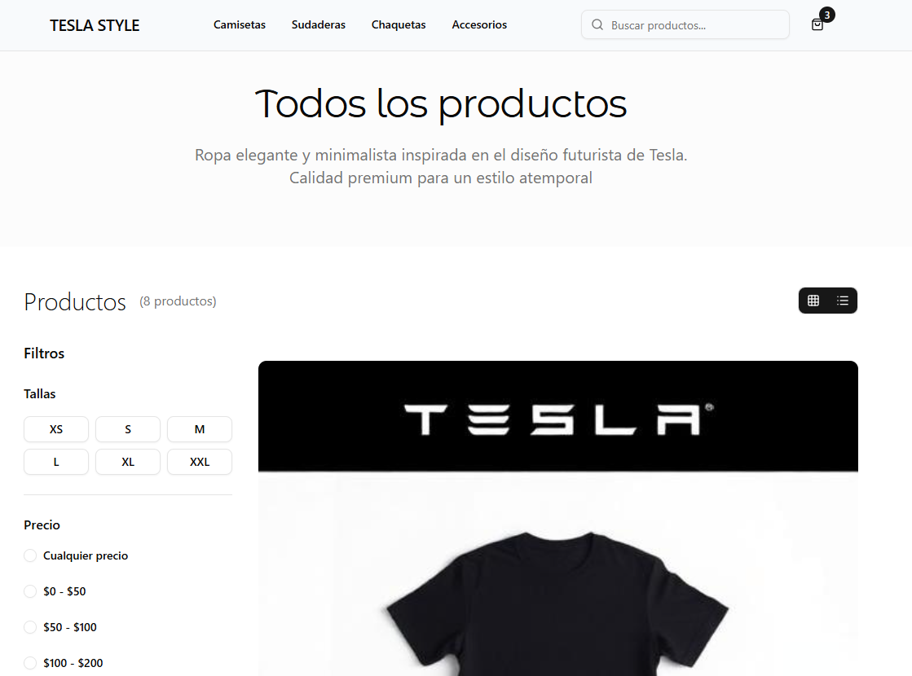
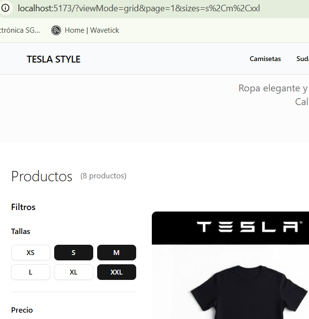

## Panel administrativo de productos

### Teslo Shop

> npm create vite@latest

- Usamos TypeScript + SWC
- Borro App.css y App.tsx, creo TesloShopApp.tsx usando el snippet rafc y lo renderizo en el main

~~~js
import { StrictMode } from 'react'
import { createRoot } from 'react-dom/client'
import './index.css'
import { TesloShopApp } from './TesloShopApp'

createRoot(document.getElementById('root')!).render(
  <StrictMode>
    <TesloShopApp />
  </StrictMode>,
)
~~~

- Creemos tres carpetas principales dentro de src
    - shop
        - layouts/ShopLayout.tsx
        - pages
            - home/HomePage.tsx
            - gender/GenderPage.tsx
            - product/ProductPage.tsx
    - admin
        - layouts/AdminLayout.tsx
        - pages
            - dashboard/DashboardPage.tsx
            - product/AdminProductPage.tsx
            - products/AdminProductsPage.tsx
    - auth
        - layouts/AuthLayout.tsx
        - pages
            - login/LoginPage.tsx
            - register/RegisterPage.tsx

### Configuración del router

- Creo en src/app.router.tsx

> npm i react-router

- Cuando son rutas hijas no inician con el /
- Para hacer uso del lazy para el lazy load **los componentes tienen que estar exportados por defecto**

~~~js
import { createBrowserRouter, Navigate } from "react-router";
import { ShopLayout } from "./shop/layouts/ShopLayout";
import { HomePage } from "./shop/pages/home/HomePage";
import { ProductPage } from "./shop/pages/product/ProductPage";
import { GenderPage } from "./shop/pages/gender/GenderPage";
import { LoginPage } from "./auth/pages/login/LoginPage";
import { RegisterPage } from "./auth/pages/register/RegisterPage";
import { DashboardPage } from "./admin/pages/dashboard/DashboardPage";
import { AdminProductsPage } from "./admin/pages/products/AdminProductsPage";
import { AdminProductPage } from "./admin/pages/product/AdminProductPage";
import { lazy } from "react";

const AuthLayout = lazy(()=> import("./auth/layouts/AuthLayout"))
const AdminLayout = lazy(()=> import ("./admin/layouts/AdminLayout"))

export const appRouter = createBrowserRouter([
    {
        path: '/',
        element: <ShopLayout />,
        children:[
           {
            index: true,
            element: <HomePage />
           },
           {
            path: 'product/:idSlug',
            element: <ProductPage />
           },
           {
            path: 'gender/:gender',
            element: <GenderPage />
           }
        ]
    },
    //Auth Routes
    {
        path:'/auth',
        element: <AuthLayout />,
        children:[
            {
                index: true,
                element: <Navigate to='/auth/login' />
            },
            {
                path: 'login',
                element: <LoginPage />
            },
            {
                path: 'register',
                element: <RegisterPage />
            }
        ]
    },
    //Admin routes
    {
        path:'/admin',
        element: <AdminLayout />,
        children:[
            {
                index: true,
                element: <DashboardPage />
            },
            {
                path: 'products',
                element: <AdminProductsPage />
            },
            {
                path: 'products/:id',
                element: <AdminProductPage />
            }
        ]
    },
    {
        path: '*',
        element: <Navigate to="/" />
    }
])
~~~

- Debo exportar por defecto para hacer el lazy load!

~~~js
const AuthLayout = () => {
  return (
    
AuthLayout

  )
}

export default AuthLayout
~~~

- Coloco el router en TesloShopApp

~~~js
import { RouterProvider } from "react-router"
import { appRouter } from "./app.router"

export const TesloShopApp = () => {
  return (
    <RouterProvider router={appRouter} />
  )
}

~~~

### Tailwind + Shadcn UI + Google Fonts

- Como trabajamos con Vite (auqnue trabajemos con React) vamos a la documentación para la instalación en un entorno creado con vite

> npm i tailwindcss @tailwindcss/vite

- En el index.css

~~~css
@import "tailwindcss";
~~~

- En el tsconfig.json añado el compilerOptions

~~~json
{
  "files": [],
  "references": [
    { "path": "./tsconfig.app.json" },
    { "path": "./tsconfig.node.json" }
  ],
    "compilerOptions": {
    "baseUrl": ".",
    "paths": {
      "@/*": ["./src/*"]
    }
  }
}
~~~

- En el tsconfig.app.json añado el baseUrl y los paths

~~~json
{
  "compilerOptions": {
    "tsBuildInfoFile": "./node_modules/.tmp/tsconfig.app.tsbuildinfo",
    "target": "ES2022",
    "useDefineForClassFields": true,
    "lib": ["ES2022", "DOM", "DOM.Iterable"],
    "module": "ESNext",
    "types": ["vite/client"],
    "skipLibCheck": true,

    /* Bundler mode */
    "moduleResolution": "bundler",
    "allowImportingTsExtensions": true,
    "verbatimModuleSyntax": true,
    "moduleDetection": "force",
    "noEmit": true,
    "jsx": "react-jsx",

    /* Linting */
    "strict": true,
    "noUnusedLocals": true,
    "noUnusedParameters": true,
    "erasableSyntaxOnly": true,
    "noFallthroughCasesInSwitch": true,
    "noUncheckedSideEffectImports": true
  },
    //shadcn
    "baseUrl": ".",
    "paths": {
      "@/*": [
        "./src/*"
      ]
    },
  "include": ["src"]
}
~~~

- Instalo los types de node

> npm install -D @types/node

- Actualizo vite.config.ts

~~~js
import { defineConfig } from 'vite'
import react from '@vitejs/plugin-react-swc'
import tailwindcss from '@tailwindcss/vite'
import path from 'path'

// https://vite.dev/config/
export default defineConfig({
   plugins: [react(), tailwindcss()],
  resolve: {
    alias: {
      "@": path.resolve(__dirname, "./src"),
    },
  },
})
~~~

- Ejecuta el CLI

> npx shadcn@latest init

- Selecciono Neutral
- Añado un botón

> npx shadcn@latest add button

- Recuerda que debes colocar el Outlet en los Layouts!

~~~js
import { Outlet } from "react-router"

export const ShopLayout = () => {
  return (
    

      <h1>ShopLayout</h1>
      <Outlet />
    

  )
}
~~~

- Hago lo mismo en el resto de Layouts
- Ahora ya puedo renderizar en los componentes

~~~js
import { Button } from "../../../components/ui/button"

export const HomePage = () => {
  return (
    

      <h1>HomePage</h1>
      <Button>Clicame!</Button>
    

  )
}
~~~

- Voy a Google Fonts, le doy a Get Font/ Get Embed Code, copio el código
- En change Styles marco light 300, Regular 400 y Bold 700

> https://fonts.google.com/specimen/Montserrat+Alternates

- Coloco el código en el index.html dentro del head

~~~html
<!doctype html>
<html lang="en">
  <head>
    <meta charset="UTF-8" />
    <link rel="icon" type="image/svg+xml" href="/vite.svg" />
    <meta name="viewport" content="width=device-width, initial-scale=1.0" />
    <title>teslo-shop</title>
    <link rel="preconnect" href="https://fonts.googleapis.com">
    <link rel="preconnect" href="https://fonts.gstatic.com" crossorigin>
    <link href="https://fonts.googleapis.com/css2?family=Montserrat+Alternates:wght@300;400;700&display=swap" rel="stylesheet">
  </head>
  <body>
    

    
  </body>
</html>
~~~

- En el index.css coloco este código sacado de google fonts

~~~css
.montserrat-alternates-light {
  font-family: "Montserrat Alternates", sans-serif;
  font-weight: 300;
  font-style: normal;
}

.montserrat-alternates-regular {
  font-family: "Montserrat Alternates", sans-serif;
  font-weight: 400;
  font-style: normal;
}

.montserrat-alternates-bold {
  font-family: "Montserrat Alternates", sans-serif;
  font-weight: 700;
  font-style: normal;
}
~~~

- Pero puedo usar tailwind para cargar las fuentes!

~~~css
@theme{
  --font-montserrat: "Montserrat Alternates", sans-serif;
}
~~~

- Ahora ya puedo usar la fuente

~~~jsx
import { Button } from "../../../components/ui/button"

export const HomePage = () => {
  return (
    

      <h1 className="font-montserrat">HomePage</h1> {/*si no pongo nada es font-normal*/}
      <h1 className="font-montserrat font-thin">HomePage</h1>
      <h1 className="font-montserrat font-normal">HomePage</h1>
      <h1 className="font-montserrat font-bold">HomePage</h1>
      <Button>Clicame!</Button>
    

  )
}
~~~

### Diseño del HomePage

- Tengo estos tres repositorios
- Loveable

> https://github.com/DevTalles-corp/threads-of-tesla-style/tree/main

- v0 Login

> https://github.com/Klerith/v0-two-card-login

- admin dashboard

> https://github.com/Klerith/bolt-admin-dashboard

- En el repo de Loveable tengo en src/pages/index.tsx esto

~~~jsx
import { useState } from "react";
import Header from "@/components/Header";
import ProductCard from "@/components/ProductCard";
import FilterSidebar from "@/components/FilterSidebar";
import { Button } from "@/components/ui/button";
import { Filter, Grid, List, ChevronLeft, ChevronRight } from "lucide-react";
import { products } from "@/data/products";

const Index = () => {
  const [showFilters, setShowFilters] = useState(false);
  const [viewMode, setViewMode] = useState<'grid' | 'list'>('grid');
  const [currentPage, setCurrentPage] = useState(1);
  const itemsPerPage = 6;
  
  // Calculate pagination
  const totalPages = Math.ceil(products.length / itemsPerPage);
  const startIndex = (currentPage - 1) * itemsPerPage;
  const endIndex = startIndex + itemsPerPage;
  const currentProducts = products.slice(startIndex, endIndex);
  
  const handlePageChange = (page: number) => {
    setCurrentPage(page);
    window.scrollTo({ top: 0, behavior: 'smooth' });
  };

  return (

    

      <Header />
      
      {/* Hero Section */}
      <section className="py-16 px-4 lg:px-8 bg-muted/30">
        

          <h1 className="text-5xl lg:text-7xl font-light tracking-tight mb-6">
            Estilo Tesla
          </h1>
          

            Ropa minimalista y elegante inspirada en el diseño futurista de Tesla. 
            Calidad premium para un estilo atemporal.
          

          <Button size="lg" className="rounded-full px-8">
            Explorar Colección
          </Button>
        

      </section>

      {/* Products Section */}
      <section className="py-12 px-4 lg:px-8">
        

          

            

              <h2 className="text-3xl font-light">Productos</h2>
              ({products.length} productos)
            

            
            

              <Button
                variant="outline"
                size="sm"
                onClick={() => setShowFilters(!showFilters)}
                className="lg:hidden"
              >
                <Filter className="h-4 w-4 mr-2" />
                Filtros
              </Button>
              
              

                <Button
                  variant={viewMode === 'grid' ? 'default' : 'ghost'}
                  size="sm"
                  onClick={() => setViewMode('grid')}
                  className="rounded-r-none"
                >
                  <Grid className="h-4 w-4" />
                </Button>
                <Button
                  variant={viewMode === 'list' ? 'default' : 'ghost'}
                  size="sm"
                  onClick={() => setViewMode('list')}
                  className="rounded-l-none"
                >
                  <List className="h-4 w-4" />
                </Button>
              

            

          

          

            {/* Filters Sidebar - Desktop */}
            

              <FilterSidebar />
            

            {/* Mobile Filters */}
            {showFilters && (
              

                

                  <h3 className="text-lg font-semibold">Filtros</h3>
                  <Button 
                    variant="ghost" 
                    size="sm"
                    onClick={() => setShowFilters(false)}
                  >
                    Cerrar
                  </Button>
                

                <FilterSidebar />
              

            )}

            {/* Products Grid */}
            

              

                {currentProducts.map((product) => (
                  <ProductCard
                    key={product.id}
                    id={product.id}
                    name={product.name}
                    price={product.price}
                    image={product.image}
                    category={product.category}
                  />
                ))}
              

              
              {/* Pagination */}
              {totalPages > 1 && (
                

                  <Button
                    variant="outline"
                    size="sm"
                    onClick={() => handlePageChange(currentPage - 1)}
                    disabled={currentPage === 1}
                    className="h-9 w-9 p-0"
                  >
                    <ChevronLeft className="h-4 w-4" />
                  </Button>
                  
                  

                    {Array.from({ length: totalPages }, (_, i) => i + 1).map((page) => (
                      <Button
                        key={page}
                        variant={currentPage === page ? "default" : "outline"}
                        size="sm"
                        onClick={() => handlePageChange(page)}
                        className="h-9 w-9 p-0"
                      >
                        {page}
                      </Button>
                    ))}
                  

                  
                  <Button
                    variant="outline"
                    size="sm"
                    onClick={() => handlePageChange(currentPage + 1)}
                    disabled={currentPage === totalPages}
                    className="h-9 w-9 p-0"
                  >
                    <ChevronRight className="h-4 w-4" />
                  </Button>
                

              )}
            

          

        

      </section>

      {/* Footer */}
      <footer className="border-t py-12 px-4 lg:px-8 mt-16">
        

          

            

              <h3 className="font-semibold mb-4">TESLA STYLE</h3>
              

                Ropa inspirada en el diseño minimalista y la innovación de Tesla.
              

            

            
            

              <h4 className="font-medium mb-4">Productos</h4>
              <ul className="space-y-2 text-sm text-muted-foreground">
                <li><a href="#" className="hover:text-foreground">Camisetas</a></li>
                <li><a href="#" className="hover:text-foreground">Sudaderas</a></li>
                <li><a href="#" className="hover:text-foreground">Chaquetas</a></li>
                <li><a href="#" className="hover:text-foreground">Accesorios</a></li>
              </ul>
            

            
            

              <h4 className="font-medium mb-4">Ayuda</h4>
              <ul className="space-y-2 text-sm text-muted-foreground">
                <li><a href="#" className="hover:text-foreground">Contacto</a></li>
                <li><a href="#" className="hover:text-foreground">Envíos</a></li>
                <li><a href="#" className="hover:text-foreground">Devoluciones</a></li>
                <li><a href="#" className="hover:text-foreground">Guía de Tallas</a></li>
              </ul>
            

            
            

              <h4 className="font-medium mb-4">Empresa</h4>
              <ul className="space-y-2 text-sm text-muted-foreground">
                <li><a href="#" className="hover:text-foreground">Sobre Nosotros</a></li>
                <li><a href="#" className="hover:text-foreground">Sustentabilidad</a></li>
                <li><a href="#" className="hover:text-foreground">Carreras</a></li>
                <li><a href="#" className="hover:text-foreground">Prensa</a></li>
              </ul>
            

          

          
          

            
&copy; 2024 Tesla Style. Todos los derechos reservados.

          

        

      </footer>
    

  );
};

export default Index;
~~~

- Vamos a irlo separando en componentes
- Empiezo copiando el div que lo contiene todo
- shop/layouts/ShopLayout.tsx

~~~jsx
import { Outlet } from "react-router"

export const ShopLayout = () => {
  return (
     

       <Outlet />
     
 
  )
}
~~~

- Lo siguiente es el Header
- Creo en shop/components/CustomHeader.tsx
- Pego el código de Loveable en el CustomHeader

~~~jsx
import { Search, ShoppingBag, Menu } from "lucide-react";
import { useState } from "react";
import { Button } from "../../components/ui/button";
import { Input } from "../../components/ui/input";

export const CustomHeader = () => {
  const [cartCount] = useState(3);
  
  return <header className="sticky top-0 z-50 w-full border-b backdrop-blur bg-slate-50">
      

        

          {/* Logo */}
          

            <Button variant="ghost" size="icon" className="md:hidden">
              <Menu className="h-5 w-5" />
            </Button>
            <h1 className="text-xl font-semibold tracking-tight">TESLA STYLE</h1>
          

          {/* Navigation - Desktop */}
          <nav className="hidden md:flex items-center space-x-8">
            <a href="#" className="text-sm font-medium transition-colors hover:text-primary">
              Camisetas
            </a>
            <a href="#" className="text-sm font-medium transition-colors hover:text-primary">
              Sudaderas
            </a>
            <a href="#" className="text-sm font-medium transition-colors hover:text-primary">
              Chaquetas
            </a>
            <a href="#" className="text-sm font-medium transition-colors hover:text-primary">
              Accesorios
            </a>
          </nav>

          {/* Search and Cart */}
          

            

              

                <Search className="absolute left-3 top-1/2 h-4 w-4 -translate-y-1/2 text-muted-foreground" />
                <Input placeholder="Buscar productos..." className="pl-9 w-64 h-9" />
              

            

            
            <Button variant="ghost" size="icon" className="md:hidden">
              <Search className="h-5 w-5" />
            </Button>
            
            <Button variant="ghost" size="icon" className="relative">
              <ShoppingBag className="h-5 w-5" />
              {cartCount > 0 && 
                  {cartCount}
                }
            </Button>
          

        

      

    </header>;
};
~~~

- Lo coloco en el Layout

~~~js
import { Outlet } from "react-router"
import { CustomHeader } from "../components/CustomHeader"

export const ShopLayout = () => {
  return (
     

      <CustomHeader />
       <Outlet />
     
 
  )
}
~~~

- Esto ya me da esta UI en el navegador

- En modo móvil me da esto (es responsive!)

- Creo un Jumbotron con la primera section. Es una introducción de la página en la que me encuentro
- Lo hago customizable con el title y subtitle
- El subtitle lo hago opcional con una opción por defecto
- Cambio un poco los estilos
- shop/components/CustomJumbotron.tsx

~~~js
import { Button } from "../../components/ui/button"

interface Props {
    title: string
    subtitle?: string
}

export const CustomJumbotron = ({title, subtitle}: Props) => {

const defaultSubtitle = 'Ropa elegante y minimalista inspirada en el diseño futurista de Tesla. Calidad premium para un estilo atemporal'

  return (
      <section className="py-10 px-4 lg:px-8 bg-muted/30">
        

          <h1 className="font-montserrat text-3xl lg:text-5xl font-medium tracking-tight mb-6">
            {title}
          </h1>
          

            {subtitle ?? defaultSubtitle}
          

        

      </section>
  )
}
~~~

- Coloco el Jumbotron en el HomePage

~~~jsx
import { CustomJumbotron } from "../../components/CustomJumbotron"

export const HomePage = () => {
  return (
    <>
      <CustomJumbotron title="Todos los productos"  />
    </>
  )
}
~~~

- Ahora vendría el Products Section, lo dejamos para después
- Vayamos con el Footer
- Creo en shop/components/CustomFooter.tsx

~~~js
export const CustomFooter = () => {
  return (
    <footer className="border-t py-12 px-4 lg:px-8 mt-16">
        

          

            

              <h3 className="font-semibold mb-4">TESLA STYLE</h3>
              

                Ropa inspirada en el diseño minimalista y la innovación de Tesla.
              

            

            
            

              <h4 className="font-medium mb-4">Productos</h4>
              <ul className="space-y-2 text-sm text-muted-foreground">
                <li><a href="#" className="hover:text-foreground">Camisetas</a></li>
                <li><a href="#" className="hover:text-foreground">Sudaderas</a></li>
                <li><a href="#" className="hover:text-foreground">Chaquetas</a></li>
                <li><a href="#" className="hover:text-foreground">Accesorios</a></li>
              </ul>
            

            
            

              <h4 className="font-medium mb-4">Ayuda</h4>
              <ul className="space-y-2 text-sm text-muted-foreground">
                <li><a href="#" className="hover:text-foreground">Contacto</a></li>
                <li><a href="#" className="hover:text-foreground">Envíos</a></li>
                <li><a href="#" className="hover:text-foreground">Devoluciones</a></li>
                <li><a href="#" className="hover:text-foreground">Guía de Tallas</a></li>
              </ul>
            

            
            

              <h4 className="font-medium mb-4">Empresa</h4>
              <ul className="space-y-2 text-sm text-muted-foreground">
                <li><a href="#" className="hover:text-foreground">Sobre Nosotros</a></li>
                <li><a href="#" className="hover:text-foreground">Sustentabilidad</a></li>
                <li><a href="#" className="hover:text-foreground">Carreras</a></li>
                <li><a href="#" className="hover:text-foreground">Prensa</a></li>
              </ul>
            

          

          
          

            
&copy; {new Date().getFullYear()} Tesla Style. Todos los derechos reservados.

          

        

      </footer>
  )
}
~~~

- Lo coloco en el shop/layouts/ShopLayout.tsx

~~~js
import { Outlet } from "react-router"
import { CustomHeader } from "../components/CustomHeader"
import { CustomFooter } from "../components/CustomFooter"

export const ShopLayout = () => {
  return (
     

      <CustomHeader />
       <Outlet />
       <CustomFooter />
     
 
  )
}
~~~

- La página va quedando así

### HomePage - Paginación y productos

- Uso el CustomPagination que creé en la app de héroes
- components/custom/CustomPagination.tsx

~~~js
import { ChevronLeft, ChevronRight } from "lucide-react"
import { Button } from "../ui/button"
import { useSearchParams } from "react-router"

interface Props{
  totalPages: number
}

export const CustomPagination = ({totalPages}: Props) => {

  const [searchParams, setSearchParams] = useSearchParams()

  const queryPage = searchParams.get('page') ?? '1'

  const page = isNaN(+queryPage) ? 1 : +queryPage

  const handlePageChange = (page: number)=>{
    if(page < 1 || page > totalPages) return 

    searchParams.set('page', page.toString())
    setSearchParams(searchParams)
  }

  return (
    

        <Button 
        onClick={()=>handlePageChange(page-1)}
        variant="outline" size="sm" disabled={page === 1}>
        <ChevronLeft className="h-4 w-4" />
        Anteriores
        </Button>

        {
          Array.from({length: totalPages}).map((__, index)=>(

            <Button 
            onClick={()=>handlePageChange(index+1)}
              variant={page === index+1? 'default': 'outline'} 
              size="sm"
              key={index}
              >{index+1}
            </Button>
          ))
        }

        {/*Elipsis*/}
       {/*  <Button variant="ghost" size="sm" disabled>
        <MoreHorizontal className="h-4 w-4" />
        </Button> */}

        <Button 
          onClick={()=>handlePageChange(page+1)}
          variant="outline" 
          disabled={page=== totalPages}
          size="sm"
          >
        Siguiente
        <ChevronRight className="h-4 w-4" />
        </Button>
    

  )
}
~~~

- Lo coloco en el HomePage con 7 totalPages (por poner un número)

~~~js
import { CustomPagination } from "../../../components/custom/CustomPagination"
import { CustomJumbotron } from "../../components/CustomJumbotron"

export const HomePage = () => {
  return (
    <>
      <CustomJumbotron title="Todos los productos"  />

      <CustomPagination totalPages={7}/>
    </>
  )
}
~~~

- Funciona, cambia el parámetro de la URL a pag=1, 2, etc
- Vayamos al Products Section del index.tsx de Loveable de donde sacábamos los componentes
- Cargo data temporal de products, luego se proporcionará un backend
- data/products.ts

~~~js
// Import all product images
import blackTshirt from "@/assets/product-black-tshirt.jpg";
import whiteHoodie from "@/assets/product-white-hoodie.jpg";
import greySweatshirt from "@/assets/product-grey-sweatshirt.jpg";
import blackJacket from "@/assets/product-black-jacket.jpg";
import whiteCap from "@/assets/product-white-cap.jpg";
import blackBackpack from "@/assets/product-black-backpack.jpg";

export interface Product {
  id: string;
  name: string;
  price: number;
  image: string;
  category: string;
  description: string;
  sizes: string[];
  colors: string[];
}

export const products: Product[] = [
  {
    id: "1",
    name: "Camiseta Tesla Negro",
    price: 35,
    image: blackTshirt,
    category: "Camisetas",
    description: "Camiseta de algodón premium con diseño minimalista inspirado en Tesla.",
    sizes: ["S", "M", "L", "XL", "XXL"],
    colors: ["Negro", "Blanco", "Gris"]
  },
  {
    id: "2",
    name: "Sudadera Tesla Blanca",
    price: 85,
    image: whiteHoodie,
    category: "Sudaderas",
    description: "Sudadera con capucha de alta calidad con logo Tesla bordado.",
    sizes: ["S", "M", "L", "XL", "XXL"],
    colors: ["Blanco", "Negro", "Gris"]
  },
  {
    id: "3",
    name: "Sudadera Tesla Gris",
    price: 75,
    image: greySweatshirt,
    category: "Sudaderas",
    description: "Sudadera clásica sin capucha con corte moderno y cómodo.",
    sizes: ["S", "M", "L", "XL"],
    colors: ["Gris", "Negro", "Azul Marino"]
  },
  {
    id: "4",
    name: "Chaqueta Tesla Negro",
    price: 150,
    image: blackJacket,
    category: "Chaquetas",
    description: "Chaqueta técnica resistente al agua con diseño elegante.",
    sizes: ["S", "M", "L", "XL", "XXL"],
    colors: ["Negro", "Gris Oscuro"]
  },
  {
    id: "5",
    name: "Gorra Tesla Blanca",
    price: 25,
    image: whiteCap,
    category: "Accesorios",
    description: "Gorra ajustable con logo Tesla bordado en alta calidad.",
    sizes: ["Único"],
    colors: ["Blanco", "Negro", "Gris"]
  },
  {
    id: "6",
    name: "Mochila Tesla Negro",
    price: 120,
    image: blackBackpack,
    category: "Accesorios",
    description: "Mochila minimalista con compartimentos organizados y diseño ergonómico.",
    sizes: ["Único"],
    colors: ["Negro", "Gris"]
  },
  {
    id: "7",
    name: "Camiseta Tesla Blanca",
    price: 35,
    image: blackTshirt, // Reutilizamos la imagen por simplicidad
    category: "Camisetas",
    description: "Camiseta blanca de algodón orgánico con logo Tesla discreto.",
    sizes: ["S", "M", "L", "XL", "XXL"],
    colors: ["Blanco", "Negro", "Gris"]
  },
  {
    id: "8",
    name: "Sudadera Tesla Negro",
    price: 85,
    image: whiteHoodie,
    category: "Sudaderas",
    description: "Sudadera negra con capucha y bolsillo frontal tipo canguro.",
    sizes: ["S", "M", "L", "XL", "XXL"],
    colors: ["Negro", "Gris", "Azul Marino"]
  }
];
~~~

- Copio las fotos a assets
- Selecciono la sección de Products del index.tsx de Loveable y la copio en un nuevo componente
- Le añado las props, borro la paginación
- Me da error currentProducts, ProductCard, viewmode, FilterSideBar
- shop/components/ProductsGrid.tsx

~~~js
import { Filter, Grid, List } from "lucide-react"
import { Button } from "../../components/ui/button"
import type { Product } from "../../data/products"
import { FilterSidebar } from "./FilterSideBar"
import {ProductCard} from "./ProductCard"

interface Props{
    products: Product[]
}

export const ProductsGrid = ({products}: Props) => {

  return (
    <section className="py-12 px-4 lg:px-8">
        

          

            

              <h2 className="text-3xl font-light">Productos</h2>
              ({products.length} productos)
            

            
            

              <Button
                variant="outline"
                size="sm"
                onClick={() => setShowFilters(!showFilters)}
                className="lg:hidden"
              >
                <Filter className="h-4 w-4 mr-2" />
                Filtros
              </Button>
              
              

                <Button
                  variant={viewMode === 'grid' ? 'default' : 'ghost'}
                  size="sm"
                  onClick={() => setViewMode('grid')}
                  className="rounded-r-none"
                >
                  <Grid className="h-4 w-4" />
                </Button>
                <Button
                  variant={viewMode === 'list' ? 'default' : 'ghost'}
                  size="sm"
                  onClick={() => setViewMode('list')}
                  className="rounded-l-none"
                >
                  <List className="h-4 w-4" />
                </Button>
              

            

          

          

            {/* Filters Sidebar - Desktop */}
            

              <FilterSidebar />
            

            {/* Mobile Filters */}
            {showFilters && (
              

                

                  <h3 className="text-lg font-semibold">Filtros</h3>
                  <Button 
                    variant="ghost" 
                    size="sm"
                    onClick={() => setShowFilters(false)}
                  >
                    Cerrar
                  </Button>
                

                <FilterSidebar />
              

            )}

            {/* Products Grid */}
            

              

                {currentProducts.map((product) => (
                  <ProductCard
                    key={product.id}
                    id={product.id}
                    name={product.name}
                    price={product.price}
                    image={product.image}
                    category={product.category}
                  />
                ))}
              

            

          

        

      </section>
  )
}
~~~

- Copio el componente de ProductCard, agrego card con npx shadcn@latest card
- shop/components/ProductCard

~~~js
import { Button } from "../../components/ui/button";
import { Card, CardContent } from "../../components/ui/card";

interface ProductCardProps {
  id: string;
  name: string;
  price: number;
  image: string;
  category: string;
}

export const ProductCard = ({ id, name, price, image, category }: ProductCardProps) => {
  return (
    <Card className="group border-0 shadow-none product-card-hover cursor-pointer">
      <CardContent className="p-0">
        

          
          

        

        
        

          

            <h3 className="font-medium text-sm tracking-tight">{name}</h3>
            
{category}

          

          
          

            
${price}

            <Button
              size="sm" 
              variant="outline"
              className="opacity-0 group-hover:opacity-100 transition-all duration-300 hover:bg-primary hover:text-primary-foreground border-primary/20 text-xs px-4 py-2 h-8"
            >
              Agregar al carrito
            </Button>
          

        

      </CardContent>
    </Card>
  );
};
~~~

- Copio el FilterSideBar a mi proyecto
- shop/components/FilterSideBar

~~~js
import { Button } from "../../components/ui/button";
import { Label } from "../../components/ui/label";;
import { RadioGroup, RadioGroupItem } from "../../components/ui/radio-group";
import { Separator } from "../../components/ui/separator";

export const FilterSidebar = () => {
  const categories = [
    { id: "tshirts", label: "Camisetas", count: 12 },
    { id: "hoodies", label: "Sudaderas", count: 8 },
    { id: "jackets", label: "Chaquetas", count: 6 },
    { id: "accessories", label: "Accesorios", count: 15 },
  ];

  const sizes = [
    { id: "xs", label: "XS" },
    { id: "s", label: "S" },
    { id: "m", label: "M" },
    { id: "l", label: "L" },
    { id: "xl", label: "XL" },
    { id: "xxl", label: "XXL" },
  ];

  const colors = [
    { id: "black", label: "Negro", color: "bg-black" },
    { id: "white", label: "Blanco", color: "bg-white border" },
    { id: "grey", label: "Gris", color: "bg-gray-400" },
    { id: "navy", label: "Azul Marino", color: "bg-blue-900" },
  ];

  return (
    

      

        <h3 className="font-semibold text-lg mb-4">Filtros</h3>
      

      {/* Sizes */}
      

        <h4 className="font-medium">Tallas</h4>
        

          {sizes.map((size) => (
            <Button
              key={size.id}
              variant="outline"
              size="sm"
              className="h-8"
            >
              {size.label}
            </Button>
          ))}
        

      

      <Separator />

      {/* Price Range */}
      

        <h4 className="font-medium">Precio</h4>
        <RadioGroup defaultValue="" className="space-y-3">
          

            <RadioGroupItem value="any" id="priceAny" />
            <Label htmlFor="priceAny" className="text-sm cursor-pointer">Cualquier precio</Label>
          

          

            <RadioGroupItem value="0-50" id="price1" />
            <Label htmlFor="price1" className="text-sm cursor-pointer">$0 - $50</Label>
          

          

            <RadioGroupItem value="50-100" id="price2" />
            <Label htmlFor="price2" className="text-sm cursor-pointer">$50 - $100</Label>
          

          

            <RadioGroupItem value="100-200" id="price3" />
            <Label htmlFor="price3" className="text-sm cursor-pointer">$100 - $200</Label>
          

          

            <RadioGroupItem value="200+" id="price4" />
            <Label htmlFor="price4" className="text-sm cursor-pointer">$200+</Label>
          

        </RadioGroup>
      

    

  );
};
~~~

- Comento donde hay errores para ver la página funcionando

~~~js
import { Filter, Grid, List } from "lucide-react"
import { Button } from "../../components/ui/button"
import type { Product } from "../../data/products"
import { FilterSidebar } from "./FilterSideBar"
import {ProductCard} from "./ProductCard"

interface Props{
    products: Product[]
}

export const ProductsGrid = ({products}: Props) => {

  return (
    <section className="py-12 px-4 lg:px-8">
        

          

            

              <h2 className="text-3xl font-light">Productos</h2>
              ({products.length} productos)
            

            
            

              <Button
                variant="outline"
                size="sm"
                //onClick={() => setShowFilters(!showFilters)}
                className="lg:hidden"
              >
                <Filter className="h-4 w-4 mr-2" />
                Filtros
              </Button>
              
              

                <Button
                  //variant={viewMode === 'grid' ? 'default' : 'ghost'}
                  size="sm"
                  //onClick={() => setViewMode('grid')}
                  className="rounded-r-none"
                >
                  <Grid className="h-4 w-4" />
                </Button>
                <Button
                 // variant={viewMode === 'list' ? 'default' : 'ghost'}
                  size="sm"
                  //onClick={() => setViewMode('list')}
                  className="rounded-l-none"
                >
                  <List className="h-4 w-4" />
                </Button>
              

            

          

          

            {/* Filters Sidebar - Desktop */}
            

              <FilterSidebar />
            

            {/* Mobile Filters */}
           {/*  {showFilters && (
              

                

                  <h3 className="text-lg font-semibold">Filtros</h3>
                  <Button 
                    variant="ghost" 
                    size="sm"
                    onClick={() => setShowFilters(false)}
                  >
                    Cerrar
                  </Button>
                

                <FilterSidebar />
              

            )} */}

            {/* Products Grid */}
            

             {/*  
 */}
                {products.map((product) => (
                  <ProductCard
                    key={product.id}
                    id={product.id}
                    name={product.name}
                    price={product.price}
                    image={product.image}
                    category={product.category}
                  />
                ))}
              {/* 
 */}
            

          

        

      </section>
  )
}
~~~

- Coloco el ProductsGrid en el HomePage, le paso la data ficticia de products

~~~js
import { CustomPagination } from "../../../components/custom/CustomPagination"
import { products } from "../../../data/products"
import { CustomJumbotron } from "../../components/CustomJumbotron"
import { ProductsGrid } from "../../components/ProductsGrid"

export const HomePage = () => {
  return (
    <>
      <CustomJumbotron title="Todos los productos"  />

      <ProductsGrid products={products}/>

      <CustomPagination totalPages={7}/>
    </>
  )
}
~~~

- La ui se ve algo así

- No se ven los productos porque he comentado el .map para la foto, (se ven muy grandes en el centro de la pantalla)

- Falta la implementación de los filtros (las tallas, el precio), también el cambio de grid con el botón negro derecho

### Home Page - Parámettros por URL

- Podemos basarno en los argumentos pasados por la URL para establecer los filtros y el rango de precios
- Para lo único que necesito un state es para determinar si un menú está abierto o no (visible) cuando estamos en modo móvil
- Por si acaso el viewMode está presente pero tiene un string vacío uso la doble tubería para que siempre sea el grid
  - La doble tubería devuelve el primer valor truthly (us string vació sería falsy)
- Creo una función para cambiar el tipo de vista con el botón de la derecha

~~~js
import { Filter, Grid, List } from "lucide-react"
import { Button } from "../../components/ui/button"
import type { Product } from "../../data/products"
import { FilterSidebar } from "./FilterSideBar"
import {ProductCard} from "./ProductCard"
import { useSearchParams } from "react-router"

interface Props{
    products: Product[]
}

export const ProductsGrid = ({products}: Props) => {

const [searchParams, setSearchParams] = useSearchParams()

const viewMode = searchParams.get('viewMode') || 'grid'

const handleViewChange =(mode: 'grid' | 'list')=>{
  searchParams.set('viewMode', mode)
  setSearchParams(searchParams)
}

  return (
    <section className="py-12 px-4 lg:px-8">
        

          

            

              <h2 className="text-3xl font-light">Productos</h2>
              ({products.length} productos)
            

            
            

              <Button
                variant="outline"
                size="sm"
                //onClick={() => setShowFilters(!showFilters)}
                className="lg:hidden"
              >
                <Filter className="h-4 w-4 mr-2" />
                Filtros
              </Button>
              
              

                <Button
                  variant={viewMode === 'grid' ? 'default' : 'ghost'}
                  size="sm"
                  onClick={() => handleViewChange('grid')}
                  className="rounded-r-none"
                >
                  <Grid className="h-4 w-4" />
                </Button>
                <Button
                  variant={viewMode === 'list' ? 'default' : 'ghost'}
                  size="sm"
                  onClick={() => handleViewChange('list')}
                  className="rounded-l-none"
                >
                  <List className="h-4 w-4" />
                </Button>
              

            

          

          

            {/* Filters Sidebar - Desktop */}
            

              <FilterSidebar />
            

            {/* Mobile Filters */}
           {/*  {showFilters && (
              

                

                  <h3 className="text-lg font-semibold">Filtros</h3>
                  <Button 
                    variant="ghost" 
                    size="sm"
                    onClick={() => setShowFilters(false)}
                  >
                    Cerrar
                  </Button>
                

                <FilterSidebar />
              

            )} */}

            {/* Products Grid */}
            

              
 
                {products.map((product) => (
                  <ProductCard
                    key={product.id}
                    id={product.id}
                    name={product.name}
                    price={product.price}
                    image={product.image}
                    category={product.category}
                  />
                ))}
               
 
            

          

        

      </section>
  )
}
~~~

- El showFilters, como es una variable que muestra un filtro que debería estar oculto por defecto, lo creamos como un state local

~~~js
import { Filter, Grid, List } from "lucide-react"
import { Button } from "../../components/ui/button"
import type { Product } from "../../data/products"
import { FilterSidebar } from "./FilterSideBar"
import {ProductCard} from "./ProductCard"
import { useSearchParams } from "react-router"
import { useState } from "react"

interface Props{
    products: Product[]
}

export const ProductsGrid = ({products}: Props) => {

const [showFilters, setShowFilters] = useState(false)

const [searchParams, setSearchParams] = useSearchParams()

const viewMode = searchParams.get('viewMode') || 'grid'

const handleViewChange =(mode: 'grid' | 'list')=>{
  searchParams.set('viewMode', mode)
  setSearchParams(searchParams)
}

  return (
    <section className="py-12 px-4 lg:px-8">
        

          

            

              <h2 className="text-3xl font-light">Productos</h2>
              ({products.length} productos)
            

            
            

              <Button
                variant="outline"
                size="sm"
                onClick={() => setShowFilters(!showFilters)}
                className="lg:hidden"
              >
                <Filter className="h-4 w-4 mr-2" />
                Filtros
              </Button>
              
              

                <Button
                  variant={viewMode === 'grid' ? 'default' : 'ghost'}
                  size="sm"
                  onClick={() => handleViewChange('grid')}
                  className="rounded-r-none"
                >
                  <Grid className="h-4 w-4" />
                </Button>
                <Button
                  variant={viewMode === 'list' ? 'default' : 'ghost'}
                  size="sm"
                  onClick={() => handleViewChange('list')}
                  className="rounded-l-none"
                >
                  <List className="h-4 w-4" />
                </Button>
              

            

          

          

            {/* Filters Sidebar - Desktop */}
            

              <FilterSidebar />
            

            {/* Mobile Filters */}
            {showFilters && (
              

                

                  <h3 className="text-lg font-semibold">Filtros</h3>
                  <Button 
                    variant="ghost" 
                    size="sm"
                    onClick={() => setShowFilters(false)}
                  >
                    Cerrar
                  </Button>
                

                <FilterSidebar />
              

            )} 

            {/* Products Grid */}
            

              
 
                {products.map((product) => (
                  <ProductCard
                    key={product.id}
                    id={product.id}
                    name={product.name}
                    price={product.price}
                    image={product.image}
                    category={product.category}
                  />
                ))}
               
 
            

          

        

      </section>
  )
}
~~~

- De esta manera, en modo móvil aparece el botón de filtros y el botón de cerrar cuando se despliegan
- Enfoquémonos en el FilterSideBar (los filtros que se muestran en lg en la parte derecha)
- Usamos el mismo mecanismo de useSearchParams
- Puedo seleccionar varias tallas a la vez
- Hago un ternario en la variante del botón para que se vea en negro cuando selecciono la talla

~~~js

import { useSearchParams } from "react-router";
import { Button } from "../../components/ui/button";
import { Label } from "../../components/ui/label";;
import { RadioGroup, RadioGroupItem } from "../../components/ui/radio-group";
import { Separator } from "../../components/ui/separator";

export const FilterSidebar = () => {

  const [searchParams, setSearchParams] = useSearchParams()

  //siempre va a ser un arreglo
  const currentSizes = searchParams.get('sizes')?.split(',') || []

  const handleSizeChange =(size: string)=>{
    const newSizes = currentSizes.includes(size)
    ? currentSizes.filter(s=> s!=size) //puedo seleccionar varias tallas a la vez
    : [...currentSizes, size]

    searchParams.set('page','1')
    searchParams.set('sizes', newSizes.join(','))
    setSearchParams(searchParams)
  }
  const categories = [
    { id: "tshirts", label: "Camisetas", count: 12 },
    { id: "hoodies", label: "Sudaderas", count: 8 },
    { id: "jackets", label: "Chaquetas", count: 6 },
    { id: "accessories", label: "Accesorios", count: 15 },
  ];

  const sizes = [
    { id: "xs", label: "XS" },
    { id: "s", label: "S" },
    { id: "m", label: "M" },
    { id: "l", label: "L" },
    { id: "xl", label: "XL" },
    { id: "xxl", label: "XXL" },
  ];

  const colors = [
    { id: "black", label: "Negro", color: "bg-black" },
    { id: "white", label: "Blanco", color: "bg-white border" },
    { id: "grey", label: "Gris", color: "bg-gray-400" },
    { id: "navy", label: "Azul Marino", color: "bg-blue-900" },
  ];

  return (
    

      

        <h3 className="font-semibold text-lg mb-4">Filtros</h3>
      

      {/* Sizes */}
      

        <h4 className="font-medium">Tallas</h4>
        

          {sizes.map((size) => (
            <Button
              key={size.id}
              variant={currentSizes.includes(size.id)? 'default': 'outline'}
              size="sm"
              className="h-8"
              onClick={()=>handleSizeChange(size.id)}
            >
              {size.label}
            </Button>
          ))}
        

      

      <Separator />

      {/* Price Range */}
      

        <h4 className="font-medium">Precio</h4>
        <RadioGroup defaultValue="" className="space-y-3">
          

            <RadioGroupItem value="any" id="priceAny" />
            <Label htmlFor="priceAny" className="text-sm cursor-pointer">Cualquier precio</Label>
          

          

            <RadioGroupItem value="0-50" id="price1" />
            <Label htmlFor="price1" className="text-sm cursor-pointer">$0 - $50</Label>
          

          

            <RadioGroupItem value="50-100" id="price2" />
            <Label htmlFor="price2" className="text-sm cursor-pointer">$50 - $100</Label>
          

          

            <RadioGroupItem value="100-200" id="price3" />
            <Label htmlFor="price3" className="text-sm cursor-pointer">$100 - $200</Label>
          

          

            <RadioGroupItem value="200+" id="price4" />
            <Label htmlFor="price4" className="text-sm cursor-pointer">$200+</Label>
          

        </RadioGroup>
      

    

  );
};
~~~

- En la URL se ve %2 que es para escapar la coma del arreglo

### SideBar - Filtro de precio

- Si no viene un query parameter va a seleccionar cualquier precio
- Puede haber varios rangos de precios seleccionados
- Podría asignarles un id a cada rango de precio
- Uso los params, en RadioGroupItem uso la property checked para marcar el botón si está seleccionado
- Creo el handlePriceChange, se lo paso al onClick del RadioGroupItem
- shop/components/FilterSideBar.tsx

~~~js
import { useSearchParams } from "react-router";
import { Button } from "../../components/ui/button";
import { Label } from "../../components/ui/label";;
import { RadioGroup, RadioGroupItem } from "../../components/ui/radio-group";
import { Separator } from "../../components/ui/separator";

export const FilterSidebar = () => {

  const [searchParams, setSearchParams] = useSearchParams()

  //sizes siempre va a ser un arreglo
  const currentSizes = searchParams.get('sizes')?.split(',') || []
  const currentPrice = searchParams.get('price') || 'any'
  
  const handleSizeChange =(size: string)=>{
    const newSizes = currentSizes.includes(size)
    ? currentSizes.filter(s=> s!=size) //puedo seleccionar varias tallas a la vez
    : [...currentSizes, size]

    searchParams.set('page','1')
    searchParams.set('sizes', newSizes.join(','))
    setSearchParams(searchParams)
  }

  const handlePriceChange = (price: string)=>{
    searchParams.set('page','1')
    searchParams.set('price', price)
    setSearchParams(searchParams)
  }

  const categories = [
    { id: "tshirts", label: "Camisetas", count: 12 },
    { id: "hoodies", label: "Sudaderas", count: 8 },
    { id: "jackets", label: "Chaquetas", count: 6 },
    { id: "accessories", label: "Accesorios", count: 15 },
  ];

  const sizes = [
    { id: "xs", label: "XS" },
    { id: "s", label: "S" },
    { id: "m", label: "M" },
    { id: "l", label: "L" },
    { id: "xl", label: "XL" },
    { id: "xxl", label: "XXL" },
  ];

  const colors = [
    { id: "black", label: "Negro", color: "bg-black" },
    { id: "white", label: "Blanco", color: "bg-white border" },
    { id: "grey", label: "Gris", color: "bg-gray-400" },
    { id: "navy", label: "Azul Marino", color: "bg-blue-900" },
  ];

  return (
    

      

        <h3 className="font-semibold text-lg mb-4">Filtros</h3>
      

      {/* Sizes */}
      

        <h4 className="font-medium">Tallas</h4>
        

          {sizes.map((size) => (
            <Button
              key={size.id}
              variant={currentSizes.includes(size.id)? 'default': 'outline'}
              size="sm"
              className="h-8"
              onClick={()=>handleSizeChange(size.id)}
            >
              {size.label}
            </Button>
          ))}
        

      

      <Separator />

      {/* Price Range */}
      

        <h4 className="font-medium">Precio</h4>
        <RadioGroup defaultValue="" className="space-y-3">
          

            <RadioGroupItem value="any" 
              id="priceAny" 
              checked={currentPrice === 'any'}
              onClick={()=>handlePriceChange('any')}
              />
            <Label htmlFor="priceAny" 
              className="text-sm cursor-pointer">Cualquier precio</Label>
          

          

            <RadioGroupItem 
              value="0-50" 
              id="price1" 
              checked={currentPrice === '0-50'}
              onClick={()=>handlePriceChange('0-50')}
              />
            <Label htmlFor="price1" className="text-sm cursor-pointer">$0 - $50</Label>
          

          

            <RadioGroupItem 
              value="50-100" 
              id="price2"
              checked={currentPrice === '50-100'}
              onClick={()=>handlePriceChange('50-100')} 
            />
            <Label htmlFor="price2" className="text-sm cursor-pointer">$50 - $100</Label>
          

          

            <RadioGroupItem 
              value="100-200" 
              id="price3"
              checked={currentPrice === '100-200'}
              onClick={()=>handlePriceChange('100-200')} 
            />
            <Label htmlFor="price3" className="text-sm cursor-pointer">$100 - $200</Label>
          

          

            <RadioGroupItem 
              value="200+" 
              id="price4" 
              checked={currentPrice === '200+'}
              onClick={()=>handlePriceChange('200+')}
              />
            <Label htmlFor="price4" className="text-sm cursor-pointer">$200+</Label>
          

        </RadioGroup>
      

    

  );
};
~~~

### Lógica adicional de la búsqueda

- En el input de la barra de búsqueda queremos que cuando introduzca una palabra agregue algo a la URL
- Creo inputRef con useRef y lo conecto al input con la property ref
- Uso onKeyDown para accionar con el enter, dejo el cursor encima del evento para obtener el tipado del evento
- shop/components/CustomHeader.tsx

~~~js
import { Search, ShoppingBag, Menu } from "lucide-react";
import { useRef, useState } from "react";
import { Button } from "../../components/ui/button";
import { Input } from "../../components/ui/input";
import { useSearchParams } from "react-router";

export const CustomHeader = () => {
  const [cartCount] = useState(3);

  const [searchParams, setSearchParams] =useSearchParams()
  const inputRef = useRef<HTMLInputElement>(null)
  
  return <header className="sticky top-0 z-50 w-full border-b backdrop-blur bg-slate-50">
      

        

          {/* Logo */}
          

            <Button variant="ghost" size="icon" className="md:hidden">
              <Menu className="h-5 w-5" />
            </Button>
            <h1 className="text-xl font-semibold tracking-tight">TESLA STYLE</h1>
          

          {/* Navigation - Desktop */}
          <nav className="hidden md:flex items-center space-x-8">
            <a href="#" className="text-sm font-medium transition-colors hover:text-primary">
              Camisetas
            </a>
            <a href="#" className="text-sm font-medium transition-colors hover:text-primary">
              Sudaderas
            </a>
            <a href="#" className="text-sm font-medium transition-colors hover:text-primary">
              Chaquetas
            </a>
            <a href="#" className="text-sm font-medium transition-colors hover:text-primary">
              Accesorios
            </a>
          </nav>

          {/* Search and Cart */}
          

            

              

                <Search className="absolute left-3 top-1/2 h-4 w-4 -translate-y-1/2 text-muted-foreground" />
                <Input 
                  ref={inputRef}
                  placeholder="Buscar productos..."   
                  className="pl-9 w-64 h-9 bg-white" 
                  onKeyDown={(event)=>{
                      //dejo el cursor encima del event para obtener el tipo
                  
                  }}
                  />
              

            

            
            <Button variant="ghost" size="icon" className="md:hidden">
              <Search className="h-5 w-5" />
            </Button>
            
            <Button variant="ghost" size="icon" className="relative">
              <ShoppingBag className="h-5 w-5" />
              {cartCount > 0 && 
                  {cartCount}
                }
            </Button>
          

        

      

    </header>;
};
~~~

- Creo una función para la lógica del onKeyDown, handleSearch
- Cuando una persona busca algo lo más probable es que no quiera la paginación, no quiera los filtros, quiere limpiar todo
- URLSearchParams no tengo que importarlo de ningún lugar porque ya viene del navegador web
- Hago las validaciones

~~~js
import { Search, ShoppingBag, Menu } from "lucide-react";
import { useRef, useState } from "react";
import { Button } from "../../components/ui/button";
import { Input } from "../../components/ui/input";
import { useSearchParams } from "react-router";

export const CustomHeader = () => {
  const [cartCount] = useState(3);

  const [searchParams, setSearchParams] =useSearchParams()
  const inputRef = useRef<HTMLInputElement>(null)

  const handleSearch =(event: React.KeyboardEvent<HTMLInputElement>)=>{
    
    if(event.key != 'Enter') return
    
    const query = inputRef.current?.value

    if(!query) return
    
    const newSearchParams = new URLSearchParams()
    newSearchParams.set('query', query)
    setSearchParams(newSearchParams)
  }
  
  return <header className="sticky top-0 z-50 w-full border-b backdrop-blur bg-slate-50">
      

        

          {/* Logo */}
          

            <Button variant="ghost" size="icon" className="md:hidden">
              <Menu className="h-5 w-5" />
            </Button>
            <h1 className="text-xl font-semibold tracking-tight">TESLA STYLE</h1>
          

          {/* Navigation - Desktop */}
          <nav className="hidden md:flex items-center space-x-8">
            <a href="#" className="text-sm font-medium transition-colors hover:text-primary">
              Camisetas
            </a>
            <a href="#" className="text-sm font-medium transition-colors hover:text-primary">
              Sudaderas
            </a>
            <a href="#" className="text-sm font-medium transition-colors hover:text-primary">
              Chaquetas
            </a>
            <a href="#" className="text-sm font-medium transition-colors hover:text-primary">
              Accesorios
            </a>
          </nav>

          {/* Search and Cart */}
          

            

              

                <Search className="absolute left-3 top-1/2 h-4 w-4 -translate-y-1/2 text-muted-foreground" />
                <Input 
                  ref={inputRef}
                  placeholder="Buscar productos..."   
                  className="pl-9 w-64 h-9 bg-white" 
                  onKeyDown={handleSearch}
                  />
              

            

            
            <Button variant="ghost" size="icon" className="md:hidden">
              <Search className="h-5 w-5" />
            </Button>
            
            <Button variant="ghost" size="icon" className="relative">
              <ShoppingBag className="h-5 w-5" />
              {cartCount > 0 && 
                  {cartCount}
                }
            </Button>
          

        

      

    </header>;
};
~~~

- Si coloco algo en el input de búsqueda y clico Enter, se purga todo lo anterior y aparece query=loquesea en la URL
- Establezcamos un valor por defecto en el query, lo obtengo con .get

~~~js
import { Search, ShoppingBag, Menu } from "lucide-react";
import { useRef, useState } from "react";
import { Button } from "../../components/ui/button";
import { Input } from "../../components/ui/input";
import { useSearchParams } from "react-router";

export const CustomHeader = () => {
  const [cartCount] = useState(3);

  const [searchParams, setSearchParams] =useSearchParams()
  const inputRef = useRef<HTMLInputElement>(null)
  //AQUI
  const query = searchParams.get('query') || ''

  const handleSearch =(event: React.KeyboardEvent<HTMLInputElement>)=>{
    
    if(event.key != 'Enter') return
    
    const query = inputRef.current?.value
    const newSearchParams = new URLSearchParams()

    if(!query){
      //lo borro para las nuevas búsquedas
      newSearchParams.delete('query')
    }else{
      newSearchParams.set('query', inputRef.current!.value)
    }
    
    setSearchParams(newSearchParams)
  }
  
  return <header className="sticky top-0 z-50 w-full border-b backdrop-blur bg-slate-50">
      

        

          {/* Logo */}
          

            <Button variant="ghost" size="icon" className="md:hidden">
              <Menu className="h-5 w-5" />
            </Button>
            <h1 className="text-xl font-semibold tracking-tight">TESLA STYLE</h1>
          

          {/* Navigation - Desktop */}
          <nav className="hidden md:flex items-center space-x-8">
            <a href="#" className="text-sm font-medium transition-colors hover:text-primary">
              Camisetas
            </a>
            <a href="#" className="text-sm font-medium transition-colors hover:text-primary">
              Sudaderas
            </a>
            <a href="#" className="text-sm font-medium transition-colors hover:text-primary">
              Chaquetas
            </a>
            <a href="#" className="text-sm font-medium transition-colors hover:text-primary">
              Accesorios
            </a>
          </nav>

          {/* Search and Cart */}
          

            

              

                <Search className="absolute left-3 top-1/2 h-4 w-4 -translate-y-1/2 text-muted-foreground" />
                <Input 
                  ref={inputRef}
                  placeholder="Buscar productos..."   
                  className="pl-9 w-64 h-9 bg-white" 
                  onKeyDown={handleSearch}
                  defaultValue={query}
                  />
              

            

            
            <Button variant="ghost" size="icon" className="md:hidden">
              <Search className="h-5 w-5" />
            </Button>
            
            <Button variant="ghost" size="icon" className="relative">
              <ShoppingBag className="h-5 w-5" />
              {cartCount > 0 && 
                  {cartCount}
                }
            </Button>
          

        

      

    </header>;
};
~~~

- De esta manera se mantiene el query si agrego otros como precio y filtros
- Si borro la búsqueda y clico Enter se borra

### Navegación entre pantallas

- 